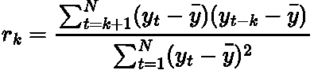
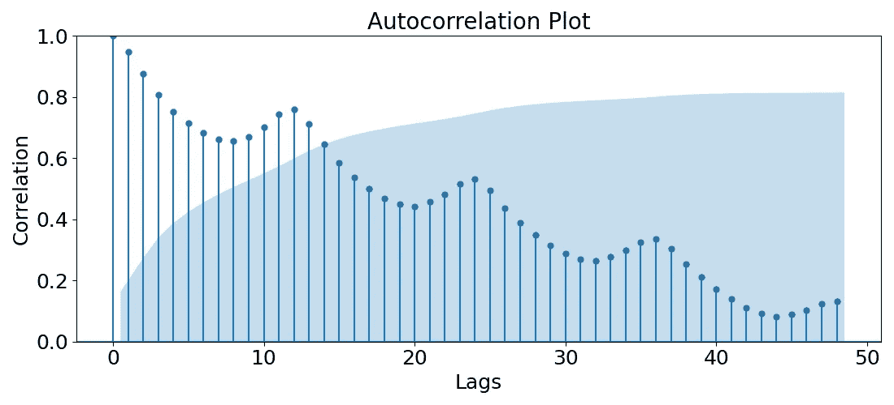

# 时间序列分析的自相关

> 原文：<https://towardsdatascience.com/autocorrelation-for-time-series-analysis-86e68e631f77>

## 描述什么是自相关，为什么它在时间序列分析中有用。

艾萨克·史密斯在 [Unsplash](https://unsplash.com?utm_source=medium&utm_medium=referral) 上拍摄的照片

# 介绍

在时间序列分析中，我们经常对过去进行推断，以预测未来。为了使这一过程成功，我们必须彻底诊断我们的时间序列，找到它所有的“角落和缝隙”

其中一种诊断方法是 [**自相关**](https://en.wikipedia.org/wiki/Autocorrelation) 。这有助于我们检测系列中的某些特征，从而为我们的数据选择最佳预测模型。

在这篇短文中，我想回顾一下:什么是自相关，它为什么有用，以及如何在 Python 中将它应用于一个简单的数据集。

# 什么是自相关？

自相关只是数据与自身的<https://en.wikipedia.org/wiki/Correlation>**。因此，我们不是测量两个随机变量之间的相关性，而是测量一个随机变量自身之间的相关性。于是，为什么叫 [***自动***](https://www.macmillandictionary.com/dictionary/british/auto_3)——关联。**

> **相关性是指两个变量之间的相关程度。如果值为 1，变量完全正相关，-1，它们完全负相关，0，没有相关性。**

**对于时间序列，自相关是时间序列在两个不同时间点的相关性(也称为*滞后*)。换句话说，我们是在用时间序列的滞后版本来衡量它。**

**[数学上的](https://otexts.com/fpp3/acf.html)，自相关计算为:**

****

**作者方程式来自 LaTeX。**

**其中 ***N*** 为时间序列的长度*y***k***为时间序列的指定滞后。所以，在计算 ***r_1*** 的时候，我们是在计算 ***y_t*** 和 ***y_{t-1}之间的相关性。******

> *****y_t** 和 **y_t** 之间的自相关将是 **1** ，因为它们是相同的。***

# ***为什么有用？***

***如上所述，我们使用自相关来衡量时间序列与其自身滞后版本的相关性。这种计算让我们对我们系列的特征有了一些有趣的了解:***

*   ***<https://www.investopedia.com/terms/s/seasonality.asp>**:假设我们发现某些滞后倍数的相关性通常高于其他倍数。这意味着我们的数据中有一些季节性成分。例如，如果我们有每日数据，并且我们发现 ***7*** 滞后项的每个倍数都比其他的高，我们可能有一些周季节性。*****
*   *****[**趋势**](https://www.geeksforgeeks.org/what-is-a-trend-in-time-series/) **:** 如果最近滞后的相关性较高，并且随着滞后的增加而缓慢下降，那么我们的数据中存在某种趋势。因此，我们需要进行一些差分来呈现时间序列<https://otexts.com/fpp2/stationarity.html>**。*******

*******要了解更多关于季节性、趋势和平稳性的知识，请查看我以前关于这些主题的文章:*******

*******</seasonality-of-time-series-5b45b4809acd>  </time-series-decomposition-8f39432f78f9>  </time-series-stationarity-simply-explained-125269968154>  

现在让我们通过 Python 中的一个例子来使这个理论更加具体！

# Python 示例

在本演练中，我们将使用经典的航空客运量数据集:

> 数据[来自拥有 CC0 许可证的 Kaggle](https://www.kaggle.com/datasets/ashfakyeafi/air-passenger-data-for-time-series-analysis) 。

作者代码要点。

作者用 Python 生成的图。

有明显的上升趋势和年度季节性(数据点按月索引)。

我们可以使用 statsmodels 包中的 [**plot_acf**](https://www.statsmodels.org/dev/generated/statsmodels.graphics.tsaplots.plot_acf.html) 函数来绘制我们的时间序列在不同滞后下的自相关，这种类型的图称为*相关图*:

作者代码要点。

作者用 Python 生成的图。

我们观察到以下情况:

*   在每倍数个 **12** 的滞后中有一个清晰的*周期*模式。由于我们的数据是按月索引的，因此我们的数据中有一个*年度季节性*。
*   相关性的强度通常随着滞后的增加而缓慢下降。这在我们的数据中指出了一个*趋势*，在建模时需要对其进行差分以使其稳定。

蓝色区域表示哪些滞后是 [**统计上显著的**](https://en.wikipedia.org/wiki/Statistical_significance) 。因此，在为该数据建立预测模型时，下个月的预测可能只考虑前一个值的 **~15** ，因为它们具有统计意义。

> 值为 0 的滞后具有 1 的完美相关性，因为我们将时间序列与其自身的精确副本相关联。

# 总结和其他想法

在这篇文章中，我们描述了什么是自相关，以及我们如何用它来检测时间序列中的季节性和趋势。然而，它还有其他用途。例如，我们可以使用预测模型的 [**残差**](https://machinelearningmastery.com/model-residual-errors-correct-time-series-forecasts-python/) 的自相关图来确定残差是否确实独立。如果残差的自相关是*而不是*几乎为零，那么拟合的模型没有考虑所有信息，并且可能可以改进。

本文中使用的完整代码脚本可以在我的 GitHub 中找到:

<https://github.com/egorhowell/Medium-Articles/blob/main/Time%20Series/Time%20Series%20Tools/autocorrelation.py>  

# 参考资料和进一步阅读

*   *预测:原理与实践:*https://otexts.com/fpp2/

# 和我联系！

*   要在媒体上阅读无限的故事，请务必在这里注册！ 💜
*   [T35*😀*](/subscribe/@egorhowell)
*   [*领英*](https://www.linkedin.com/in/egor-howell-092a721b3/) 👔
*   [*推特*](https://twitter.com/EgorHowell) 🖊
*   [*GitHub*](https://github.com/egorhowell) 🖥
*   <https://www.kaggle.com/egorphysics>**🏅**

> **(所有表情符号都是由 [OpenMoji](https://openmoji.org/) 设计的——开源的表情符号和图标项目。许可证: [CC BY-SA 4.0](https://creativecommons.org/licenses/by-sa/4.0/#)*********