# 自动编码器:从普通到变化

> 原文：<https://towardsdatascience.com/autoencoders-from-vanilla-to-variational-6f5bb5537e4a>

## 因为甘不是你需要的全部

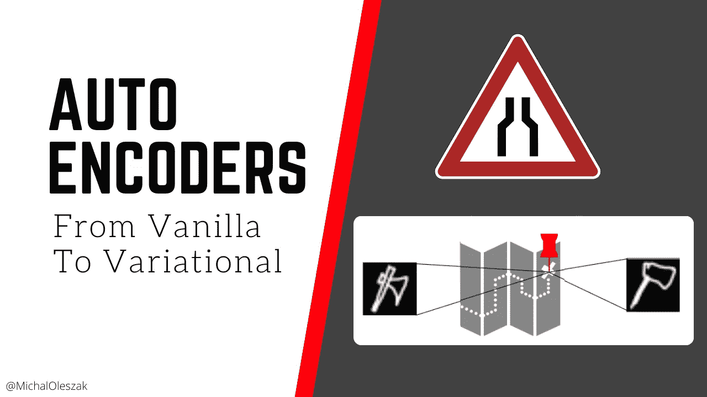

当你听到计算机生成的图像时，你可能会想到深度假货、不存在的猫或马变成的斑马。这很合理地让你想起了[甘斯](/generative-adversarial-networks-101-c4b135a440d5)。但是，即使这些模型在生成逼真的图像方面取得了巨大的成功，它们也有缺点，而且决不是全部。自动编码器，GANs 的老兄弟，还没有过时。事实上，现在自动编码器领域正在进行一些热门研究。所以不要把自动编码器一笔勾销！相反，请继续阅读，了解他们！

# 你需要的不仅仅是甘

当谈到计算机视觉中的生成建模时，GANs 是所有的炒作。这是功不可没的:他们发现了许多令人惊叹的应用，在这些应用中，他们生成了高保真图像。但是看穿了炒作就暴露了一些不足。

gan 很难训练:训练不稳定，他们[遭受模式崩溃](https://pub.towardsai.net/generative-adversarial-networks-102-dcgan-mode-collapse-ef119aa31a6f)(最终一次又一次地产生相同的图像)，为你的数据找到正确的架构是具有挑战性的。简而言之，他们需要大量的保姆来让他们工作。

此外，gan 很难反转，这意味着从生成的图像到产生它的噪声输入没有简单的方法。如果想稍微增加生成的图像，这将是一个有用的特性。使用可逆生成模型，可以得到产生特定图像的输入，向正确的方向稍微扰动一下，结果得到非常相似的图像。

最后，GANs 不提供密度估计。也就是说，我们可以生成一幅图像，但是没有办法知道特定的特征出现的可能性有多大。例如，如果我们对异常检测感兴趣的话，那就太好了。如果我们有一个生成模型，可以告诉我们一只可能的猫和一只不可能的猫是什么样子，我们就可以将这些密度估计传递给下游的异常检测任务。

> gan 产生高质量的图像。不幸的是，它们在训练中需要很多看护，不可逆，并且不提供密度估计。

自动编码器(AEs)是一种替代方案。它们相对快速且易于训练，具有可逆性和概率性。AE 生成的图像的保真度可能还没有 GANs 的好，但这不是将它们一笔勾销的理由！

# 自动编码器没有死

有人说，GANs 一出现，自动编码器就过时了。这在某种程度上是正确的。但是他们现在正在卷土重来。

人们已经意识到 GANs 的缺点，并承认它们并不总是最合适的模型。目前有一些关于自动编码器的令人兴奋的研究正在进行。

例如，一种被称为[矢量量化变分自动编码器(VQ-VAE)](https://arxiv.org/abs/1906.00446) 的自回归 AE 声称可以产生与 GAN 的质量相匹配的图像，同时不会遭受 GAN 的已知缺点，如模式崩溃和缺乏多样性。

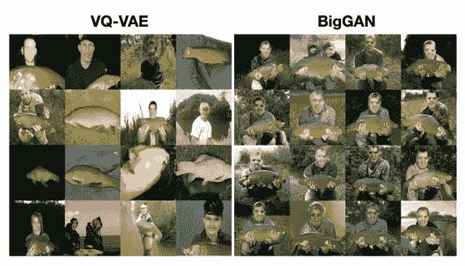

图 5 的一部分来自“用 VQ-VAE-2 生成多样的高保真图像”(链接: [arXiv:1906.00446](https://arxiv.org/abs/1906.00446) )

在本文中，作者通过生成渔民图像，将他们的 AE 模型与 DeepMind 的 BigGAN 进行了比较。请注意在声发射产生的图像中有多少变化。

自动编码器领域另一个令人兴奋的研究例子是的和甘的 T5。这种混合模型使用 GAN 的鉴别器在典型的对抗训练中所学到的知识来提高 AE 的生成能力。

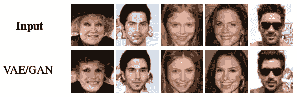

图 4 的一部分来自“使用学习的相似性度量对像素之外的内容进行自动编码”(link: [arXiv:1512.09300](https://arxiv.org/abs/1512.09300))

在上图中，作者使用他们的模型从学习的表征中重建了一组图像，这是 GAN 无法做到的，因为它缺乏我们已经讨论过的可逆性。重建看起来很不错，不是吗？

我相信自动编码器还没有以某种方式在图像生成中发挥作用，熟悉它们当然很好。

> 自动编码器尚未在图像生成中发挥作用。

在本文的剩余部分，我们将看看自动编码器是如何工作的，有哪些不同类型的自动编码器，以及如何使用它们。我们还将使用 TensorFlow 训练一些人。

# 使用自动编码器的表征学习

自动编码器都是为了有效地表示数据。他们的工作是找到这样一种高维输入的低维表示，它允许重建原始输入而不丢失其内容。

从下图所示的[快速绘图数据集](https://www.tensorflow.org/datasets/catalog/quickdraw_bitmap)中提取 ax 绘图。该图像为 28x28 灰度，这意味着它由 784 个像素组成。自动编码器将找到从这个 784 维空间到 2D 空间的映射，这样压缩后的 ax 图像将仅由两个数字描述:图上的 X 和 Y 坐标。接下来，只知道 X-Y 坐标，自动编码器将尝试从这两个值重建原始的 784 像素。

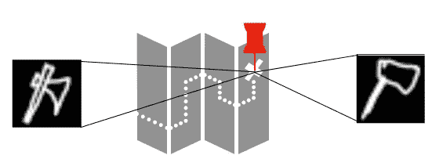

自动编码器学习其输入的低亮度表示。图片由作者提供。

重建不会是完美的，因为在压缩过程中一些信息不可避免地会丢失，但希望它足以识别原始图像。

我们示例中的地图是有效表示数据的潜在空间。虽然我们使用了 2D 地图进行说明，但实际上潜在空间通常会更大，但仍然比输入图像小得多。

自动编码器的工作是创建这样一个低维表示，让它重建原始输入。这确保该潜在空间压缩最相关的输入特征，并且没有噪声和对于要重建的输入不重要的特征。

> Autoencoder 的潜在空间压缩最相关的输入特征，并且没有噪声和冗余特征。

这使得它在许多方面都很有吸引力。您可以使用自动编码器进行降维或特征提取(事实上，您可以构建一个数学上等同于主成分分析(PCA)的自动编码器)。只需用自动编码器在您可能运行的任何数据管道中学习的低维度表示替换您的高维度数据。

自动编码器还有许多其他应用。它们可以用于图像去噪:只需输入一个有噪声的图像，让自动编码器重建原始的无噪声图像。它们还用于自我监督的预训练，在这种训练中，模型从一大组未标记的数据中学习图像特征，然后在一小组标记数据上为一些监督任务进行微调。最后，自动编码器可以用作生成模型，这将是本文的主要焦点。

> 自动编码器可用于降维、特征提取、图像去噪、自我监督学习，以及作为生成模型。

# 标准自动编码器

让我们把手弄脏吧！我们将为[谷歌游戏“快，画！”的玩家制作的手绘形状的](https://quickdraw.withgoogle.com/) [quickdraw 数据集](https://github.com/googlecreativelab/quickdraw-dataset)构建一个简单的自动编码器。我们将只使用三类图像:狗、猫和树。这是一个图像样本。

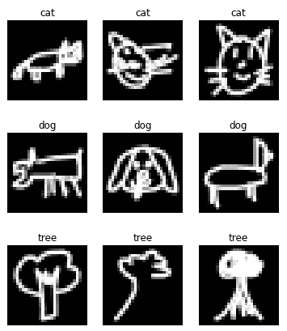

数据样本。来源:https://github.com/googlecreativelab/quickdraw-dataset[。](https://github.com/googlecreativelab/quickdraw-dataset)

## 训练自动编码器

那么，我们如何构建一个自动编码器呢？它需要由两部分组成:编码器，它获取输入图像并将其压缩成低亮度的表示；解码器，它做相反的事情:从潜在的表示开始，它产生原始大小的图像。

让我们从编码器开始。因为我们要处理图像，所以我们将在网络中使用卷积层。该模型将输入图像依次通过卷积层和最大池层，以便将它们压缩成低维表示。

这种特殊的架构是基于 Aurélien Géron 在他的书《FashionMNIST 数据集》中使用的架构。如果你好奇为什么我们使用 SELU 激活而不是 ReLU，[看看我关于这个话题的帖子](/activation-functions-you-might-have-missed-79d72fc080a5)。

我们的编码器的输出由 64 个特征图组成，每个特征图的大小为 3x3。这是我们对数据的低密度表示。接下来，我们需要一个解码器将这些小的表示处理成原始大小的图像。为此，我们可以使用转置卷积层，这可以看作是常规卷积的反面。他们放大图像，增加其高度和宽度，同时减少其深度或特征地图的数量。

剩下要做的就是将编码器和解码器连接起来，并将它们共同训练成一个自动编码器。请注意我们如何将训练数据作为特征和目标两次传递给 fit 方法。这是因为模型的工作是重构其输入。我们用二进制交叉熵损失为 20 个时期训练该模型。

关于损失函数再多说几句。这通常被选择为原始图像及其重建图像的单个像素之间的二进制交叉熵，如我们在这里所做的，或者均方根误差，或 RMSE。两者之间的主要区别在于，二进制交叉熵对大误差的惩罚更强，这导致将重建图像的像素值推入平均幅度。这反过来使得重建的图像不那么生动。然而，对于我们的灰度图像，损失函数的选择不应该产生任何有意义的差异。

## 分析自动编码器

让我们来看看测试集中的一些图像，以及它们被我们的自动编码器重建得有多好。

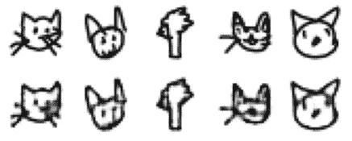

来自测试集的原始图像(顶行)与其重建图像(底行)。图片由作者提供。

看起来这个模型做得很好。一些细节模糊不清，但整体重建精度似乎相当体面。

另一种可视化 autoencoder 所学内容的方法是仅将一些测试图像传递给编码器。这将产生他们的潜在表现，在我们的例子中是大小(3，3，64)。然后，我们可以使用 t-SNE 等降维算法将它们映射到二维空间，并绘制一个散点图，用它们的标签(猫、狗或树)给这些点着色。

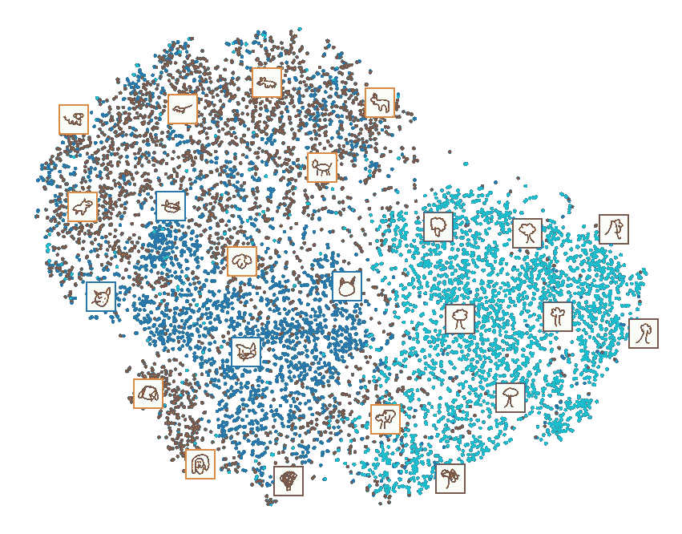

t-SNE 映射到 2D 的测试图像的潜在表征。图片由作者提供。

我们可以清楚地看到，树木与其余的图像分离得很好，而猫和狗有点混淆。注意底部的大块蓝色区域。这些是猫的头部图像，典型的特征是胡须，正如你在散点图顶部绘制的示例图像中所看到的。这些没有和狗混为一谈。然而，在图的上部，我们看到了从侧面拍摄的动物，这使得区分猫和狗变得更加困难。令人着迷的是，autoencoder 在没有给定标签的情况下已经了解了多少图像的类别！

> 自动编码器可以在没有标签的情况下学习很多关于图像类的知识。

总结我们对 vanilla autoencoder 的分析，似乎该模型已经学会了数据的有意义的潜在表示。但是让我们回到这篇文章的主题:它能作为一个生成模型吗？

# 作为生成模型的标准自动编码器

让我们从断言我们期望从生成模型中得到什么开始。我们希望能够选择潜在空间中的任何随机点，通过解码器，获得逼真的图像。最重要的是，在潜在空间中选择不同的随机点应该会产生不同的生成图像，这些图像应该涵盖模型已经看到的所有类型的数据:猫、狗和树。

## 从潜在空间取样

当我们在潜在空间中随机选择一个点时，第一个问题就出现了。在这种情况下，“随机”是什么意思？它应该来自正态分布还是均匀分布？分布应该如何参数化？下图显示了对测试数据样本进行编码后，潜在空间值的概率密度。

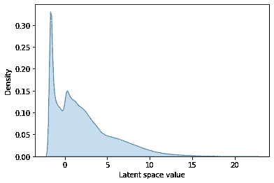

潜在空间值的概率密度。图片由作者提供。

我也算了一些汇总统计。潜在空间值最小为-1.76，最大为 22.35。对于随机采样点，将潜在空间对称地集中在零周围，或者至少以某种方式有界，会容易得多；这里，大的正值和大的负值都可能出现。

> 潜在空间值形成一个不规则的、无界的分布，使得很难对随机点进行采样。

## 图像多样性

另一个问题是潜在空间中代表个体类别的区域，这影响了生成图像的多样性。

我们的潜在空间是 3x3x64 的形状，这使得它是 576 维的，无法可视化。为了便于解释，让我们关注第一维的 3D 切片，它的形状是 3x1x1。当只考虑这个切片时，每个图像在一个潜在空间中由一个 3D 矢量表示，我们可以将它可视化为一个散点图。这是一个测试数据样本的图，用。地面实况课。

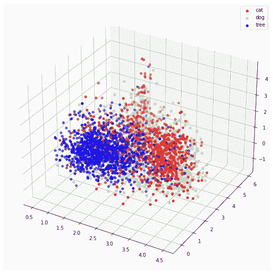

测试数据嵌入的 3D 子集。图片由作者提供。

请注意蓝点云是如何分布在比红蓝云小得多的体积上的。这意味着，如果我们从这个空间中随机选取一个点，我们更有可能得到一只猫或一只狗，而不是一棵树。在极端情况下，当考虑潜在空间的所有 576 个维度时，我们可能永远不会对一棵树进行采样，这违背了我们对生成模型能够覆盖它所看到的整个数据空间的要求。

> 不同图像类别的潜在表示在大小上可能不同，导致模型生成某些类别的频率比其他类别高得多。

再看一下散点图。你可能已经注意到一个从红绿点云中向上突出的尖峰。在这个尖峰信号中隐藏着一些图像。但是，如果我们从那里侧身，在云的正上方，但在尖峰旁边的一个点采样，会怎么样呢？从这个空白空间取样会产生真实的图像吗？让我们再多谈一点。

## 潜在空间中的有意义区域

在潜在空间的 3D 子空间中，图像嵌入通常被很好地聚类——可能除了点云顶部的红色和绿色尖峰。但是当我们添加更多的维度时，嵌入图像之间会出现更多的空白空间。我们整个 3x3x64 潜空间都是真空的。因此，当从其中随机采样一个点时，我们极有可能得到一个远离(在大多数维度上)任何特定图像的点。如果我们让这些随机选择的点通过解码器，会得到什么呢？答案是无形状的图案。

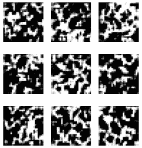

产生了猫、狗和树——算是吧。图片由作者提供。

为什么会这样？在猫和狗之间的一个点上取样难道不应该产生一个耷拉着耳朵和胡须的生物吗？

不幸的是，普通自动编码器学习的潜在空间不是连续的。这意味着在这个空间中的点之间没有意义的平滑过渡。事实上，即使是解码成格式良好的图像的点的小扰动也可能导致垃圾输出。

> 普通自动编码器学习的潜在空间是不连续的。

总而言之，我们已经看到了使用普通自动编码器作为生成模型的三个问题:我们不知道如何从不规则的无界空间中采样，一些类可能在潜在空间中比其他类表现得更多，最后，学习的空间是不连续的，这使得很难找到一个点来解码成格式良好的图像。

进入可变自动编码器。

# 变分自动编码器

变分自动编码器，或 VAE，通过引入随机性和限制潜在空间，从而更容易从中采样，解决了我们刚刚讨论的问题。

> 变分自动编码器在模型中引入了随机性，并限制了潜在空间。

要将我们的标准自动编码器转换成一个变化的编码器，我们只需要调整编码器部分和损失函数。先说前者。

## 可变编码器

变分编码器不是将输入图像映射到潜在空间中的一个点，而是将其映射到一个分布中。准确的说是多元正态分布。

多元正态分布是一元正态分布在更多维度上的扩展。正如单变量正态分布由两个参数(均值和方差)描述一样，多变量正态分布由两个参数向量描述，每个向量的长度等于维数。例如，2D 正态分布有两个平均值的向量和两个方差的向量。如果分布的许多维是相关的，则出现附加的协方差参数，但是在 VAEs 中，我们假设所有的维是独立的，这使得所有的协方差为零。

为了将输入图像编码成潜在空间中的低亮度表示，我们将从多元正态分布中对其进行采样，编码器将学习多元正态分布的参数(均值和方差)。

总之，我们的潜在空间将被描述为两个向量:均值向量和方差向量。让我们将这两个向量都设为 576 维，以匹配我们之前构建的普通编码器，它编码成 3x3x64=576 维空间。我们实际上可以重用我们的普通编码器。把它的输出变平，然后把两个向量连接起来。

这里只有两件事需要详细说明。首先，正如您可能从变量名中猜到的，我们使用方差的对数来描述我们的正态分布，而不是原样的方差。这是为了消除包含值:方差必须是正的，而对数方差可以是任何值。

第二，编码器使用自定义的`Sampling`层，该层根据平均值和对数变量从多元正态中采样一个点。让我们看看它是怎么做到的。

我们简单地取平均值并加上`e^(log_var / 2)`乘以ε，这是一个从标准正态分布中采样的值(平均值为零，方差为 1)。指数和除以 2 来自对数反转的简单推导——我们有对数方差，但需要方差。如果你对细节感兴趣，请在评论中告诉我。

## 为什么变分编码器工作

酷，我们有我们的变分编码器！本质上，与普通编码器相比，我们已经用将输入映射到某个空间内的随机点来代替将输入映射到确定性点。为什么这样更好？

想想用一个可变的编码器重复映射同一个图像。每一次，我们都会在潜在空间中找到一个稍微不同的点，尽管它们都在平均值附近。这迫使 VAE 知道在解码时该邻域中的所有点应该产生相似的输出。这确保了潜在空间是连续的！

> 编码器中的随机化迫使潜在空间是连续的。

## 变分解码器

现在我们来看解码器。VAE 的这一部分不需要很多改变，我们也可以重用我们的老香草解码器。

唯一的区别是，现在编码器的输出，或潜在空间，是一个 1D 矢量，而不是三维张量。实际上，我们只添加了一个整形层，并将旧的解码器堆叠在上面。

我们现在可以结合变分编码器和解码器，以形成 VAE 模型。

## 变分损失函数

在普通自动编码器中，我们使用了二进制交叉熵损失，并提到均方根误差也是一种选择。在 VAEs 中，损失函数需要扩展。

交叉熵或 RMSE 损失是一种重建损失，它会因产生与原始输入不同的重建而对模型造成不利影响。

在 VAEs 中，我们在损失函数中增加了一项，它对学习与标准正态分布差异很大的多元正态分布的模型不利。我们通过在损失函数中增加一个 KL 散度来做到这一点。KL-divergence 是对两种分布差异的度量，在这种情况下，我们测量标准正态分布和模型学习到的正态分布之间的差异。也就是说，如果均值不等于零，方差不等于一，就会产生损失。

`latent_loss`的公式是在这种特殊情况下简化的 KL-divergence 公式，其中目标分布是标准正态分布，并且两者都没有零协方差。在将其添加到常规损失后，我们将其缩放为输入图像的大小，以确保其与重建损失具有相似的比例，而不是占主导地位。但是我们为什么要把这个 KL 部分加到损失里面呢？

首先，它使得在潜在空间中采样随机点变得简单。我们可以只从标准法线采样，并确保这个空间对模型有意义。第二，由于标准法线是圆形的，并且关于它的平均值是对称的，所以潜在空间中存在间隙的风险较小，当解码时，这些间隙会产生不成形的图案。

这样，我们就克服了普通自动编码器在图像生成方面的所有三个缺点。让我们训练我们的变分自动编码器并分析它。

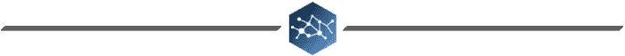

# 分析变分自动编码器

我们可以再次将测试集中的原始图像与其重建图像进行比较。

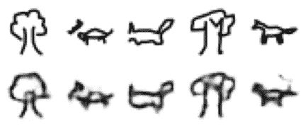

来自测试集的原始图像(顶行)与其重建图像(底行)。图片由作者提供。

后者可能看起来比普通自动编码器更模糊，这是意料之中的。毕竟，我们已经调整了损失函数，不仅关注重建精度，还关注产生有意义的潜在空间。

## 图像之间的变形

我们可以做的一件很酷的事情是，选择两幅图像并在它们之间变形，以验证变分自动编码器学习到的潜在空间确实是连续的、行为良好的和有意义的。让我们以这只猫和这棵树为例。

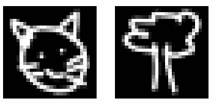

一只猫和一棵树的样本图像。图片由作者提供。

我们可以对它们进行编码，以获得它们的隐藏表示，在我们的例子中，它们只是长度为 576 的向量，并在它们之间进行线性插值。然后，我们可以将插值线上的每个点传递给解码器，以生成猫和树之间的图像。

用于索引训练数据的数字是我们选择的两个图像的索引。我们将两个潜在的表示堆叠在形状为 2x576 的矩阵中，并对其列应用 scipy 的线性插值函数。因此，我们可以调用`linfit([i+1 for i in range(10)])`来获得中间插值。

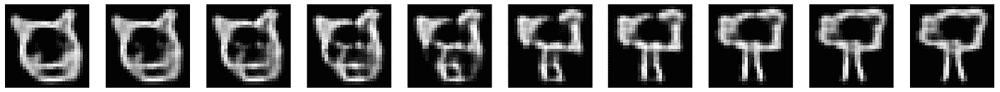

一只猫变成了一棵树。图片由作者提供。

注意猫的嘴是如何变成树干的。以类似的方式，我们可以把另一只猫变成一只狗。注意猫的尖耳朵是如何逐渐变成狗的软耳朵的。

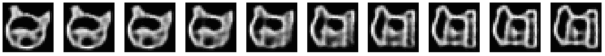

一只猫变成了一只狗。图片由作者提供。

这个有趣的实验表明，变分自动编码器学习的潜在空间是连续的，并确保点之间的平滑过渡。

> VAE 的潜在空间是连续的，允许在图像之间生成有意义的插值。

## 图像算术

如果潜在空间是连续的和有意义的，我们应该能够在图像上做算术。我们试试吧！

考虑这两只猫(图片是重建的，而不是原始图像)。

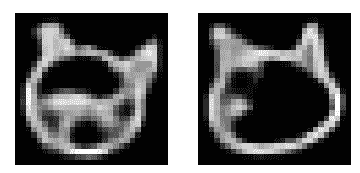

猫的重建。图片由作者提供。

如果我们把左边有胡须的猫减去右边没有胡须的猫，会得到什么？当然，减法必须发生在潜在空间。

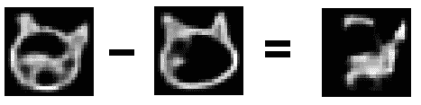

图像算术。

可以说，结果是类似胡须的东西。

# 包扎

我们已经看到了自动编码器如何学习数据的低维表示，以及这些潜在表示对于新图像的生成如何不完美，至少在普通自动编码器的情况下是这样的:它们学习的空间很难采样并且不连续。

我们还看到了变化的自动编码器如何通过向编码器引入随机性和增加损失函数来缓解这些问题，以加强学习连续和有意义的潜在空间，从而允许在图像之间进行算术和变形。

上面讨论的例子是在具有现成架构的玩具数据集上训练的。想象一下，当认真处理时，变分自动编码器是多么强大！

# 来源

*   Geron A .，2019，第二版，使用 Scikit-Learn 和 TensorFlow 进行机器学习:构建智能系统的概念、工具和技术，O'Reilly
*   Foster D .，2019，生成式深度学习。教机器绘画、写作、作曲和演奏，奥莱利

感谢阅读！

如果你喜欢这篇文章，为什么不在我的新文章上 [**订阅电子邮件更新**](https://michaloleszak.medium.com/subscribe) ？通过 [**成为媒介会员**](https://michaloleszak.medium.com/membership) ，你可以支持我的写作，并无限制地访问其他作者和我自己的所有故事。

需要咨询？你可以问我任何事情，也可以在这里 预定我 1:1 [**。**](http://hiretheauthor.com/michal)

你也可以试试我的其他文章。不能选择？从这些中选择一个:

     