# 使用线性规划自动进行预算规划

> 原文：<https://towardsdatascience.com/automate-budget-planning-using-linear-programming-5254aace697c>

## 选择投资回报最大化的项目，遵循管理准则，同时遵守预算限制

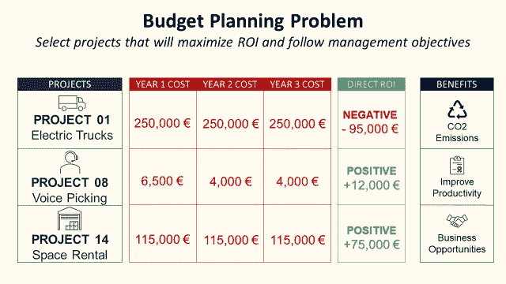

线性规划的预算规划问题—(图片由作者提供)

## 目标

将国际物流公司的**年度预算分配**的**决策过程**自动化**。**

## 介绍

在物流行业，公司经常需要投资 **IT 能力**、**现代** **搬运设备**或**额外的仓库空间**来提高他们的运营效率。

**区域运营总监**从当地团队收到中期项目的预算申请**。**由于**预算限制**，他们需要决定组织将**为哪些**项目**分配资源**。

> 花钱比赚钱难多了。—阿里巴巴集团联合创始人马云

在本文中，我们将使用 Python 设计一个简单的线性规划模型来自动化这个决策过程

*   三年后每个项目的投资回报 **(€)**
*   每年总成本和预算限额**(€/年)**

我们还将包括公司针对以下方面的最高管理准则…

*   **可持续发展** *(二氧化碳减排)*
*   **数字化转型** *(物联网、自动化和分析)*
*   **卓越运营***(生产力、质量和持续改进)*

💌新文章直接免费放入你的收件箱:[时事通讯](https://www.samirsaci.com/#/portal/signup)

```
**SUMMARY**
**I. Scenario: Budget Planning Process** As a Regional Director you need to allocate your budget on projects
**II. Build your Model
1\. Exploratory Data Analysis** Analyze the budget applications received
**2\. Linear Programming Model**
Decisions variables, objective function and constraints**3\. Initial Solution: Maximum ROI** What would be the results if you focus only on ROI maximization?
**4\. Final Solution: Management Guidelines
III. Conclusion & Next Steps**
```

如果你喜欢看，看看 Youtube 教程

# 一.情景

## 问题陈述

作为一家[国际物流公司](https://youtube.com/shorts/7y_mVdM_sZE)的**区域总监**，你要负责**四个国家**的物流运作。

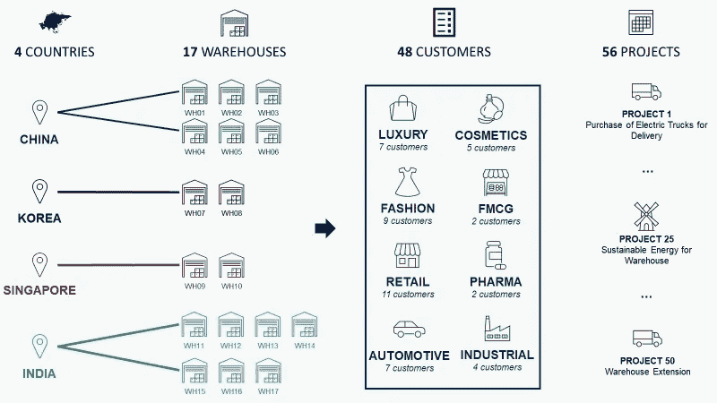

您负责的 56 个项目—(图片由作者提供)

你的团队管理着 **48 个客户**的运营，这些客户更多的而不是 **8 个垂直市场(奢侈品、化妆品……)。**

对于 17 个仓库中的每一个、**、**、**仓库经理**、*(向您汇报)*列出了所有需要**资本支出(CAPEX)的项目。**

在申请表中，他填写了所有有助于证明这项投资(经济上)合理性的信息

*   该项目将惠及哪个**客户**？
*   每年**的预计成本是多少**(€)？
*   三年后**【M€】预计**投资回报率是多少？****

**他还可以加上与公司长期战略相关的所有非财务结果。**

**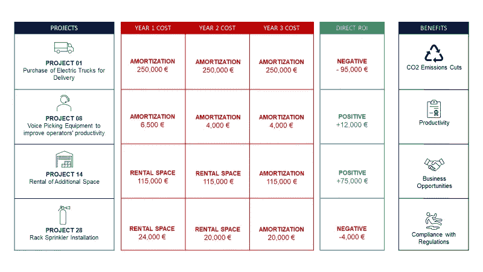**

**资本支出申请表信息示例—(图片由作者提供)**

**例如，一个项目可以为**可持续发展**、**企业社会责任** (CSR) 或**数字化转型做出贡献。****

****目标** 找到正确的**预算分配**使**最大化你的利润**(ROI)**尊重最高管理层的指导方针**。**

**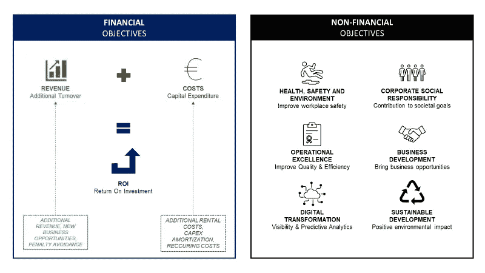**

**(图片由作者提供)**

**因为您负责 **58 个项目**，所以让我们构建**一个简单的工具来自动化**这个决策过程。**

# **二。构建您的模型**

**我们将使用 python 的纸浆库，这是一个线性(LP)和整数规划(IP)问题的建模框架。**

> **你可以在我的 Github(跟随我:D)资源库中找到带有虚拟数据的完整代码:[链接](https://github.com/samirsaci/budget-planning)
> 我的投资组合与其他项目:[萨米尔萨奇](https://samirsaci.com/)**

## **1.探索性数据分析**

**今年，您总共有 **58 个项目**涵盖 **9 个垂直市场**。**

**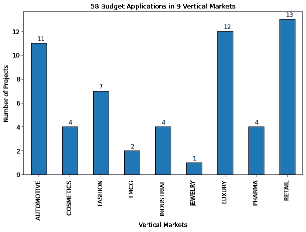**

**(图片由作者提供)**

**由于仓库扩建项目，汽车和豪华**市场占据了预算分配的很大一部分。****

****

**(图片由作者提供)**

**大多数项目都与业务发展有关，即给公司带来额外的营业额(和利润)**

**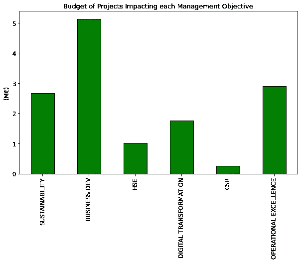**

**(图片由作者提供)**

## **2.线性规划问题**

**让我们使用**类比**和**线性规划模型**的定义来构建一个模型。**

**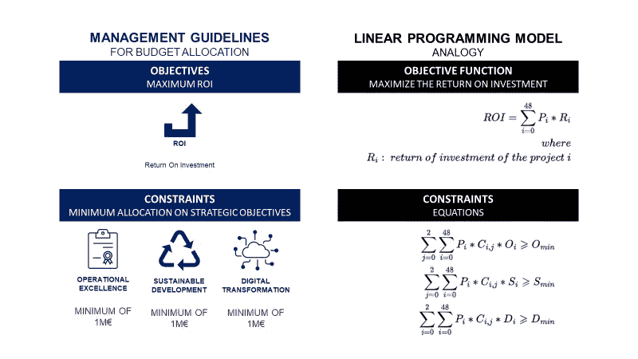**

**(图片由作者提供)**

## **决策变量**

**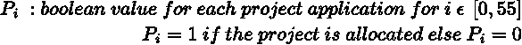**

**(图片由作者提供)**

## ****目标函数****

**你的目标是使你选择的项目组合的总投资回报率最大化**

**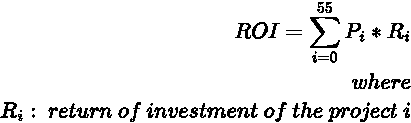**

**(图片由作者提供)**

## **预算限制(约束)**

**你的预算是**450 万€** 分三年**(€125 万，€150 万，€175 万)。****

****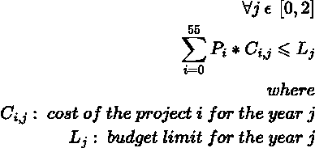****

****(图片由作者提供)****

## ******战略目标(约束条件)******

****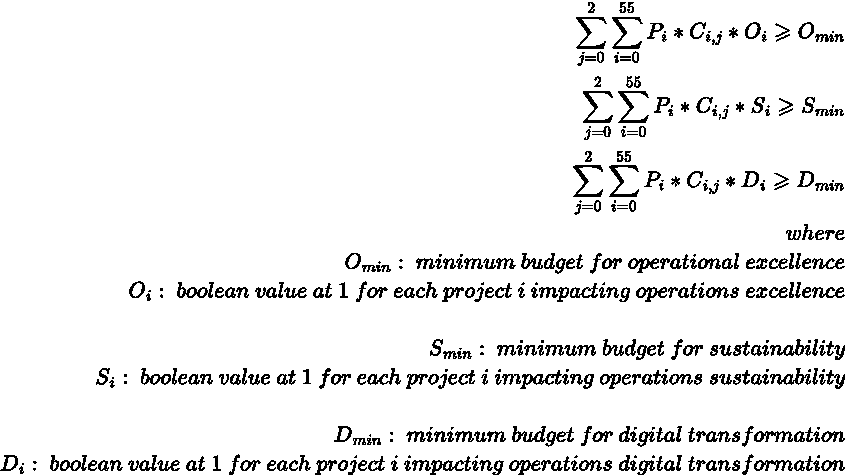****

****(图片由作者提供)****

****我们将把三大支柱的**最低预算定为 100 万€** 。****

## ****3.初始解决方案:最大化投资回报率****

****为了理解这种模式的附加值，让我们来看看如果我们**去除战略目标约束**会有什么分配。****

```
**Return of Investment = **1,050,976 Euros**
**36**/58 Projects Accepted with a Budget Allocation of **4.07/4.5 M€****
```

****结果是令人满意的，有良好的投资回报率和超过 80%的预算分配。****

******按战略目标分配呢？******

********

****(图片由作者提供)****

****当你要求模型关注盈利能力时，你**达不到管理目标**。****

## ****4.最终解决方案****

****如果我们对公司长期战略的关键支柱有**最低预算分配**的要求:****

```
**Return of Investment = **909,989 Euros**
**34/58** Projects Accepted with a Budget Allocation of **4.15/4.5 M€****
```

****投资回报受**轻微影响**。****

******管理目标呢？******

********

****(图片由作者提供)****

****管理方针得到了的尊重。****

# ****三。结论和下一步措施****

*****关注我的 medium，了解更多与供应链数据科学相关的见解。*****

## ****结论****

****这个**简单模型**提供了**自动化决策制定**的能力，同时确保符合分配。****

****它可以很容易地通过添加约束来改进****

*   ****每个国家、垂直市场或仓库的最大预算分配****
*   ****预算分配目标(应分配 95%的预算)****

## ****后续步骤****

****这个脚本可以在一个 **Flask web 应用**中实现，并部署一个上传 excel 文件的功能。****

****然后，您可以自动化这一复杂的流程，帮助经理获得更多的视觉洞察力，并加快决策过程。****

# ****关于我****

****让我们连接上 [Linkedin](https://www.linkedin.com/in/samir-saci/) 和 [Twitter](https://twitter.com/Samir_Saci_) ，我是一名供应链工程师，正在使用数据分析来改善物流运营和降低成本。****

****如果你对数据分析和供应链感兴趣，可以看看我的网站****

****<https://samirsaci.com> **** 

# ****参考****

****[1]运筹学计算基础设施，优化与纸浆(文档)，[链接](https://coin-or.github.io/pulp/)****