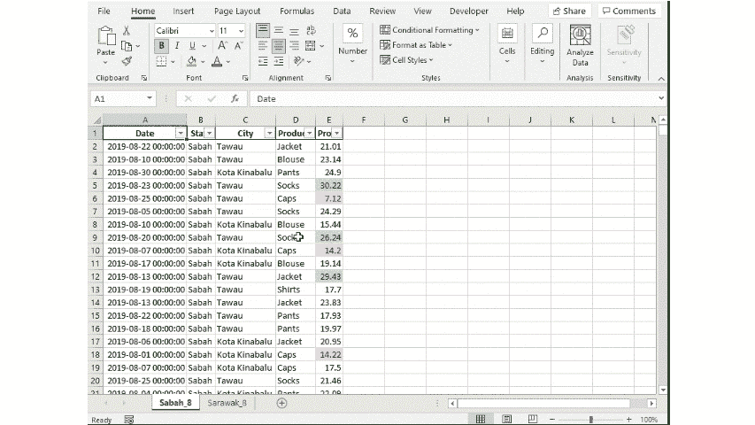
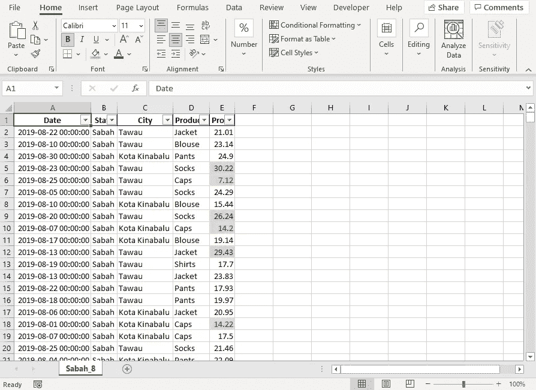
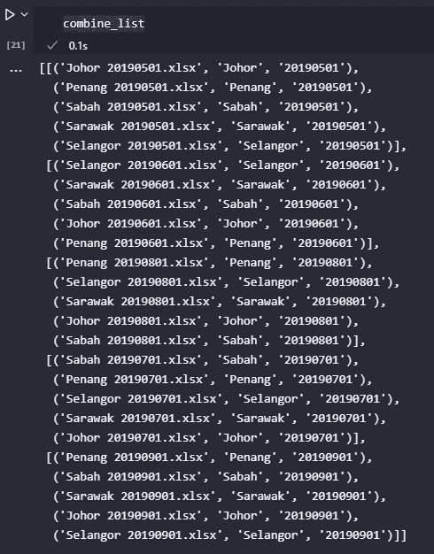
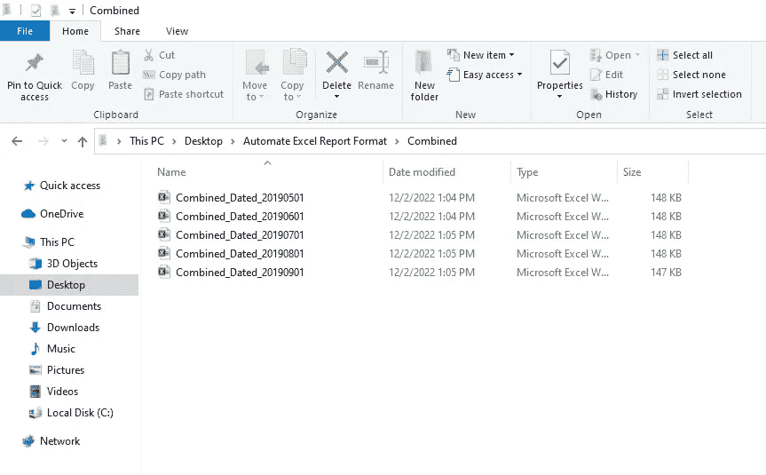
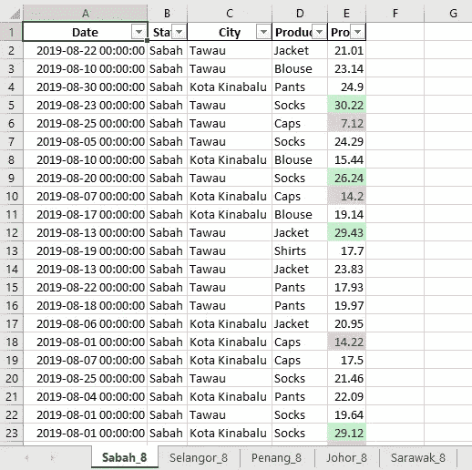
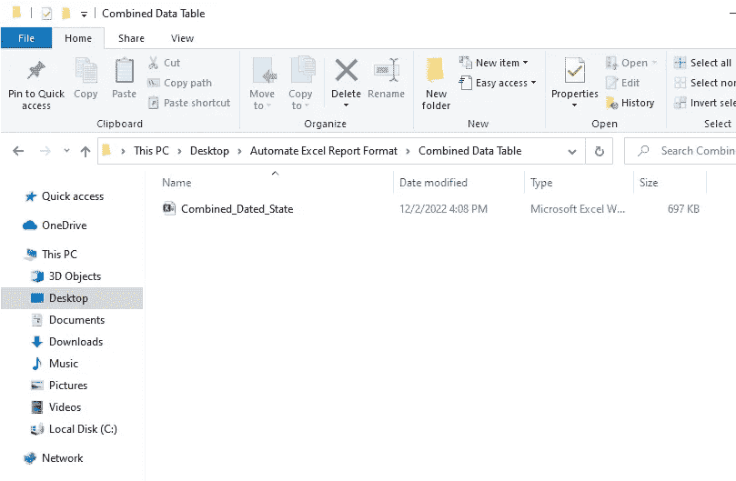
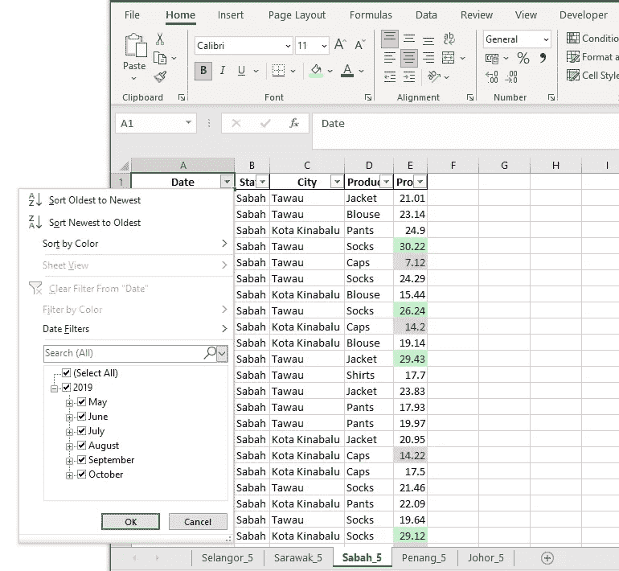

# 使用 Python 自动组合 Excel 工作表

> 原文：<https://towardsdatascience.com/automate-excel-worksheets-combination-with-python-181052177baf>

## [使用 PYWIN32 实现自动化](https://towardsdatascience.com/tagged/automation-with-pywin32)

## 用 Python 将多个 Excel 工作簿和多个工作表合并，并保持格式


[Artem Militonían](https://unsplash.com/@artmilitonian?utm_source=unsplash&utm_medium=referral&utm_content=creditCopyText) 在 [Unsplash](https://unsplash.com/s/photos/lazy?utm_source=unsplash&utm_medium=referral&utm_content=creditCopyText) 上拍照

这是我的创造力(懒惰)对重复任务的另一种自动化。所以，我被要求**根据文件名**中的日期组合几个 Excel 工作簿 **。一开始，我非常乐观，因为使用 Python 这个任务很简单。我需要做的就是用`pandas`读取文件，然后使用神奇的`append`方法，然后保存到一个新文件。搞定了。**

不幸的是，这个计划没有成功，因为所有的 Excel 工作簿内部都有多个工作表，并且根据工作表中的值有一些预设的格式。好了，图片说话比较好，练习册看起来像下图。



工作簿示例。作者 GIF。

所以格式设置得很好，使用`pandas`合并它们会删除所有格式，这是不可接受的。有一秒钟我想我会遵循 KISS(保持简单愚蠢)方法，即打开每个 Excel 工作簿，一个一个地复制和粘贴。但是，处理速度快死我了🤦‍♂️.

我将再次使用我最喜欢的 Python 库来完成这个自动化任务，它是✨ **PyWin32 ✨** 。


25 个练习册将在后面的示例中合并。图片作者。

对于本教程，准备了 25 个 Excel 工作簿，每个工作簿只有一个工作表(由 Python 脚本生成)。这些工作簿包含 2019 年 5 月至 9 月马来西亚选定州的每个分公司的利润信息，如下图所示。



每个工作簿的内部外观。图片作者。

工作簿按照以下格式命名: <state><white space=""><yyyymmdd>。xlsx，而工作表的命名遵循以下格式: <state>_ <m>。</m></state></yyyymmdd></white></state>

每个工作表都有如下预设格式:

1.  自动过滤
2.  自动调整
3.  条件格式

在本文中，将演示两种类型的 Excel 工作表的复制粘贴:

1.  复制整个 Excel 表格并将其作为新工作表粘贴到另一个 Excel 工作簿中
2.  复制一个 Excel 工作表的数据表**并粘贴到另一个 Excel 工作表的现有数据表**的下方

最后但同样重要的是，我将在下面的每个示例中频繁地提到类似对象、方法或属性这样的词。我曾经写过一篇文章([使用 Python 实现 Excel 的自动化](/automate-excel-with-python-7c0e8c7c6256))来解释对象、方法或属性的概念。我亲爱的读者是鼓励和欢迎阅读文章每当他们有疑问的三个概念。

> 开始吧！

# A.复制整个 Excel 工作表并**将其作为新工作表**粘贴到另一个 Excel 工作簿中

您可以观看视频或继续阅读本部分。

## **1 .将一个工作簿中的一个工作表复制/合并到另一个现有工作簿中**

此示例将演示如何将一个工作表从一个工作簿复制到另一个现有工作簿。

```
import win32com.client as win32
from pathlib import Path
win32c =  win32.constants**# create excel object**
excel = win32.gencache.EnsureDispatch('Excel.Application')**# excel can be visible or not**
excel.Visible = True  # False
```

第一步是导入库并创建 **Excel 对象**。然后，我们将打开相关的工作簿。

```
**# open workbooks**
f_path = Path.cwd() # your path
f1_name = 'Penang 20190901.xlsx'
f2_name = 'Sabah 20190901.xlsx'
filename1 = f_path / f1_name
filename2 = f_path / f2_name
wb1 = excel.Workbooks.Open(filename1)
wb2 = excel.Workbooks.Open(filename2)
sheetname = "Penang_9"
```

在本例中，我们将名为“Penang_9”的工作表从“Penang 20190901.xlsx”复制到名为“Sabah 20190901.xlsx”的现有工作簿中。打开工作簿后，我们可以开始复制工作表的操作。

```
**# copy worksheet above from wb1 to wb2**
wb1.Worksheets(sheetname).Copy(*Before*=wb2.Sheets(1))
```

对于此操作，我们使用了**从**工作表对象**复制方法**。

```
**# remove hashtag to save and quit modified Excel file**
#wb2.Save()
#wb2.SaveAs(Filename = r"new file name.xlsx") # save as new Workbook
#wb2.Close(True)
#excel.Quit()
```

最后一步是使用 **Save** 或**Save as**方法保存处理后的工作簿。**关闭方法**关闭 Excel 工作簿，而**退出方法**退出使用 Python 创建的 Excel 对象。

## **2 .将多个工作簿中的工作表复制/合并为一个工作簿**

在第一个示例中，我对工作表名称进行了硬编码，对于大量文件而言，这样做并不可取。该脚本将非常长，需要付出更多努力将所有工作表名称保存为单独的变量。

工作表中的 T24 索引 T25 就在这里。通过如下使用 Excel **索引属性** [(Excel 对象、方法和属性)](/automate-excel-with-python-7c0e8c7c6256) ，我们可以创建一个更可持续的函数来组合来自多个工作簿的工作表。

```
# return Sheet with index = 1 without stating Sheet Name
ws_name = wb1.Sheets(1)
```

对于本例，我们将根据日期将 25 个 Workbooks 合并为 5 个。每个工作簿最初仅包含一个工作表。如示例 A1 所示，需要 4 个步骤。

**i .导入库**

```
import re
import os
import win32com.client as win32
from pathlib import Path
win32c =  win32.constants
```

需要使用正则表达式(re)库来标识文件名中的日期。

**ii .定义复制工作表的功能**

该功能用于将工作表从一个工作簿复制到另一个工作簿。IF-ELSE 条件用于确定是否有工作簿打开。如果没有，它将打开第一个工作簿并保存为`wb1`，否则它将打开第二个工作簿并保存为`wb2.`，然后`wb2`中的工作表将被复制到`wb1`。

内部 for 循环将合并同一个`f_list`中的工作簿，然后外部循环将在该过程完成时移动到下一个`f_list` 。`combine list` 是一个嵌套列表，里面包含`f_list` ，而`f_list`包含

1.  带有扩展名(f[0])的文件名，
2.  状态(f[1])和
3.  文件的日期(f[2])。

每个`f_list`包含日期相同的文件元组，如下图所示。



combine_list 截图。图片作者。

**三。根据标准**定义将文件名放入单独列表的函数

该功能是根据文件名中的日期对文件进行分组，并保存到`combine_list`。所有文件名保存在`filename_list` 参数中。对于每个文件名，我们将使用正则表达式(re)编译一个模式，如下所示。

```
pattern = re.compile(r"([\w]+) ([\d]{8}).xlsx")
x = pattern.search(f)
```

在上面的行中，我们想要标识州名和日期，日期是文件名中的一个 8 位数字。 **x** 将返回搜索结果，使用`group`我们可以选择文本中的任何部分来使用。

```
temp_name = x.group(1)        
temp_date = x.group(2)
```

索引从 0 开始，索引 0 指的是整个文本，索引 1 指的是第一个括号，在本例中是州名，索引 2 指的是第二个括号，它指的是日期。IF-ELSE 条件是将获得的第一个日期保存为参考日期，然后将其与文件名中的其余日期进行比较。每个匹配将作为一个元组保存到`file_list`。然后，元组会被追加到主列表中，也就是`combined_list`。

添加到`combined_list`的每个文件名都将被添加到`used_filename`，WHILE 循环将继续，直到`used_filename`的长度等于初始列表`filename_list`。`filename_list`、`files`的克隆在一开始就被创建，并被用作 FOR-LOOP 的标准。每次一个文件名被添加到`used_filename`中，它就会从`files`中被删除，所以不会有重复。

**四。设置参数并调用函数**

```
# your path
f_path = r"C:\Users\Desktop\Automate Excel Report Format" # get all files in the directory
filename_list = os.listdir(f_path + "\\" + "Sample File") # create excel object
excel = win32.gencache.EnsureDispatch('Excel.Application')# excel can be visible or not
excel.Visible = True  # False 
group_file_according_criteria(f_path, filename_list, excel)
```

`filename_list` 是需要合并的文件列表。由于文件是根据格式命名的，我们可以根据州或日期来组合文件。在此示例中，工作簿根据日期进行合并。原始工作簿保存在名为“Sample File”的文件夹中，而合并的工作簿保存在名为“combined”的文件夹中。这两个文件夹位于同一目录中。



自动化脚本的输出。



自动化脚本的输出。

合并所有月份相同的工作表。

总之，本示例显示如何根据日期将同一文件夹中的工作簿分组到一个列表中，然后将同一列表中所有工作簿的工作表合并到一个工作簿中。

# B.复制一张 Excel 表的数据表**并粘贴到另一张 Excel 表的现有数据表**下方

## **1。合并两个工作表的数据表**

为了确保我们只复制数据表，我们需要知道要复制的列和行的确切数量。因此，`pandas.DataFrame.shape` 函数将用于获取行数。*在这个例子中，列数是硬编码的，因为作者没有想到除了使用 Python 字典之外的更好的方法来返回列的字母表*😂*。*

复制数据表的步骤与复制整个工作表(示例 A1)略有不同，因为需要知道行数。主要区别是使用`pandas`库读取数据表的大小，这里使用的**复制方法**在 **Range 对象**下。

```
wb1.Sheets(sheetname1).Range(f"A2:E{df_penang.shape[0] + 1}").Copy(*Destination* = wb2.Sheets(sheetname2).Range(f"A{df_sabah.shape[0] + 2}"))
```

除此之外，请注意，复制数据表时，选定的范围从单元格 A2 开始。

```
Range(f"**A2**:E{df_penang.shape[0] **+ 1**}")
```

这是因为第一行是表头行，也因为这样，最后一行是`df.shape[0]+1`返回的行数。如果数据的行数是 1000 行，不包括标题行(`df.shape`返回不考虑标题的行数)，最后一行将是 1001。

然后，为了定位粘贴复制数据的位置，我们需要在目标工作表的数据表的行数上加 2。

```
Range(f"A{df_sabah.shape[0] **+ 2**}")
```

如果在目标工作表中，数据表的行数也是 1000，则在标题行计数后，最后一行也将是 1001。因此，粘贴复制的数据表的位置将在第 1002 行。

## **2。合并多个工作表的数据表**

对于这个例子，我使用了在第 A2 部分中创建的文件。文件名以“Combined _ Dated”开头，每个文件内部都有 5 个工作表，表示 5 个州在同一日期的利润记录，如下图所示。


自动化脚本的输出。


自动化脚本的输出。

由于有多个工作表，最好使用工作表索引来标识工作表，而不是使用工作表名称。在这一部分中，我们将利用下面两个 Excel 对象属性。

```
# return number of Worksheet in the Workbook
wb1.Sheets.**Count**# return the name of a Worksheet (Sheet with index = 1)
ws_name = wb1.Sheets(1).**Name**
```

与其他 3 个例子一样，这一部分也需要 4 个步骤。

**一、导入库**

在示例 A2 中，正则表达式(re)用于比较工作簿的名称。在本例中，它将用于比较工作表的名称。

```
import win32com.client as win32
from pathlib import Path
import pandas as pd
import re
```

**二。定义打开工作簿的函数**

该函数用于打开工作簿，调用`copy_data_table`函数比较两个工作簿中的工作表，并将数据表粘贴到具有相同州名的工作表中。

IF-ELSE 条件用于确定是否有工作簿打开。如果没有，它将打开第一个工作簿并保存为`wb1`，否则它将打开第二个工作簿并保存为`wb2`。然后`wb2`中的工作表中的所有数据表都会被`copy_data_table`函数复制到`wb1`中。这里的**计数方法**将用于返回`wb1`中的张数。并且假设`wb1`和`wb2`有相同数量的工作表，那么**计数**的结果将被用于获取`wb2`中工作表的名称。

`copy_data_table`函数将为外部 for 循环中的每个循环返回`wb1`和`save_path`。这是因为我们每次将数据表复制粘贴到`wb1`中，都需要知道**更新后的** `wb1`中数据表的最新大小，才能粘贴下一个数据表。

**三。定义复制数据表的功能**

此函数用于将所有工作表的数据表从一个工作簿复制到另一个工作簿。

我知道上面的剧本看起来很吓人，但是别担心，我会牵着你的手走完理解的旅程😉。

在上面的脚本中有两个 FOR 循环和两个 IF- ELSE 条件。我来一一解释一下。

1.FOR 循环

```
for n in range(*number_of_sheet_1*):
    # read the shape of dataframe of both file
    ws_name_1 = *wb1*.Sheets(n+1).Name
    state_name_wb1 = (re.split("_", ws_name_1))[0] # use RE to compile pattern to find a match
    for ws_name_2 in *wb2_ws_namelist*:
        pattern = re.compile(r"*(*[*\w*]+*)*_[*\d*]{1}")
        x = pattern.search(ws_name_2) # assume we are combine according state, which will be in
        first parenthesis
        state_name_wb2 = x.group(1)
```

当我们将多个工作表从一个工作簿复制到另一个工作簿时，我们将使用索引属性首先选择工作簿 1 (wb1)中的一个工作表，然后使用名称属性来标识工作簿 2 (wb2)中与`wb1`具有相同州名的工作表。

在外部 FOR 循环中，下面的脚本将获取 wb1 中当前索引为**的工作表的名称。正则表达式将用于获取州名。**

```
ws_name_1 = wb1.Sheets(n+1).Name        
state_name_wb1 = (re.split("_", ws_name_1))[0]
```

一旦我们从 wb1 中得到一个工作表名称，我们将把它与 wb2 中的工作表名称列表进行比较。这是内部 FOR 循环。wb2 中的工作表名称列表已经保存在`wb2_ws_namelist`中。

在内部 FOR 循环中，工作簿 2 中每个工作表的州名将通过正则表达式获取，如下面的脚本所示。

```
pattern = re.compile(r"([\w]+)_[\d]{1}")            
x = pattern.search(ws_name_2)            
# assume we are combine according state, which will be in first parenthesis            
state_name_wb2 = x.group(1)
```

然后，IF-ELSE 条件用于比较工作簿 1 中当前选定工作表的状态名和工作簿 2 中每个工作表的状态名

2.如果-否则

```
# for the match worksheet, calculate their number of rows and copy the data from one to another**if state_name_wb1 == state_name_wb2:**
    **if *save_path* =="":**
        file_path_1 = *main_file_path* **else:**
        file_path_1 = *save_path*df_main = pd.read_excel(file_path_1, *sheet_name* = ws_name_1)
    df_second = pd.read_excel(*file_path*, *sheet_name* = ws_name_2)**# copy the data table**
    *wb2*.Sheets(ws_name_2).Range(f"A2:E{df_second.shape[0] +            1}").Copy(*Destination* =
*wb1*.Sheets(ws_name_1).Range(f"A{df_main.shape[0] + 2}"))**else:**
    pass
```

外部 IF-ELSE 条件是比较两个打开的工作簿的工作表名称中的州名。如果状态名相等，那么我们将进入内部 IF-ELSE。

在内部 IF_ELSE 中，如果`save_path`为空，这意味着这个 IF-ELSE 条件之外的 FOR 循环刚刚开始，还没有数据表被复制。在这个阶段，我们将使用原`wb1`的`file_path`。否则，我们将使用已处理的`wb1`中的`save_path`。

然后，我们将使用`pandas.shape`函数获取当前`wb1`和`wb2`中数据表的形状，并使用**复制方法**中的结果，将数据表粘贴到准确的位置。

工作簿 2 中工作表的数据表与工作簿 1 中当前选定的工作表具有相同的状态名，该数据表将被复制到工作簿 1 中当前选定的工作表。

3.在所有循环完成后

```
*save_path* = f_path + "\\Combined Data Table\\" + "Combined_Dated_State.xlsx"
*wb1*.SaveAs(*Filename* = *save_path*) # use save as to save as a new Workbook
# when overwriting previous saved file, will have pop up window, asking whether save
*wb1*.Close(True)
*wb2*.Close(True)
*wb1* = excel.Workbooks.Open(*save_path*return *wb1*, *save_path*
```

由于有多个工作簿，工作簿 1 每次都必须与另一个工作簿合并保存，以便 pandas 可以读取最新数据帧的形状，并计算出正确的目的地以粘贴数据表。`wb1`和`save_path`也需要返回到下一个循环的主函数。

再次保存工作簿时，会有一个弹出窗口，询问是否在现有工作簿上保存，只需单击“是”😁。

**四。调用主函数**

```
f_path = r"C:\Users\*D*esktop*\A*utomate Excel Report Format"
# get all files in the directory
filename_list = os.listdir(f_path + "\\Combined\\") # create excel object
excel = win32.gencache.EnsureDispatch('Excel.Application')# excel can be visible or not
excel.Visible = True  # Falseopen_workbook(f_path, filename_list, excel)
```

该示例使用了示例 B2 的输出。由于工作簿中的工作表是根据一种格式命名的，因此我们可以根据状态来组合文件。最终的合并工作簿保存在名为“合并数据表”的文件夹中。这两个文件夹位于同一目录中。



自动化脚本的输出。



自动化脚本的输出。

总之，此示例显示了如何根据工作表的名称将同一文件夹中不同工作簿的工作表合并到一个工作簿中。最初，每个工作簿只有一个月的数据。合并后，最终的工作簿将包含 5 个月的数据。

这就是从多个工作簿中自动合并工作表的教程。感谢阅读到最后。

# 保持联系

订阅 [YouTube](https://www.youtube.com/channel/UCiMtx0qbILP41Ot-pkk6eJw)

# 边注

在[用 Python 自动化 Excel](/automate-excel-with-python-7c0e8c7c6256)中，我解释了 Excel VBA 的**对象、方法和属性**。这是使用`pywin32`时你必须知道的三个主要概念。

如果您对**自动化数据透视表并从数据透视表中提取过滤后的数据到 pandas DataFrame** 感兴趣，您可以使用[用 Python 自动化数据透视表(创建、过滤和提取)](https://kahemchu.medium.com/automate-excel-with-python-pivot-table-899eab993966)。

如果你的工作使用 Google Sheet 而不是 Microsoft Excel，你可以参考这篇文章“自动化 Google Sheet Report ”,了解可能的自动化。

# 参考

1.  [如何用 Python win32com 模块在 Excel 中创建透视表](https://trenton3983.github.io/files/solutions/2020-06-22_pivot_table_win32com/create_pivot_table_with_win32com.html)
2.  [Excel VBA 参考](https://docs.microsoft.com/en-us/office/vba/api/overview/excel)
3.  [Excel VBA 复制方法](https://docs.microsoft.com/en-us/office/vba/api/excel.range.copy)
4.  [Python 集— GeeksforGeeks](https://www.geeksforgeeks.org/python-sets/)

*祝贺并感谢你阅读到最后。希望你喜欢这篇文章。*😊


照片由[亲教会媒体](https://unsplash.com/@prochurchmedia?utm_source=unsplash&utm_medium=referral&utm_content=creditCopyText)在 [Unsplash](https://unsplash.com/s/photos/thank?utm_source=unsplash&utm_medium=referral&utm_content=creditCopyText) 上拍摄