# 使用 Python 自动化图形设计

> 原文：<https://towardsdatascience.com/automate-graphic-design-using-python-e161bce62cfe>

## 使用 Python Pillow 自动创建数百个仓库标签，作为提货地点的标志

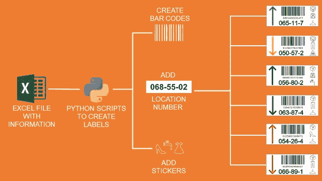

(图片由作者提供)

**场景** 你是一家国际时装零售商物流部的**实施经理**。

对于每个项目，你管理设备的实施，培训团队并设计存储位置的布局。

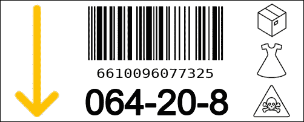

仓库标签示例—(图片由作者提供)

因此，你要花大量时间设计**海报、安全标志**或**标签。**

在这篇文章中，我们探索了一种使用 Python 库 **Pillow** 来自动化图形设计**过程的方法。**

💌新文章直接免费放入你的收件箱:[时事通讯](https://www.samirsaci.com/#/portal/signup)

如果你喜欢看，看看 Youtube 教程

# 如何用 Python 做平面设计？

## 方案

你是一家时装零售商物流部门**项目团队**的一员，该公司在各大洲都有仓库。

该团队负责为新开的配送中心实施流程和设备。

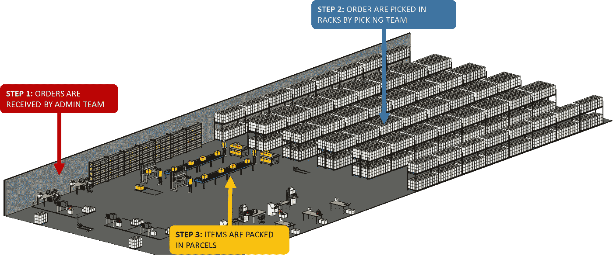

配送中心示例—(图片由作者提供)

例如，您的主要任务是设计存储位置的机架布局。

在一个仓库中，你可以有几百个存放和拣选货物的货盘/货架位置。

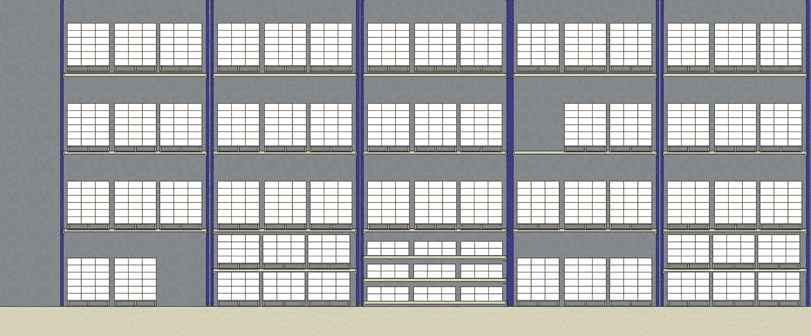

(一层:提货地点，其他层:仓库)——(图片由作者提供)

为了帮助操作员找到正确的位置，您需要打印并粘贴带有关键信息的标签。

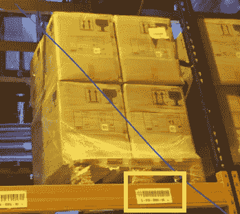

高架存储位置的标签示例—(图片由作者提供)

## 目标

您希望设计定制的标签来减少错误、帮助操作人员并遵守您公司的标准操作程序。

因为每个仓库可能有几千个位置，所以您希望自动化这个过程。

## 解决办法

我将提出一个自动创建这些标签的解决方案。

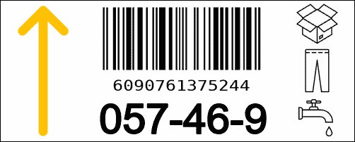

标签的最终结果—(图片由作者提供)

这是一个简单的 python 脚本，它从 excel 文件导入位置信息，并自动生成如上所示的标签。

有关数据分析、生产力和供应链管理的更多文章，

  

# 标签设计

## 六个关键参数

此标签将由三种类型的操作员阅读:

*   联系卡车司机，他们会将托盘或箱子放在这些位置
*   从这些地点提取物品的提货操作员
*   将执行库存盘点的库存管理员

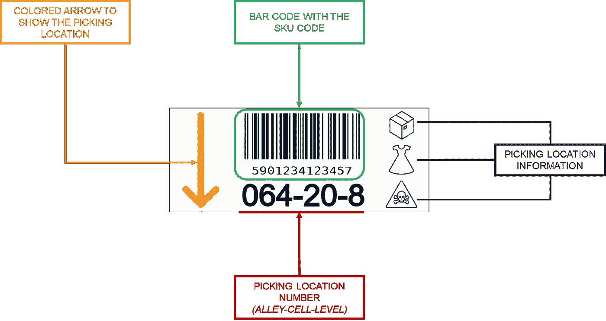

标签信息—(图片由作者提供)

因此，您需要包括一些与位置和存储产品相关的关键信息:

*   一个**彩色箭头**显示产品的存放位置(上方或下方)
*   一个带有 SKU 代码的**条形码**，供使用射频枪的操作人员使用
*   **拣货位置**编号，带有小巷、小区和楼层编号
*   **三个图标**，提供与存储的位置和物品相关的信息

## 空间坐标

考虑到每个项目的大小，您希望固定每个项目的空间坐标。

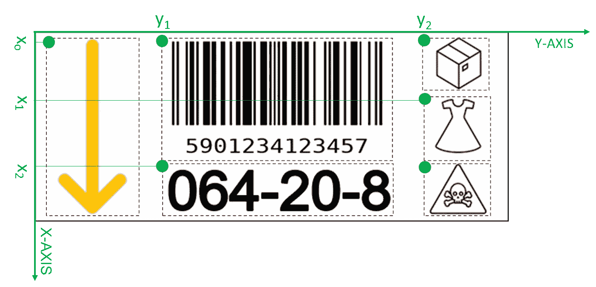

关键坐标—(图片由作者提供)

在这个非常简单的标签中，您有 5 个参数来定位不同的项目。

我们决定把原点放在左上角；是因为枕头用的是同一个原点。

## 导入 png 图标

存储位置编号和条形码将在 python 脚本中生成。

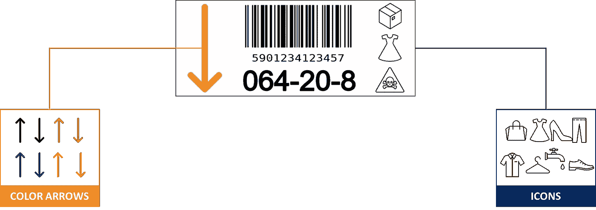

要添加的图标—(图片由作者提供)

其他项目是图标，将使用本地存储的 png 文件导入到您的枕头对象。

## 信息源

在您的主数据中，有几千个 SKU，包含尺寸、重量、价格等信息。

您将把这些 SKU 分配到需要特定标签的提货地点。

对于自动化工具，您可以创建一个 excel 文件，每个 SKU 对应一行，包括

*   **SKU 码**:将用于创建条形码
*   **地理信息**:巷子、区域、位置号
*   **物流处理单元**:如果你是一件一件的拿货，那么是一件；如果你是一箱一箱的拿货，那么是一箱
*   **箭头类型**带有方向和颜色
*   **产品类别**(领带、鞋子、连衣裙……)
*   **提货地点特殊信息**:危险品、洒水车、RFID、…

# 自动创建标签

## 开始循环

您的脚本将遍历数据框的各行，为每一行生成一个标注。

对于每个标签，首先创建一个带有黑色边框和特定尺寸(500，200)像素的空白画布。

空白画布—(作者图片)

## 添加图标

对于这一步，您将添加图标来指定

*   坐标(x，y)
*   使用百分比调整大小后的尺寸
*   图标文件名取自数据框

附言:

*   您需要转换您的 png 文件，以保持透明的背景。
*   图标坐标是使用它们在两个轴上的大小来定义的

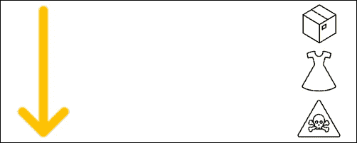

图标标签—(作者提供的图片)

## 添加条形码

使用 SKU 码和 python 的条形码库生成条形码。

页（page 的缩写）学生:

*   create_ean 将生成一个本地存储的 png 文件，该文件将在循环中使用
*   条形码已调整大小以适合画布

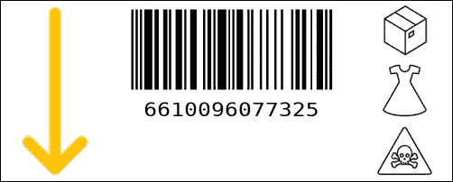

带有条形码的标签—(图片由作者提供)

## 添加位置代码

这最后一步将完全使用 Python Pillow 来执行。

最终结果—(图片由作者提供)

# 瞧啊。

您的标签已生成并准备打印。

这不是列奥纳多·达·芬奇的作品，但只需点击一下，它就可以自动生成数千个标签。

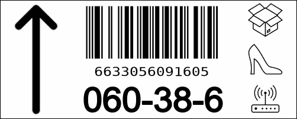

30 秒内生成 1000 个标签—(图片由作者提供)

如果你想了解 Pillow 更高级的功能，可以看看他们的[官方文档](https://pillow.readthedocs.io/)。

## 超出

如果你认为制作 PowerPoint 演示很无聊，看看下面的文章，

  

# 关于我

让我们在 [Linkedin](https://www.linkedin.com/in/samir-saci/) 和 [Twitter](https://twitter.com/Samir_Saci_) 上连线，我是一名供应链工程师，正在使用数据分析来改善物流运营和降低成本。

如果你对数据分析和供应链感兴趣，可以看看我的网站

 