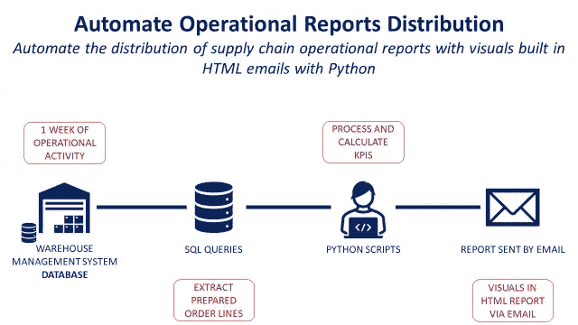
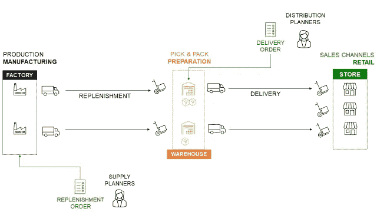
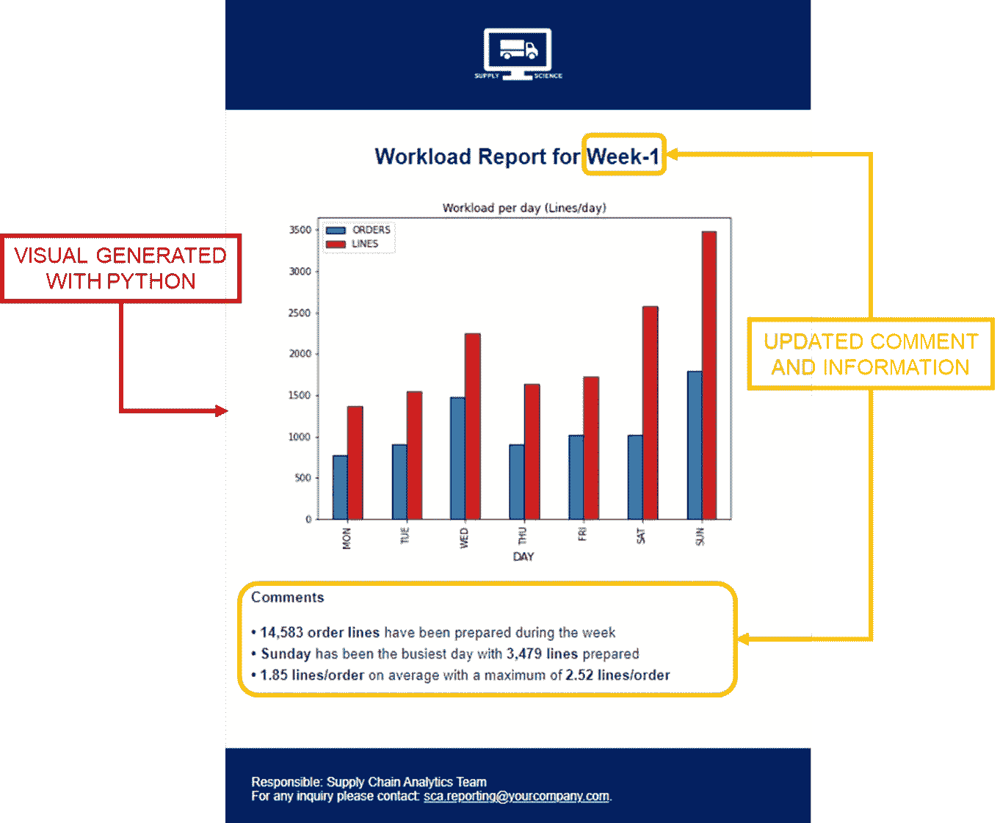
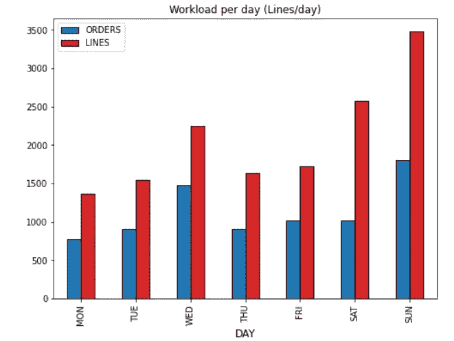
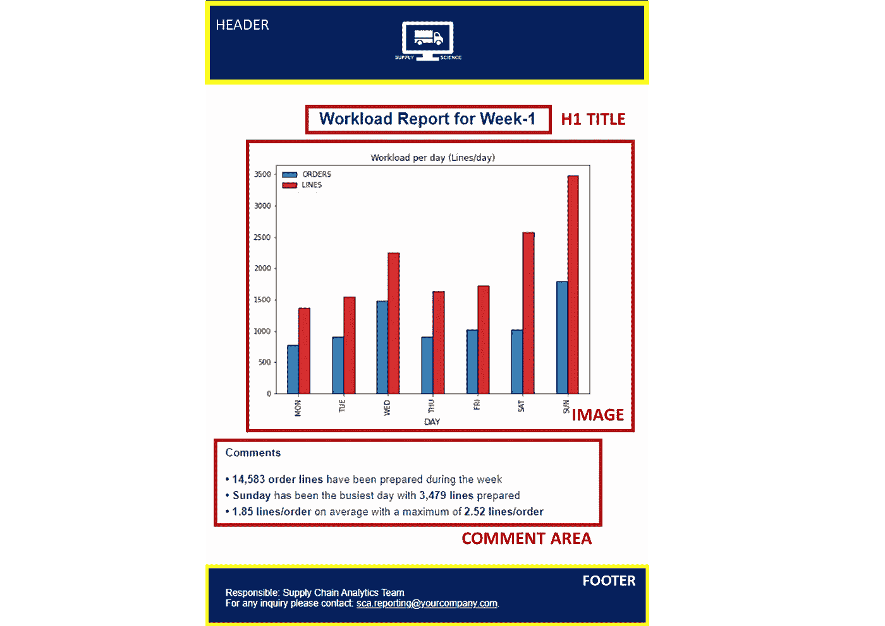
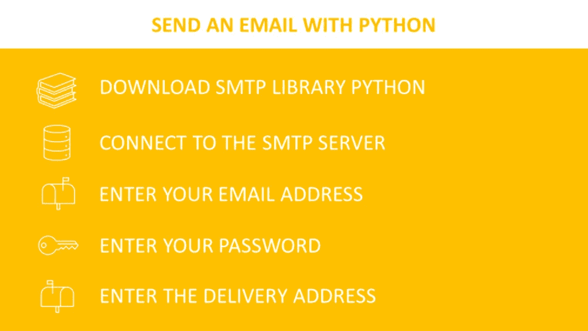

# 使用 Python 在 HTML 电子邮件中自动分发运营报告

> 原文：<https://towardsdatascience.com/automate-operational-reports-distribution-in-html-emails-using-python-c65c66fc99a6>

## 利用 Python 在 HTML 电子邮件中内置的可视化功能，自动分发供应链运营报告

(图片由作者提供)

**场景** 你是一家时装零售公司配送中心的**持续改进工程师**，负责**绩效报告**。

每周，**您连接到系统，提取数据**和**执行分析**以构建操作仪表板。

您通过电子邮件向您的管理层发送带有**运营指标的每周报告。**

这个过程非常耗时，因为您是用 Excel 手动完成的。

**目标** 在本文中，我们将构建一个**全自动解决方案**，使用 **Python** 在 HTML 电子邮件中共享一份**单页运营报告**。

💌新文章直接免费放入你的收件箱:[时事通讯](https://www.samirsaci.com/#/portal/signup)

如果你更喜欢视频，你可以看看 Youtube 教程

# 如何用 Python 通过邮件发送自动报表？

## 方案

你是一家在世界各地都有商店的国际服装集团的持续改进经理。

该公司在亚洲的工厂生产服装、包包和配饰。

**门店**从**本地仓库**发货，由**工厂**直接补货。

物流网络—(图片由作者提供)

## 性能管理

您必须定期与管理层分享仓库运营指标。

这是一个手动过程，您需要

1.  从**仓库管理系统(WMS)** 中提取数据
2.  使用 Excel 处理数据并构建**可视化效果**
3.  通过电子邮件发送一份简短的报告**，并附上图片和评论**

## 目标

为了提高效率，您希望使用 Python 来自动化这个过程。

你的解决方案将是一个**简单的 python 脚本**，部署在云上，它将**自动**执行这四个步骤:

*   从 WMS SQL 数据库中提取上周准备好的订单行
*   使用**关键洞察**处理数据并计算 KPI
*   自动发送带有**视觉效果**和**评论**的 HTML 电子邮件

分四步走—(图片由作者提供)

## 结果

最终报告将如下图所示:

*   标题将根据本周进行调整
*   将包括一个条形图视觉
*   评论区将提供基于视觉的见解

最终结果—(图片由作者提供)

整个过程将是自动化的，因此报告可以在没有您的支持下按时发送。

> 如果您正在寻找运营管理的应用示例，请观看这个短片

<http://samirsaci.com>  

# 解决办法

> *你可以在这里找到带哑数据的源代码:* [*Github*](https://github.com/samirsaci/automated_report)

让我们探索生成最终报告的所有步骤。

生成通过电子邮件发送的自动报告的步骤—(图片由作者提供)

## 数据析取

由于你无法访问我的 WMS 数据库，我共享了一个包含虚拟数据的 CSV 文件。

但是您的解决方案将连接到您的 WMS

*   创建您的 SQL 查询来提取装运记录
*   使用 pandas.read_sql_query 进行查询
*   结果将是一个熊猫数据框

## 数据处理

一个重要的指标是每个订单的行数，您的处理任务会将该列添加到您的数据框中。

## 构建图表

您需要一个简单的条形图，显示每天准备的行数和订单数。

视觉—(作者提供的图片)

## 保存图像

为了嵌入到你的 HTML 页面中，你需要保存它

## 添加见解

你的报告的一个附加价值是用三个要点来总结一周的行动。

因此，您需要计算正确的指标，为您的最高管理层带来可见性。

这些见解将包含在您的评论区 HTML 文件中。

## 创建 HTML 报告

在资源库中，您可以找到一个非常简单的 HTML 页面模板，它将用于创建您的电子邮件。

HTML 文件的结构—(图片由作者提供)

结构简单

*   png 文件中带有徽标的标题
*   更新了当前周的标题
*   您的视觉使用 png 图像
*   包含最新见解的评论区
*   页脚，您可以在其中放置作者的信息

## 包括图像

为了在 HTML 中包含标题和可视内容，您将创建 MIMEImage 对象，并在 HTML 代码中加入 content-id。

## 添加见解

在 HTML 代码中，我在要写见解的地方做了一些标记。想法是使用 replace 函数来修改它们，并放入 python 脚本返回的值。

## 创建并发送电子邮件

要使用 python 发送电子邮件，您可以使用库 smtplib。

使用 python 发送电子邮件—(图片由作者提供)

您需要添加以下信息(示例供参考)

*   **SMTP 服务器，端口:***例如***‘SMTP . Google . com’，465**
*   *您的**电子邮件地址**和**送货地址***
*   *您的邮箱**密码***

*然后，您可以发送带有更新的视觉效果和见解的 HTML 电子邮件。*

# *结论和后续步骤*

**欢迎关注我的 medium，获取更多与数据分析和供应链管理相关的文章**

## *结论*

*有了这个非常简单的例子，您就有了一个模板来构建您自己的报告自动化解决方案。*

*你现在可以了，*

*   *添加视觉效果或表格*
*   *带来更多见解或用条件丰富文本*

## *后续步骤*

*只需点击一下鼠标，就可以在您的计算机上本地启动这个 python 脚本。*

*然而，由于最初的目标是完全自动化这个过程，您可以在 Heroku 上部署这个**代码，并安排在每周一上午 9:00 发布。***

# *关于我*

*让我们在 [Linkedin](https://www.linkedin.com/in/samir-saci/) 和 [Twitter](https://twitter.com/Samir_Saci_) 上连线，我是一名供应链工程师，正在使用数据分析来改善物流运作和降低成本。*

*如果你对数据分析和供应链感兴趣，可以看看我的网站*

*<https://samirsaci.com> *