# 使用 Python 自动创建 PowerPoint 幻灯片

> 原文：<https://towardsdatascience.com/automate-powerpoint-slides-creation-with-python-a639c7d429a6>

## 使用 Python 创建供应链运营 PowerPoint 报告的自动化工具提高您的工作效率

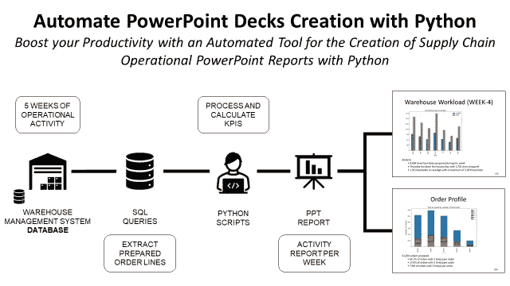

(图片由作者提供)

**场景** 你是一家时装零售公司物流部的**分销计划经理**。

要执行分析，您需要**将**连接到仓库管理系统**，使用 Python 构建的自动化工具提取**和**流程数据**。

但是，您必须花时间手动将这些视觉效果放入幻灯片，以便进行每周运营回顾。

**目标** 在本文中，我们将构建一个解决方案**来自动创建带有视觉效果和注释的 PowerPoint 幻灯片。**

**💌新文章直接免费放入你的收件箱:[时事通讯](https://www.samirsaci.com/#/portal/signup)**

**如果你喜欢看，看看 Youtube 教程吧！**

# **如何用 Python 制作 Powerpoint 演示文稿？**

**你是一家在各大洲都有商店的国际服装零售商的**分销计划团队的一员。****

****

**物流网络—(图片由作者提供)**

**你的分销网络包括几个为商店补充货物的当地仓库。**

## **每月运营回顾**

**在月底，你与商店经理一起组织一次运营回顾，评估分销网络的 [**绩效**](https://www.youtube.com/watch?v=KR_ziEiPcDk) 。**

**为了让讨论生动起来，你准备一些幻灯片，**

1.  **从[仓库管理系统中提取数据(WMS)](https://www.youtube.com/shorts/MW1QRJs3iuE)**
2.  **用 Python 处理数据和构建**视觉效果****
3.  **准备 PowerPoint 演示文稿**

## **目标**

**为了提高效率，您可能希望自动化 PowerPoint 页面集的创建过程。**

**您的解决方案将完全自动化**

*   **从 [WMS SQL 数据库](https://www.youtube.com/shorts/MW1QRJs3iuE)提取上个月的订单行**
*   **每周处理数据并使用**关键洞察**计算 KPI**
*   **在 PowerPoint 演示文稿中自动加入视觉效果和见解**

**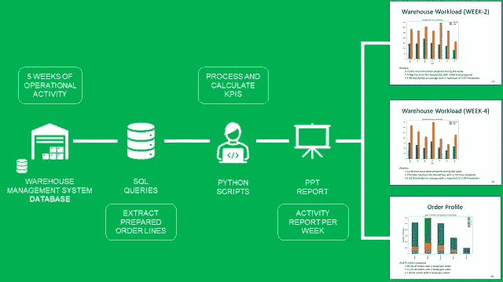**

**分四步走—(图片由作者提供)**

## ****结果****

**最后一组幻灯片将包括如下幻灯片:**

*   ****5 张幻灯片**显示每日工作量*(左)*和 **1 张幻灯片**用于每月订单分析*(右)***
*   **用 Python 生成的可视化**
*   **评论区将提供基于视觉的见解**

**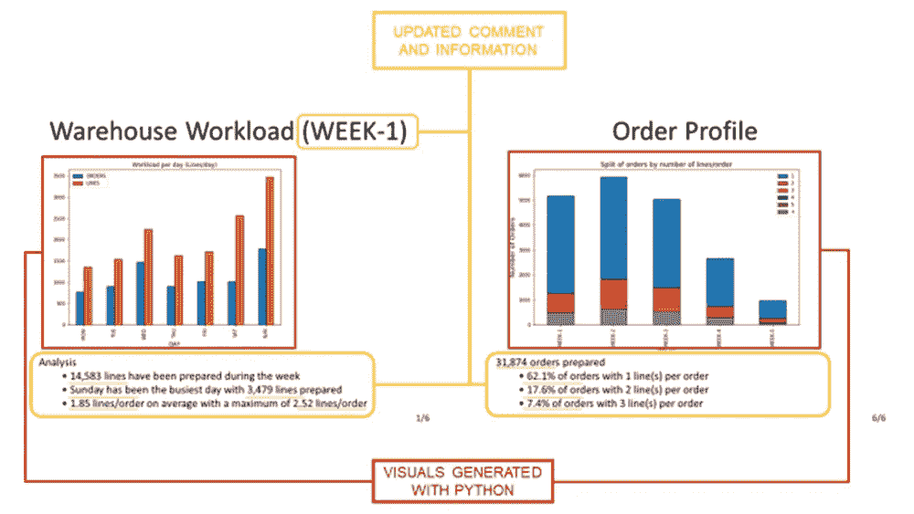**

**最终结果—(图片由作者提供)**

# **解决方法**

> ***你可以在这里找到带哑数据的源代码:*[***Github***](https://github.com/samirsaci/automate-powerpoint)**

**让我们探索生成最终报告的所有步骤。**

**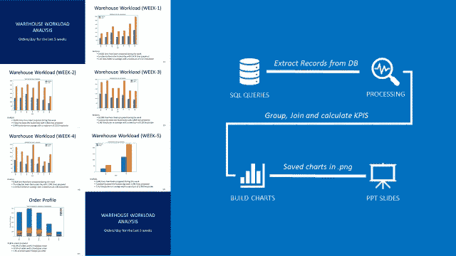**

**在 PowerPoint 上创建运营报告的步骤—(图片由作者提供)**

## **数据析取**

**连接到您的 WMS 并提取装运记录**

*   **创建您的 SQL 查询来提取装运记录**
*   **使用 pandas.read_sql_query 进行查询**
*   **结果将是一个熊猫数据框**

**如果你没有访问**[**WMS 数据库**](https://www.youtube.com/shorts/MW1QRJs3iuE) 的权限，可以使用 GitHub repo 中共享的数据集。****

## ****处理数据****

****添加一个使用 pandas 计算每个订单行数的列。****

## ****创造视觉效果****

****创建一个简单的条形图，显示每天准备的行数和订单数。****

****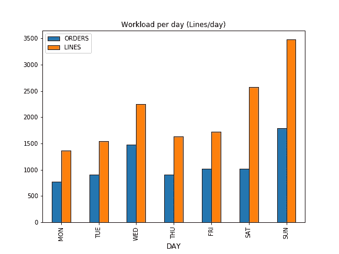****

****条形图—(图片由作者提供)****

****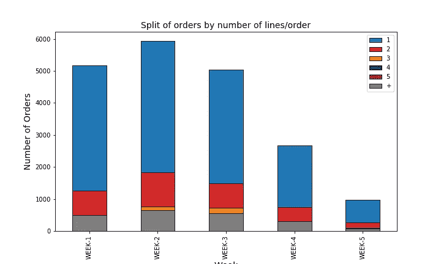****

****堆积条形图—(图片由作者提供)****

## ****保存图表****

****为了添加到 PowerPoint 中，您需要将其保存在本地。****

## ****添加评论和见解****

****您可以根据您共享的图表添加评论，该图表将总结每周的表现。****

****为了更加清晰起见，请将这些评论放在图片下面。****

****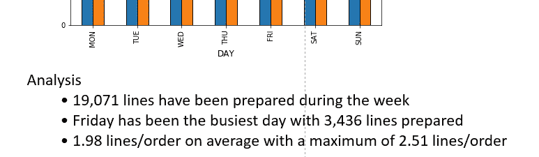****

****评论示例—(图片由作者提供)****

# ****创建 PowerPoint 幻灯片组****

****我们将使用开源库 **python-pptx** 来构建我们的 PowerPoint 平台。更多详情，请看[文档](https://python-pptx.readthedocs.io/en/latest/)。****

## ******介绍幻灯片******

****我们将在演示开始时以一张特殊的介绍幻灯片开始。****

****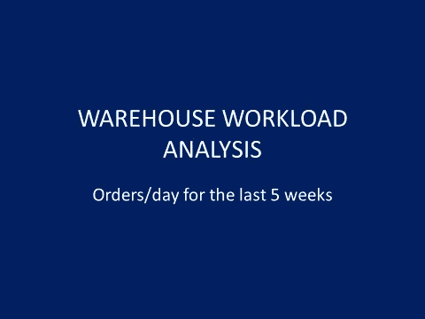****

****第一张幻灯片—(图片由作者提供)****

******代码******

## ******每周每日分析幻灯片******

****你的幻灯片的结构总是一样的****

*   ****顶部的标题*(例如:仓库工作量(第 5 周))*****
*   ****幻灯片中央的一幅画****
*   ****评论区的文本框****

****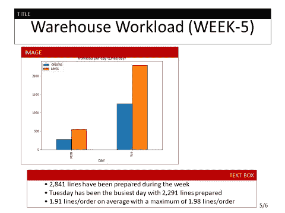****

****幻灯片结构—(图片由作者提供)****

******代码******

****💡提示
*你可以通过修改 Inches()函数的参数来改变对象的位置。*****

## ******订单概况的每周分析******

****在本幻灯片中，您将使用堆积条形图，注释将基于整个月的范围。****

****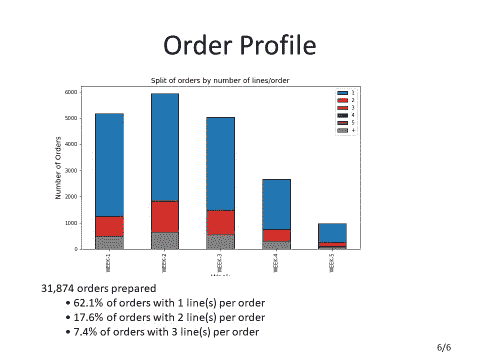****

****订单简介—(作者图片)****

******代码******

****💡提示
*您可以通过修改函数 Pt()的参数来改变字体大小。*****

****最后，您有一个包含 7 张幻灯片的 PowerPoint 文件，可用于您的会议。****

****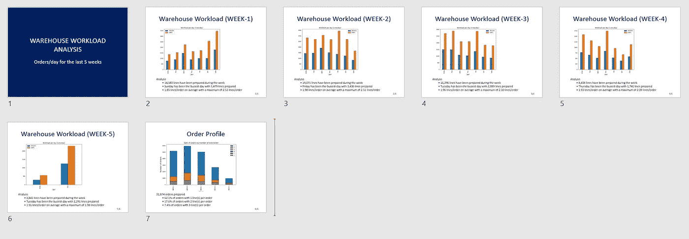****

****PowerPoint 决赛—(图片由作者提供)****

# ****结论和后续步骤****

*****欢迎关注我的 medium，获取更多与数据分析和供应链管理相关的文章*****

## ****结论****

****有了这个非常简单的例子，您就有了构建自己的 PowerPoint 自动化解决方案的模板。****

****你现在可以了，****

*   ****添加 PowerPoint 的视觉效果、表格或智能视觉效果(查看文档)****
*   ****带来更多见解或用条件丰富文本****

****只需点击一下鼠标，就可以在您的计算机上本地启动这个 python 脚本。****

## ****自动化电子邮件报告****

****您还可以使用 python 的 SMTP 库通过电子邮件自动分发报告。****

****事实上，一个部署在云上的简单 python 脚本将**自动**执行这四个步骤:****

*   ****从 WMS SQL 数据库中提取上周准备好的订单行****
*   ****使用**关键洞察**处理数据并计算 KPI****
*   ****自动发送带有**视觉效果**和**评论**的 HTML 电子邮件****

****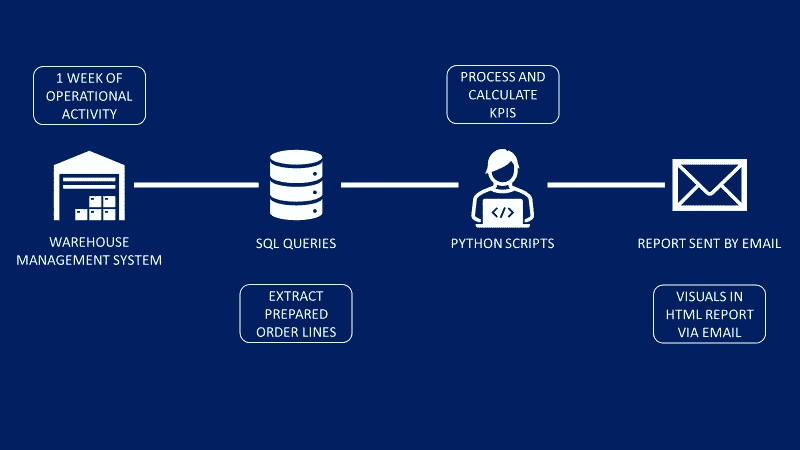****

****分四步走—(图片由作者提供)****

****更多的细节，你可以看看我几周前发表的这篇文章，****

****<https://www.samirsaci.com/automate-operational-reports-distribution-in-html-emails-using-python/>  

# 关于我

让我们在 [Linkedin](https://www.linkedin.com/in/samir-saci/) 和 [Twitter](https://twitter.com/Samir_Saci_) 上连线，我是一名[供应链工程师](https://www.samirsaci.com/blog/)正在使用数据分析来改善物流运作和降低成本。

如果你对数据分析和供应链感兴趣，可以看看我的网站

<https://samirsaci.com> ****