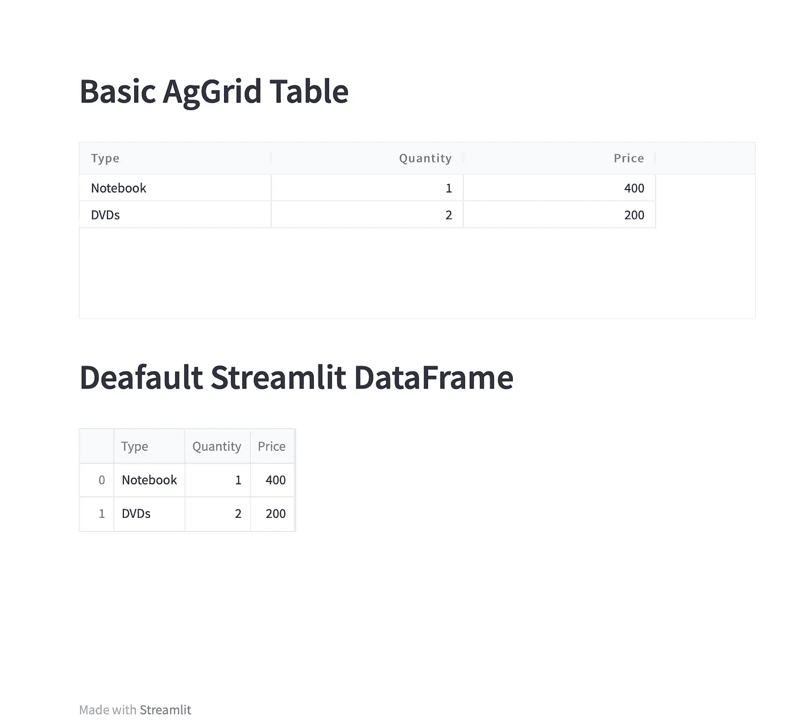
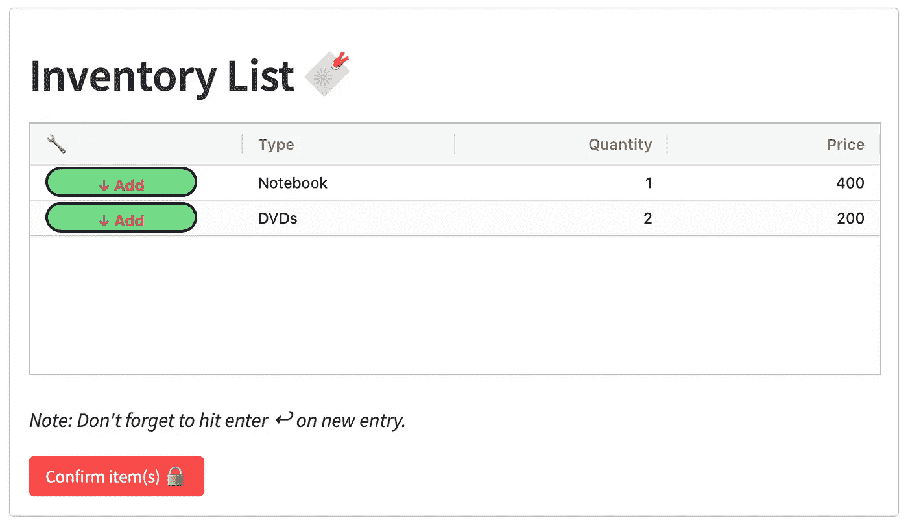
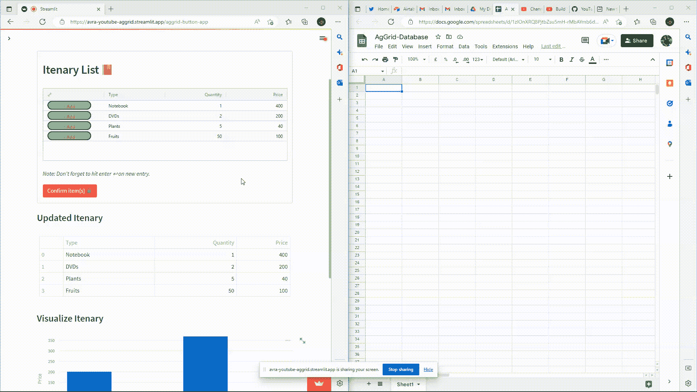

# 使用交互式 AgGrid 和 Google Sheets 自动化 Streamlit Web 应用程序

> 原文：<https://towardsdatascience.com/automate-streamlit-web-app-using-interactive-aggrid-with-google-sheets-81b93fd9e648>

## *可定制的* AgGrid 数据表连接到谷歌工作表数据库


这幅图像旨在展示 Streamlit、Google Sheet 和 AgGrid table 之间微妙的抽象联系，由互联的电话描绘，允许数据在它们之间无缝流动。照片由[帕万·特里库塔姆](https://unsplash.com/@ptrikutam?utm_source=medium&utm_medium=referral)在 [Unsplash](https://unsplash.com?utm_source=medium&utm_medium=referral) 上拍摄

## **TL；博士**

*   这篇博客文章演示了如何在 Streamlit 应用程序中使用 AgGrid 库来创建交互式数据表。
*   它展示了如何将表连接到 Google Sheets 数据库，并将数据从表发送到数据库。
*   此外，还实现了 JavaScript 回调，用于向 AgGrid 表添加行。

# 1.介绍

treamlit 是一个流行的开源框架，用于构建数据科学和机器学习应用。它允许开发人员使用简单的 Python 代码创建交互式的、基于 web 的应用程序。然而，Streamlit 中内置的数据表组件功能有限，并不总是适合更高级的用例。这就是 AgGrid 库的用武之地。AgGrid 是一个强大的 JavaScript 库，可以用来创建交互式数据网格和表格。

在 Streamlit 应用程序中实现 AgGrid 对于数据科学家和机器学习工程师来说特别有用，他们希望构建用户友好的应用程序，允许用户查看、操作和分析数据。AgGrid 提供了多种功能，如过滤、排序和聚合，可以帮助用户更好地理解和处理大型数据集。它还支持多种数据类型，包括数字、字符串和日期，并且可以根据应用程序的需要进行定制。

在这篇博文中，我们将演示如何在 Streamlit 应用程序中使用 AgGrid，并将其连接到 Google Sheets 数据库。我们将向您展示如何创建一个可定制的数据表，将数据从表发送到数据库，以及使用 JavaScript 函数向表中添加行。

# 2.先决条件

要阅读这篇博文，您需要安装以下库:

*   `streamlit`:这是主要的 Streamlit 库，用于在 Python 中构建交互式数据应用。要安装它，您可以使用下面的命令:`pip install streamlit`
*   `pandas`:这个库用于 Python 中的数据操作和分析。在我们的用例中，它用于读/写数据和创建数据帧。DataFrame 是一种表格数据结构，可用于存储和操作数据。要安装它，您可以使用下面的命令:`pip install pandas`
*   `streamlit-aggrid`:这是一个 Streamlit 扩展或包装器，提供与 AgGrid 库的集成。它用于创建和自定义数据表。要安装它，您可以使用下面的命令:`pip install streamlit-aggrid`
*   `gspread`:这是一个用于与 Google Sheets 交互的 Python 库。它用于连接 Google Sheets 数据库。要安装它，您可以使用下面的命令:`pip install gspread`
*   `google-auth`和`google-auth-oauthlib`:这些库用于谷歌服务的认证。它们是`gspread`库工作所必需的。要安装它们，您可以使用下面的命令:`pip install google-auth google-auth-oauthlib`

或者，您可以从终端使用以下命令一起安装这些库，

```
# Installation of the dependencies 
pip install streamlit pandas streamlit-aggrid gspread
```

# 3.设置简单的 AgGrid 表

一旦我们安装了依赖项，我们就可以开始创建一个虚拟数据帧，用于填充 AgGrid 表。我们将首先导入必要的库并创建一个示例数据框架，

```
# Importing the dependencies

import streamlit as st 
import pandas as pd
from st_aggrid import AgGrid, JsCode
from st_aggrid.grid_options_builder import GridOptionsBuilder
```

```
# Creates a Streamlit header and an Expander 
# to provide some context for the app.

st.header("AgGrid Demo `Part 3`")
with st.expander('🤩 What I plan to demonstrate today ? ', expanded=False):
    st.markdown('''

                ◻ 1\. Implementing `button` within AgGrid table

                ◻ 2\. Display any `update` made from the user-end

                ◻ 3\. `Download` the AgGrid table

                ◻ 4\. `Connect` to Database
                ''')

# Create an AgGrid table from a pandas DataFrame
d = {‘Type’:[‘Notebook’, ‘DVDs’] ,’Quantity’: [1, 2],’Price’: [400, 200]}
df = pd.DataFrame(data = d)
```

现在我们有了一个示例数据帧，我们可以使用`AgGrid`函数在 Streamlit 中将它显示为一个 AgGrid 表:

```
# Display the Dataframe in AgGrid
AgGrid(df)
```

这将为我们提供一个包含虚拟数据的基本 AgGrid 表，但是它的交互性不是很好。为了使我们的 AgGrid 表更具交互性，我们可以使用 JavaScript 添加一些特性，比如单元格渲染器和单元格上的点击事件。



来自演示 Streamlit 应用程序的屏幕截图，展示了(上)AgGrid 表(下)默认 Streamlit-data frame-按作者分类的图像之间的差异

# 4.实现一个允许向 AgGrid 表中添加新行的按钮

要向 AgGrid 表添加按钮，我们需要使用 JavaScript 创建一个自定义单元格渲染器。单元格渲染器是一个返回要在单元格中显示的 HTML 元素的函数。

我们将首先创建一个 JavaScript 函数，当单击按钮时，该函数向 AgGrid 表添加一个新行。为此，我们将使用 AgGrid API 提供的`applyTransaction`方法。这个方法允许我们通过应用一个事务对网格进行修改。在这种情况下，我们使用`add`事务向表中由`rowIndex`指定的索引处添加一个新的空行。

```
# JavaScript function to add a new row to the AgGrid table
js_add_row = JsCode ('''
function(e) {
 let api = e.api;
 let rowPos = e.rowIndex + 1; 
 api.applyTransaction({addIndex: rowPos, add: [{}]}) 
};
'''
)
```

接下来，我们将定义一个单元格呈现器，它将在`'🔧'` AgGrid 列的每个单元格中呈现一个按钮。单元格渲染器是一个定义如何渲染单元格的类。在本例中，我们使用 HTML `button`元素来呈现按钮。该按钮将有一个`onclick`事件，当点击时调用`js_add_row`函数。我们还在按钮上应用了一些基本的 CSS 样式，使它看起来更有吸引力。

```
# Cell renderer for the '🔧' column to render a button
cellRenderer_addButton = JsCode('''
    class BtnCellRenderer {
        init(params) {
            this.params = params;
            this.eGui = document.createElement('div');
            this.eGui.innerHTML = `
            <span>
                <style>
                .btn_add {
                    background-color: #71DC87;
                    border: 2px solid black;
                    color: #D05732;
                    text-align: center;
                    display: inline-block;
                    font-size: 12px;
                    font-weight: bold;
                    height: 2em;
                    width: 10em;
                    border-radius: 12px;
                    padding: 0px;
                }
                </style>
                <button id='click-button' 
                    class="btn_add" 
                    >&#x2193; Add</button>
            </span>
        `;
        }
        getGui() {
            return this.eGui;
        }
    };
    ''')
```

# 5.用按钮功能可视化 AgGrid

现在我们已经定义了 JavaScript 函数，我们可以创建一个 AgGrid 表并配置它来显示我们的按钮。为此，我们将首先使用`from_dataframe`方法从我们的熊猫数据帧中创建一个`GridOptionsBuilder`对象。这将根据 DataFrame 中的数据为我们的 AgGrid 表创建一个默认配置。

接下来，我们将使用`configure_column`方法指定字段名为`'🔧'`的列应该使用我们的`cellRenderer_addButton`单元格渲染器，我们还将指定`onCellClicked`事件应该触发我们的`js_add_row` JavaScript 函数。

```
# Create a GridOptionsBuilder object from our DataFrame
gd = GridOptionsBuilder.from_dataframe(df)

# Configure the default column to be editable
# sets the editable option to True for all columns
gd.configure_default_column(editable=True)

# Configure the '🔧' column to use our the cell renderer 
# and onCellClicked function
gd.configure_column( field = '🔧', 
                     onCellClicked = js_add_row,
                     cellRenderer = cellRenderer_addButton,
                     lockPosition='left')
                    )
gridoptions = gd.build()
```

最后，我们可以使用`AgGrid`函数并传入`GridOptionsBuilder`对象来创建我们的 AgGrid 表。注意，为了从用户界面的角度简化，我们使用`st.form()`布局在 Streamlit 前端创建一个表单。该表单有一个标题，上面写着“库存清单”🔖和一个标记为“确认项目”的提交按钮🔒".`AgGrid`函数中使用的参数在代码块中被很好地注释了。

```
# AgGrid Table with Button Feature
# Streamlit Form helps from rerunning on every widget-click
# Also helps in providing layout

with st.form('Inventory') as f:
    st.header('Inventory List 🔖')

# Inside the form, we are displaying an AgGrid table using the AgGrid function. 
# The allow_unsafe_jscode parameter is set to True, 
# which allows us to use JavaScript code in the AgGrid configuration
# The theme parameter is set to 'balham', 
# which applies the Balham theme to the table
# The height parameter is set to 200, 
# which specifies the height of the table in pixels.
# The fit_columns_on_grid_load parameter is set to True, 
# which ensures that the columns of the table are resized to fit 
# the width of the table when it is first displayed

    response = AgGrid(df,
                    gridOptions = gridoptions, 
                    editable=True,
                    allow_unsafe_jscode = True, 
                    theme = 'balham',
                    height = 200,
                    fit_columns_on_grid_load = True)
    st.write(" *Note: Don't forget to hit enter ↩ on new entry.*")
    st.form_submit_button("Confirm item(s) 🔒", type="primary") 
```

就是这样！现在您应该有一个工作的 AgGrid 表，在`'🔧'`列的每个单元格中有一个按钮，单击该按钮时会向表中添加一个新行。



应用程序的屏幕截图，显示 AgGrid 表中呈现的“添加按钮”——图片由作者提供

# 6.以表格或图的形式获取 AgGrid 数据

表格中的数据很容易获取。每当前端用户确认 AgGrid 表中的任何更改并触发`st.form_submit_button()`时，`st.table`函数用于以表格形式显示 AgGrid 表中的更新数据。

```
# Visualize the AgGrid when submit button triggered           
st.subheader("Updated Inventory")
# Fetch the data from the AgGrid Table
res = response['data']
st.table(res) 
```

然后我们使用`st.bar_chart`函数显示来自 AgGrid 表的数据的条形图，使用`Type`列作为 x 轴，使用`Price`列作为 y 轴。

```
# Plotting the data
st.subheader(“Visualize Inventory”)
st.bar_chart(data=res, x = ‘Type’, y = ‘Price’)
```

# 7.将 AgGrid 数据保存在本地或云中

为了用户界面的美观，我们使用`st.columns`函数创建了两列，在第一列中，我们有一个标签，上面写着“保存在本地机器中？”。在第二列中，我们的目标是创建一个按钮，将 AgGrid 数据更新到连接的 Google Sheet。

**a)本地下载:**`csv`变量设置为对 AgGrid 表中的数据调用`convert_df`函数的结果。单击该按钮时，会下载名为“file.csv”的 CSV 文件。

```
# Function
@st.experimental_memodef 
convert_df(df): 
```Converts the data to a CSV format```
  return df.to_csv(index=False).encode(‘utf-8’)

st.subheader("Store Inventory")
col1,col2 = st.columns(2)
# https://docs.streamlit.io/knowledge-base/using-streamlit/how-download-pandas-dataframe-csv
csv = convert_df(response['data'])
col1.write("Save in Local Machine?")
col1.download_button(
   "Press to Download 🗳️",
   csv,
   "file.csv",
   "text/csv",
   key='download-csv'
)
```

**b)实时更新到云端:** Google Sheets 可以作为云存储解决方案，以表格格式存储和访问数据。数据可以由多个用户同时访问和修改，更改会自动保存并实时同步。

*注意，在这一步，为了获得服务账户信息，您需要创建一个谷歌云平台(GCP)项目和一个服务账户，然后下载服务账户密钥文件。参考文献[3]对这些步骤进行了详细阐述。*

下面的步骤描述了所使用的代码(为了更好地理解，对代码进行了很好的注释)，

*   下面的代码首先导入`service_account`模块和`gspread`库。`gspread`库用于从 Python 访问和修改 Google Sheets 文档。

```
# Importing the necessary Library
from google.oauth2 import service_account
import gspread 

def send_to_database(res):
    # Create a list of scope values to pass to the credentials object
    scope = ['https://spreadsheets.google.com/feeds',
            'https://www.googleapis.com/auth/drive']

    # Create a credentials object using the service account info and scope values
    credentials = service_account.Credentials.from_service_account_info(
                st.secrets["gcp_service_account"], scopes = scope)

    # Authorize the connection to Google Sheets using the credentials object
    gc = gspread.authorize(credentials)

    # Open the Google Sheets document with the specified name
    sh = gc.open("AgGrid-Database")

    # Access the worksheet within the document with the specified name
    worksheet = sh.worksheet("Sheet1") 

    # Set up a progress bar
    my_bar = st.progress(0)

    # Iterate through the rows of the data frame
    for ind in res.index:
        # Calculate the percentage complete
        percent_complete = (ind+1)/len(res) 
        # Update the progress bar
        my_bar.progress(percent_complete)

        # Get the values in the first column of the worksheet
        values_list = worksheet.col_values(1)
        # Calculate the next empty row in the worksheet
        length_row = len(values_list)

        # Update the cells in the worksheet with the data from the data frame
        worksheet.update_cell(length_row+1, 1, res['Type'][ind])
        worksheet.update_cell(length_row+1, 2, str(res['Quantity'][ind]))
        worksheet.update_cell(length_row+1, 3, str(res['Price'][ind]))

    # Return a success message
    return st.success("Updated to Database ", icon="✅")\

# If the "Send to Database" button is clicked, execute the send_to_database() function
col2.write("Save in Shared Cloud?")
if col2.button("Send to Database"):
    send_to_database(res)
```

*   该函数首先定义一个列表`scope`，指定服务帐户应该拥有的权限。在这种情况下，服务帐户被授权访问 Google Sheets API 和 Google Drive API。
*   接下来，我们需要检索必要的凭证来访问我们的 Google Sheets 数据库。代码使用`Credentials.from_service_account_info()`方法创建一个`Credentials`对象，并传递存储在`st.secrets`字典中的服务帐户信息。该方法返回一个`Credentials`对象，该对象可用于验证到 Google Sheets 和 Google Drive 的连接。
*   然后使用`Credentials`对象使用`gspread.authorize()`方法来验证到 Google Sheets 的连接。`gc.open()`方法用于打开名为“AgGrid-Database”的 Google Sheets 文档，而`sh.worksheet()`方法用于访问名为“Sheet1”的文档中的工作表。
*   然后代码使用`st.progress()`方法建立一个进度条。它遍历 DataFrame `res`的行，对于每一行，它使用`worksheet.col_values()`方法检索工作表第一列中的值。然后使用`update_cell()`方法用数据框`res`中的数据更新工作表中的单元格。
*   最后，当所有数据都写入工作表时，代码使用`st.success()`方法返回一条成功消息。该代码还包含一个`if`语句，当单击“发送到数据库”按钮时，该语句执行`send_to_database()`函数。



将数据从 AgGrid 表更新到云(Google Sheets)——作者视频

# 8.结论

总之，使用上面的代码行创建的 web 应用程序演示了 AgGrid 表中各种功能的实现，包括添加新行、显示用户所做的更新、下载表以及连接到数据库的能力。该应用程序易于使用，界面简洁，功能直观。无论你是想跟踪库存，更新待办事项列表，还是管理任何其他数据，这款网络应用都能满足你。该应用的现场演示可以在[这里](https://avra-youtube-aggrid.streamlit.app/aggrid-button-app)找到。

# 9.参考

[1] A.Gadhir，[如何在 AG 网格单元格中添加按钮](https://blog.ag-grid.com/cell-renderers-in-ag-grid-every-different-flavour/)，(2020)

[2] [CSS 按钮—基本按钮样式](https://www.w3schools.com/css/css3_buttons.asp)，W3CSS

[3] [将 Streamlit 连接到一个私有的 Google 工作表](https://docs.streamlit.io/knowledge-base/tutorials/databases/private-gsheet)，Streamlit (2021)

[4] P.Fonseca， [streamlit-aggrid Python 包](https://github.com/PablocFonseca/streamlit-aggrid)，(2020)

# 10.代码

这里是完整的代码，快速开始，玩得开心！

请随意写下您的反馈。Tada！