# 使用您的第一个 Python 警报机器人自动化团队

> 原文：<https://towardsdatascience.com/automate-teams-with-your-first-python-alerting-bot-bcc8f7c6ee5a>


图 1——亚历山大·奈特在 Unsplash 上的照片

## 在 5 分钟内发送您的第一个通知！

在许多公司中，微软团队是公司沟通的核心。您可以与同事交谈，计划和协助会议，创建*团队*来共享项目中的信息和文件。据称，它是微软协作的[中心。](https://www.microsoft.com/en-us/microsoft-teams/group-chat-software)

今天，让我们看看如何让团队实现自动化，并使用它来发送个人或专业通知。webhooks 的设置非常简单，不超过 5 分钟。难以置信！

## 动机

1.  你在训练一个 ML 模型。这可能需要几个小时，并且您希望在运行结束时得到提醒。在你的电脑和手机上给自己发送一个跑步结束的信号是非常容易的。
2.  您正在运行 10 分钟的计算操作。太短做不了别的，太长看不了屏幕。你可能会死在你的手机上！在运行结束时收到状态通知可以提高工作效率，避免浪费时间。
3.  您或您的团队希望在计算过程中得到一些信息的提醒，以防执行异常。*(例如:评估较差的数据质量。)*
4.  您希望以报告的形式与您的团队或更广泛的工作受众共享每日或每月的数据。您的同事会很高兴通过特定的(有组织的)渠道接收数据作为专用通知，而不是通过另一封包含数据的电子邮件和另一个加入的 PowerPoint。

## 技术概述

要发送团队通知，必须执行以下步骤

*   拥有一个团队帐户和一个团队，并有一个在*(先决条件)*上发布的渠道
*   将 webhook 连接器添加到该团队
*   在通道中配置 webhook 连接器
*   创建要发布的内容
*   从任何联网设备请求正确的 URL(最终使用 Python)

# 创建网页挂钩

webhook 是一个链接，您将获得并使用它来发送一个 HTTP `post`请求，其中包含所需的通知内容。

首先，你需要决定在哪个香奈儿哪个团队发布通知。为了这篇博文，我创建了一个专门的中型聊天机器人团队，有一个私人教程频道。

1.  在频道的设置(“ **…** ”)上，点击连接器。

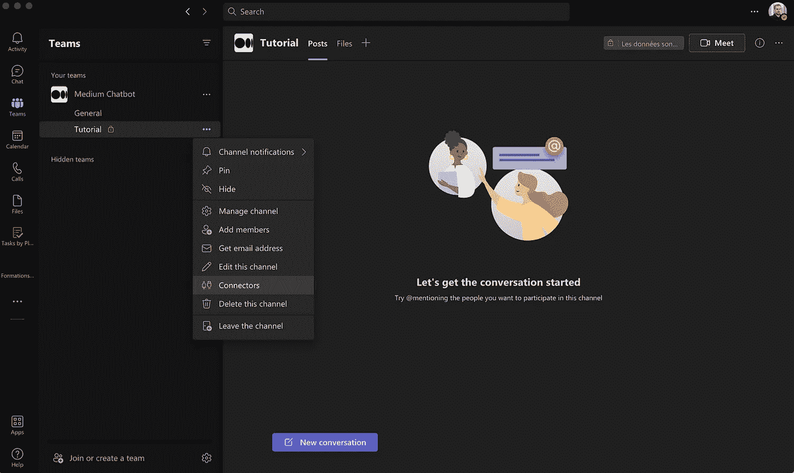

图 2 —在团队通道上打开连接器窗口

2.它将打开所有可用的连接器。在右上角的搜索栏中查找“webhook”。

3.点击“传入网页挂钩”的“**添加**按钮

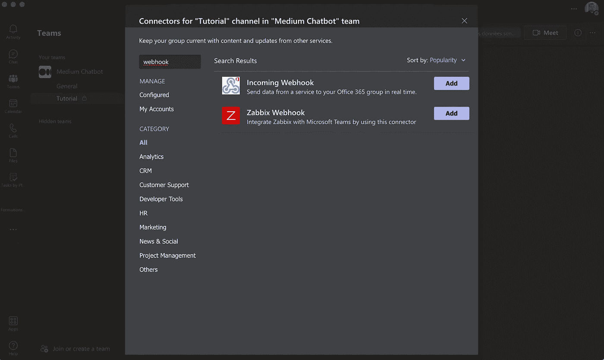

图 3 —在团队中选择传入的 Webhook

4.这将打开一个新对话框来验证您的选择。再次点击**添加**

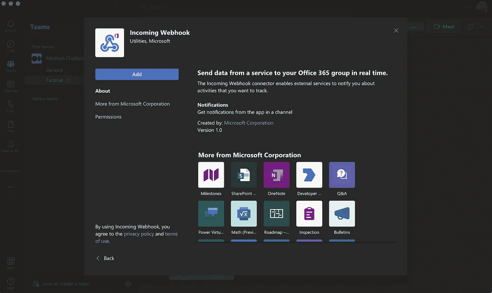

图 4 —在团队中安装引入的 Webhook

5.不同的窗口将会关闭

6.重新打开通道的连接器:设置“**…**”**>****连接器**。您将看到第一个可用的连接器现在是传入的 webhook。

7.点击**配置**按钮

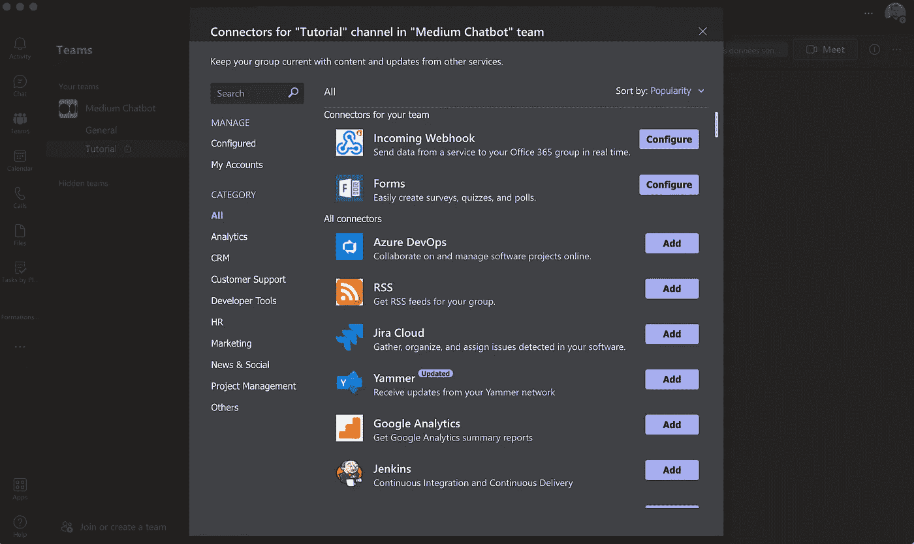

图 5 —恢复到团队频道的连接器页面

8.配置框打开。您会立即看到配置是多么简单:

*   给机器人起个名字。当通知到达时，它将是频道中显示的名称。我习惯在名字里加一个机器人表情符号🤖！让我们把它命名为“你忠诚的机器人”🤖"
*   添加个人资料图片。也将在发布消息时显示。因为我们想用 Python 实现自动化，所以我会添加 Python 徽标作为个人资料图片。但是你显然可以使用你公司的标志，一个机器人图片，或者你的脸书个人资料图片！

就是这样！不要害怕，如果你不确定你的机器人的名字，你可以在以后更改这些信息而不会有任何后果😉

9.点击“创建”按钮

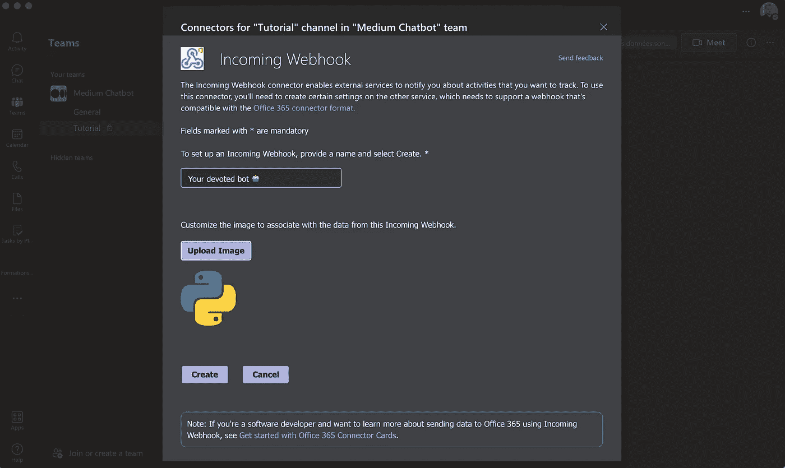

图 6 —配置传入的 Webhook

10.你的专用机器人的网址将会出现，你可以复制它。

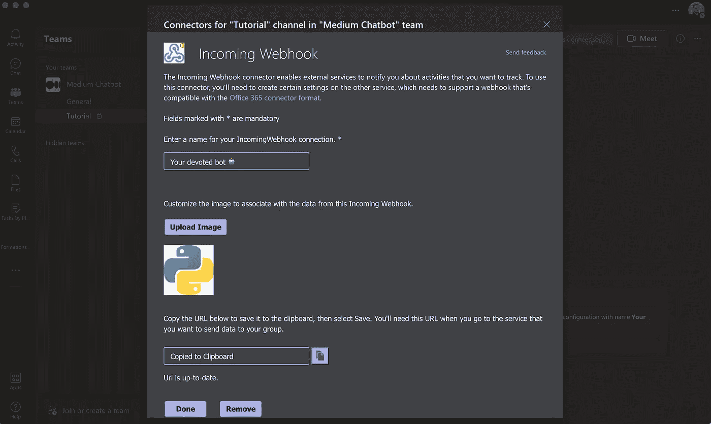

图 7 —获取传入网络挂钩的 URL

它看起来将如下所示:

```
[https://yourcompanyname.webhook.office.com/webhookb2/3502e881-7606-4faf-99a6-116a08d2ae9b@ebaeb74c-fiff-40f8-b755-10b0e2bf7528/IncomingWebhook/tl23354ab6704kys83466028f40mmss0/49c2927e-6269-4317-9d68-d2d1057b07fb](https://mousquetaires.webhook.office.com/webhookb2/3205e881-7066-4faf-99a6-116a08d2ae9b@ebaeb74c-eeae-40f8-b755-10b0e2bf7528/IncomingWebhook/fa25573da6704dcd83466028d40caaa0/49c2927e-6269-4317-9d68-d2d1057b07fb)
```

11.把这个 URL 保存在某个地方，我们稍后会看到如何使用它。

12.现在，您可以点击“ **Done** ”按钮并关闭连接器窗口。

13.现在，回到通道，您将看到一条消息，表明您配置了一个传入的 Webhook。

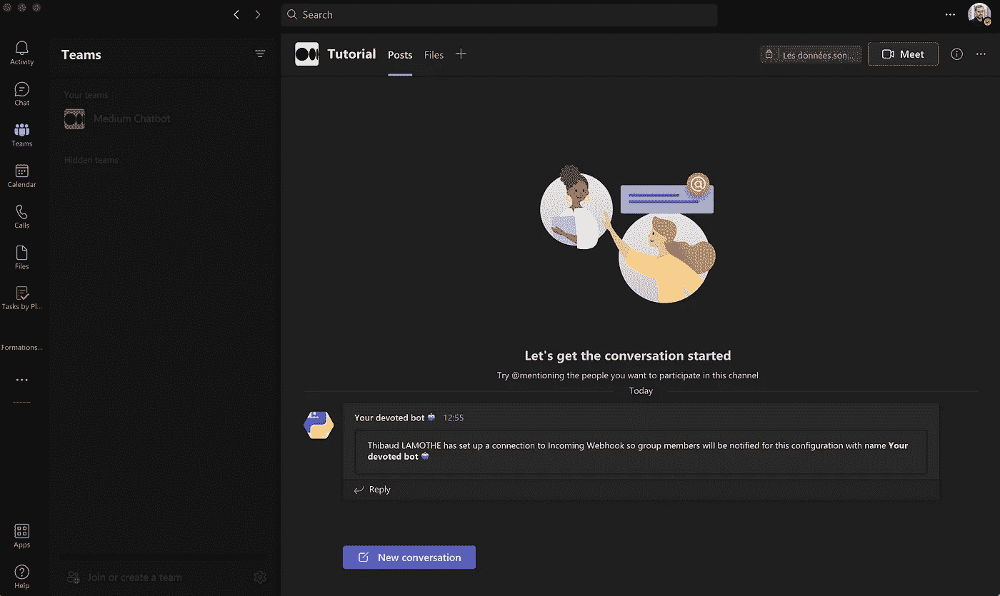

图 8-正确安装的确认

还有…差不多就是这些了！第一次可能会花你几分钟的时间，但是将来，我相信你可以在 45 秒内完成这个过程⏲

现在，您的通道可以从外部来源接收消息，让我们更深入地了解如何发送通知。

# 发送通知

## 通知构成

有很多方法可以通过 webhook 创建内容。你可以在这里找到微软的文档，但是在我做过的许多测试中，没有多少是有效的。然后我将向您展示一个可以被 webhook 解释的基本消息。

该消息必须采用 JSON 格式，并且至少包含 3 个必填字段。

*   **摘要**:将显示在电话通知上的文本。
*   **activityTitle** :将在频道中显示在通知顶部的文本
*   **activitySubtitle** :是您的通知消息的内容。
*   在你的通知顶部，你会看到一行出现。该值用[十六进制色码](https://www.color-hex.com/)定义其颜色。

## 发送消息

如前所述，要发送通知，您需要发送一个包含数据的 post 请求。Post 请求可能不是从普通浏览器发送的，但是可以很容易地用 Python 来管理。

而要发送 post 请求，没有什么比使用[请求包](https://docs.python-requests.org/en/latest/)更简单的了，为人类简化 HTTP。

从 Python 脚本发送请求

执行这段代码基本上会将通知发送到您的通道😎

不用说，互联网连接对于这一步是绝对必要的。

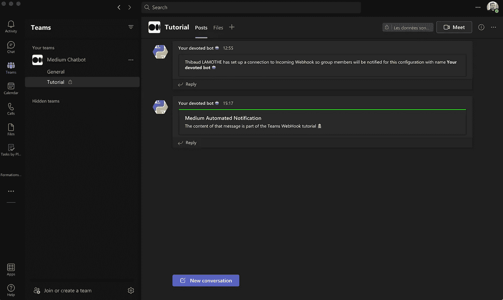

图 9 —您的第一个自动通知

您可以看到与所使用的十六进制颜色值“ *00FF00* ”相对应的绿线。

注意:除了使用 python 进行 post 请求，还可以使用软件如 [postman](https://www.postman.com/) 来发送通知。

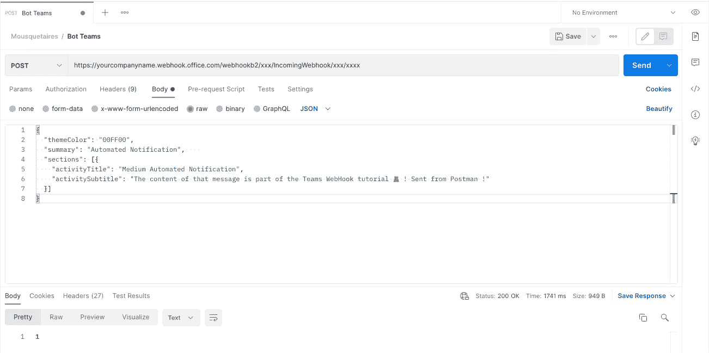

图 10 —使用邮递员的自动通知—团队中的传入 Webhook

结果会非常相似(不是说完全一样！).

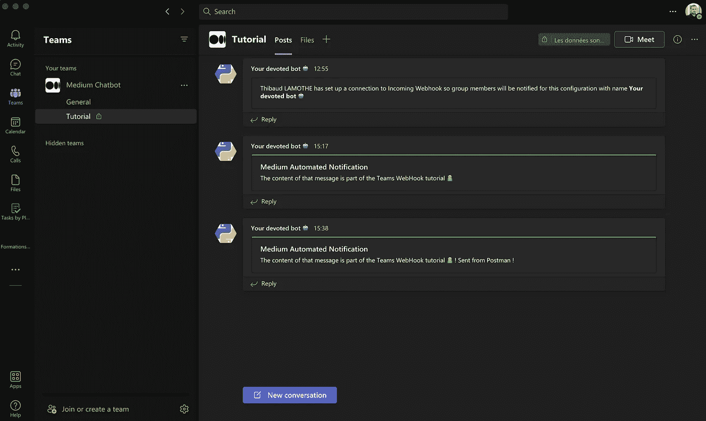

图 11 —您的第二个自动通知

它可能对测试有用，但不用说使用 python 会更容易进行进一步的集成！

## 格式化内容

您的消息内容必须包装在字符串中。因此，它可以用基本文本编写，如本例所示。但是您也可以使用[团队降价解决方案](https://support.microsoft.com/en-us/office/use-markdown-formatting-in-teams-4d10bd65-55e2-4b2d-a1f3-2bebdcd2c772)。但是因为它使用了你也可以在你的信息中使用的标记，我推荐使用标准的 HTML 格式，它可以被 webhook 理解。

HTML 格式的通知

如果你想使用 multiline，`<br>`标签将是你最好的朋友。在 Python 中使用三重引号字符串可以产生一种视觉效果，因此您可以实现“回车”效果。

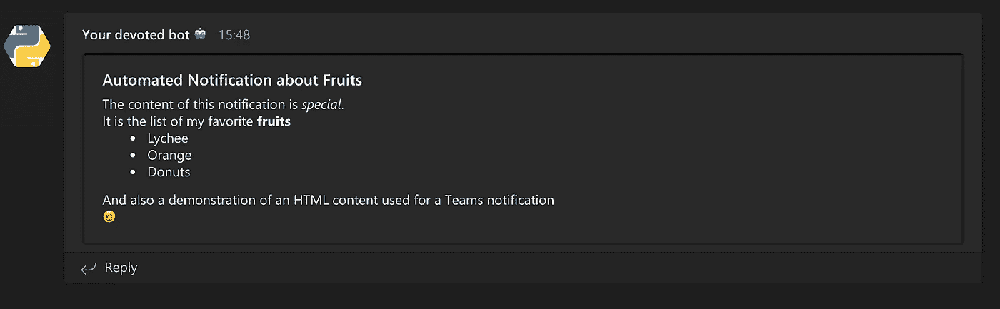

图 12 — HTML 格式和复杂的自动通知

如果你想在消息中使用变量，我建议使用 f 字符串。然后你完全可以创建动态代码

使用 Python 和 f 字符串动态创建 HTML 内容

> ⚠️ **删除消息**:使用 webhook url，目前无法删除消息。所以要小心你用它发送的数据。

## 收到警报

您现在知道如何在频道上发布消息。但是因为它没有提到你(对于这个基本的通知解决方案来说是不可能的)，你必须订阅频道通知。

1.  打开频道设置" **…** "
2.  点击"🔔**频道通知**
3.  选择**自定义**

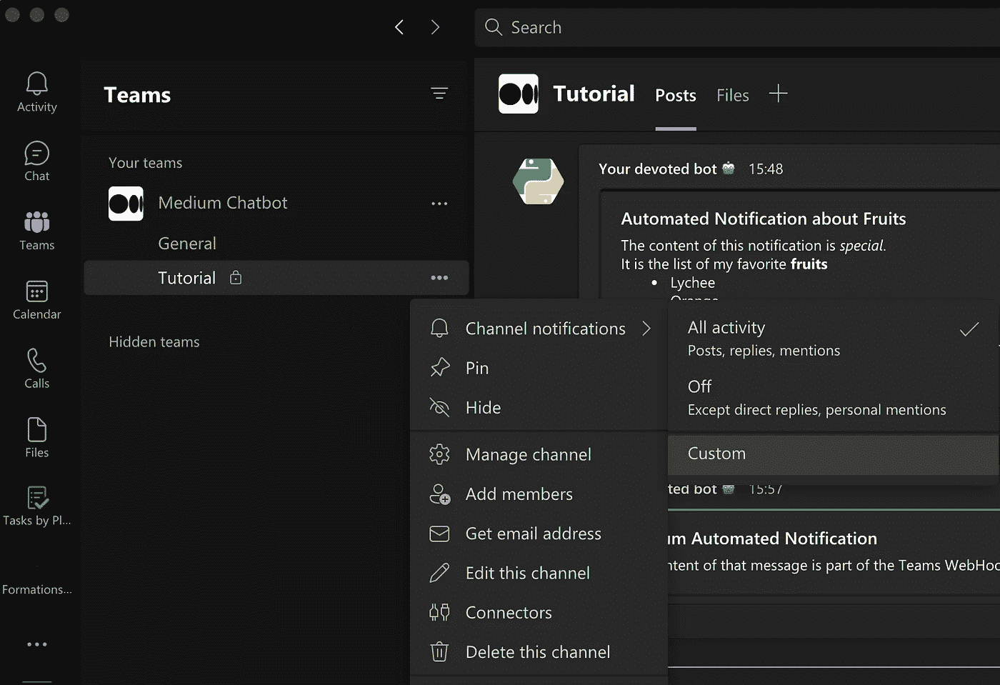

图 13 —更新通知参数

4.如图*图 14* 所示设置参数。

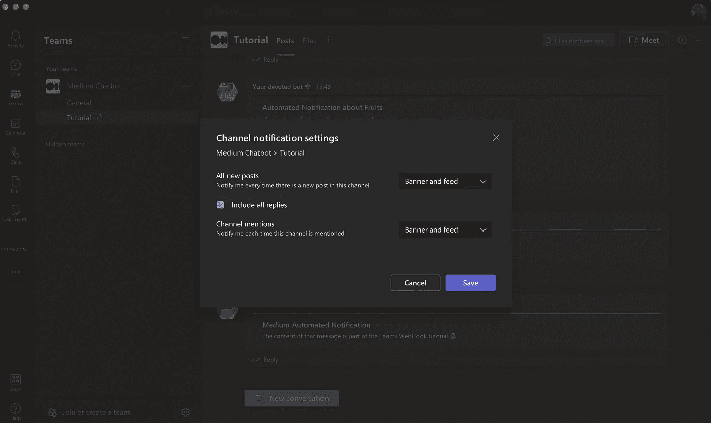

图 14 —自定义通知参数

5.点击**保存**按钮

现在你可以尝试重新发送消息，你会收到一个真正的团队通知。如果你在手机上安装了这款应用，你会收到通知。

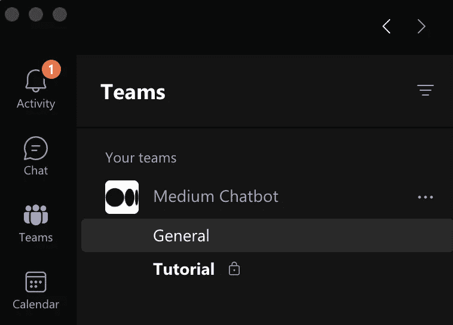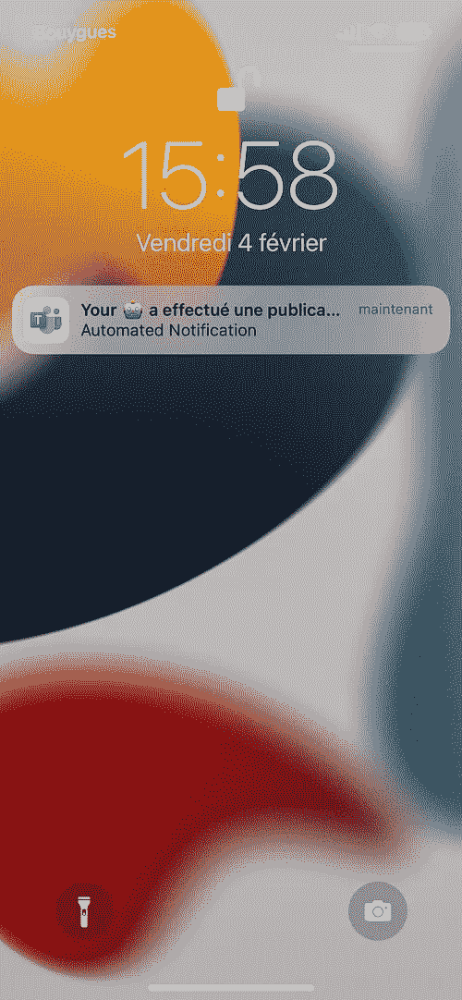

图 15 —在电脑(左图)和手机(右图)上接收通知

## 丢失 bot URL

如果你不记得机器人的网址是什么，不要惊慌。总是可以在配置中找到它。

1.  点击通道设置“ **…** ”，打开“**连接器**
2.  在窗口的左侧，点击“**已配置的**
3.  🛑做**不做**点击**配置**按钮
4.  但请点击“ **1 已配置**”链接
5.  点击**管理**按钮

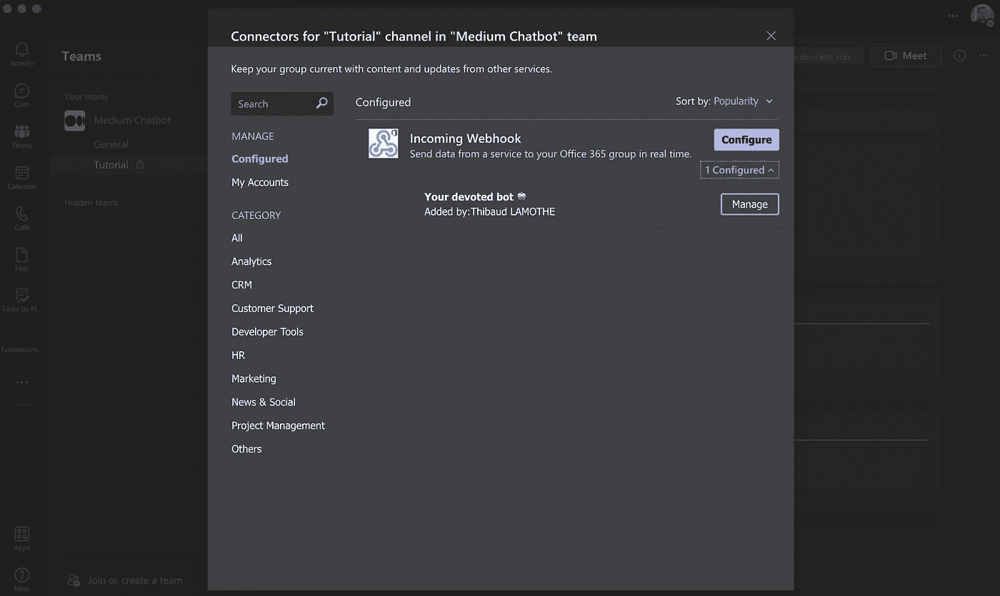

图 16 —返回到现有的传入 Webhook 的配置

然后，您将能够修改 bot 的配置，并再次复制要使用的 URL。

## 结论

今天，我们在团队频道中创建和配置了一个 Webhook URL。然后我们看到了如何创建发送到这个 webhook 的内容，最重要的是如何使用 python 进行发送过程。

这允许你包含警报代码 [ATAWAD](https://www.systancia.com/en/atawad-en/#:~:text=The%20term%20ATAWAD%2C%20which%20stands,of%20devices%20used%20by%20everyone.) (任何时间，任何地点，任何设备)，因为你有互联网连接，并从你的手机接收这些警报或消息，为你或你当前的项目团队。

> 如果你喜欢这个帖子并想了解更多，你可以在[媒体](https://medium.etomal.com/)上关注我，成为[会员](https://medium.etomal.com/membership)，在 [LinkedIn](https://www.linkedin.com/in/thibaud-lamothe/) 上与我联系，或者访问我的[网站](https://etomal.com/)。

> 希望你喜欢&回头见🤠