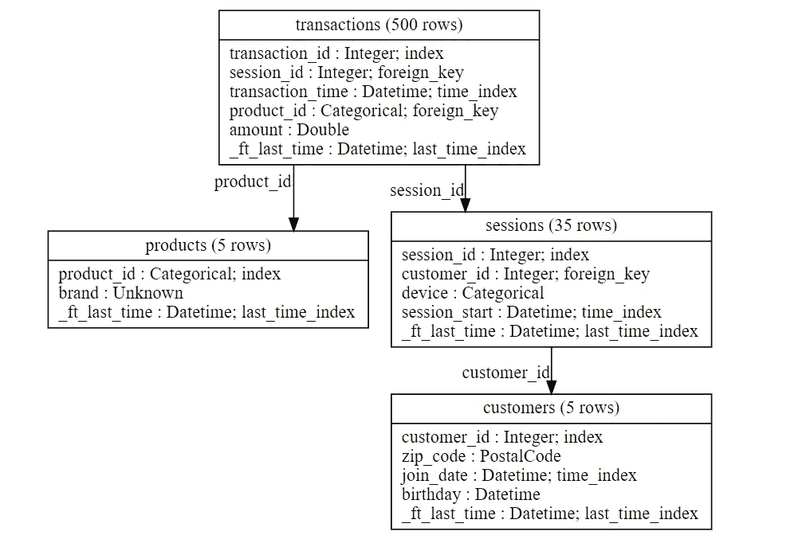
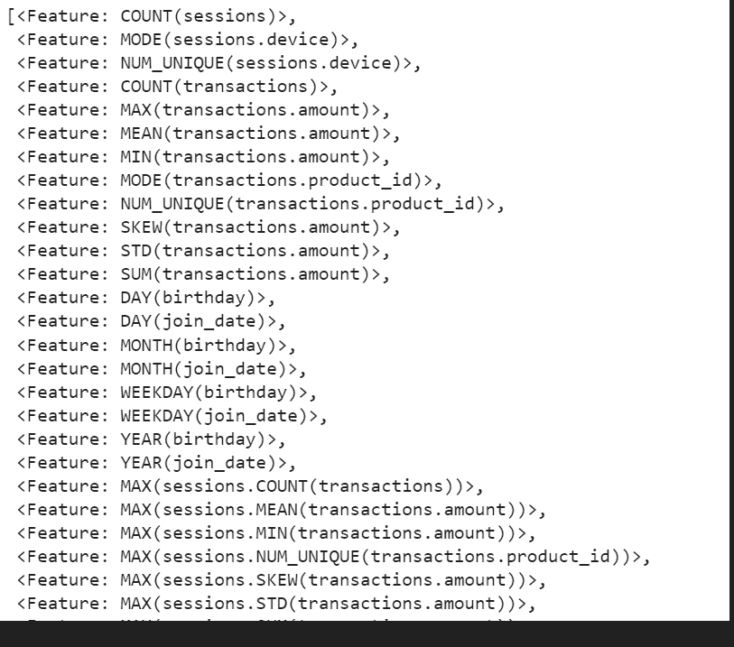

# 自动化关系数据集的要素工程管道

> 原文：<https://towardsdatascience.com/automate-the-feature-engineering-pipeline-for-your-relational-dataset-1908aba5610c>

## 面向自动化要素工程的开源 Python 框架基本指南

图片由[穆罕默德·哈桑](https://pixabay.com/users/mohamed_hassan-5229782/?utm_source=link-attribution&amp;utm_medium=referral&amp;utm_campaign=image&amp;utm_content=3559564)拍摄，来自[皮克斯拜](https://pixabay.com//?utm_source=link-attribution&amp;utm_medium=referral&amp;utm_campaign=image&amp;utm_content=3559564)

特征工程是数据科学模型开发流程中重要且耗时的组成部分。特征工程管道决定了模型的鲁棒性和性能。

有各种自动化要素工程包可为单个数据集处理和创建要素。但是这些包不适用于涉及使用多个关系数据集的用例。合并多个关系数据集并从中计算要素是一项繁琐而耗时的任务。在本文中，我们将讨论一个开源包 Featuretools，它可以通过几行 Python 代码从时态和关系数据集自动创建要素。

# 功能工具:

Featuretools 是一个开源的 python 框架，用于为时态和关系数据集的预测建模用例自动化特征工程管道。Featuretools 库 的一些 ***关键特性有:***

*   **深度特征合成:** Featuretools 包提供了 DFS 来从关系数据集中自动构建有意义的特征。
*   **精确处理时间:** Featuretools 提供了 API 来确保只有有效的数据用于计算，使您的特征向量免受常见标签泄漏问题的影响。
*   **可重复使用的特征基元:**特征工具提供低级功能，可叠加创建特征。定制原语可以在任何数据集上构建和共享。

Featuretools 软件包与其他流行的软件包兼容，如 Pandas、NumPy 和 scikit-learn，并在很短的时间内创建有意义的功能。

> 你可以看看我以前的一篇关于自动化特征工程的文章:

*   [自动化机器学习管道的 8 个 AutoML 库](https://medium.com/swlh/8-automl-libraries-to-automate-machine-learning-pipeline-3da0af08f636)
*   [用几行 Python 代码实现时间序列特征工程的自动化](/automate-time-series-feature-engineering-in-a-few-lines-of-python-code-f28fe52e4704)

# 实施:

可以使用`**pip install featuretools**` 从 PyPI 安装 Featuretools 库。

## 读取数据集:

我们将使用一个模拟样本关系数据集，该数据集具有**事务**、**会话**和**客户**表。可以使用 featuretools `**load_mock_customer()**`函数生成模拟数据集。

上述数据集之间的关系是:

(图片由作者提供)，关系表之间的关系

## 指定关系:

*   首先，我们用数据集中的所有实体指定一个字典(第 1-5 行)。
*   其次，我们指定实体是如何关联的(第 7-10 行)。当两个实体具有一对多关系时，我们将“一”实体称为“父”实体，其余的实体称为子实体。父子关系定义为:`***( parent_table, parent_key, child_table, link_key )***` 为元组列表。

## 生成要素:

Featuretools 包提供了`**dfs()**`功能，可以使用深度特征合成生成相关特征。深度特征合成(DFS)是一种对关系数据和时态数据执行特征工程的自动化方法。

通常，如果没有 featuretools，数据科学家将编写代码来为客户汇总数据，并应用不同的统计函数来生成量化客户行为的功能。但是 DFS 算法可以通过指定`target_dataframe_name="customers"`来生成这些特征，其中‘客户’是集合所有数据的数据集。

在调用`**dfs()**`函数时，它会在短时间内返回特征工程矩阵和特征描述。通过提供上述 3 个关系数据集并聚合客户数据，我们得到 75 个聚合特征。

## 结果:

75 个自动生成特征的描述可以从下面的快照中观察到:

(GIF by Author)，功能工具生成的功能上的功能描述

# 结论:

在处理涉及关系数据集的用例时，数据科学家必须手动聚合数据，并使用不同的统计技术创建要素。Featuretools 是一个方便的包，能够从多个表中优雅地提取要素，并将它们聚合到一个最终的数据集中。这为数据科学家节省了大量的时间和精力，他们可以花更多的时间来执行一些高级的功能工程。

# 参考资料:

[1]功能工具文档:[https://www.featuretools.com/](https://www.featuretools.com/)

> 感谢您的阅读