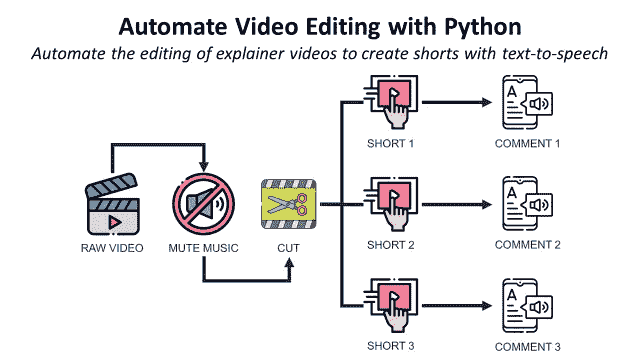
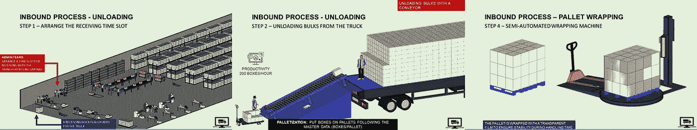
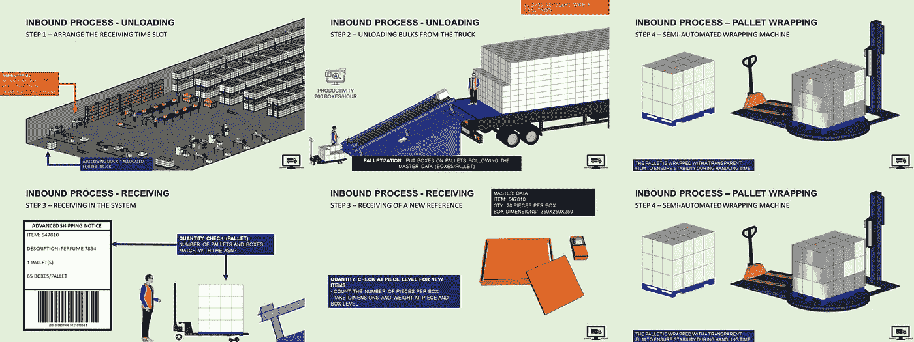
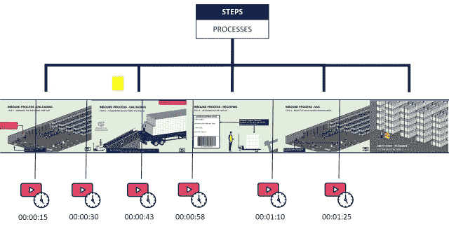
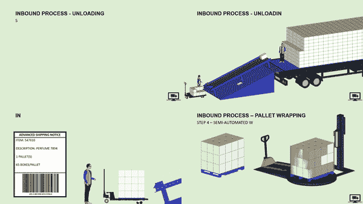
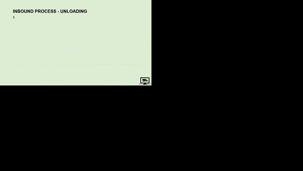

# 使用 Python 自动编辑视频

> 原文：<https://towardsdatascience.com/automate-video-editing-with-python-4e0c43edef36>

## 自动编辑 explainer 视频，为仓库操作员的培训创建带有文本到语音注释的短片

(图片由作者提供)

**场景** 你是一家国际时装零售商物流部的**运营经理**。

为了支持新操作员和管理人员的入职培训，您需要准备培训视频。

训练屏幕示例—(图片由作者提供)

你的同事给你分享了一个[讲解人视频](https://youtu.be/nz69i6l7SzI) *(视频作者)*介绍了仓库收货的所有流程。

要制作会议动画，您需要将此视频剪成短片，解释每个过程。

在本文中，我们将探索一种使用 python 库 Moviepy 来自动化这些简单视频编辑任务的方法。

💌新文章直接免费放入你的收件箱:[时事通讯](https://www.samirsaci.com/#/portal/signup)

# 如何用 Python 编辑视频？

## 培训材料

在本视频中，您完整地展示了仓库接收产品的几个过程。

视频中呈现的流程—(视频作者:[供应科学](https://www.youtube.com/c/SupplyScience/videos))

因此，您可能希望使用这段列出不同流程的视频作为入职培训的培训支持:

*   总时长:00 分 03 秒 18
*   包括引言和结尾在内的 18 个部分
*   背景音乐，但没有背景声音

## 目标

您想要剪切视频，删除背景音乐，并创建带有音频评论的短片。

三步工作流程—(图片由作者提供)

想法是使用 Python 构建一个自动化的工作流，它将

1.  加载原始视频
2.  移除背景音乐
3.  将视频剪切成几个镜头，分别聚焦于不同的过程
4.  添加通过文本到语音转换解决方案生成的音频注释

## 解决办法

有一个使用 Python 库 Moviepy 的解决方案。更多细节，我强烈建议看一下[文档](https://zulko.github.io/moviepy/)。

*如果你也想自动化图形设计，有另一个教程适合你*

# 履行

## 步骤 1:加载视频

我们首先加载原始视频的. mp4 文件，你可以在我的 Youtube 频道上找到它。

## 第二步:剪切视频

由于您希望专注于某些特定流程，因此不会使用整个视频。

通过在特定时间剪切生成短片—(图片由作者提供)

因此，我们需要找到一种方法来剪切特定时间的视频，以生成将用于显示特定过程的短剪辑。

**功能:换算成秒**

💡**见解**
*我们稍后开始剪辑视频时会用到这个功能。*

**动作:剪切视频**

📹**结果**

(作者视频)

💡**见解**
*你有一个短视频剪辑，背景音乐是在正确的时间戳从原始视频中剪下的。*

## 第三步:去除声音

你想播放没有声音的视频，所以你想脱下短裤，去掉声音。

📹**结果**

💡**见解**
*你也可以运用体积的分数运用。低于 1(减少)或高于 1(增加)的 volumex(分数)*

## 第四步:合并两条短裤

你剪了两个视频，你想连续播放？为此有一个 Moviepy 函数，

📹**结果**

## 第五步:堆叠视频

你想同时显示几个进程？您可以将视频堆叠在同一个屏幕上。

📹**结果**

堆叠视频—(图片由作者提供)

## 第六步:增加一些滞后

如果你想堆叠视频，但每个视频之间有 5 秒钟的延迟，这是可以做到的。我不知道为什么有人会这么做，但为什么不呢！)

📹**结果**

带滞后的堆叠视频—(图片由作者提供)

## 最后一步:添加文本到语音的注释

我们已经使用文本到语音的 API 生成了评论。我们能把它们加到视频里吗？

答案是肯定的！

📹**结果**

💡**见解**
*Google TTS(free tier)很烂！你知道价格合理的更好的吗？*

# 结论

关注我的媒体，获取更多与数据分析和生产力相关的文章。

当然，我们离 Adobe Premiere 或 Final Cut Pro 还很远。但是，如果您需要简单的编辑任务，它也能胜任。

此外，我只和你分享了图书馆能做的一小部分。我强烈建议看一下文档以获得更多的见解。

现在，您可以开始设计培训材料或启动全自动 Tiktok 频道了。

# 关于我

让我们在 [Linkedin](https://www.linkedin.com/in/samir-saci/) 和 [Twitter](https://twitter.com/Samir_Saci_) 上连线，我是一名[供应链工程师](https://www.samirsaci.com/about/)，正在使用数据分析来改善物流运作和降低成本。

如果你对数据分析和供应链感兴趣，可以看看我的网站

<https://samirsaci.com>  

我在一个专门的 Youtube 频道上分享了其他关于自动化手工任务的视频教程，如 PowerPoint、平面设计或商业规划。

<https://www.youtube.com/channel/UCiYf8BKpRmuPMLnoic74LyA/videos>  

如果您想了解更多有关生产力和任务自动化数据分析的信息，

<http://samirsaci.com> 