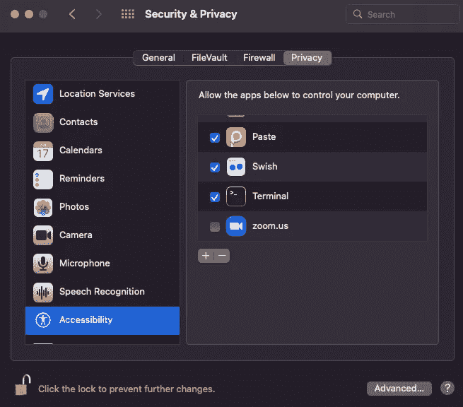
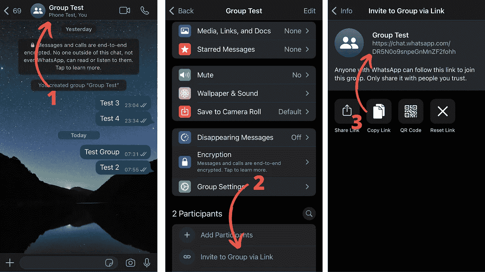

# 用 Python 三步实现 WhatsApp 消息自动化

> 原文：<https://towardsdatascience.com/automate-whatsapp-messages-with-python-in-3-steps-d64cf0de4539>

## 使用 Python 向联系人和群组发送 WhatsApp 消息


[Eyestetix 工作室](https://unsplash.com/@eyestetix?utm_source=medium&utm_medium=referral)在 [Unsplash](https://unsplash.com?utm_source=medium&utm_medium=referral) 拍摄的照片

用 Python 可以做的最酷的事情之一就是自动化日常任务。大概我们每天最常见的任务就是在 WhatsApp 上发消息。

尽管这项任务简单得就像拿起电话、打字、点击“发送”按钮一样，但我们有时会忘记在特殊场合(生日、周年纪念日等)发送信息。

我们可以用 Python 安排 WhatsApp 消息吗？

当然可以！我们只需要安装一个名为 pywhatkit 的库。然后，我们可以安排将消息发送给我们的任何联系人，甚至发送给一个群组。

以下是使用 Python 向联系人和群组发送 WhatsApp 消息需要遵循的 3 个步骤。

免责声明:本指南仅用于教育目的。在学习 Python 时，您可能会使用这个库来安排生日/周年纪念消息，但我不建议您在需要发送需要保持私密的消息时使用它。

# 使用 pywhatkit 向 WhatsApp 发送消息

Pywhatkit 是一个用于不同目的的 Python 库，其中之一就是发送 WhatsApp 消息。

这是一个易于使用的库，不需要任何额外的设置。也就是说，它有很多依赖项，所以我强烈建议您将它安装在一个新的虚拟环境中(在这里了解如何设置虚拟环境[)。](/why-you-need-a-python-virtual-environment-and-how-to-set-it-up-35019841697d)

*如果你不想看，可以看我的视频！*

> 请务必在此[订阅](https://frankandrade.ck.page/44559e1ae7)以获取我的**自动化备忘单**(免费 PDF)

## 步骤 1:安装 pywhatkit

要安装 pywhatkit 的最新版本，打开终端并运行以下命令。

```
pip install pywhatkit
```

安装可能需要几秒钟甚至一分钟，所以请耐心等待。一旦安装了这个库，就可以用命令`pip list`检查这个库安装的所有依赖项。

## 第二步:向 WhatsApp 上的联系人发送消息

在我们开始发送消息之前，您必须通过 WhatsApp Web 登录您的 WhatsApp 帐户。如果你没有登录，手机和电脑不在同一个 WiFi 上，或者手机离电脑很远，这个方法就不管用了。

要使用 Python 和 pywhatkit 向 WhatsApp 联系人发送消息，我们使用下面代码所示的`.sendwhatmsg`方法(改为插入您的联系号码)。

```
**import** pywhatkit*# syntax: phone number with country code, message, hour and minutes*
pywhatkit.sendwhatmsg('+1xxxxxxxx', 'Message 1', 18, 52)
```

这个代码的意思是“键入‘消息 1’并在 18:52 将其发送给联系人 X”

运行上面的代码后，您会得到类似这样的消息:

> 10 秒后，web.WhatsApp.com 将打开，15 秒后，Whatsapp 将发送一条消息。

就是这样！几秒钟后，您的浏览器将会打开，消息将会发送给您的联系人。

**重要提示**:当您的浏览器打开时，会弹出一条授予访问权限的消息。您必须接受此消息(如果您不授予权限，库将无法控制您的浏览器)。

您也可以手动执行此操作。在 macOS 上，你必须进入“系统偏好设置”，点击“安全与隐私”，选择“可访问”，然后勾选“终端”框。



作者图片

太好了！现在，我们还可以在浏览器中自定义其他操作。

假设我们想在发送消息 2 秒后关闭标签页。我们这样做，运行下面的代码。

```
**import** pywhatkitpywhatkit.sendwhatmsg(“+1xxxxxxx”, “Message 2”, 18, 55, 15, **True**, **2**)
```

这里的“真”表示我们希望在消息发送后的“X”秒后关闭标签。最后一个参数“2”表示这个“X”秒。

## 第三步:向 WhatsApp 上的一个群发送消息

我们还可以向 WhatsApp 上的特定群组发送消息，但首先，我们必须获得群组 id。

要查找 id，请按照下列步骤操作:

1.  打开任何你想要的群组，点击“群组信息”部分
2.  向下滚动，找到“通过链接邀请”选项。点击该选项
3.  你会看到一个链接。复制链接。链接的后缀部分是组的 id。



作者图片

一旦您有了将用于这个测试的组的 id，我们就必须使用`.sendwhatmsg_to_group`方法。这个方法类似于我们在步骤 2 中使用的方法，但是现在我们插入一个组 id。

```
**import** pywhatkit*# syntax: group id, message, hour and minutes*
pywhatkit.sendwhatmsg_to_group("write-id-here", "Message 3", 19, 2)
```

就是这样！注意 pywhatki 还有其他方法。你也可以使用`.sendwhatmsg_instantly`和`.sendwhatmsg_to_group_instantly`即时发送信息，但它们对我不起作用。

以防万一，下面是我们在本教程中使用的`.sendwhatmsg`和`.sendwhatmsg_to_group`的参数。

*   **phone_no** (str):接收方的手机号码
*   **group_id** (str):组的 id
*   **消息** (str):待发送的消息
*   **time_hour** (int，0–24)， **time_min** (int):预定时间的小时和分钟
*   **wait_time** (int = 15):等待消息送达的时间(默认设置为 15 秒)
*   **tab_close** (bool = False):如果您将此项设置为 True，那么当消息发送后，标签将在 X 秒后关闭
*   **close_time** (int = 3):表示消息发送后标签页关闭的秒数

[](https://frankandrade.ck.page/44559e1ae7)

**如果你喜欢阅读这样的故事，并想支持我成为一名作家，可以考虑报名成为一名媒体成员。每月 5 美元，让您可以无限制地访问数以千计的 Python 指南和数据科学文章。如果你用[我的链接](https://frank-andrade.medium.com/membership)注册，我会赚一小笔佣金，不需要你额外付费。**

**[](https://frank-andrade.medium.com/membership) **