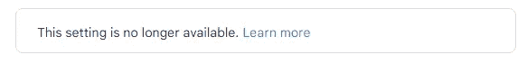

# 2022 年及以后，使用 Python 自动处理您的电子邮件

> 原文：<https://towardsdatascience.com/automate-your-emails-with-python-for-2022-and-beyond-2284054d1012>

## 如何在最新的 2022 更新和安全变更中使用 Python 实现电子邮件自动化


维塔利·神圣在 [Unsplash](https://unsplash.com?utm_source=medium&utm_medium=referral) 上的照片

自从互联网建立以来，电子邮件一直是最受欢迎的交流方式之一。虽然在现代世界中，其他的物理交流方式似乎正在消失，但电子邮件在众多任务中的突出地位仍然适用。

电子邮件具有广泛的应用。我们利用电子邮件与不同类型的人或公司交流。无论你是想给雇主、雇员或职员发信息，提交简历，要求澄清，还是执行各种其他类似的任务，电子邮件都是最直接、最受欢迎的沟通方式。

在这篇文章中，我们将看看谷歌的最新安全更新。然后，我们将通过遵循一些额外的安全步骤，探索获得安全应用程序密码的最有效方法。最后，我们将利用 Python 来构建我们的电子邮件自动化，通过它我们可以轻松地向一个或多个电子邮件地址发送邮件。

在开始这个项目之前，提高您的 Python 基础是一个好主意。我推荐通过下面提供的链接查看我的关于七种最佳 Python 编程实践的文章，以提高您的工作效率。其中一些技巧甚至适用于本文！

</7-python-programming-tips-to-improve-your-productivity-a57802f225b6>  

# Google 帐户的安全更新:


照片由[布雷特·乔丹](https://unsplash.com/@brett_jordan?utm_source=medium&utm_medium=referral)在 [Unsplash](https://unsplash.com?utm_source=medium&utm_medium=referral) 拍摄

在我们开始自动化电子邮件项目之前，我们需要一些额外的权限，这些权限必须由电子邮件 web 服务授予。在这篇文章中，我们将看看如何访问你的 Gmail 和 Google 账户。一旦我们完成了本节中的步骤，我们就可以继续编写 Python 文件来使用生成的密码访问帐户。

以前，我们可以打开对不太安全的登录的访问。执行以下步骤将允许我们通过 Python 直接访问我们的帐户。([链接](https://accounts.google.com/ServiceLogin/signinchooser?service=accountsettings&passive=1209600&osid=1&continue=https%3A%2F%2Fmyaccount.google.com%2Flesssecureapps&followup=https%3A%2F%2Fmyaccount.google.com%2Flesssecureapps&emr=1&mrp=security&rart=ANgoxcetrSEMQi_gNZjX9nR4Te_K16nitmcDBpaKQukgllDTwp59HqkIlv-UZEYa4334kVFz85xfFxHAvBTvYIvWiAghXKDSdQ&flowName=GlifWebSignIn&flowEntry=ServiceLogin))。然而，随着谷歌更新其安全措施，这一步骤现已被取代。因此，它不再允许这种方法。以下是为感兴趣的用户提供的详细信息。

> 一些应用和设备使用不太安全的登录技术，这使您的帐户容易受到攻击。你可以关闭对这些应用的访问(我们建议你这样做),或者如果你想不顾风险使用它们，也可以将其打开。如果不使用，Google 会自动关闭此设置。



> 为了帮助保护您的帐户安全，从 2022 年 5 月 30 日起，Google 不再支持使用要求您仅使用用户名和密码登录 Google 帐户的第三方应用程序或设备。

正如上面的截图所强调的那样，前面提到的方法不再适用于谷歌的新安全更新。因此，我们将使用更安全的应用程序生成的密码，该密码将在完成以下步骤后自动提供。让我们分析一下如何获得应用程序密码，以便使用 Python 自动处理您的电子邮件。

*   登录您的 Gmail 帐户
*   点击管理您的帐户
*   选择安全选项并启用双因素身份验证(2-FA)
*   一旦 2-FA 选项可用，您现在可以选择创建应用程序密码
*   按照步骤生成并保存您的应用程序密码。以下唯一生成的应用程序密码将用于此 Python 项目。

> ***免责声明:*** 本节描述的步骤提供了额外的安全性，据我所知，执行这些步骤基本上是安全的。请验证这些步骤并小心操作。要了解更多信息，我建议观众访问官方网站，按照这个[链接](https://support.google.com/mail/answer/185833?hl=en)的步骤进行操作。

# 开发 Python 项目来自动化您的邮件:


照片由[拉诺尔特](https://unsplash.com/@ranurte?utm_source=medium&utm_medium=referral)在 [Unsplash](https://unsplash.com?utm_source=medium&utm_medium=referral) 上拍摄

在文章的这一部分，我们将着重于相应地编写自动化电子邮件所需的程序。我们将构建所有必要的 Python 文件，导入必要的库，并编写自动向一个或多个其他电子邮件地址发送电子邮件的结构。让我们从构建一些先决条件 Python 文件开始。

## 1.先决条件 Python 文件:

在我们深入主要的 Python 文件之前，让我们创建几个额外的 Python 文件。这些文件主要用于存储您的个人电子邮件地址和其他电子邮件地址列表。我们将创建这两个 Python 文件，用于维护我们个人数据的隐私和安全需求。如果您想要使用不同的登录或更改电子邮件地址列表，您可以修改这些文件。

为了创建第一个 Python 文件，我们将它命名为`my_email.py`，通过它我们将存储我们的电子邮件地址和特定的应用程序密码，这些密码是我们之前通过身份验证步骤生成的。下面的代码片段显示了如何用相应的参数描述必要的变量。您可以在方便的时候编辑电子邮件和密码。

```
email_mine  = "Your_Email@gmail.com"
password_mine  = "******"
```

在第二个 Python 文件中，我们将列出存储发送邮件所需的每个电子邮件地址的各个变量。确保将 Python 文件命名为`email_addresses.py`以便于访问。下面是关于如何定义电子邮件地址列表的代码片段。

```
email1 = "email_id_1"
email2 = "email_id_2"
```

一旦您完成了两个主要 Python 文件的创建，我们就可以继续创建主 Python 文件了。完成后，我们可以导入必要的库。新创建的 Python 文件可以被命名为任何东西，但是如果你想跟随教程，你可以把它命名为`automate_email.py.`

## 2.必要的库导入:

这个项目需要的主要库是 smtplib 库，我们可以用它来导入 SMTP 模块。简单邮件传输协议(SMTP)是一种互联网通信协议，允许用户建立连接或媒介，通过互联网将电子邮件从一个帐户传输到另一个帐户。其他必要的导入将是之前创建的 Python 模块以及它们各自的变量。我们将相应地使用这些进口。

```
# Importing all the necessary requirements
from smtplib import SMTP
from my_email import email_mine , password_mine
from email_addresses import email1, email2
```

第二个和第三个 Python 模块及其各自的变量可以根据开发人员的偏好进行更改。随意添加和试验不同的定制。

## 3.连接和登录:

导入所有基本库和模块后，我们可以创建一个安全连接并登录到我们的电子邮件帐户。第一步，我们将端口号设置为 587，并建立到 gmail.com 的连接，我们将在那里解释我们的电子邮件。第二步，我们将调用 ehlo()函数。

此功能是 SMTP 协议的扩展版本，用于增加安全性和识别发送主机的域名。在下一步中，我们建立一个到服务器的传输层安全或安全套接字层连接。starttls()命令将帮助我们将不安全的网络变成安全的网络。

最后，我们可以考虑之前导入的变量，登录到我们的电子邮件地址。在前面步骤中定义的端口变量可用于使用您想要的凭证登录。下面是计算本节中所有步骤的代码块。

```
# Creating the respective object along with the gmail login and port number
smtp_port = SMTP("smtp.gmail.com", 587)# Establishing a connection to the SMTP server with Transport Layer Security (TLS) mode
smtp_port.ehlo()# Informing the client to establish a secure connection, either to a TLS or SSL
smtp_port.starttls()# Logging into your account
smtp_port.login(email_mine , password_mine)
```

## 4.创建主题和正文:

一旦我们建立了安全的连接并安全地登录到我们的帐户，我们就可以开始创建电子邮件的主题和正文。这一步非常简单，因为用户可以利用 f 字符串将主题与内容主体连接起来，以创建最终的消息，如下面的代码片段所示。

```
# Creating the contents of the email
subject = "Hello"
body = "Email Automation Project!"
final_message = f"Subject: {subject} \n \n {body}"
```

如果用户希望对消息类型有更多的控制，他们可以利用 input()命令在命令提示符下键入他们各自的消息。通过这样做，用户可以在每次运行程序后想要发送邮件时键入他们自己的定制消息。

## 5.自动化电子邮件:

建立安全连接并打印出我们的内容后，最后一步是自动发送电子邮件。我们会将我们的电子邮件地址存储在一个列表中，该列表是我们导入到模块中的。最后，我们将使用 SMTP 库中的发送邮件功能来自动化我们的电子邮件。

必需的参数是您的电子邮件地址、自动发送邮件的地址列表和最终消息。一旦该过程完成，最好退出(或退出)连接，直到需要进一步使用。下面是执行以下操作的最终代码片段。

```
# Creating the list of email addresses
address_list = [email1, email2]
smtp_port.sendmail(email_mine, address_list, final_message)
print("Email Sent")
smtp_port.quit()
```

## 6.完整代码:

将所有代码层系统地组装在一起，我们可以将所有这些元素组合成一个完整的代码。创建了前两个 Python 模块文件后，查看者可以使用下面的嵌入式代码块来访问整个代码。

查看者可以自由地对现有代码进行创新，以创建他们自己的变体并获得更突出的结果。通过修改一些代码元素来提高生产率，可以对下面的项目进行一些额外的改进。

# 结论:


在 [Unsplash](https://unsplash.com?utm_source=medium&utm_medium=referral) 上由 [Austin Distel](https://unsplash.com/@austindistel?utm_source=medium&utm_medium=referral) 拍摄的照片

> 我对我的电子邮件收件箱有条不紊，并且我总是有一个实际的待办事项清单。没有这两样东西，我想我会失去理智。
> **——*泰勒詹金斯里德***

在本文中，我们介绍了在 Python 的帮助下实现电子邮件自动化的过程。我们了解了如何使用双因素身份验证方法创建安全的应用程序密码。一旦创建并生成了应用程序密码，我们就可以保存它，以便在我们的 Python 项目中使用它来自动化电子邮件。

在 SMTP 库的帮助下，我们能够与我们的电子邮件地址建立安全连接，并向另一个电子邮件地址列表发送电子邮件。本文中演示的自动化电子邮件的过程非常简单，但是在通过 Python 发送电子邮件时非常有效。然而，观众可以自由地通过进一步的实验来更新和创新这个项目。

如果你想在我的文章发表后第一时间得到通知，请点击下面的[链接](https://bharath-k1297.medium.com/subscribe)订阅邮件推荐。如果你希望支持其他作者和我，请订阅下面的链接。

<https://bharath-k1297.medium.com/membership>  

如果你对这篇文章中提到的各点有任何疑问，请在下面的评论中告诉我。我会尽快给你回复。

看看我的一些与本文主题相关的文章，你可能也会喜欢阅读！

</the-ultimate-replacements-to-jupyter-notebooks-51da534b559f>  </7-best-research-papers-to-read-to-get-started-with-deep-learning-projects-59e11f7b9c32>  </visualizing-cpu-memory-and-gpu-utilities-with-python-8028d859c2b0>  

谢谢你们坚持到最后。我希望你们都喜欢这篇文章。祝大家有美好的一天！