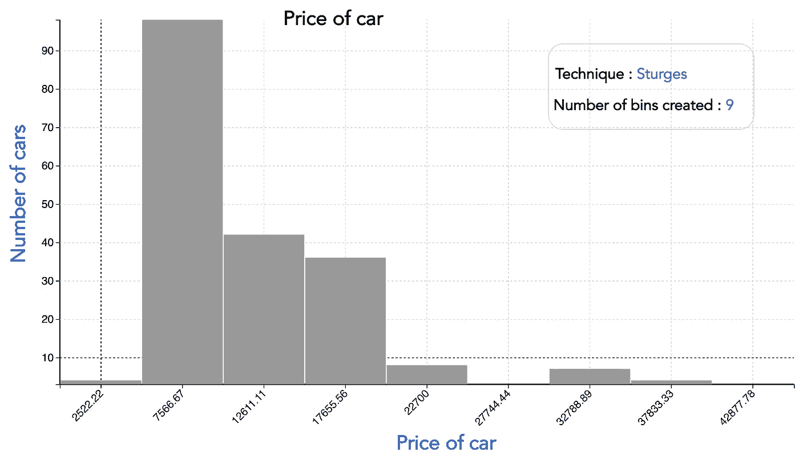
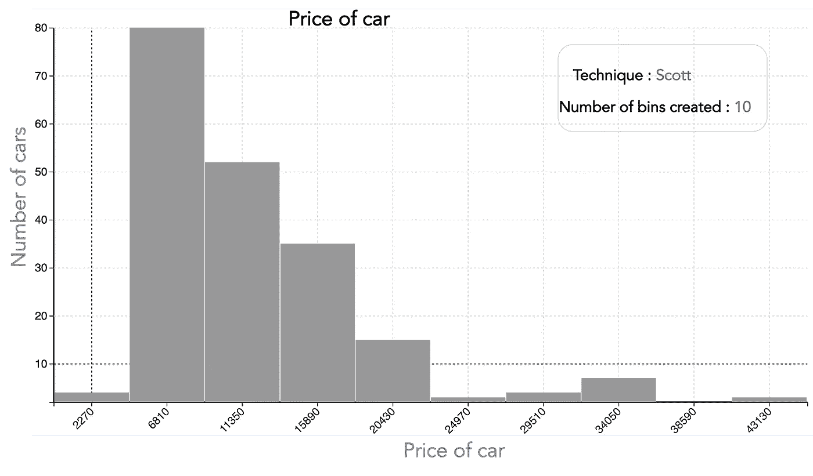
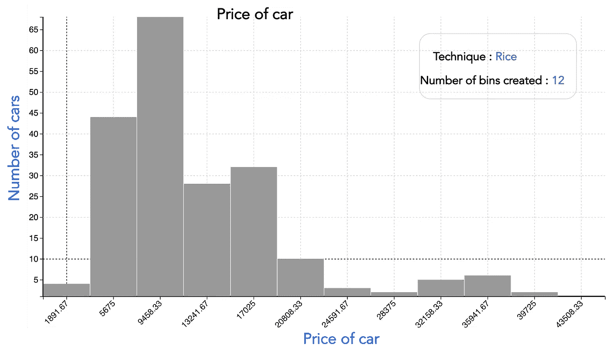
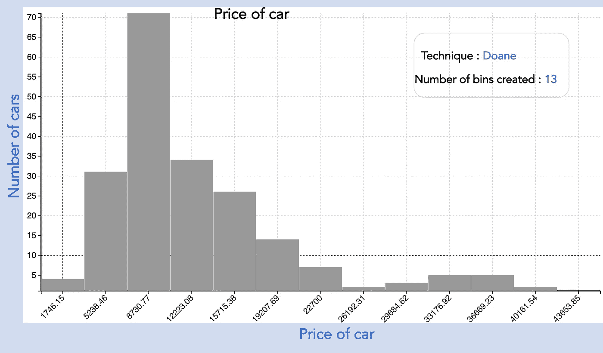
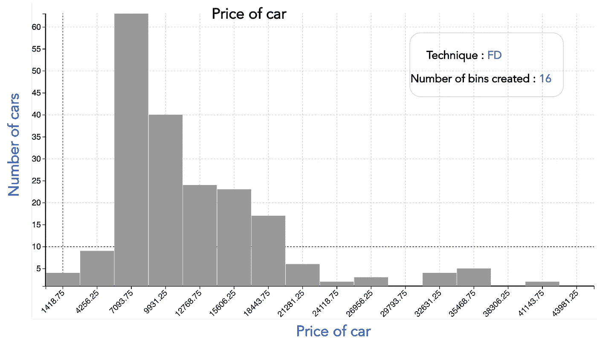

# 自动化您的直方图

> 原文：<https://towardsdatascience.com/automate-your-histograms-f9ec5392e593>

## 自动选择箱子数量的方法

照片由[алексарцибашев](https://unsplash.com/@lxrcbsv?utm_source=unsplash&utm_medium=referral&utm_content=creditCopyText)在 [Unsplash](https://unsplash.com/s/photos/graphs?utm_source=unsplash&utm_medium=referral&utm_content=creditCopyText)

创建直方图的老式方法是手动指定容器的数量。智能的方法是使用一个估计器或算法来为你自动选择箱的数量。

有各种各样的技术来自动化箱柜的数量。在这篇文章中，我将列出最常见的方法。直方图是关于汽车价格的(数据集参考可在故事的结尾获得)。这些技术是基于自动创建的多个库来组织的。因此，创建最少数量的自动箱的技术在列表的开头，而创建最多数量的箱的技术在列表的末尾。

# 斯特格斯

通常创建最少数量的箱。它仅适用于高斯数据，并且低估了大型非高斯数据集的箱数。

使用 Sturges 估计器的自动垃圾箱(图片由作者提供)

# 斯科特

这是一种考虑到数据可变性和数据大小的不太稳健的估计方法。

使用 Scott estimator 的自动垃圾箱(图片由作者提供)

# 米

估计器不考虑可变性，只考虑数据大小。你可以看到直方图的左边部分有点凹凸不平。它通常会高估所需的箱数。

使用 Rice estimator 的自动垃圾箱(图片由作者提供)

# 多恩

它是 Sturges 估计器的改进版本，可以更好地处理非正态数据集。汽车的价格不是正态分布而是左偏的。然而，Doane 技术将试图找到一个“正常的钟形曲线”。例如，我们开始看到分布，我们开始在下方直方图的左侧看到一种“正常形状”。

使用 Doane 估计器的自动 bin(图片由作者提供)

# **弗雷曼·迪康尼斯估算师**

这是一个稳健的(对异常值有弹性的)估计量，它考虑了数据的可变性和数据的大小。您可以观察到，与其他箱相比，最初的低值箱显示逐渐增加。

使用 Freedman Diaconis 估计器的自动 bin(图片由作者提供)

# 结论

一边制作。直方图，最好是自动创建箱，而不是手动选择箱的数量。如果你想保持箱柜数量少，去斯特奇斯或斯科特估计。如果您的数据不是正态分布的，那么 Doane 估计器是一个不错的选择。如果您的数据有异常值，那么 Freedman Diaconis Estimator 将帮助您在有异常值的情况下获得良好的数据表示。

一些直方图也给出了一个“自动”估计器，它将试图找到最佳估计器。在任何情况下，理解在什么情况下使用哪个估计量总是有帮助的。

# 数据源引用

数据来自[https://archive.ics.uci.edu/ml/datasets/automobile](https://archive.ics.uci.edu/ml/datasets/automobile)。

该数据集可用于研究目的，只需提及以下引文

Dua d .和 Graff c .(2019 年)。UCI 机器学习知识库[http://archive . ics . UCI . edu/ml]。加州欧文:加州大学信息与计算机科学学院。

# 额外资源

# 网站(全球资讯网的主机站)

你可以访问我的网站，使直方图以及其他零编码分析。https://experiencedatascience.com

请**订阅**,以便在我发布新故事时随时获得通知。

  

你也可以通过我的推荐链接**加入 Medium**

  

# Youtube 频道

这是我的 YouTube 频道
[https://www.youtube.com/c/DataScienceDemonstrated](https://www.youtube.com/c/DataScienceDemonstrated)的链接