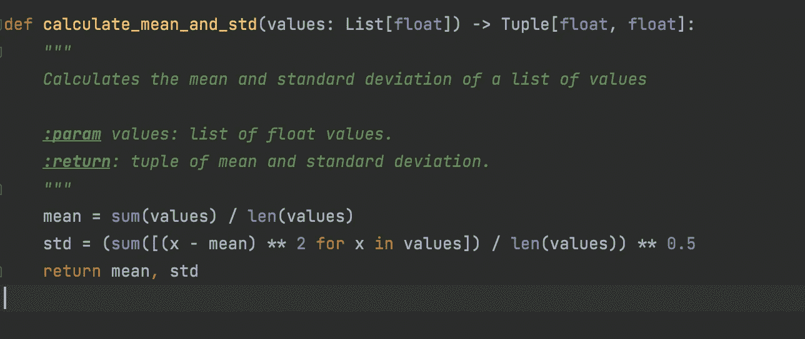
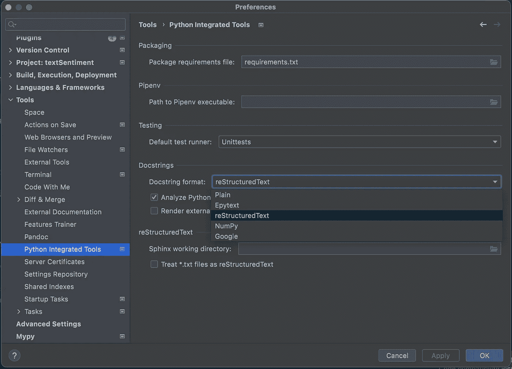
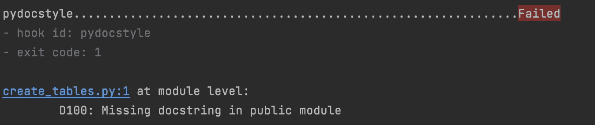
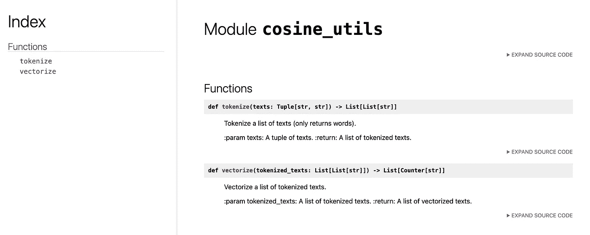

# 使用预提交挂钩自动化您的 Python 代码文档

> 原文：<https://towardsdatascience.com/automate-your-python-code-documentation-with-pre-commit-hooks-35c7191949a4>

## 自动化文档字符串检查和使用预提交钩子自动生成文档的实践指南

约书亚·阿拉贡在 [Unsplash](https://unsplash.com?utm_source=medium&utm_medium=referral) 上拍摄的照片

当时间紧迫时，代码文档通常是最先受到影响的。然而，高质量的代码文档是在开发团队中有效协作的关键，以便在新开发人员加入时轻松入职，并在团队成员决定离开您的公司时确保连续性。在这篇博客文章中，我们将看看如何使用 docstrings 为团队的 Python 项目自动生成代码文档。

# 使用文档字符串约定…并执行它

不幸的是，实现文档自动化的第一步包括一个手工步骤:与您的团队就文档字符串约定达成一致，并在您的代码中一致地应用该标准。

但是首先，什么是 docstrings？

文档字符串是[字符串，放在代码](https://peps.python.org/pep-0257/)中函数、类和方法定义的第一位。它们通常出现在一行中，并以三引号符号开始。Docstrings 用于记录函数、类和方法的用途，以及它们接受的参数和返回的内容。在 Python 中，除了少数例外，所有的函数、类和方法都应该有 docstrings。

计算总体均值和总体标准差的函数的文档字符串示例(与 [Github Codepilot](https://copilot.github.com) 共同编写的代码，图片由作者提供)。

存在许多不同的文档字符串标准，但是在 Python 中一些最常用的标准包括 [reStructuredText](https://peps.python.org/pep-0287/) 、 [Numpydoc](https://numpydoc.readthedocs.io/en/latest/format.html) 、 [Googledoc](https://google.github.io/styleguide/pyguide.html) 和 [EpyText](http://epydoc.sourceforge.net/manual-epytext.html) 。

虽然你仍然需要自己编写好的文档字符串来开发你的代码(除非你正在使用 [GitHub Copilot](https://copilot.github.com) 也许),但是大多数 ide 会在这个过程中帮助你。[py charm](https://www.jetbrains.com/pycharm/)——我选择的 Python IDE 例如，在你定义了一个函数或类之后，[会自动生成一个 docstrings 存根](https://www.jetbrains.com/help/pycharm/using-docstrings-to-specify-types.html),并预先填充类型注释。您可以设置想要使用的 docstrings 约定，或者使用您自己的模板(请参见下图)。

要在 Pycharm 中设置首选文档字符串格式，请转到 PyCharm >首选项> Python 集成工具>文档字符串格式

一旦您的团队就文档字符串约定达成一致，建议配置预提交挂钩以检查约定是否得到一致应用(并使它们成为您的[持续集成](https://www.atlassian.com/continuous-delivery/continuous-integration)管道的一部分，例如， [GitHub Actions](https://github.com/features/actions) ，或 [AWS CodeBuild](https://aws.amazon.com/codebuild/) )。

预提交钩子是[小“脚本”,你在每次提交时运行它来识别，有时甚至自动修复你的代码中的问题](https://pre-commit.com)。它们有许多不同的风格，可以用来，例如，[加强代码风格](https://python.plainenglish.io/how-to-improve-your-python-code-style-with-pre-commit-hooks-e7fe3fd43bfa)，修复格式问题，或者分析代码的[复杂性](/simplify-your-python-code-automating-code-complexity-analysis-with-wily-5c1e90c9a485)。

如果你想了解更多关于预提交钩子的知识，以及如何使用它们，请看下面的帖子。👇

<https://python.plainenglish.io/how-to-improve-your-python-code-style-with-pre-commit-hooks-e7fe3fd43bfa>  

当您的团队在自己的机器上本地开发代码时，对 docstrings 使用预提交挂钩可以保持团队一致。当您在一个连续交付的框架中工作时，它们尤其有用，在这个框架中，团队成员需要经常进行较小的变更，并且您需要跟上快速的开发和评审周期。

幸运的是，有很多工具可以帮助您的团队跟踪他们是否正确地使用了 docstrings。

让我们快速浏览几个选项。

## 审问

首先， [interrogate](https://interrogate.readthedocs.io/en/latest/index.html?highlight=pre-commit) 是一个有用的工具，它会让你知道你是否没有为你的类或函数添加 docstrings。您可以在`.pre-commit-config.yaml`文件中使用以下语法将询问添加到您的预提交钩子中:

[询问](https://interrogate.readthedocs.io/en/latest/)的预提交配置示例(作者根据[询问文档](https://interrogate.readthedocs.io/en/latest/index.html?highlight=pre-commit)编写的代码)

`--fail-under`标志设置了工具报告失败的截止时间，而`--verbose`标志确保详细的覆盖报告被打印到控制台。在上面显示的配置中，如果少于 80%的代码被覆盖(用 docstrings)，询问“test”将失败。[您还可以在您的`pyproject.toml`文件中配置一系列其他选项](https://interrogate.readthedocs.io/en/latest/index.html?highlight=pre-commit)，以确保 interrogate 符合您的特定需求。而且，如果你和我一样热衷于在你的回复中添加徽章，你会很高兴知道[审问有这个选项](https://interrogate.readthedocs.io/en/latest/#badge-options)。

一旦你设置了预提交挂钩并进行新的提交(或运行`pre-commit run`)，interrogate 将提供一个覆盖报告:

[询问](https://interrogate.readthedocs.io/en/latest/)报道的例子(图片由作者提供)

如您所见，我在这里很懒，完全没有为我的任何函数编写 docstrings。并且，审问正确地抱怨我没有达到(配置的)80%的截止值。

## Pydocstyle

其次，您可能会发现 [Pydocstyle](http://www.pydocstyle.org/en/stable/) 是一个包含在预提交钩子中的有用工具。您的`.pre-commit-config.yaml`文件中的配置应该遵循以下格式:

Pydocstyle 的预提交配置示例(作者代码，基于 [Pydocstyle 文档](http://www.pydocstyle.org/en/stable/usage.html#usage-with-the-pre-commit-git-hooks-framework))

运行钩子(`pre-commit run`)时，发现的任何错误都将被打印回控制台，例如:

使用 [Pydocstyle](http://www.pydocstyle.org/en/stable/) 作为提交前挂钩时，由它标识的错误示例(图片由作者提供)

您有足够的灵活性来定制 Pydocstyle 以满足您的需求，有了[一个大的错误代码菜单，您可以选择忽略](http://www.pydocstyle.org/en/stable/error_codes.html)。在上面的例子中，我已经决定禁用错误代码`D107`和`D204`的警告，这意味着我将允许`__init__`文件中缺少文档字符串，以及在文档字符串后缺少一个空行。

## 其他选项

其他值得包括在提交前配置中的选项包括:

*   `check-docstring-first`预提交钩子，顾名思义，它将检查[你的文档串实际上在代码](https://pre-commit.com/hooks.html)之前
*   `docformatter`，它将[自动重新格式化文档字符串以遵循 PEP 257 标准](https://github.com/PyCQA/docformatter)；
*   `velin`预提交钩子，[，它将尝试重新格式化你的文档字符串以遵循 numpydoc 标准](https://github.com/Carreau/velin)。

# 从文档字符串自动生成文档

现在我们已经介绍了我们的文档字符串，我们可以使用它们来自动生成文档，并使它在一个地方可用。还是那句话，有很多选择可以考虑。

在下面的例子中，我们将使用 [pdoc3](https://pdoc3.github.io/pdoc/doc/pdoc/#gsc.tab=0) ，它[从文档字符串(来自活动对象的](https://pdoc3.github.io/pdoc/doc/pdoc/#gsc.tab=0) `[__doc__](https://pdoc3.github.io/pdoc/doc/pdoc/#gsc.tab=0)` [属性)为您的类、模块、函数和变量](https://pdoc3.github.io/pdoc/doc/pdoc/#gsc.tab=0)生成文档。作为一个额外的好处，如果您使用公认的分隔符，它将[正确解析 LaTex 语法(非常适合数据科学、机器学习和其他数学密集型项目！).](https://pdoc3.github.io/pdoc/doc/pdoc/#gsc.tab=0)

让我们快速看一下 pdoc3 的预提交配置示例。在下面的例子中，我已经设置了 pdoc3 为一个名为`cosine_utils`的模块自动生成文档。我已经将其配置为输出 html 文档(pdoc3 也支持纯文本和 PDF 输出)。

pdoc3 的预提交配置示例(由作者编写，基于此[源](https://github.com/pdoc3/pdoc/issues/313))

运行这个预提交钩子将生成一个名为`html`的文件夹，其中包含自动生成的文档。您将能够在您选择的浏览器中查看文档，其中包含一个格式良好的索引，显示文档对象、源代码和您在文档字符串中包含的信息。

用 pydoc3 生成的 html 文档示例(图片由作者提供)

从 docstrings 自动生成文档的其他选项包括，例如， [Pydoc](https://docs.python.org/3/library/pydoc.html) ， [Sphinx](https://docs.readthedocs.io/en/stable/intro/getting-started-with-sphinx.html) ，以及我自己尝试的文档生成器， [markdowndocs](https://github.com/ngoet/markdowndocs) 。后者可以通过一个预提交挂钩来设置，以将 markdown 风格的文档(基于您的文档字符串和代码)添加到您的项目自述文件中(更多细节请参见[本报告](https://github.com/ngoet/markdowndocs)，生成的文档示例请参见[本文件](https://github.com/ngoet/markdowndocs/blob/main/examples/code_documentation.md#setupparser))。

除了实施特定的 docstring 样式和自动化检查之外，在您的团队中拥有良好的代码文档实践也很重要。我喜欢尝试(虽然我并不总是成功！)来编写 docstrings，我的想法是，当我的同事需要通过阅读我的代码来使用现有的模块或服务时，他们应该能够自行加入。如果团队中的每个人都编写干净的代码，伴随着清晰的、描述性的变量和类名，以及匹配的文档字符串，那么您的开发工作将会变得更加容易。

感谢您的阅读！

<https://medium.com/@ndgoet/membership>  

如果你喜欢这篇文章，这里有一些你可能会喜欢的文章👇

<https://python.plainenglish.io/how-to-improve-your-python-code-style-with-pre-commit-hooks-e7fe3fd43bfa>  </automating-unit-tests-in-python-with-hypothesis-d53affdc1eba>  </automating-version-tags-and-changelogs-for-your-python-projects-6c46b68c7139>  

*请仔细阅读* [*本免责声明*](/@ndgoet/disclaimer-5ad928afc841) *在依赖* [*中的任何内容之前，我关于 Medium.com 的文章*](https://towardsdatascience.com/@ndgoet) *为自己的作品:)*