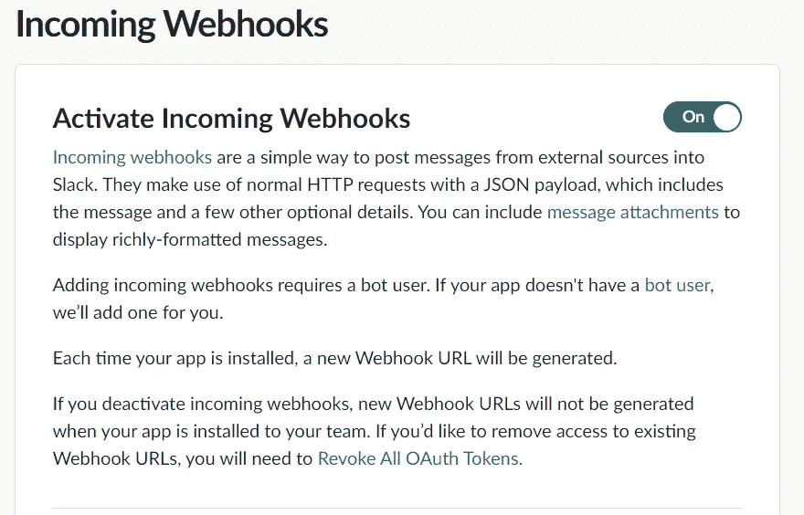
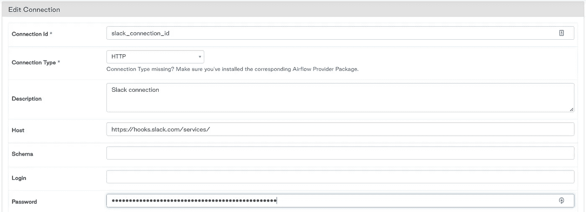
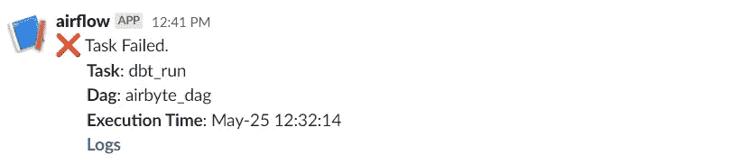

# 气流松弛的自动警报

> 原文：<https://towardsdatascience.com/automated-alerts-for-airflow-with-slack-5c6ec766a823>

## 利用 Slack API 获得 DAG 任务失败和成功的自动更新和警报


照片由 [Artturi Jalli](https://unsplash.com/@artturijalli?utm_source=medium&utm_medium=referral) 在 [Unsplash](https://unsplash.com?utm_source=medium&utm_medium=referral) 拍摄

让我们面对现实吧——有时气流 Dag 需要一段时间才能运行。与其不断地回到 Airflow UI 来检查 dag 更新，为什么不开始跟踪电子邮件、消息和待办事项，然后通过 Slack 获得运行结果的通知呢？

通过 Slack 管理气流通知可以方便地监控和调试气流任务。一个专用的 slack 通道还为其他人(如客户、产品经理和队友)提供了工作流状态的透明度，而无需检查 Airflow UI。

# 要求

1.  对您的工作区的宽松管理员访问
2.  松弛 API 密钥
3.  气流实例

# 入门指南

为您的 Airflow 实例安装以下 python 库

```
# requirements.txt
apache-airflow-providers-http
apache-airflow-providers-slack
apache-airflow-providers-slack[http]
```

## 准备松弛

在您的工作区中创建一个通道，供 API 访问。我把我的叫做“气流”。

转到`api.slack.com/apps`并点击“创建新应用”,供您的 airflow 实例访问。退出模式后，为您的 slack workspace 应用程序启用传入 webhooks。然后，滚动到底部，选择“添加新的 webhook 到工作区”。



Slack API webhooks

您可以从命令行测试您的 webhook/api 密钥，以验证所有设置是否正确(用您自己的密钥替换):

```
curl -X POST -H 'Content-type: application/json' --data '{"text":"Hello, World!"}' https://hooks.slack.com/services/00000000000/00000000000/000000000000000000000000
```

## 完成气流设置

一旦启动并运行了 Airflow，就在 UI 中创建新的 HTTP 连接。将其命名为`slack`，并将 webhook url 插入到“host”输入中。api 密钥的剩余部分将被输入到“密码”中。



气流松弛 HTTP 连接设置

现在，我们可以使用 Airflow 的`BaseHook`、`SlackWebHookOperator`和`Dag Task Instance Context`向 slack 发送有关最新 dag 运行信息的警报。

宽限预警代码

该代码将在气流任务失败时发送消息。自动化该过程的最后一步是将`slack_fail_alert`函数作为参数添加到 dag 默认参数中:

```
default_args = {
   ...,
   'on_failure_callback': slack_fail_alert
}
```

该代码也可以很容易地修改，以提醒任务成功或其他状态。

## 测试

为了进行测试，有意在代码中写入一个错误，以验证 airflow 会在任务失败时发送消息。或者，如果不想破坏代码，可以在`on_success_callback`参数中使用这些函数。假设一切都设置正确，您将收到一条消息，其中包含最新任务运行的详细信息。

下次您在 dag 工作流中遇到故障时，将通过 slack 通知您任务的名称和日志的直接链接，以便您可以开始调试过程。



气流松弛信息警报

就是这样！只需一点点设置，我们就创建了气流的自动监控和警报。接下来的步骤可能是邀请项目的相关利益相关者到 **#airflow** slack channel，让他们了解当前工作流的状态。如果您的应用程序或数据仓库的最终用户看到任何错误，他们可以在将问题升级到其他人之前，检查气流通道以查看错误是否立即显现。

感谢阅读！查看这个[库](https://github.com/cyoung43/airflow-demo)，获取额外的代码和上下文，以及其他有用的气流技巧。