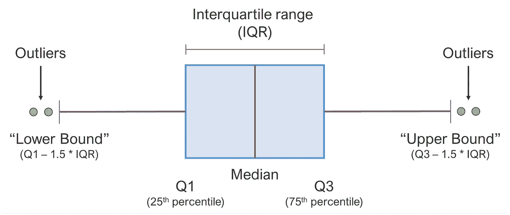
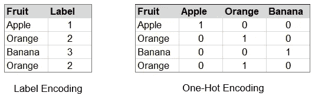
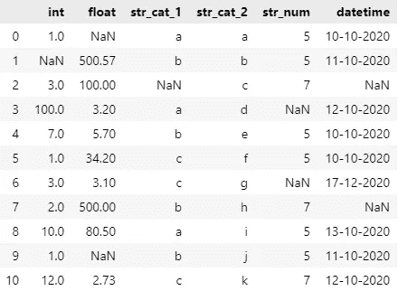
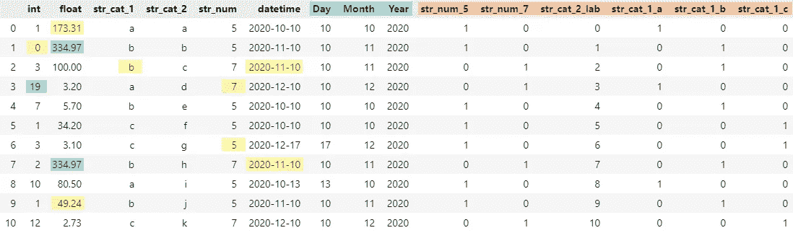

# 使用 Python 自动清理数据

> 原文：<https://towardsdatascience.com/automated-data-cleaning-with-python-94d44d854423>

## 如何自动化数据准备并为您的下一个数据科学项目节省时间


图片来自 [Unsplash](https://unsplash.com/photos/lFv0V3_2H6s) 。

众所周知，数据清理和预处理是数据科学项目的主要组成部分。而且，你可能会同意我的观点，这不是项目中最令人兴奋的部分。

> 那么，(让我们扪心自问):我们能自动化这个过程吗？

嗯，自动化数据清理说起来容易做起来难，因为所需的步骤高度依赖于数据的**形状**和特定领域的**用例**。尽管如此，还是有办法以一种标准化的方式使**自动化**至少是相当大的一部分**。**

在本文中，我将向您展示如何在 **Python 3.8** 中构建自己的**自动化数据清理管道**。

*查看*[*Github*](https://github.com/elisemercury/AutoClean)*上的 AutoClean 项目。*

# 1 | **我们想自动化什么？**

在深入这个项目之前，我们应该问自己的第一个也是最重要的问题是:数据清理过程的哪些步骤**可以**实现**标准化**和**自动化**？

最有可能自动化或标准化的步骤是在几乎每个数据科学项目的每个清理过程中反复执行的步骤。而且，由于我们想要建立一个“一刀切”的管道，我们想要确保我们的处理步骤是相当通用的，可以适应各种类型的数据集。

例如，在大多数项目中经常被问到的一些常见问题包括:

*   我的数据是什么格式的？CSV，JSON，text？还是另一种格式？我该如何处理这种格式？
*   我们的数据特征有哪些**数据类型**？我们的数据集包含分类和/或数字数据吗？我们如何处理每一个问题？我们想要对我们的数据进行**一次性编码**，和/或执行数据**类型转换**？
*   我们的数据是否包含**缺失值**？如果是，我们如何处理它们？我们要执行一些**插补技术**吗？或者我们能安全地**删除**有缺失值的观测值吗？
*   我们的数据是否包含**异常值**？如果是，我们是应用**正则化技术**，还是让它们保持原样？……等等，我们甚至认为什么是“异常值”？

无论我们的项目将针对什么用例，这些都是很可能需要解决的问题，因此可以成为**自动化**的一个伟大主题。

这些问题的答案以及它们的实现将在接下来的几章中讨论和展示。

# 2 |管道的构建模块

首先，让我们从导入我们将使用的库开始。这些将主要是 Python **Pandas、Sklearn** 和 **Numpy** 库，因为它们在处理数据时非常有用。

我们将定义我们的脚本将接受一个 **Pandas dataframe 作为输入**，这意味着我们至少需要将数据转换成 Pandas dataframe 格式，然后才能被我们的管道处理。

现在，让我们看看我们的管道的构建模块。以下章节将经历以下处理步骤:

**【区块 1】**缺失值
**【区块 2】**异常值
**【区块 3】**分类编码
**【区块 4】**提取日期时间特征
**【区块 5】**打磨步骤

## [块 1 ]缺少值

一个项目从一个包含缺失值的数据集开始是相当常见的，并且有各种方法来处理它们。我们可以简单地删除含有缺失值的观测值，或者我们可以使用插补技术。在各种回归或分类模型的帮助下预测数据中的缺失值也是常见的做法。

> *💡*插补技术用某些值(如平均值)或与特征空间中其他样本值类似的值(例如 K-NN)来替换缺失数据。

我们如何处理缺失值的选择主要取决于:

*   数据类型(数值或分类)和
*   相对于样本总数，我们有多少缺失值(从 100k 中删除 1 个观察值与从 100 个中删除 1 个观察值的影响不同)

我们的管道将遵循策略**插补>删除**，并将支持以下技术:线性和逻辑回归预测、K-NN 插补、均值、中值和众数以及删除。

很好，现在我们可以开始为我们的第一个构建块编写函数了。我们将首先创建一个单独的类来处理缺失值。下面的函数 *handle* 将以不同的方式处理**数值型**和**分类型**缺失值:一些插补技术可能只适用于数值型数据，而一些则只适用于分类型数据。让我们来看看处理数字特征的第一部分:

点击查看完整源代码

该函数检查为数字和分类特征选择了哪种处理方法。默认设置为“*自动”*，这意味着:

*   **数值**缺失值将首先通过**线性回归**预测进行插补，剩余值将通过 K-NN 进行插补
*   **分类**缺失值将首先使用**逻辑回归**通过预测进行估算，剩余值将使用 K-NN 进行估算

对于分类特征，与上述相同的原则适用，除了我们将仅支持使用逻辑回归、K-NN 和模式插补的插补。当使用 K-NN 时，我们将首先将我们的分类特征标记编码为整数，使用这些标记来预测我们缺少的值，最后将标记映射回它们的原始值。

根据所选择的处理方法， *handle* 函数从其类中调用所需的函数，然后在各种 Sklearn 包的帮助下操作数据:*_ imput*函数将负责 K-NN、均值、中值和众数插补，*_ Lin _ regression _ imput*和*log _ regression _ imput*将通过预测执行插补，我假设 *_delete* 的角色是自我插补

我们最终的 *MissingValues* 类结构将如下所示:

点击查看完整源代码

*我不会更详细地介绍该类其余函数中的代码，但是我邀请您查看* [*AutoClean 资源库*](https://github.com/elisemercury/AutoClean/blob/main/AutoClean/Modules.py) *中的完整源代码。*

完成所有需要的步骤后，我们的函数输出处理过的输入数据。

酷，我们通过了管道的第一个模块🎉。现在让我们考虑一下如何处理数据中的异常值。

## [区块 2 ]异常值

我们的第二个模块将关注数据中异常值的处理。首先我们需要问自己:什么时候我们认为一个值是异常值？对于我们的管道，我们将使用一个普遍应用的规则，即如果**在以下**范围之外，则数据点可被视为异常值:

*【Q1—1.5 * IQR；Q3 + 1.5 * IQR]*

…其中 Q1 和 Q3 是第一和第三四分位数，IQR 是四分位数之间的范围。下面你可以看到一个很好的箱线图:



图片作者。

既然我们已经定义了什么是异常值，我们现在必须决定如何处理这些异常值。同样，有各种策略可以做到这一点，对于我们的用例，我们将重点关注以下两种:winsorization 和 deletion。

> *💡* Winsorization 在统计学中用于限制数据中的极端值，并通过用数据的特定百分位数替换异常值来减少异常值的影响。

使用 winsorization 时，我们将再次使用上面定义的范围来替换异常值:

*   值>上限将由**上限范围值**代替，并且
*   数值< lower bound will be replaced by the **量程下限值**。

我们的*异常值*类的最终结构将如下所示:

点击查看完整源代码

我们到达了第二块的末尾——现在让我们看看如何对分类数据进行编码。

## [块 3 ]分类编码

为了能够用分类数据进行计算，在大多数情况下，我们需要我们的数据是数字类型，即数字或整数。因此，常见的技术包括**一键编码**数据，或**标签编码**数据。

> *💡*数据的一键编码将特征的每个唯一值表示为二进制向量，而标签编码为每个值分配一个唯一的整数。



图片作者。

每种方法都有不同的利弊，比如独热编码产生了许多额外的特性。此外，如果我们标记 encode，这些标记可能会被某些算法解释为数学相关:1 个苹果+ 1 个橘子= 1 个香蕉，这显然是对这种类型的分类数据的错误解释。

对于我们的管道，我们将设置默认策略*‘auto’*来根据以下规则执行编码:

*   如果特征包含< 10 unique values, it will be **单热编码**
*   如果特征包含< 20 unique values, it will be **标签编码的**
*   如果特征包含> 20 个唯一值，它将**而不是**被编码

这是处理编码过程的一种非常原始和快速的方式，可能会很方便，但也可能导致编码不完全适合我们的数据。即使自动化很棒，我们仍然希望确保我们也可以**手动定义**哪些特性应该被编码，以及如何编码。这是在 *EncodeCateg* 类的*句柄*函数中实现的:

点击查看完整源代码

*句柄*函数将一个**列表**作为输入，而我们想要手动编码的特性可以由列名或索引定义，如下所示:

```
encode_categ = [‘onehot’, [‘column_name’, 2]]
```

既然我们已经定义了如何处理异常值，我们可以继续我们的第四个块，它将涵盖 **datetime** 特性的提取。

## [块 4 ]提取*日期时间*特征

如果我们的数据集包含一个具有 **datetime** 值的特征，比如时间戳或日期，我们很可能希望提取这些值，以便在以后处理或可视化时更容易处理它们。

我们也可以以自动化的方式来做这件事:我们将让我们的管道搜索这些特性，并检查其中的一个是否可以转换成**日期时间**类型。如果是，那么我们可以有把握地假设这个特性保存了 **datetime** 值。

点击查看完整源代码

我们可以定义提取**日期时间**特征的粒度，而默认设置为*s’*秒。提取后，该函数检查日期和时间的条目是否有效，意思是:如果提取的列*、*、*、【月】、*、【年】、*、**、**都包含 0，那么这三个都将被删除。对于*【小时】**【分钟】**【秒】*也是如此。*

现在我们已经完成了日期时间的提取，我们可以进入管道的最后一个构建模块，它将包含一些最终的调整来完善我们的输出数据帧。

## [区块 5 ]数据框抛光

现在我们已经处理了我们的数据集，我们仍然需要做一些调整，使我们的数据框架“看起来不错”。我这么说是什么意思？

首先，由于应用了插补技术或其他处理步骤，一些原本属于类型**整数**的特征可能已经被转换为**浮点数**。在输出我们最终的数据帧之前，我们将**把这些值转换回** **整数**。

其次，我们希望将数据集中的所有 **float** 要素的**舍入到与原始输入数据集中的**相同的小数位数**。这一方面是为了避免浮点小数中不必要的尾随 0，另一方面是为了确保不要将我们的值四舍五入超过我们的原始值。**

*同样，我不会更详细地讨论这些想法背后的代码，但我邀请您查看* [*AutoClean 资源库*](https://github.com/elisemercury/AutoClean) *中的完整源代码。*

# 3 |将所有内容放在一起

首先，祝贺你坚持到现在！🎉

我们现在已经到了想要将所有构建模块放在一起的阶段，这样我们就可以实际开始使用我们的管道了。你可以在我的 **GitHub 库**中找到完整的**自动清理**代码，而不是在这里发布完整的代码:

<https://github.com/elisemercury/AutoClean>  

下面我们来看一个 AutoClean 如何处理样本数据集的可视化示例:



样本数据集。图片作者。

我生成了一个随机数据集，正如您所看到的，当涉及到不同的数据类型时，我使它变化很大，并且我在数据集中添加了一些随机的 NaN 值。

现在，我们可以运行自动清理脚本，如下所示:

产生的清理后的输出数据帧如下所示:



已处理的样本数据集。图片作者。

在上图中，您将看到 AutoClean 对我们的数据所做的可视化更改。估算的缺失值用**黄色**标记，异常值用**绿色**标记，提取的日期时间值用**蓝色**标记，分类编码用**橙色**标记。

我希望这篇文章对您有所帮助，并且 AutoClean 将帮助您节省一些宝贵的时间。🚀

如果您有任何问题或反馈，请随时发表评论。也欢迎在 GitHub 上投稿！

# 参考资料:

[1] N. Tamboli，[所有你需要知道的关于不同类型的缺失数据值以及如何处理它](https://www.analyticsvidhya.com/blog/2021/10/handling-missing-value/) (2021)

[2] C .泰勒，[什么是四分位间距规则？](https://www.thoughtco.com/what-is-the-interquartile-range-rule-3126244) (2018)

[3] J. Brownlee，(2020)分类数据的顺序和一键编码