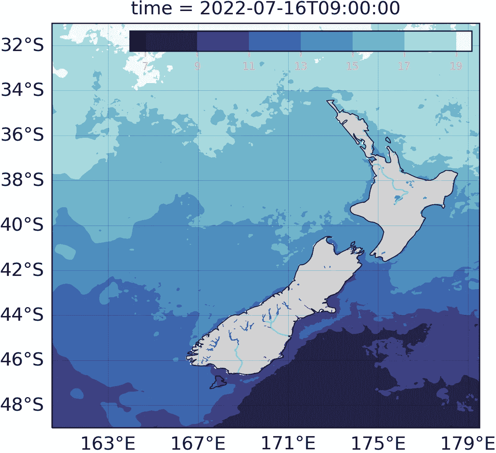
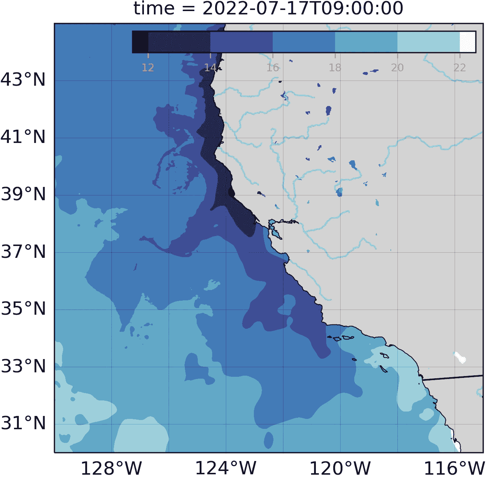

# 用 shell 脚本、R 和 Python 自动绘制海面温度图

> 原文：<https://towardsdatascience.com/automated-mapping-of-sea-surface-temperature-with-shell-scripting-r-and-python-763339432449>



新西兰海面温度。资料来源:JPL MUR 措施项目。2015.GHRSST 级 MUR 全球基金会海面温度分析。版本。4.1.阿宝。美国加利福尼亚州 DAAC。数据集于【2022 年 7 月 16 日】在[https://doi.org/10.5067/GHGMR-4FJ04](https://doi.org/10.5067/GHGMR-4FJ04)通过 NOAA erd DAP[https://up well . pfeg . NOAA . gov/erd DAP/griddap/NASA _ JPL _ 28d 8 _ bd66 _ 24 B1 . html](https://upwell.pfeg.noaa.gov/erddap/griddap/nasa_jpl_28d8_bd66_24b1.html)访问

有许多方法来绘制海洋表面温度，或 SST，它是由一系列卫星传感器产生的，并在多个不同的平台上提供服务。很难决定使用哪种方法，或者从大量选项中选择哪种产品。

20 世纪 80 年代初，当我还是一名海洋学研究生时，如果你想要 SST 数据，你必须向美国国家航空航天局(NASA)提出请求，他们会寄给你一包 CD，里面载有多个文件中的数据。那些日子早已过去。最新的趋势是完全避免下载数据。现在，您可以从基于云的服务器中选择并子集化[分析就绪的云优化(ARCO)数据](https://www.frontiersin.org/articles/10.3389/fclim.2021.782909/full)，使用笔记本电脑上的代码在计算机上使用多个处理器远程处理数据，在相同的远程机器上可视化数据，并下载成品(参见[https://tinyurl.com/2p8s6y9u](https://tinyurl.com/2p8s6y9u)和[https://tinyurl.com/yc2jne6d](https://tinyurl.com/yc2jne6d))。这些方法非常强大，但是它们需要更多的专业知识来实现。

在这篇文章中，我将展示一种方法，它仍然可以下载 NetCDF 格式的数据并在本地处理地图。这不是一种分析就绪的云优化方法，但对于许多不涉及处理万亿字节数据的目的来说，这仍然是非常足够和快速的。它确实需要一个快速的互联网连接，一个数据下载不会超过你的配额的数据计划，以及一台具有足够处理能力的计算机。

最初的问题是使用哪个 SST 数据集，以及在哪里方便地获得它。为了便于说明，我选择了一个由几个卫星传感器合并而成的无间隙产品，该产品已经映射到准备投影的坐标上。高分辨率海洋表面温度[组](https://www.ghrsst.org)版本 4 多尺度超高分辨率，或 [GHRSST-MUR](https://podaac.jpl.nasa.gov/dataset/MUR-JPL-L4-GLOB-v4.1) 产品，是一个近实时(1 天延迟)、4 级(映射)、无间隙产品，由几个辐射计和光谱辐射计以及*原位*数据合并而成。它提供了 0.01 度分辨率的几乎全球无云 SST 覆盖( [Chin et al. 2017](https://www.sciencedirect.com/science/article/abs/pii/S0034425717303462?via%3Dihub) )。

这些数据在 [NASA 喷气推进实验室物理海洋学分布式活动档案中心(DAAC](https://podaac.jpl.nasa.gov/dataset/MUR-JPL-L4-GLOB-v4.1) )上以 NetCDF-4 文件格式提供，或者在[亚马逊网络服务器上以](https://registry.opendata.aws/mur/)ARCO Zarr 格式提供。要访问 NetCDF 数据，使用国家海洋大气管理局[环境研究处数据访问程序](https://upwell.pfeg.noaa.gov/erddap/index.html) (NOAA-ERDDAP)更方便。在 ERDDAP 上，可以使用 [ERDDAP 图形用户界面(GUI](https://upwell.pfeg.noaa.gov/erddap/griddap/nasa_jpl_28d8_bd66_24b1.html) )访问 GHRSST-MUR 最终产品并对其进行子集划分，但更好的选择是使用内置于 ERDDAP 中的 [OPenDAP 类工具来访问所需格式的数据集子集。ERDDAP GUI 有助于获得正确格式的所需 URL。](https://coastwatch.pfeg.noaa.gov/erddap/tabledap/documentation.html)

ERDDAP 提供了许多使用类似 OPenDAP 的工具从不同的分析程序(如 R、Python 或 Matlab)中获取所需数据的例子。我发现使用 R 通过 ERDDAP 访问和下载数据是最简单的，但是我更喜欢用 Python 绘制 SST 图。我使用一个 bash shell 脚本将所有东西放在一起，并自动完成下载数据和创建地图的过程。

有一些技巧可以让自动化工作。(1)修改外壳环境，以允许从外壳脚本激活 Python 脚本所需的 Conda 环境。(2)使用 shell 脚本运行 R 脚本、thels Python 脚本，并为执行设置计时器。

## 使用外壳脚本控制代码执行时间和顺序

我在电脑上一个名为“geo_env”的项目环境中运行 Python 代码，在运行脚本之前需要激活这个项目环境。我使用 Conda 包管理器安装了 Python，因此为了从运行在 Linux 上的 shell 脚本中激活环境，有必要修改~/。bashrc 通过 NOAA erd DAP[https://up well . pfeg . NOAA . gov/erd DAP/griddap/NASA _ JPL _ 28d 8 _ bd66 _ 24 B1 . html](https://upwell.pfeg.noaa.gov/erddap/griddap/nasa_jpl_28d8_bd66_24b1.html)在“#<<< conda initialize <<< “, shown below:

```
# >>> conda initialize >>>
# !! Contents within this block are managed by 'conda init' !!
__conda_setup="$('/home/smcc/anaconda3/bin/conda' 'shell.bash' 'hook' 2> /dev/null)"
if [ $? -eq 0 ]; then
    eval "$__conda_setup"
else
    if [ -f "/home/smcc/anaconda3/etc/profile.d/conda.sh" ]; then
        . "/home/smcc/anaconda3/etc/profile.d/conda.sh"
    else
        export PATH="/home/smcc/anaconda3/bin:$PATH"
    fi
fi
unset __conda_setup
# <<< conda initialize <<<# edit to permit conda activate to work in a shell script
export -f conda
export -f __conda_activate
export -f __conda_reactivate
export -f __conda_hashr
export -f __conda_exe
# end smcc edit
```

Activation of the project environment from the shell script can then be done using the following command:

```
conda activate geo_env
```

To run the shell script every day, or at whatever interval you choose, needs a timed job execution. You can use a cron job, but I prefer to use “at” to run the script once without cron and then call “at” recursively to reset the job each time the shell script runs. This command sets the run time for the shell script to noon each day:

```
at -f "./shell/download_latest_GHRSST_data_from_ERDdap.sh" 12:00 + 24 hours
```

You can check the timing of the next run using:

```
at -l
```

Here is the full shell script:

```
#!/bin/bash
############################################ download_latest_GHRSST_data_from_ERDdap.sh
###########################################
# activate the conda environment for python
# NOTE: ~/.bashrc was modified so conda activate will work in a shell script
conda activate geo_env##########################################
# Download the latest GHRSST data for each of the regions
# from ERDDAP.
# NOTE: Edit the R script to add more regions
##########################################
Rscript "../R/download_GHRSST_MUR-JPL-L4-GLOB-v4.1_daily.R"##########################################
# Process the downloaded data and draw maps
###########################################
python "../python/batch_process_sst_and_plots.py"##########################################
# Use "at" to run the script ONE TIME without cron# and then call "at" recursively to reset the job each time
# the shell script runs.
# NOTE: before resetting the at commands, use
# atq | cut -f 1 | xargs atrm# to remove all previous jobs
# (which can be shown with: at -l)
########################################
at -f "../shell/download_latest_GHRSST_data_from_ERDdap.sh" 12:00 + 24 hours
```

## Download the data from ERDDAP with R

Downloading the data is straightforward with a simple R script:

```
#####################################################
# download GHRSST, MUR-JPL-L4-GLOB-v4.1 daily
#####################################################
*setwd*("/mnt/data/dynamic_data/projects/projects2022/GHRSST_and_anomalies/R")
start_date = *paste*(*Sys.Date*()-2, "T12:00:00Z", sep='') # just one day
end_date = *paste*(*Sys.Date*()-2, "T12:00:00Z", sep='') # today minus 2 days#####################################################
# New Zealand 
url <- paste("https://upwell.pfeg.noaa.gov/erddap/griddap/nasa_jpl_dde5_3be1_897b.nc?analysed_sst%5B(",start_date,"):(",end_date,")%5D%5B(-49.0):(-31.0)%5D%5B(160.5):(179.5)%5D&.draw=surface&.vars=longitude%7Clatitude%7Canalysed_sst&.colorBar=KT_thermal%7CD%7CLinear%7C15%7C18%7C6&.land=over&.bgColor=0xffccccff", sep="")# filename <-"../data/latest_MUR_SST_New_Zealand.nc"
download.file(url, filename)
# end New Zealand#####################################################
# California
url <-*paste*("https://upwell.pfeg.noaa.gov/erddap/griddap/nasa_jpl_dde5_3be1_897b.nc?analysed_sst%5B(",start_date,"):(",end_date,")%5D%5B(30.0):(45.0)%5D%5B(-130.0):(-115.0)%5D&.draw=surface&.vars=longitude%7Clatitude%7Canalysed_sst&.colorBar=KT_thermal%7CD%7CLinear%7C15%7C18%7C6&.land=over&.bgColor=0xffccccff", sep="")filename <-"../data/latest_MUR_SST_SoCal.nc"
download.file(url, filename)
# end California
```

I’ve just used New Zealand and California for this example. More regions can be added by modifying the coordinates in additional URL commands. I find it convenient to use the ERDDAP GUI to generate the URL used in the R script.

## Plotting the maps with Python

I use a simple python script to define the regions of interest and then plot them.

```
# batch_process_sst_and_plots.py
################################################################
# All regions are processed in a loop
################################################################## define regions to process# region_list =["New_Zealand_Northland","New_Zealand_Taranaki","New_Zealand_East_Cape","Australia_QLD_Brisbane","Australia_QLD_central","Australia_QLD_northern","Australia_NSW_Sydney","Australia_Tasmania","Costa_Rica","Baja_Sur","California","Gulf_of_Maine","US_Central_Bight","Florida"]# to process one or more only ...
region_list = ["New_Zealand", "California"]for region in region_list:
    import plot_SST_map
    plot_SST_map.plot_map(region)
```



Sea surface Temperature off California. Source: JPL MUR MEaSUREs Project. 2015\. GHRSST Level 4 MUR Global Foundation Sea Surface Temperature Analysis. Ver. 4.1\. PO.DAAC, CA, USA. Dataset accessed [17 July 2022] at [https://doi.org/10.5067/GHGMR-4FJ04](https://doi.org/10.5067/GHGMR-4FJ04)之后添加编辑

以下是绘图脚本:

```
*def* plot_map(region):
#########################################################
# Import packages:
#########################################################
import matplotlib.pyplot as plt
import matplotlib.ticker as mticker
from matplotlib.pyplot import tick_params
# from matplotlib.font_manager import get_fontconfig_fonts
from datetime import datetime
import cartopy.crs as ccrs
import cartopy.feature as cfeature
import cmocean as cmo
import numpy as np
import pandas as pd
import xarray as xr
import os
from pyproj import transform########################################################
# Load data
# Open a netCDF data file using xarray
########################################################
f = "latest_MUR_SST_" + region + ".nc"
datadir = ("/mnt/data/dynamic_data/projects/projects2022/GHRSST_and_anomalies/data")
d = datadir + "/" + f
# open netcdf file as an xarray dataset
ds = xr.open_dataset(d)
# open single variables in the xarray dataset
# sst_3d = ds["analysed_sst"] + 273.15
sst_3d = ds["analysed_sst"]
#reduce dimensions to 2d
sst = sst_3d.squeeze()# Generate figure (set its size (width, height) in inches).
fig = plt.figure(figsize=(5, 8))
ax = plt.subplot(1, 1, 1, projection=ccrs.PlateCarree())
ax.coastlines(linewidths=0.5)
ax.add_feature(cfeature.LAND, facecolor="lightgray")
ax.add_feature(cfeature.BORDERS)
ax.add_feature(cfeature.RIVERS)# get the min, max for SST, convert to a scalar, and round off
varmin = sst.min()
sstmin = *int*(*round*(varmin.item(),0))
varmax = sst.max()
sstmax = *int*(*round*(varmax.item(),0))
sst_int = *int*(sstmax - sstmin)
if sst_int >=6:
    contour_levels = np.array(*range*(sstmin,sstmax,2))
elif sst_int <6:
    contour_levels = np.array(*range*(sstmin,sstmax,1))################################################
# Plot data
###############################################
pt_sst = sst.plot.contourf(ax=ax,
    transform=ccrs.PlateCarree(),
    levels=contour_levels,
    cmap=cmo.cm.ice,
    add_colorbar=*False*,
    zorder=0,
)# color bar ################
from mpl_toolkits.axes_grid1.inset_locator import inset_axescax = inset_axes(ax,
    width="80%",  # width = 80% of parent_bbox width
    height="5%",  # height : 5%
    loc='upper right',
)# axins1.gridlines(draw_labels=False)
    cbar = plt.colorbar(pt_sst,
    cax=cax,
    orientation="horizontal",
    extendrect=*True*,
)cbar.ax.tick_params(labelsize=7, colors='salmon')
gl = ax.gridlines(draw_labels=*True*,
    dms=*True*,
    x_inline=*False*,
    y_inline=*False*,
    linewidth=0.25,
    color="black",
    alpha=0.25,
)# Manipulate latitude and longitude gridline numbers and spacinggl.top_labels = *False* gl.right_labels = *False* if region == "New_Zealand":
    gl.xlocator = mticker.FixedLocator([163, 167, 171, 175, 179])
    gl.ylocator = mticker.FixedLocator([-48, -46, -44, -42, -40, 
    38, -36, -34, -32])
elif region == "California":
    gl.xlocator = mticker.FixedLocator([-130, -128, -126, 
    -124, -122, -120, -118, -116])
    gl.ylocator = mticker.FixedLocator([31, 33, 35, 37, 39, 41, 43])
    gl.xlabel_style = {"rotation": 0, "size": 12}
    gl.ylabel_style = {"rotation": 0, "size": 12}########################################################
# Save the plot
######################################################### tidy by removing any previous file
os.system("rm /mnt/data/dynamic_data/projects/projects2022/GHRSST_and_anomalies/figures/latest_MUR_SST_"+region+".png")plt.savefig("/mnt/data/dynamic_data/projects/projects2022/GHRSST_and_anomalies/figures/latest_MUR_SST_"+region+".png",
    format="png",
    bbox_inches='tight',
    pad_inches=0,
    dpi=300
    )
```

本文只是展示了一个利用这些 SST 数据可以做什么的例子，即制作感兴趣区域海洋表面温度的每日地图。结合几个互补的工具，比如 shell 脚本、R 和 Python，可以使这个任务变得更容易。使用像 [VS Code](https://code.visualstudio.com/docs/?dv=linux64_deb#first-steps) 这样的 IDE，可以在同一个项目中编辑和调试 R 和 Python，有助于将这两种语言结合起来达到更好的效果。

## 开源代码库

本文的代码可以在一个 [Github 存储库中找到。](https://github.com/smcclatchie/medium-GHRSST)

## 参考

陈，T.M .，j .瓦兹奎-库沃，和 E.M .阿姆斯壮。2017.全球海表温度的多尺度高分辨率分析，环境遥感，200。https://doi.org/10.1016/j.rse.2017.07.029