# 什么是供应链控制塔？

> 原文：<https://towardsdatascience.com/automated-supply-chain-control-tower-with-python-17dbf93a18d0>

## 使用 Python 优化您的供应链网络，通过自动化解决方案跟踪您的货物并评估延迟交付的风险。

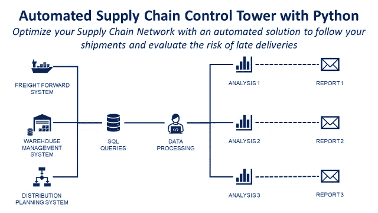

(图片由作者提供)

供应链控制塔传统上被定义为一组连接到各种**系统**的仪表板，使用数据监控整个供应链的**重要事件**。

它使供应链部门能够更好地实时跟踪、了解和解决关键问题。

在本文中，我们将实现**自动化工具，用于自动发送**事件报告**、**跟踪**未结货物并分析**交付周期**。**

💌新文章直接免费放入你的收件箱:[时事通讯](https://www.samirsaci.com/#/portal/signup)

如果你愿意，你可以观看本教程的视频版本

# 如何用 Python 监控你的供应链？

**场景** 你是一家国际**服装集团**的**分销计划** **经理**，该集团在世界各地都有门店。

商店补货配送计划员正在管理商店的库存，以满足需求。


供应链网络—(图片由作者提供)

当库存水平达到最低水平时

*   配送计划员在 [ERP](https://www.youtube.com/shorts/v0_R8P6MLQ0) 中创建**补货订单**，其中包含项目**数量**和 [**要求交货日期**](https://www.youtube.com/watch?v=qhLqu6M7lcA)
*   仓库运营团队 [**准备订单**](https://www.youtube.com/watch?v=XejgbF2m_8g) 出货
*   运输团队 [**组织向**](https://www.youtube.com/watch?v=PYkN24PMKd8) 门店发货

**发货跟踪** 每天，你需要跟踪发货情况，并向商场和物流经理报告事故:

*   有多少货物延迟交付？
*   当前运输中的货物在哪里？
*   有多少转运货物面临风险？

我们的**供应链控制塔**将基本上是一套自动化的 python 脚本，通过电子邮件分发报告，回答这些问题。

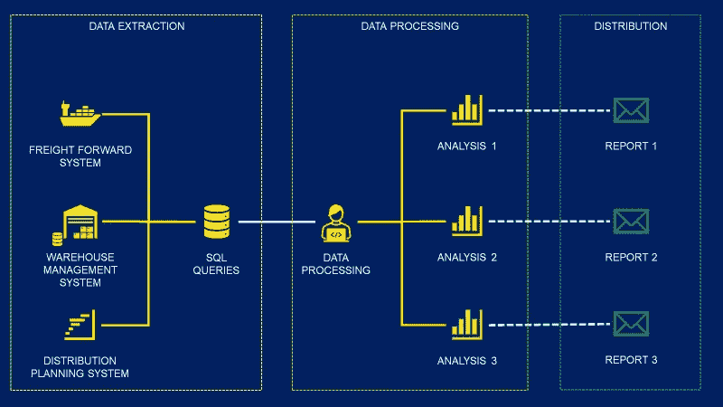

分三步跟踪货物—(图片由作者提供)

*   **步骤 1** :使用 **pandas.read_sql** 执行 SQL 查询，从系统中提取出货信息
*   **步骤 2** :使用 **pandas** 和 **matplotlib** 处理数据并构建视觉效果
*   **步骤 3** :使用 **smtplib** 创建 **HTML** 报告并通过电子邮件发送

[](http://samirsaci.com)  

# 解决办法

## 截止时间

在系统中创建订单和由不同团队管理的商店交付之间有几个步骤

*   订单传输到[仓库系统](https://www.youtube.com/shorts/MW1QRJs3iuE) : **IT 团队**
*   仓库订单准备: [**仓库运营**](https://www.youtube.com/watch?v=OdLeRR4rvt0&list=PLvINVddGUMQWRel1u0RIBbKIYRUQBdrt9)
*   从仓库到商店的运输: [**运输 Ops**](https://www.youtube.com/watch?v=ddthuvFQdGY&list=PLvINVddGUMQXkAtacSSmUavDoRFQbmvAW)

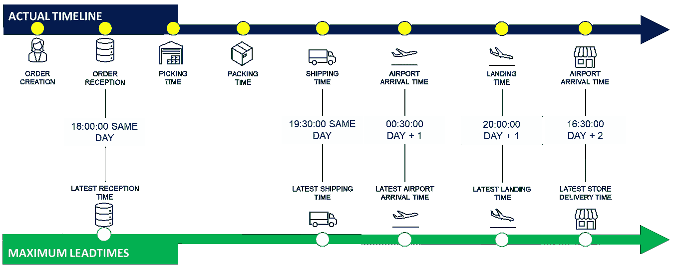

带截止时间的关键步骤—(图片由作者提供)

对于一些关键步骤，我们有截止时间，如果不遵守这些时间**，总交付周期将增加**24 小时。

## 装运记录

执行 SQL 查询后，您就有了一个包含所有所需时间戳的装运信息数据集

*   **最后状态**:执行提取时流程的最后一步
*   **On-Time Flags** :布尔变量，检查是否遵守截止时间

## 已交付货物的分析

在要求的交货日期之后，已经交付了多少货件？

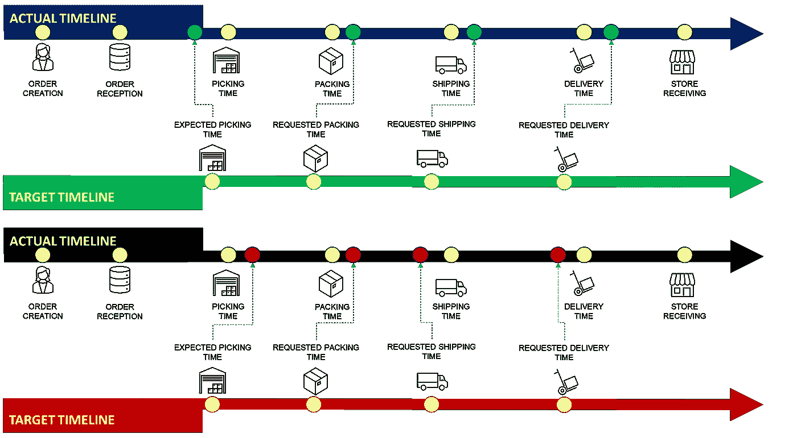

交付的货物(顶部:准时，底部:迟到)——(图片由作者提供)

*   准时交货:实际交货时间比要求交货时间早
*   延迟交货:实际交货时间比要求交货时间晚

****💡准时定义**
根据国际贸易术语解释通则或您想要评估的团队绩效，您可以使用不同的定义**

*   **准时交货衡量的是仓库和运输团队的绩效，因为卡车到达商店时，运输团队停止了工作**
*   **准时收货衡量整体物流绩效，因为它包括商店收货:当系统收到商品并准备出售时，准时收货停止**
*   **准时发货在从仓库发货时停止:它衡量仓库操作的效率**

**有关全定义准时的更多信息，**

> **问题 1:有多少货物延迟交付？**

**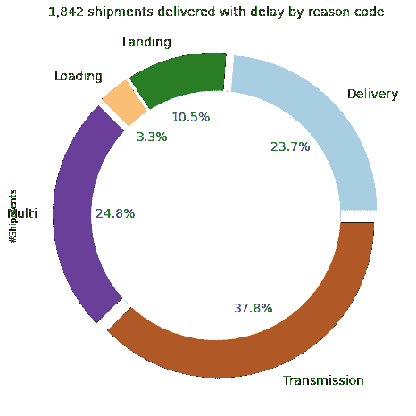**

**延迟交付环形图—(图片由作者提供)[使用 Python 创建环形图:[教程](https://www.youtube.com/watch?v=eGH4ZQYT3-4)**

```
**💡 ANALYSIS**
1,842 shipments delivered with delay
- 696 due to order transmission issues
- 60 due to warehouse operational issues
- 630 impacted by transportation
- 456 due to multiple factors🧮 **PYTHON CALCULATION**
- Filter the shipments to take only the delivered ones
- Groupby Last Status: count the number of shipments
- Pandas pie plot
```

**这种视觉效果可用于为所有团队的绩效评估制作动画**

*   **传输问题:询问您的基础设施和网络团队这些问题的根本原因，并跟进他们的行动计划**
*   **交付问题:与最后一英里运输团队和商店经理保持一致，以改善协调，避免迟到**

****按天发货状态****

**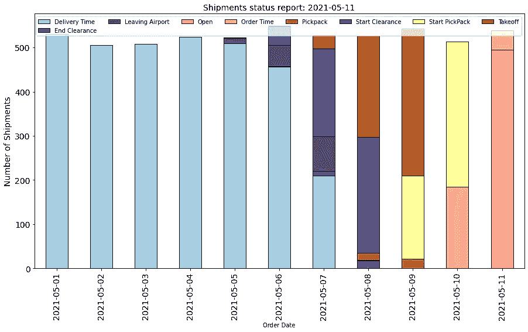**

**每日订单状态的堆积条形图—(图片由作者提供)【用 Python 创建堆积条形图:[教程](https://www.youtube.com/watch?v=xkJA2YgiKyg)**

**例如，如果你需要运送重要的货物。这种视觉效果可以作为日常跟进工具来推动运营团队。**

*   **推动仓库运营团队清理状态为 **PickPack** 的积压订单**
*   **与您的货运代理联系，确保订单的清关文件准备就绪，状态**开始清关**和**起飞****

## **在途货物分析**

**在途货物是已经订购但尚未交付给商店的货物。**

> **问题 2:目前运输中的货物在哪里？**

**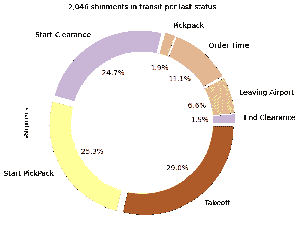**

**运输中的货物—(图片由作者提供)**

```
**💡 COMMENT** 2,046 shipments in transit
- 782 in the warehouse
- 593 on flight transit
- 535 in customs
- 136 on last mile delivery🧮 **PYTHON CALCULATION**
- Filter the shipments to take only the not delivered one
- Groupby Last Status: count the number of shipments
- Pandas pie plot
```

> **问题 3:有多少过境运输面临风险？**

****定义** 如果运输中的货物错过了截止时间或在整个运输链的至少一个步骤中被延误，则被视为有风险。**

**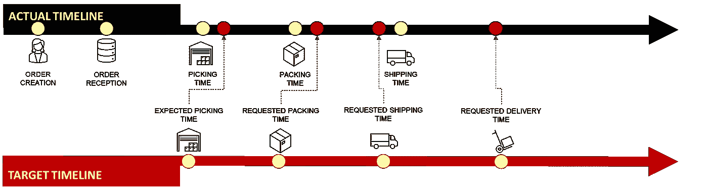**

**面临风险的运输示例—(图片由作者提供)**

**在下面的例子中，您的货物离开仓库的时间落后于计划。因此，延迟交付被认为是有风险的。**

**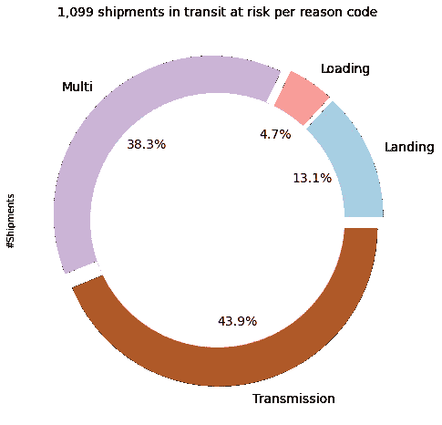**

**运输途中的货物面临风险—(图片由作者提供)**

```
**💡 COMMENT** 1,099 shipments in transit at risk because of delay
- During Warehouse Operations         : 534 shipments
- During the flight                   : 144 shipments
- Due to multiple factors             : 421 shipments🧮 **PYTHON CALCULATION**
- Filter the shipments to take only the not delivered one with at least on OnTime flag False
- Map the shipments with reascon code: if the flag XX OnTime = False the reason code is XX
- If you have multiple reasons the reason code is Multi
- Groupby Reason code: count the number of shipments
- Pandas pie plot
```

****💡系列发布的重要发货**
如果你要发布一个新系列，你可以格外关注这些有风险的发货，并推动团队加快进程**

*   **在最后一英里使用快递，而不是标准运输**
*   **对仓库提货订单进行优先级排序**

> **什么会影响您的端到端交付周期？流程中的可变性**

**如果您的交付链的不同流程中存在一些可变性，该怎么办？**

**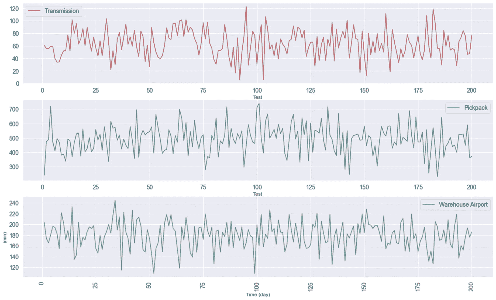**

**交付周期可变性的示例—(图片由作者提供)**

**在理想情况下，如果所有流程的交付周期都符合目标，那么您的交付周期为 **72 小时**。**

**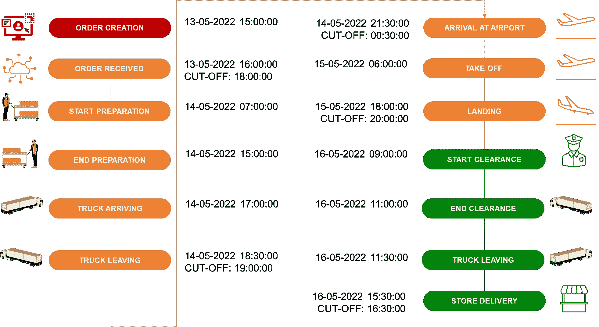**

**最佳交付流程示例—(图片由作者提供)**

**但是，如果您引入一些可变性，您可能会错过供应链中不同的截止时间，并造成交货延迟。**

**例如，您的仓库劳动力短缺，有些订单需要 5 个小时才能准备好。**

**这些订单将错过 19:00:00 的截止时间，卡车将不带这些订单离开。你必须再等 24 小时才能从你的 DC 发货。**

**欲知详情，**

# **后续步骤**

## **报告分发**

**您是否希望在一封干净的 HTML 电子邮件中自动发送上述带有评论区的图片？**

**几天前发表的一篇文章中提出了一个解决方案。**

**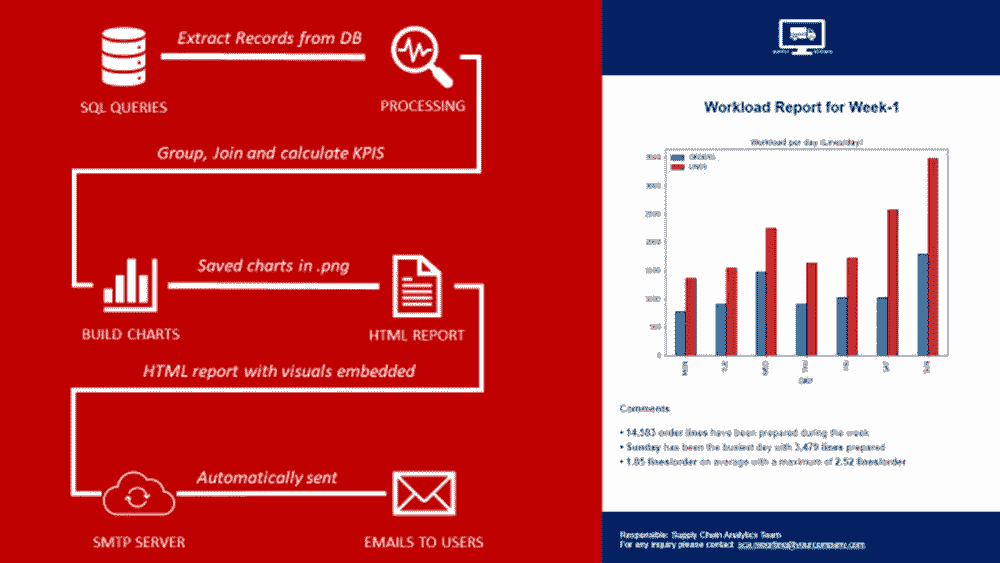**

**通过 Python 使用 HTML 电子邮件分发报告—(图片由作者提供)**

**您只需将您的工具插入到本文共享的 GitHub 资源库中的脚本中。**

**这个方法使用了 python 的 SMTP 库和一个简单的 HTML 模板。**

**欲知详情，**

**[](/automate-operational-reports-distribution-in-html-emails-using-python-c65c66fc99a6)  

## 高级供应链分析

供应链分析可以表示为一组工具，这些工具将使用信息流来回答问题和支持决策过程。


四种类型的供应链分析—(图片由作者提供)

对于每一种类型，你都需要具体的方法、数学概念和分析工具来回答这个问题。

供应链塔可以包含在[描述性](https://www.youtube.com/watch?v=0AZfe7DuT_U)和诊断性分析中，因为这有所帮助

*   监控和可视化延迟交付
*   使用每个流程的时间戳启动根本原因分析

对于接下来的步骤，您可以使用

*   用于[改进流程的规范模型](https://www.samirsaci.com/improve-warehouse-productivity-using-order-batching-with-python/)、[优化您的网络](https://www.samirsaci.com/robust-supply-chain-networks-with-monte-carlo-simulation/)或[使用 python 改进您的规划规则](https://www.samirsaci.com/production-fixed-horizon-planning-with-python/)
*   预测模型[预测你的销售](https://www.samirsaci.com/machine-learning-for-retail-sales-forecasting-features-engineering/)并提前分配资源

欲知详情，

[](https://www.samirsaci.com/what-is-supply-chain-analytics-2/)  

# 关于我

让我们连接上 [Linkedin](https://www.linkedin.com/in/samir-saci/) 和 [Twitter](https://twitter.com/Samir_Saci_) ，我是一名供应链工程师，正在使用数据分析来改善物流运作和降低成本。

如果你对数据分析和供应链感兴趣，可以看看我的网站

[](https://samirsaci.com) **