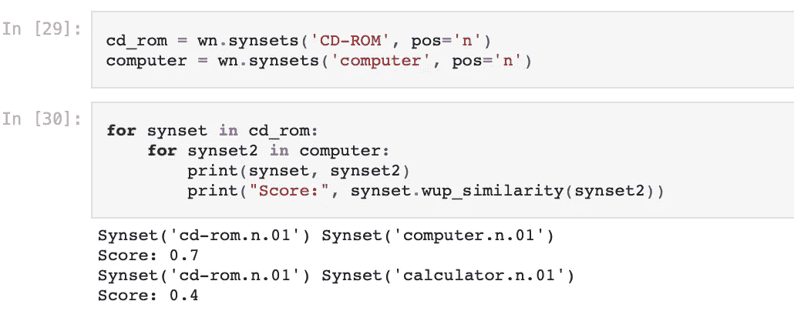
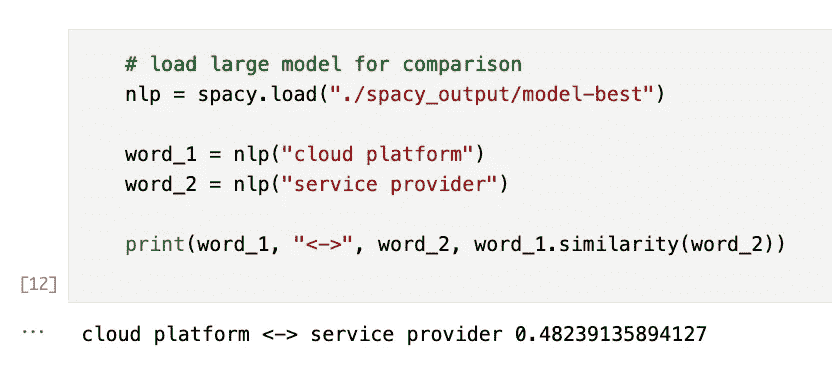
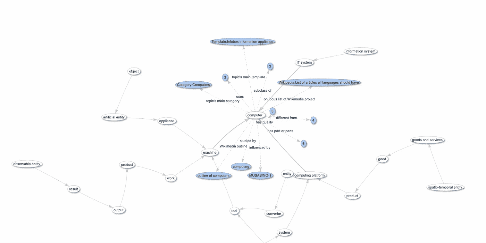
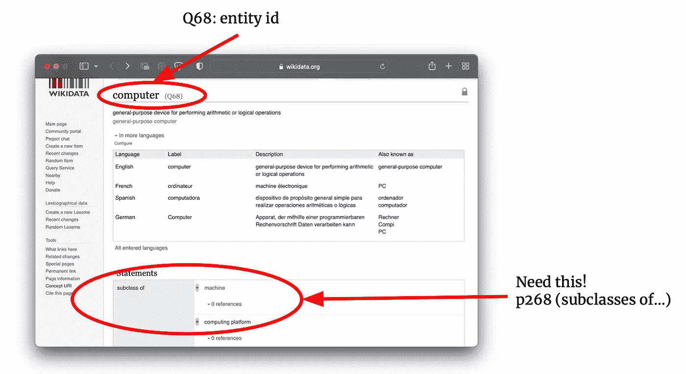
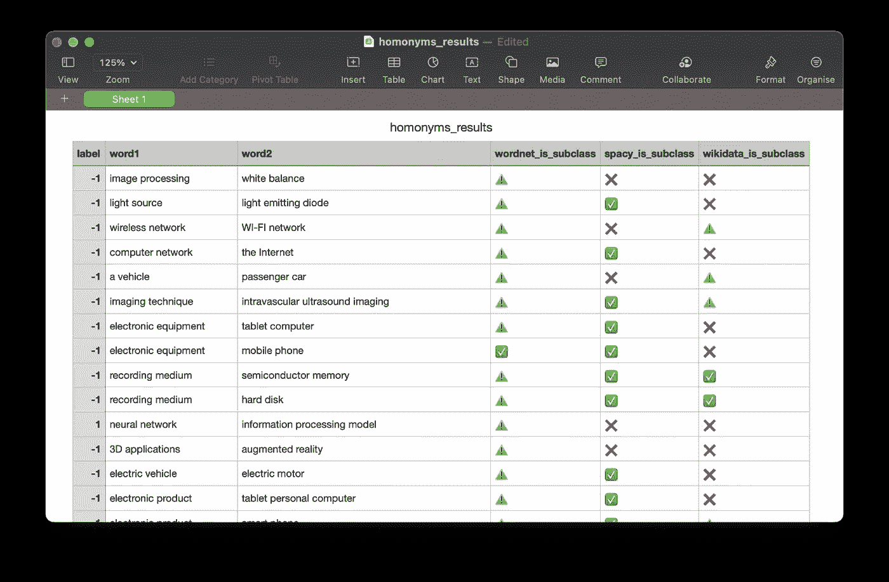
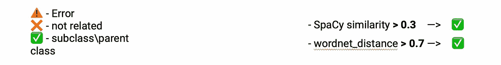
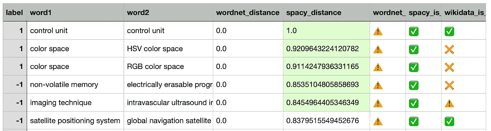
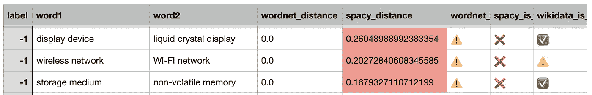
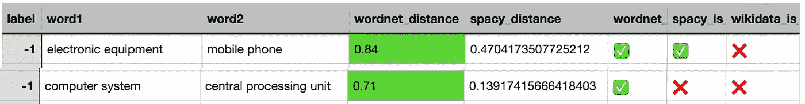

# 自动单词相关度评估| WordNet、SpaCy 和 Wikidata API

> 原文：<https://towardsdatascience.com/automatic-word-relatedness-evaluation-wordnet-spacy-wikidata-api-9fd1c72ac73c>

*⚠️在本文中，我将依靠赫斯特模式和用法的先验知识进行上位词提取。然而，我将使用专利的数据集，所以我建议检查我在这个周期的前一篇文章。*

 [## 用专利文本改进 NER 模型| SpaCy、Prodigy 和一点魔法🪄

### 本文提出了一种利用专利文本训练特定领域 NER 模型的方法。

towardsdatascience.com](/improving-the-ner-model-with-patent-texts-spacy-prodigy-and-a-bit-of-magic-44c86282ea99)  [## 用 SpaCy 实现 Hearst 模式

### 上下位关系的自动提取

towardsdatascience.com](/implementing-hearst-patterns-with-spacy-216e585f61f8) 

W 我们为什么要关心单词的相关性？那么，让我们从什么是关联性及其在 NLP 中的应用开始。

拓扑结构上下文中的相关度可以通过具有“父”单词和“子”单词来解释。到目前为止，这些术语被称为:

***上位词****——…一个具有广泛意义的词，构成了一个具有更具体意义的词所属的范畴；*

***下义****——……是反向的意思；比适用于它的一般术语有更具体含义的词。*

为了便于理解，这里有一个例子:

在这里，“光盘”和“硬盘”是“存储单元”的**的下位词**。反过来，“存储单元”是“光盘”和“硬盘”的**上位词**。

简而言之，这样的词汇关系是 NLP 任务的基本构件。与 NER(命名实体识别)一起，这种关系可以应用于各种任务，例如**分类预测、信息提取(IE)** 和简单的**数据集创建**(高级模型的示例)。

你会在我之前的文章中找到更多关于上位词以及如何提取它们的信息。在这里，我将集中使用几种工具来评估单词之间的关系类型。它不仅可以用于检查上位词对，还可以用于评估词对关系的任何其他应用。

# 数据

作为一个例子，我将使用专利的**G06K**T30【数据识别/数据呈现】小节中的专利文本。最重要的是，我训练了一个定制的 NER 模型来识别技术术语。**我在我的** [**上一篇**](https://medium.com/towards-data-science/improving-the-ner-model-with-patent-texts-spacy-prodigy-and-a-bit-of-magic-44c86282ea99) **中详细描述了这个数据集。**

> ⚠️数据不受版权保护，可安全用于商业目的。 ***根据***[***USPTO***](http://www.uspto.gov/news/media/ccpubguide.jsp)***:****受 37 CFR 1.71(d) & (e)和 1.84(s)****中反映的有限例外限制，专利的文本和图纸通常不受版权限制*** *。*

# 用于评估的上位词对

为了实现，我们将重用已经提取的上位词对。你可以从[项目的 repo](https://github.com/kinivi/patent_ner_linking) 中下载这个文件。这里有几个例子。

“关系”和“标签”行表示连接的方向。“1”或“hyper”意味着 word1 是 word2 的更广泛的含义(上位词)。

# 方法 1 | WordNet 相似度

第一种方法基于 WordNet 数据库，以距离的形式比较单词之间的相似性。尽管这个分数不能给出一个精确的答案，如果对是上下位关系，它仍然是有价值的简单和快速评估提取的数据。

实现非常简单；你需要安装 nltk 包并下载 WordNet 到里面。

然后，为每个单词创建一个名为 *synset* 的对象包装器，并运行它们之间的相似度计算。Synset 是“一组认知同义词，每个同义词表达一个不同的概念”。有时单词可以根据上下文表示不同的意思，因此 *synset* 提供了一组这些意思以及到其他单词的链接。

下面是一个关于“光盘”和“计算机”与**吴-帕尔默相似性**的演示。这个分数表示两个词义的相似程度，基于这两个词义在分类法中的深度。正是我们需要的！

然后，为每个单词创建一个名为 synset 的对象包装器，并

由于使用了 WordNet，这种方法可以修改，并在基于单词分类法的任务中有很大的潜力。然而，这种方法的一个很大的缺点是很多单词不能在字典中找到。这尤其与术语和缩写有关。它们不会被 nltk 识别，因此相似度无法计算。

# 方法 2 |空间

另一种直接的方法是利用深度学习 NLP 模型的单词间嵌入距离。目前最简单的方法是使用[空间](https://spacy.io/)。有了这个库，你可以利用一个已经预先训练好的模型或者训练定制模型。在前面的步骤中，我们已经为模式数据集中的命名实体识别(NER)调优了一个定制模型。**推荐使用微调模型，因为它在相似性评估时会给出更好的准确性**。

要计算相似度，只需对目标词加载模型运行*相似度()*函数:

利用空间和定制训练模型计算单词间的相似度

或者，下面是使用默认模型的方法:

与默认空间模型的计算相似性

# 方法 3 |维基数据 API

最新的、最伟大的、老实说也是最慢的方法——[Wikidata](https://www.wikidata.org/wiki/Wikidata:Main_Page\)。

Wikidata *“充当其 Wikimedia 姊妹项目(包括 Wikipedia、Wikivoyage、Wiktionary、Wikisource 等)的* ***结构化数据*** *的中央存储。”*它具有基于图形的结构和开放的 API 来访问数据。与 WordNet 相比，Wikidata 包含大量经常更新的信息。那些**，**我们确实会发现大部分新旧技术术语和缩略语。

你可以在这里玩来搜索图表中的数据，并可视化实例的属性。

作者提供的 word " **计算机** " |图像属性的图形可视化

具体来说，我们对属性**p268**(的*子类)感兴趣，它在图结构中具有“父单词”的 ID。*

Web 界面上的必要字段|作者提供的图片

要在 Python 中连接和使用这个 API，安装 [qwikidata](https://qwikidata.readthedocs.io/en/stable/) 和 [wptools](https://github.com/siznax/wptools) 。

在导入 libs 之后，我们需要获得单词对中两个单词的 id。下面是一个“iPad:和母词“电脑”的例子。通过利用 *get_parse()* ，我们搜索并解析该术语的页面，然后从*【wikibase】*字段中提取 ID。

用于检查维基数据中单词子类的 Python 脚本

然后，我们通过使用*get _ subclass _ of _ item()*和**查找父类的所有可能子类的 ID，简单地检查子类的 ID 是否在这个列表中**。

# 最终结果|所有方法一起

综上所述，最好的方法是什么？没有明确的答案，下面是原因。

我们在 144 个提取对的整个列表上运行了所有三种方法，并创建了一个表来比较结果。

最终结果表

总的来说，每个方法的输出被转换成 3 类:**相关、不相关和错误**。对于距离测量的方法，我们根据经验选择阈值。

评分系统|图片由作者提供

完整的表和 Python 函数来创建这样的结果，您可以在[项目报告](https://github.com/kinivi/patent_ner_linking/blob/main/project.ipynb)中找到。

所以，关于得到的结果。已经可以看出，WordNet 大部分时间都是给出错误的。为什么？这就是我们所说的 WordNet 字典的局限性。WordNet 不太可能包含专利中的缩写或高度特定的技术术语。

按最高空间分数排序的最佳结果

让我们来看看空间分数最高的一对。很明显“HSV 颜色空间”是“颜色空间”的子类。这里空间相似性工作得最好。基本上，它只是由类似的话触发，没有什么特别的，但它的工作。

另一方面，这并不是一种持续的行为。看看下面的例子。

按最低空间分数排序的最佳结果

按照预期，“显示设备”和“液晶**显示器**应该有相当大的相似度得分，但是没有。然而，Wikidata API 有望在这种情况下工作，并提供正确的结果。

你已经注意到了 WordNet 的一个常量⚠️(错误)。但不代表没用。这就是证据:

WordNet 有用性的例子

“手机”明明是“电子设备”；它对维基数据没有影响，仍然给空间相似性一个很小的分数。

它显示了什么？任何问题都没有灵丹妙药。然而，利用几种不同方法的复杂方法可能是一种防弹解决方案。

这个解决方案会更好吗？当然啦！这里有一些想法和可能的改进

*   🔪**利用 WordNet 的 n-grams**。像**图像处理单元** - >图像处理单元。拆分单词以查找字典中的相似类别
*   🪞尝试同义词
*   🛠 **改进了维基数据的 Graph-Q 查询。**老实说，获取所有子类既慢又不可靠。最好创建一个自定义查询来检查特定的 ID 并将其传递给 API。

完整的代码和解析的数据可以在这里找到:

 [## GitHub-kini VI/patent _ ner _ linking:📰命名实体识别(NER)和实体链接(EL)

### 这个项目的主要目标是:用特定领域的专利数据集训练 NER 模型，用

github.com](https://github.com/kinivi/patent_ner_linking)