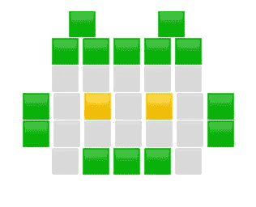

# 自动单词求解

> 原文：<https://towardsdatascience.com/automatic-wordle-solving-a305954b746e>

## 去掉 Wordle 的乐趣本身就是乐趣…让我们看看怎么做

机器人文字解算器，插图(图片由作者提供)

首先，一个起源的故事。大约一周前，我开始玩单词游戏。对于那些不知道的人，只需点击链接并播放一次:你就会知道它的要点。这有点像游戏[的策划者](https://en.wikipedia.org/wiki/Mastermind_(board_game))，但是有文字。有一些隐藏的单词，你会得到提示，你猜测的单词是否和那个单词有相同的字母，可能在完全相同的位置。我觉得这特别有趣，因为这又回到了我的博士导师提出的一个观点:语言有特殊的结构，这使它与纯组合学非常不同。因此，如果解决摄魂师是一个棘手的组合问题(实际上是 [NP-complete](https://arxiv.org/abs/cs/0512049) )，那就值得伟大的[唐·克努特](https://en.wikipedia.org/wiki/Donald_Knuth)写一篇[文章](https://www.cs.uni.edu/~wallingf/teaching/cs3530/resources/knuth-mastermind.pdf)，Wordle 看起来也应该很有趣。

第一个区别是，在某种意义上，你的目标是在每一步最大化信息(这有一个正式的含义:参见这个漂亮的 [*数据科学信息论简介*](/an-introduction-to-information-theory-for-data-science-4fcbb4d40878) *了解更多细节)*。所以，重复你已经知道的字母是没有用的。按照这种逻辑，你应该尽量减少你所使用的单词之间的相似性。此外，也许找出隐藏单词中的元音是很好的，因为单词基本上是围绕它们的元音构建的。回到我的起源故事，我按照这个逻辑，用“点”和“激光”的开场序列。然而，在最后一个单词中，不知何故失败了，我在 6 次尝试中没有猜出这个单词。**一个未来的 Wordle 反派诞生了。**

让我们看看计算机会如何看待 Wordle。

起初，全方位的隐藏单词是可能的。在每一次猜测之后，这个隐藏单词列表会根据收到的反馈进行删减。在我们做出每一个猜测之后，“对手”(一些邪恶的单词恶魔，试图找到最难猜的隐藏单词，给出我们迄今为止所知道的)可以选择最令人困惑的反馈。这在玩家和对手之间建立了一个[广泛形式的游戏](https://en.wikipedia.org/wiki/Extensive-form_game)，理想情况下，我们会运行一个[极小极大](https://en.wikipedia.org/wiki/Minimax)算法，通过[逆向归纳](https://en.wikipedia.org/wiki/Backward_induction)找到玩家在每个阶段要做的最好的事情。然而，这是一个非常大的运行状态空间，以一种合理的方式来完成它是不可行的。此时，我们需要决定以何种方式学习一些不完美的策略(并为此使用来自[强化学习](/state-values-and-policy-evaluation-ceefdd8c2369)的一些方法)。然而，在我们的例子中，有直观的贪婪试探法可以首先尝试，希望它们足够好。让我们提两个:

*   ( **Greedy-min-max** )选择最小化最大剩余可能单词列表的猜测:

每次猜测后，现有的可能单词列表根据对手给出的反馈进行划分。因为最终，我们只想得到一个可能的单词，一个好的目标是逐渐减少可能单词列表的大小。

*   (**平均-最小化**)选择最小化平均剩余可能单词列表的猜测:

我不太喜欢这种方法(因为我们的目标是最差情况下的性能，而不是平均性能)，但我们也会尝试这种方法，因为无论如何，这些只是启发式算法，而不是最佳算法。请注意，最小化平均单词列表等同于拥有最大数量的不同反馈以供猜测(想想为什么…)

切入正题，这是我的 Github 库，它实现了一个脚本，该脚本遵循以下策略:

<https://github.com/yotam-gafni/wordle_solver>  

(它还有一个实现，您可以每天使用它来玩)

我感谢这两个 Github 项目，在那里我得到了可能的猜测词和隐藏词的列表。查看它们，因为它们具有自动求解器所不具备的有趣特性:

<https://github.com/coolbutuseless/wordle>  <https://github.com/octokatherine/word-master>  

此外，看看 [Absurdle](https://qntm.org/files/wordle/index.html) :它采用我们讨论过的对抗方式，并试图让你尽可能多地移动！

# 为了伟大的结果…

贪婪最小最大最坏情况性能是 **5 次猜测**

平均最小化最坏情况性能是 **6 次猜测**

两者都能够总是击败沃尔多游戏！难以置信。

但是……有一个小小的警告。这个游戏有一个硬模式，你只能使用在那个阶段仍然有可能的单词作为猜测。这样，Greedy-min-max 最坏情况下的性能是 8 次猜测。我相信这可以通过查看发生这种情况的少量特定树路径来解决:如果有人足够勇敢，这是一个有价值的任务！

最后但同样重要的是，许多人都在问的问题的答案是:在 Wordle 中最佳的第一步是什么？

我见过很多关于它的答案，从 [*adieu*](https://ftw.usatoday.com/lists/wordle-strategy-first-word-best-adieu) *(在 USAtoday，没少)到* [*raise*](https://matt-rickard.com/wordle-whats-the-best-starting-word/) ，但 greedy-min-max 的答案是毫无疑问的， [*aesir*](https://en.wikipedia.org/wiki/%C3%86sir#:~:text=The%20%C3%86sir%20(Old%20Norse%3A%20%5B,resulting%20in%20a%20unified%20pantheon.) *。*

由于今天 greedy-min-max 的表现，如果没有一些绿色方块，这篇文章是不完整的:

单词 203 4/6

🟨⬜⬜⬜🟨
🟩🟩⬜⬜⬜
⬜⬜⬜🟨🟩
🟩🟩🟩🟩🟩

这是所有关于曲柄出的数字！

安静，祝你愉快。

(后记:如果想看另一条解决 Wordle 的路径，可以看看 Ido 的帖子:[https://medium . com/@ I do-frizler/the-science-behind-Wordle-67c 8112 ed0 d 1](https://medium.com/@ido-frizler/the-science-behind-wordle-67c8112ed0d1)。我从 Eyal Walach 那里听说，他们实现了一种类似的方法，能够在最多六次猜测中解决硬模式。也欢迎你在推特上关注我，我在那里分享数学和经济学的内容