# 使用外部 API 和云函数自动更新 BigQuery 表

> 原文：<https://towardsdatascience.com/automatically-updating-a-bigquery-table-using-an-external-api-and-a-cloud-function-c05423ca3ed>

## 关于构建完全自动化的过程来定期更新 BigQuery 表的分步指南


[沙恩·奥尔登多夫](https://unsplash.com/@pluyar?utm_source=unsplash&utm_medium=referral&utm_content=creditCopyText)在 [Unsplash](https://unsplash.com/fr/photos/mQHEgroKw2k?utm_source=unsplash&utm_medium=referral&utm_content=creditCopyText)

# 语境

最近，Roquette Data & Advanced Analytics 团队一直在研究 BigQuery 或 Snowflake 等分析数据仓库如何改善我们的最终用户对数据的访问。

这种数据仓库提供了一个全球平台，可以轻松地接收、处理结构化数据，并将其提供给业务用户或解决方案。

在这篇文章中，我将解释我们如何开发一个简单的过程来接收来自外部 API 的天气数据，并将其提供给我们的用户。

此类数据有助于检测本地温度和制造过程输出之间的任何相关性(有时就是这样！)或者我们的销售是否会受到温度变化的影响。

# 本教程需要的内容:

*   一个免费的 API 来获取全球各地的各种天气信息(我们的设施几乎遍布每个大洲)。我们的一位数据科学家([亚瑟·特尔德斯](https://medium.com/u/8853717eec87?source=post_page-----c05423ca3ed--------------------------------))发现 [**OpenMeteo**](https://open-meteo.com/en) 很好地满足了我们的需求。
*   数据仓库平台。在本文中，我们将使用来自 Google 的: **BigQuery** 。

# 在 Google 云平台中建立一个新项目

我会假设你已经有一个 GCP 帐户。如果没有，你可以很容易地打开一个，并获得 300 美元的信用 30 天。如果你已经有了一个，记住这个例子几乎不会花你一分钱(<0.05$).

You should start by creating a new project to isolate your work. Click on the project selector in the top left and then “New Project”:


Project Selector on GCP— Image from Author


New Project Button on GCP — Image from Author

We call this new project “api-weather-test” and click on “create”:

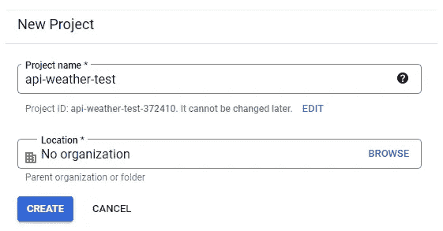

New Project Creation on GCP — Image from Author

# Selecting your project and activating APIs

Once your project is created (it should take a few seconds only), we select it by using again the project selector to reach the project homepage:

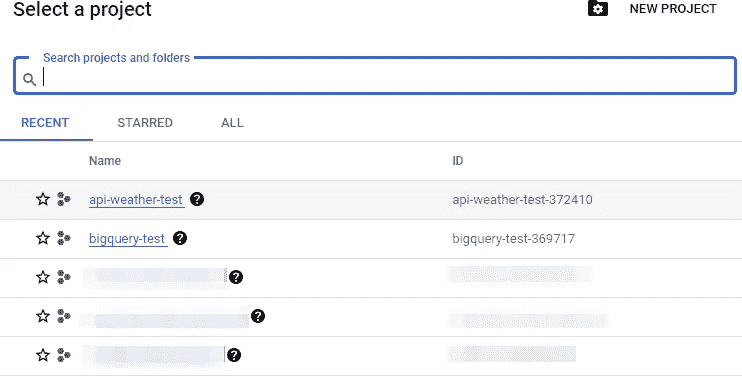

Project selection on GCP — Image from Author

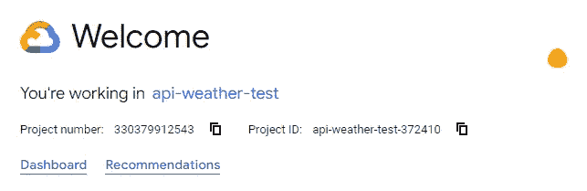

*GCP 的项目主页——图片来自作者*

我们的新项目来将已经嵌入的功能(如 BigQuery)，但我们需要激活一些额外的 API。我们应该在搜索栏中查找的第一个是“云发布/订阅 API”:

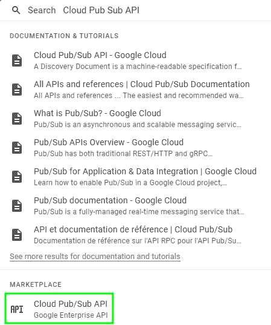

*GCP 的云发布/订阅搜索—图片来自作者*

到达相应的页面后，我们只需启用 API。

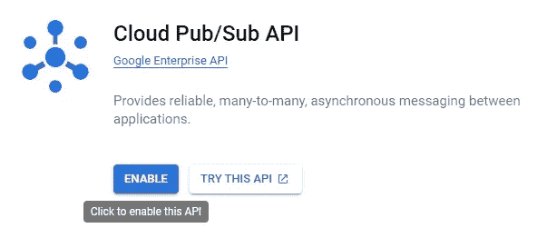

*在 GCP 启用云发布/订阅 API 图片来自作者*

# 我们的自动化概念

我们打算定期从外部 API(例如每天)，然后将其转移到 BigQuery 表中。

如下所述，实现这一目标的一种可能方式是:

*   **创建能够查询外部 API 和更新 BigQuery 表的 Python 脚本**，
*   **将这个 Python 脚本**封装到一个云函数中，该云函数将“监听”发布/订阅消息并等待其触发，
*   **每天广播一条“Pub/Sub”消息**(就说午夜吧！)将被填充到项目中。

因此，每次发送“发布/订阅”消息时，云函数都会执行 Python 脚本并更新大查询表。

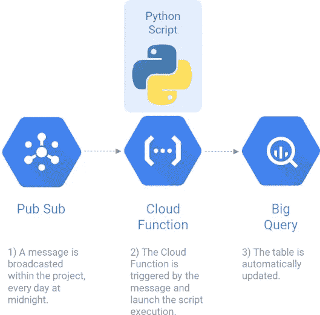

*自动化概念—图片来自作者*

# 步骤 1:使用云调度程序创建作业

我们通过搜索栏进入“云调度程序”用户界面:


*GCP 云调度搜索—图片来自作者*

我们创建了一个新职位，并开始定义:

*   它的名字，
*   它被执行的区域，
*   它的描述，
*   它的频率，在 Unix-cron 格式下指定(如果你不熟悉的话，你应该查一下 [CronGuru](https://crontab.guru/) )，
*   和它的时区。

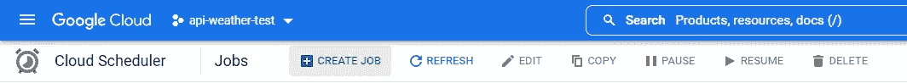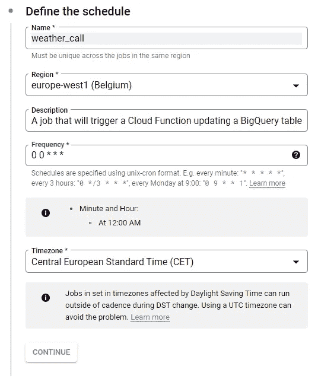

*云调度程序——在 GCP 创造就业机会——图片来自作者*

我们还必须定义将要执行的目标的类型。我们选择“发布/订阅”并创建一个名为“天气”的新主题，因为所有消息都应该属于一个预定义的主题。


*云调度程序—GCP 上的作业配置—图片来自作者*


*云调度程序——GCP 上的主题创建——图片来自作者*

我们不会使用消息体的特性，所以您可以随意放置(这里是“更新”):

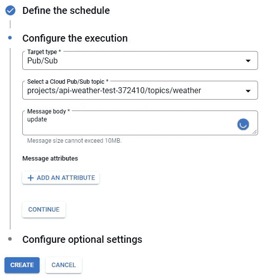

*云调度程序——在 GCP 创造就业机会——图片来自作者*

创建完成后，这个新作业应该出现在列表中，其下一次计划的执行时间显示在“下次运行”列中。


*云调度器用户界面—图片来自作者*

# 步骤 2:在 BigQuery 中创建我们的表

我们再次使用搜索栏到达 BigQuery 页面，并单击“Create Dataset”(一个包含表或视图的数据集)

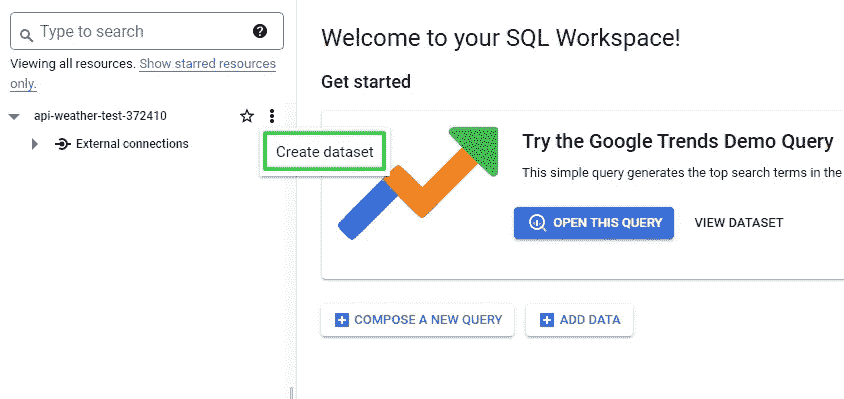

*BigQuery 主页——图片来自作者*

关于这个新数据集的重要信息是:

*   **其 ID**(=名称，此处为“天气”)
*   **它的位置**

(额外的设置是可用的，但对本例没有用)

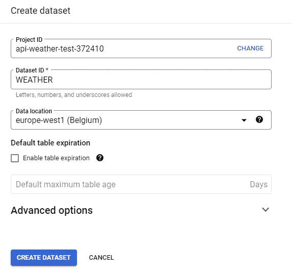

*BigQuery —在 GCP 上创建数据集—图片来自作者*

创建后，它应该出现在我们的项目结构下，如下所示:

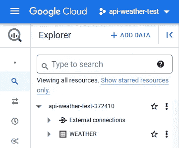

*BigQuery —数据集—图片来自作者*

有几种方法可以创建空表。我们选择执行相应的 SQL 表。

将“api-weather-test- **372410** ”替换为您自己的项目名称后，只需点击“**编写一个新的查询**，并运行以下指令:

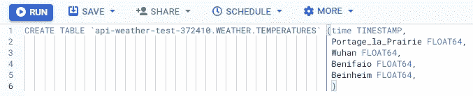

*big query—使用 SQL 创建表格—图片来自作者*

```
|CREATE TABLE `api-weather-test-372410.WEATHER.TEMPERATURES` (time TIMESTAMP,
                                                             Portage_la_Prairie FLOAT64 OPTIONS (description = 'External temperatures in C° for Portage plant.'),
                                                             Wuhan FLOAT64 OPTIONS (description = 'External temperatures in C° for Wuhan plant.'),
                                                             Benifaio FLOAT64 OPTIONS (description = 'External temperatures in C° for Benifaio plant.'),
                                                             Beinheim FLOAT64 OPTIONS (description = 'External temperatures in C° for Beinheim plant.'),
                                                             )
```

我们可以观察到该表包含:

*   一个带有时间戳类型的“时间”列，
*   4 个浮动柱对应于我们的四个罗盖特工厂(真实数据集包括 25 个罗盖特工厂)。

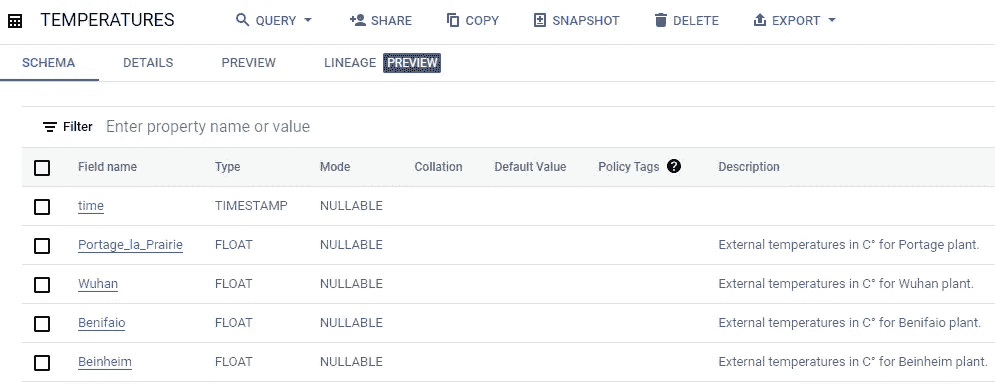

*BigQuery —带有 SQL 的温度表—图片来自作者*

通过在 SQL 指令中使用“OPTIONS (description = '…')”，每个列的描述都包含在表方案中，使用户更容易理解其中包含什么类型的信息。

我们的(空)表已经准备好欢迎数据…让我们跳到下一步！

# 步骤 3:创建云函数

我们可以通过搜索栏导航到“Cloud Functions”页面，然后点击“Create Function”(*注:Google 可能会要求您激活其他 API，如 CloudBuild 和 CloudFunctions* )

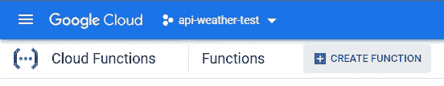

*注意:云函数可以被认为是小容器，在其中执行代码。它们支持不同的语言，例如:。NEt，Go，Java，Node，PHP，Python，或者 Ruby。*

我们创建了一个名为“天气更新”的功能，由“天气”主题的“发布/订阅”消息触发。

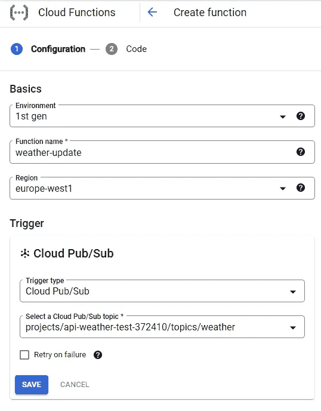

*云功能配置—图片来自作者*

一旦配置完成，我们需要选择相应的语言。我们选择 Python 3.9 作为运行时。

现在只需要复制粘贴我的 GitHub 中的代码:

*   [main.py](https://github.com/pierrelouisbescond/medium_articles/blob/main/medium_api_main.py)

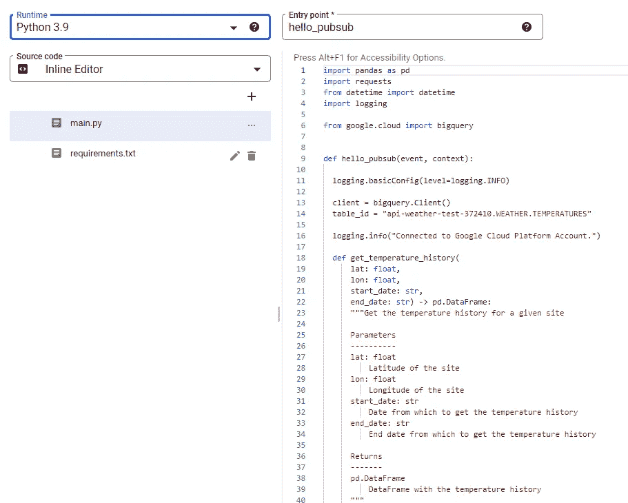

*云函数— main.py 配置—图片来自作者*

*   [requirement . txt](https://github.com/pierrelouisbescond/medium_articles/blob/main/medium_api_requirements.txt)

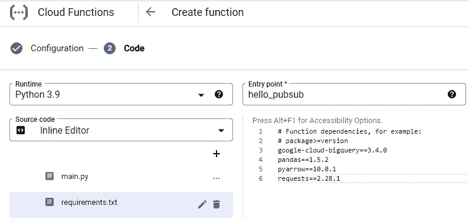

*云功能— requirements.txt 配置—图片来自作者*

我们点击“部署”并等待云功能激活:

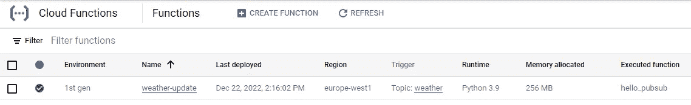

*云函数 UI——图片来自作者*

因为我们想确保该功能运行良好，而不需要等到午夜，所以我们单击“Test function”立即运行它:

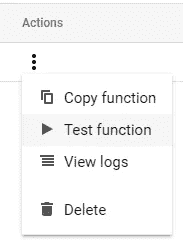

*云函数 UI —动作—图片来自作者*


日志确实确认了该功能的正确执行。

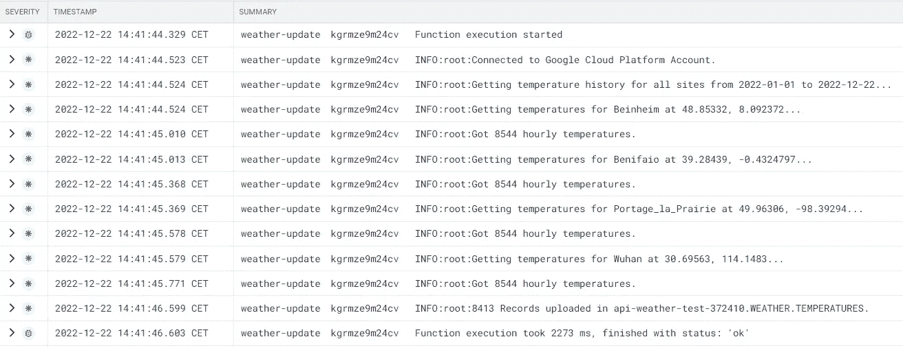

*云函数日志——图片来自作者*

我们返回到“BigQuery”页面，执行下面的 SQL 指令(确保使用您自己的项目名称:api-weather-test- **XXXXXX** )。

该表现在包含从 2022 年 1 月 1 日至今的所有可用记录:

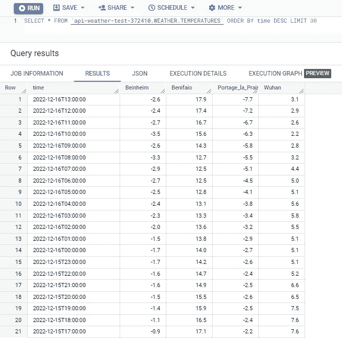

*BigQuery — SQL 指令执行—图片来自作者*

*注:美国石油学会提供的数据为近似值。5 天的延迟，这意味着在 22/12 执行的查询将检索到 17/12 的数据。*

# 严峻的考验！

我们可以去睡觉了😪并且等到第二天早上检查午夜更新是否顺利！

我们从检查“发布/订阅”消息是否运行开始…它确实运行了:

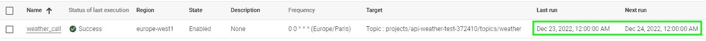

我们跳转到云函数日志，看到“天气更新”函数在午夜被正确执行，几秒钟后:

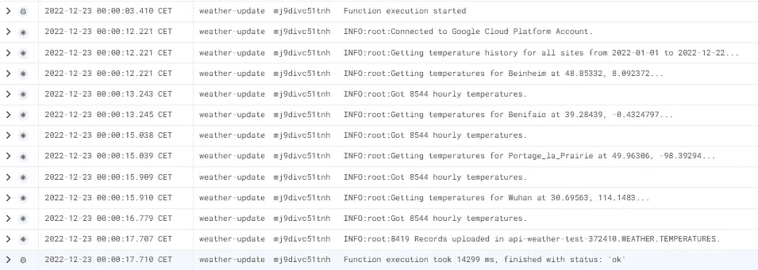

*云函数日志——图片来自作者*

正如所料，BigQuery 表现在包含了新记录😁：

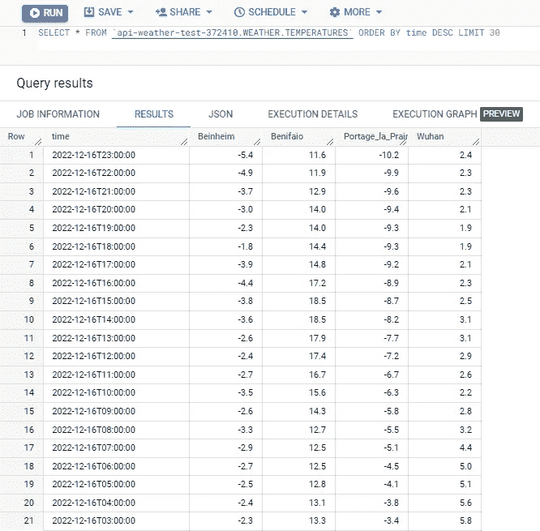

*BigQuery — SQL 指令执行—图片来自作者*

# 然后，瞧！

不需要任何额外的工作，BigQuery 将在每天午夜更新，没有进一步的行动。

在我们结束这篇文章之前，请注意以下几点:

*   为了使本文的代码尽可能简单，Python 脚本完全删除了表内容，每次都用所有可用的数据更新它。这不是优化资源的最佳方式。在生产中，我们应该以“增量模式”工作，只从 API 中检索自上次更新以来的新记录，并将它们传输到表中。
*   假设我们想要将“温度”表中的信息与另一个 BigQuery 表(例如:“流程 _ 输出”)。我们将不需要使用第二个云函数。我们可以直接使用“预定查询”来执行 SQL 指令(例如内部连接)。

像往常一样，我试图确定所有需要的步骤，但如果我的教程中有任何遗漏的说明，请不要犹豫来找我！

请不要犹豫，浏览我在 Medium 上的其他文章:

<https://pl-bescond.medium.com/pierre-louis-besconds-articles-on-medium-f6632a6895ad> 