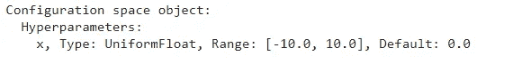
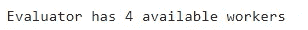
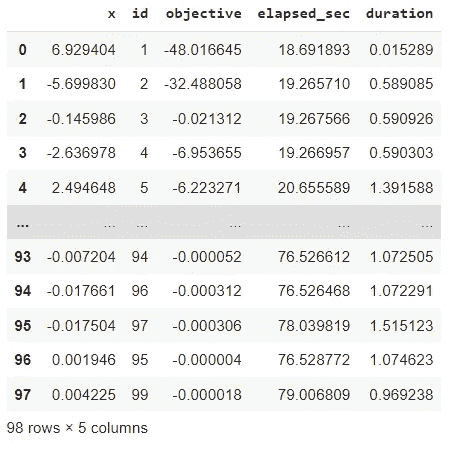
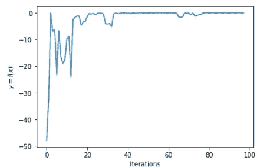

# 自动化深度神经网络

> 原文：<https://towardsdatascience.com/automating-deep-neural-networks-d76af8e0c7fa>

## 使用 DeepHyper 自动开发深度神经网络


克里斯里德在 [Unsplash](https://unsplash.com?utm_source=medium&utm_medium=referral) 上的照片

创建神经网络模型很困难，因为我们需要估计或找出给定问题的最佳超参数。我们需要决定用于解决问题的层数和神经元数。创建神经网络模型时，需要考虑多个实体。

有不同类型的神经网络，即 ANN、CNN、RNN、LSTM 等。对于所有这些模型，都有不同的超参数来帮助提高模型的准确性和性能。为了创建不同类型的神经网络，我们需要遵循一定的步骤。

DeepHyper 是一个开源的 python 库，它不仅可以自动化创建模型的过程，还可以帮助进行超参数调整和模型评估。这有助于理解黑匣子里发生了什么。

在本文中，我们将使用一个 DeepHyper 来创建神经网络模型并对其执行操作。

让我们开始吧…

# 安装所需的库

我们将从使用 pip 安装 DeepHyper 开始。下面给出的命令可以做到这一点。

```
pip install deephyper
```

# 导入所需的库

在这一步中，我们将导入所需的库和函数来创建深度学习模型。

```
from deephyper.problem import HpProblem
from deephyper.evaluator import Evaluator
from deephyper.evaluator.callback import LoggerCallback
from deephyper.search.hps import AMBS
import matplotlib.pyplot as plt
```

# 创建模型

在这一步中，我们将创建需要优化的函数，然后创建搜索空间，还创建评估器接口，最后创建搜索算法。

```
def f(config):
    return - config["x"]**2
problem = HpProblem()
problem.add_hyperparameter((-10.0, 10.0), "x")
problem
```



功能(来源:作者)

接下来，让我们创建评估器。

```
evaluator = Evaluator.create(
    f,
    method="ray",
    method_kwargs={
        "num_cpus": 1,
        "num_cpus_per_task": 0.25,
        "callbacks": [LoggerCallback()]
    },
)print(f"Evaluator has {evaluator.num_workers} available worker{'' if evaluator.num_workers == 1 else 's'}")
```



评估(来源:作者)

创建搜索是最后一步，让我们来完成它。

```
search = AMBS(problem, evaluator)
```

创建搜索后，我们需要执行一定数量的搜索。

```
results = search.search(max_evals=100)
results
```



结果(来源:作者)

我们也可以使用 matplotlib 可视化评估。

```
plt.plot(results.objective)plt.xlabel("Iterations")
plt.ylabel("$y = f(x)$")plt.show()
```



结果(来源:作者)

在这里，我们可以清楚地看到目标以及它是如何向 0 收敛的。继续尝试，如果你发现任何困难，请在回复部分告诉我。

本文是与[皮尤什·英加尔](https://medium.com/u/40808d551f5a?source=post_page-----d76af8e0c7fa--------------------------------)合作完成的

# 在你走之前

***感谢*** *的阅读！如果你想与我取得联系，请随时通过 hmix13@gmail.com 联系我或我的* [***LinkedIn 个人资料***](http://www.linkedin.com/in/himanshusharmads) *。可以查看我的*[***Github***](https://github.com/hmix13)**简介针对不同的数据科学项目和包教程。还有，随意探索* [***我的简介***](https://medium.com/@hmix13) *，阅读我写过的与数据科学相关的不同文章。**