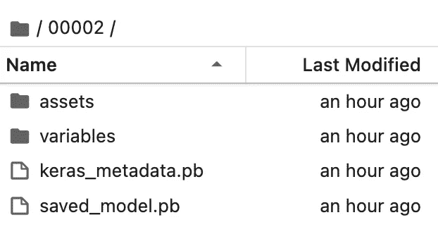
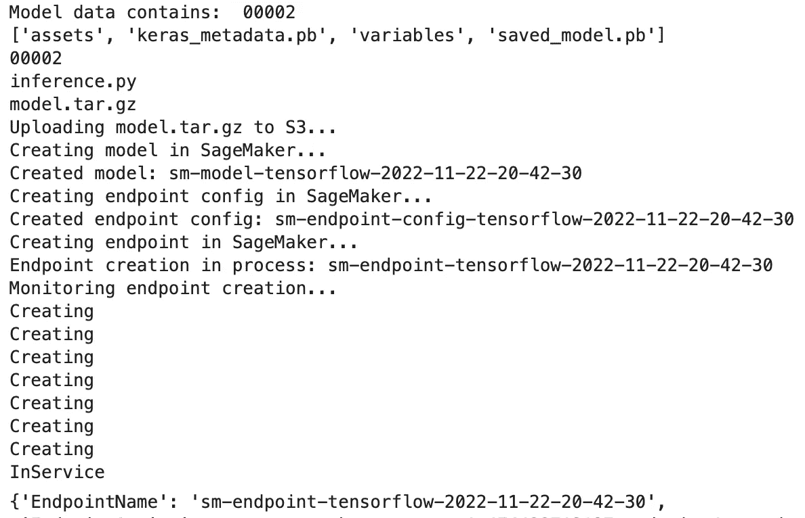

# 在 Amazon SageMaker 上自动部署预先训练好的模型

> 原文：<https://towardsdatascience.com/automating-deployment-of-pre-trained-models-on-amazon-sagemaker-46d50c246503>

## 在 SageMaker 推理上部署 TensorFlow ResNet50


图片来自 [Unsplash](https://unsplash.com/photos/Uz0uQXvOtEY) 由[附身摄影](https://unsplash.com/@possessedphotography)

过去，我曾写过在亚马逊 SageMaker 上部署[预先训练好的模型](/deploying-a-pre-trained-sklearn-model-on-amazon-sagemaker-826a2b5ac0b6)。虽然我发布的[工件](https://github.com/RamVegiraju/Pre-Trained-Sklearn-SageMaker)是可复制的，但它需要理解[AWS SDK](/sagemaker-python-sdk-vs-boto3-sdk-45c424e8e250)和适当的 API 调用，以及理解更高级别的 [SageMaker Python SDK](https://sagemaker.readthedocs.io/en/stable/) 。

对于新用户来说，这可能需要消化很多东西，为了使体验更简单，我已经帮助构建了一个 [API](https://github.com/aws-samples/sagemaker-migration-toolkit) ，它自动化了用户为了正确部署 [SageMaker 端点](https://docs.aws.amazon.com/sagemaker/latest/dg/deploy-model.html)而必须理解的大量底层工作。有了这个 API，重点是使预训练模型的迁移对于数据科学家和一般不熟悉 SageMaker 或 AWS 的用户来说更加简单和直观。

目前支持什么？目前该 API 被称为 **SageMaker 迁移工具包**，它支持 TensorFlow、PyTorch 和 Sklearn 模型的预训练模型部署。除此之外，还有对实时和无服务器端点的支持，默认情况下，如果您没有指定您想要的推断选项，该包将部署到无服务器端点。最后，目前只有单个模型端点支持实时推理，但对于预先训练的多模型部署的手动示例，请查看这些[示例](https://github.com/RamVegiraju/SageMaker-Deployment/tree/master/RealTime/Multi-Model-Endpoint/Pre-Trained-Deployment)。

在今天的文章中，我将带您了解如何利用 TensorFlow 框架将这个 API 与流行的预训练的 [ResNet50 模型](https://www.tensorflow.org/api_docs/python/tf/keras/applications/resnet50/ResNet50)一起使用。

## SageMaker 迁移工具包设置

关于 API 的设置说明可以在 [GitHub 自述文件](https://github.com/aws-samples/sagemaker-migration-toolkit/blob/main/README.md)中找到。安装与其他 Python 包非常相似，您将在下面的步骤中看到。

1.  克隆 GitHub repo
2.  python setup.py bdist_wheel
3.  pip install dist/sage maker _ migration _ toolkit-0 . 0 . 1-py3-none-any . whl
4.  sagemaker _ migration.configure 模块名称 sagemaker_migration.configure

第四步是为 SageMaker 服务添加 IAM 角色。您应该能够在 IAM 控制台中访问它，或者在笔记本单元中运行以下代码来获得您的角色。

```
import sagemaker
sagemaker.get_execution_role()
```

在这个例子中，我们将在一台 [SageMaker 笔记本](https://docs.aws.amazon.com/sagemaker/latest/dg/nbi.html)上使用 conda_tf2 内核，以便预装 TensorFlow。

## ResNet50 型号设置

在开始使用迁移工具包之前，我们需要正确下载和序列化 ResNet50 模型工件。SageMaker 希望模型数据的格式符合框架的服务栈。对于 TensorFlow 服务，序列化模型数据遵循 [SavedModel](https://www.tensorflow.org/guide/saved_model) 格式。模型数据的结构应该如下所示:

```
model_artifact_version/
    variables/
        variables.data
        variables.index
    keras_metadata.pb
    saved_model.pb
inference.py #optional, but recommended
```

使用 TensorFlow，我们可以加载 ResNet50 模型。

```
import os
import tensorflow as tf
from tensorflow.keras.applications import resnet50
from tensorflow.keras import backend
import numpy as np
from tensorflow.keras.preprocessing import image

tf.keras.backend.set_learning_phase(0)
model = resnet50.ResNet50() #Load model
```

既然我们的模型已经加载，我们可以将这些模型工件转储到一个目录中，其结构如上所示。

```
export_dir = "00002" #directory to store model artifacts
model = tf.keras.applications.ResNet50()

if not os.path.exists(export_dir):
    os.makedirs(export_dir)
    print("Directory ", export_dir, " Created ")
else:
    print("Directory ", export_dir, " already exists")
# Save to SavedModel
model.save(export_dir, save_format="tf", include_optimizer=False)
```



保存的模型工件(作者截图)

最后，SageMaker 迁移工具包还期望提供一个 inference.py 脚本。对于那些不熟悉的人来说，一个 [inference.py](https://aws.plainenglish.io/adding-custom-inference-scripts-to-amazon-sagemaker-2208c3332510) 文件允许用户将他们的预处理和后处理逻辑添加到他们的端点。对于这个模型，我们真的不需要任何前/后处理，所以我们可以创建一个没有任何功能的虚拟推理脚本。

```
%%writefile inference.py
import os
import json
```

我们现在准备利用迁移工具包进行模型部署。

## SageMaker 迁移工具包部署

我们首先导入必要的模块来使用这个包。

```
from sagemaker_migration import frameworks as fwk
import os
```

在框架模块中，目前支持 TensorFlow、PyTorch 和 Sklearn。我们创建一个 TensorFlow 模型实体，并传递适当的参数。

```
# Create a TensorFlow Model Object Entity, you can create a real-time or serverless endpoint
tf_model = fwk.TensorFlowModel(
    version = '2.3.0',
    model_data = '00002',
    inference_option = 'real-time',
    inference = 'inference.py',
    instance_type = 'ml.m5.xlarge')
```

这里有几个强制参数:

1.  model_data (str):这是序列化模型数据的路径。
2.  推论(str):这是你的推论. py 脚本，即使是空的也要提供一个。
3.  version (str):这是您的模型的框架版本，在底层，工具包将搜索该版本支持的 SageMaker 容器。

至于推理选项，默认设置为无服务器推理。如果您指定推理选项，您还可以设置参数，例如用于[实时推理](https://github.com/aws-samples/sagemaker-migration-toolkit/blob/main/sagemaker_migration/sagemaker_migration.py#L32)的实例类型，以及用于[无服务器推理](https://github.com/aws-samples/sagemaker-migration-toolkit/blob/main/sagemaker_migration/sagemaker_migration.py#L43)的并发/内存。

与使用 Boto3 的主要区别在于，您不再需要与模型、端点配置、[图像](https://aws.plainenglish.io/how-to-retrieve-amazon-sagemaker-deep-learning-images-ff4a5866299e)和其他较低层次的相关 SageMaker 对象进行交互。当您部署这个 TensorFlow 模型实体时，您将看到所有这些都是自动创建的。

```
tf_model.deploy_to_sagemaker()
```



端点创建(作者截图)

模型 tarball 是自动为您创建的， [SageMaker 模型](https://boto3.amazonaws.com/v1/documentation/api/latest/reference/services/sagemaker.html#SageMaker.Client.create_model)、 [SageMaker 端点配置](https://boto3.amazonaws.com/v1/documentation/api/latest/reference/services/sagemaker.html#SageMaker.Client.create_endpoint_config)，最后是 [SageMaker 端点](https://boto3.amazonaws.com/v1/documentation/api/latest/reference/services/sagemaker.html#SageMaker.Client.create_endpoint)本身。

## 结论

[](https://github.com/aws-samples/sagemaker-migration-toolkit/blob/main/examples/resnet-sm-toolkit.ipynb) [## sage maker-migration-toolkit/resnet-sm-toolkit . ipynb at main…

### 在 GitHub 上创建一个帐户，为 AWS-samples/sage maker-migration-toolkit 的开发做出贡献。

github.com](https://github.com/aws-samples/sagemaker-migration-toolkit/blob/main/examples/resnet-sm-toolkit.ipynb) 

您可以在上面的链接中找到这个例子的代码。如果您在使用 API 或您想要请求的任何模型时有任何问题，请在 [Github](https://github.com/aws-samples/sagemaker-migration-toolkit) 上添加 PR 或问题。一如既往，我希望这篇文章是一个有用的指南，尤其是对那些刚接触 SageMaker 上的模型部署的人。敬请关注更多信息，感谢所有反馈。

## 额外资源

[负载测试 SageMaker 端点](https://github.com/aws-samples/load-testing-sagemaker-endpoints)

[SageMaker 自带容器](/bring-your-own-container-with-amazon-sagemaker-37211d8412f4)

*如果你喜欢这篇文章，请在* [*LinkedIn*](https://www.linkedin.com/in/ram-vegiraju-81272b162/) *上与我联系，并订阅我的媒体* [*简讯*](https://ram-vegiraju.medium.com/subscribe) *。如果你是新手，使用我的* [*会员推荐*](https://ram-vegiraju.medium.com/membership) *报名。*