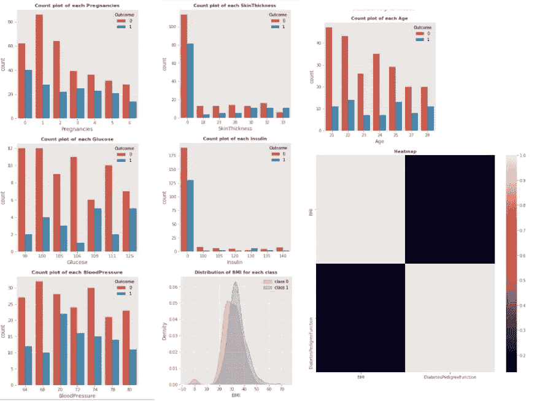
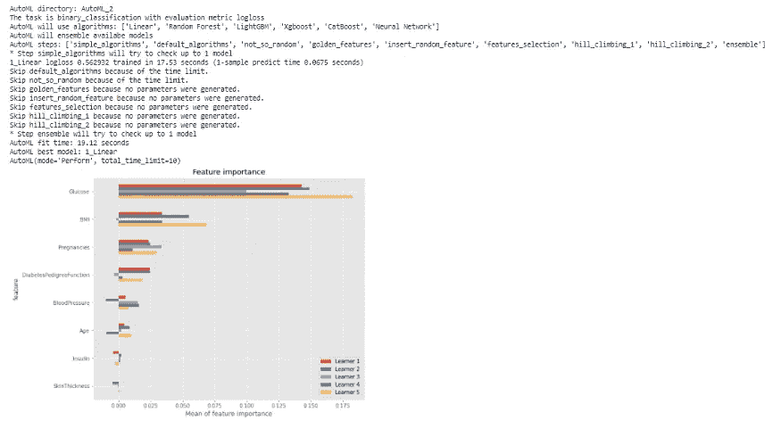

# 自动化 EDA 和机器学习

> 原文：<https://towardsdatascience.com/automating-eda-machine-learning-62724e8967a7>

## 使用 MLJAR-Supervised 自动化 EDA 机器学习模型并创建降价报告


来源:作者

探索性数据分析是理解我们正在处理的数据的重要步骤，它有助于我们识别数据中的任何隐藏模式、数据的不同列之间的相关性以及分析数据的属性。EDA 通常会占用项目总时间的 30%左右，因为我们需要编写大量代码来创建不同类型的可视化并对其进行分析。

Python 提供了 N 个库，这有助于自动化 EDA 过程，从而节省时间和精力，但是如何选择使用哪个库呢？选择一个库取决于我们试图解决什么类型的问题。

如果我们试图从头开始制作一个机器学习模型，我们可以使用 MLJAR-Supervised。它是一个开源的 python 库，具有不同的功能，即:

1.  自动化 EDA
2.  ML 模型选择和超参数调整。
3.  创建报告等。

在本文中，我们将探索 MLJAR-Supervised。让我们开始吧…

# 安装所需的库

我们将从使用 pip 安装一个 MLJAR 监督的库开始。下面给出的命令可以做到这一点。

```
!pip install mljar-supervised
```

# 导入所需的库

在这一步中，我们将导入加载数据集、对数据集执行 EDA 以及创建机器学习模型所需的库。

```
import pandas as pd 
from sklearn.datasets import load_digits
from sklearn.metrics import accuracy_score
from sklearn.model_selection import train_test_split
from supervised.automl import AutoML
from supervised.preprocessing.eda import EDA
```

# 正在加载数据集

在本文中，我们将使用著名的“糖尿病”数据集，可以从网上下载。我们将导入数据，并将其分为训练和测试数据。

```
df_train = pd.read_csv("/content/train.csv")
df_test = pd.read_csv("/content/test.csv")
X_train,y_train = df_train.drop(['Outcome'],axis=1),df_train['Outcome']
X_test,y_test = df_test.drop(['Outcome'],axis=1),df_test['Outcome']
```

# 执行 EDA

现在我们将在一行代码中执行 EDA。

```
EDA.extensive_eda(X_train,y_train,save_path="/content/mljar-supervised/")
```



EDA(来源:作者)

在这里，您可以清楚地看到不同类型的图和图形，您可以分析这些图和图形来查看数据模式。

# 创建机器学习模型

现在我们将使用 AutoML 创建 ML 模型。

```
a = AutoML(mode='Perform',total_time_limit=10)
a.fit(X_train,y_train)
```



来源:作者

在这里，您可以看到 AutoML 创建了 6 个不同的模型，并对它们进行了特性重要性分析。

这些模型可以根据我们的要求来使用，我们可以为我们的模型选择最佳的特征，因为我们已经有了特征重要性，所以 MLJAR 是一个完整的包，它可以通过分析数据和创建可视化来帮助您了解数据集是什么，然后它创建不同的模型并找到这些模型的特征重要性，所有这些都是在几行代码中完成的。

继续尝试不同的数据集，执行 EDA 并制作机器学习模型。如果您发现任何困难，请在回复部分告诉我。

# 在你走之前

***感谢*** *的阅读！如果你想与我取得联系，请随时通过 hmix13@gmail.com 联系我或我的* [***LinkedIn 个人资料***](http://www.linkedin.com/in/himanshusharmads) *。可以查看我的*[***Github***](https://github.com/hmix13)**简介针对不同的数据科学项目和包教程。还有，随意探索* [***我的简介***](https://medium.com/@hmix13) *，阅读我写过的与数据科学相关的不同文章。**