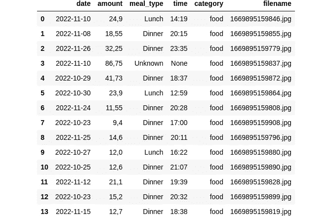
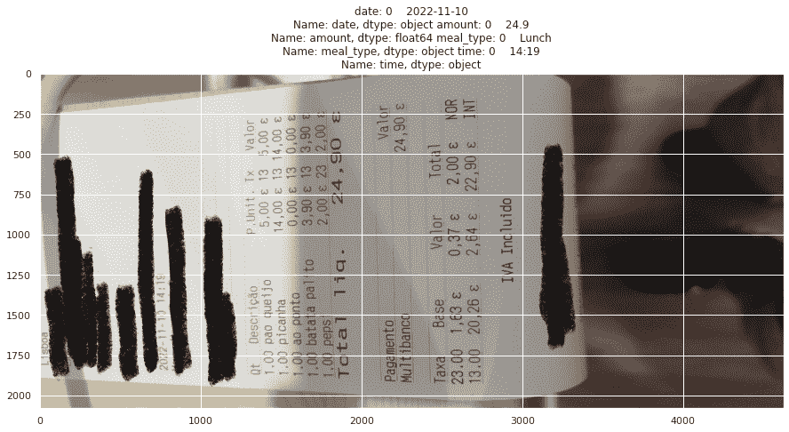
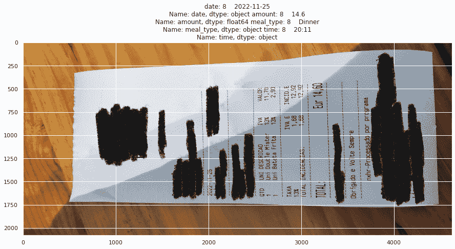

# 使用 Python 自动生成费用报告

> 原文：<https://towardsdatascience.com/automating-expense-reports-with-python-95c43a63980c>


[斯科特·格雷厄姆](https://unsplash.com/@homajob?utm_source=medium&utm_medium=referral)在 [Unsplash](https://unsplash.com?utm_source=medium&utm_medium=referral) 上拍照

## 使用 Python 和 mindee API 自动化费用报告

过去，员工必须手工提交费用报告，或者至少在电子表格上起草报告。然后，计算机出现了，内置的电子表格使得生成和跟踪报告变得更加容易。但是，如果您能够自动完成整个数据输入过程，以便根据收据图像生成费用报告，那会怎么样呢？

在本文中，我将向您展示使用 Python 自动化费用报告的步骤。

# 步伐

自动化费用报告的步骤如下:

1.  ***开户上*** [***被管理人***](https://platform.mindee.com/) ***平台***
2.  ***设置一个 API 键***
3.  ***安装“mindee”包***
4.  ***导入依赖关系***
5.  ***编写助手函数***
6.  ***从费用单据中加载、解析、提取数据***
7.  ***将结果导出到表中***
8.  ***保存表格到*** `***.csv***` ***文件***

我们开始吧！

## 1.在 [mindee](https://platform.mindee.com/) 平台上创建账户

对于这种自动化，为了避免编写自定义代码来检测收据图像中的文本， ***我们将使用一个名为*** `***mindee***`的 Python 包，它附带了一个 API，只需几行代码就可以完成所有这些工作。

虽然这个包的专业版是付费的， ***他们每月免费提供 250 页*** ，对于个人来说应该是绰绰有余，可以实现个人费用报告的自动化。

要创建帐户，请执行以下操作:

1.  前往`[mindee](https://platform.mindee.com/)` [平台网站](https://platform.mindee.com/)
2.  签约雇用

## 2.设置 API 密钥

要设置 API 密钥，请执行以下操作:

1.  点击“创建新的 API”
2.  选择“费用收据”API
3.  复制您的 API 密钥并保存它。

## 3.安装“mindee”软件包

要安装`mindee`包，请运行:

```
pip install mindee
```

## 4.导入依赖项

对于这个项目，我们将使用以下软件包:

*   `mindee`
*   `pandas`
*   `random`
*   `glob`
*   `matplotlib`
*   `seaborn`

如果您的本地环境中没有它们，请用`pip install <package>`安装它们。

现在我们可以导入我们的依赖项:

```
from mindee import Client, documents
import random
import pandas as pd
import glob
# Sanity Check using pandas and matplotlib
import matplotlib.pyplot as plt
import seaborn as sns
sns.set()
```

## 5.编写助手函数

为了实现这种自动化，我们需要 3 个助手函数:一个用于在从`mindee` API 获得响应后提取费用数据，另一个用于将时间转换为膳食类型(在本例中，我的费用报告需要明确说明膳食类型，如午餐或晚餐的食物费用)。最后，第三个函数用于创建包含所有数据的最终表。

代码将是:

作者写的。

```
# Output of the tests written above['13:51', '11:49', '22:13', '19:57', '10:32', '20:47', '20:40', '14:27', '14:41', '15:06']
13:51 Lunch
11:49 Lunch
22:13 Dinner
19:57 Dinner
10:32 Lunch
20:47 Dinner
20:40 Dinner
14:27 Lunch
14:41 Lunch
15:06 Lunch
```


最终表格的测试示例。图片由作者提供。

## 6.从费用收据中加载、解析和提取数据

现在，我们要做的就是:

1.  **使用我们获得的 API 密钥**实例化我们的 *mindee* 客户端

```
# Instantiate a new client
mindee_client = Client(api_key="Your API KEY")
```

**2。初始化一些包含提取数据的空列表**

```
date_list = []
amount_list = []
category_list = []
time_list = []
meal_type_list = []
filenames_list = []
```

**3。加载费用收据的图像，并将其馈送给 mindee API**

```
image = "./expense_images/1669895159779.jpg"
input_doc = mindee_client.doc_from_path(image)
api_response = input_doc.parse(documents.TypeReceiptV4)
expense_data = api_response.document
expense_data<mindee.documents.receipt.receipt_v4.ReceiptV4 at 0x7f9685b278b0>
```

输出将是一个为费用收据定制的 mindee 对象(可能有几个选项，所以可以在 mindee 平台的官方文档中随意研究)。

**4。从 API 响应中提取费用信息**

```
date, amount, filename, category, time = extract_expenses_data(expense_data)
```

**5。将时间信息转换成相关的餐饮类型信息**

这个例子对我来说是非常具体的，所以你可以根据你的费用类型来改变这个函数。但是在这里，我所做的是将一个类似于`13:30`的字符串转换成午餐，将一个类似于`20:30`的字符串转换成晚餐。

```
if not time:
        meal_type = "Unknown"
else:
    meal_type = convert_time_to_meal_type(time)
```

6。将提取的信息附加到相应的列表中

在这种情况下，我只对单个收据这样做，但是当对多个收据这样做时，列表方法将更有意义。

```
date_list.append(date)
# I am replacing the . for , here because the final report goes on
# a google sheet which takes `,` instead of `.` for float numbers.
amount_list.append(str(amount).replace(".", ","))
category_list.append(category)
time_list.append(time)
meal_type_list.append(meal_type)
filenames_list.append(filename)
```

## 7.将结果导出到表格

现在我们已经组织好了数据，我们可以用结构化数据创建一个表。

```
# The format of the table will be | data | amount | filename | category |
df = create_table(date_list,amount_list,meal_type_list, time_list,category_list, 
                  filenames_list)

# show the table to check
df
```


## 8.将表格保存到`.csv`文件

最后，我们保存了包含所有费用收据信息的表格。

```
df.to_csv("expense_table.csv", header=False)
```

# 将所有东西整合在一起

现在我们已经详细了解了每个步骤，在多张费用收据上运行该操作的完整源代码如下:

作者写的。



从费用收据中提取数据的最终表。图片由作者提供。

你有它！你自动完成了根据收据图像报告开支的枯燥任务！作为最终检查，最好看一下最终结果，以确保您获得的信息与费用收据中的实际数据一致。

为此， ***我们可以将收据与使用*** `***matplotlib***` ***提取的每张费用收据的文本数据并排可视化。***

作者写的。[源代码可以在这里](https://github.com/EnkrateiaLucca/automating_expense_reports_python)找到。



样本检查图像示例。图片由作者提供。



样本检查图像示例。图片由作者提供。

```
...
...
...
I am showing just a couple of images with restricted 
information for privacy reasons but the overall idea is here.
```

好的，结果似乎一致！我们有它，一个整洁的自动化来节省你每个月的时间！

# 关于自动化一切的最终想法

如果您是一名经理、开发人员、会计或几乎任何与某种数据输入相关的人，这种方法可能非常有用。本质上，它清楚地表明，只需几行 Python 代码就可以实现工作场所的自动化。

为什么不使用一个简单的程序来自动处理您的费用报告呢？自动化类似这样的重复性任务可以节省你相当多的时间，并且它打开了简化你的工作流程的大门。

如果你喜欢视频，请点击这里查看我的 Youtube 视频:

**如果你喜欢这个帖子，** [**加入 Medium**](https://lucas-soares.medium.com/membership)**[**订阅我的 youtube 频道**](https://www.youtube.com/channel/UCu8WF59Scx9f3H1N_FgZUwQ) **和** [**我的快讯**](https://lucas-soares.medium.com/subscribe) **:)。****

**这里有几个 ***提高工作效率必备物品*** 的链接:**

*   **[Bose 降噪耳机](https://amzn.to/3Wj0Zg5)**
*   **[罗技 MX Master 3 高级无线鼠标](https://amzn.to/3Dm432m)**
*   **[海盗船 K55 RGB 键盘](https://amzn.to/3Wpvfpx)**

> **这些是附属链接，如果你使用它们，我会得到一小笔佣金，干杯！:)**

# **参考**

*   **【https://platform.mindee.com/ **
*   **[https://www.python.org/](https://www.python.org/)**