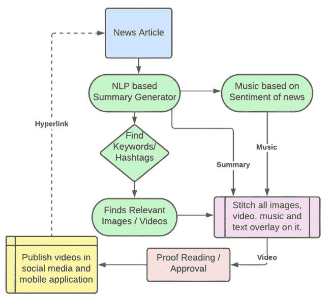

# 使用机器学习自动化视频创建过程

> 原文：<https://towardsdatascience.com/automating-the-process-of-video-creation-f416da4db362>

## *使用机器学习来总结新闻文章并创建短视频提要*

照片由[马克·克鲁兹](https://unsplash.com/@mark_crz?utm_source=medium&utm_medium=referral)在 [Unsplash](https://unsplash.com?utm_source=medium&utm_medium=referral) 上拍摄

随着 ***短格式视频*** 和高度 ***个性化内容*** 的消费上升，您是否想过根据自己的喜好定制新闻视频源？这种视频源将帮助我们避免我们经常从多个来源消费的冗余新闻和无关内容。

在这篇博客中，让我们尝试**自动化视频创作过程**。在这个过程中，为了简单起见，我们将使用现成的预训练模型(尽管微调这些模型会提高性能)。

首先，让我们选择一个要制作视频的文本源。

这里有一篇摘自 bbc.com 的文章，谈论新当选的澳大利亚总理及其背景。

 [## 澳大利亚大选:安东尼·艾博年领导工党赢得澳大利亚大选

### 安东尼·艾博年在领导工党首次选举后将成为澳大利亚下一任总理…

www.bbc.com](https://www.bbc.com/news/world-australia-61267489) 

**工艺流程:**

工艺流程

**第一步:**

既然我们试图将一篇文章制作成一个短视频，那么**总结**这篇文章并从中获取重要信息是非常必要的。

导入库

我们将使用 hugginface 的管道来总结文章。

**第二步**

我们的下一个目标是为摘要中的每一句话找到一个**关键词**，并基于该关键词得到一个相关的图片/视频。我们将使用 KEYBERT 来查找句子中的关键字。KEYBERT 在后台使用 BERT 来提取句子的关键字。

**第三步**

现在，我们已经为摘要中的每一句话找到了一个关键词，让我们为这些关键词找到一个**相关图片**。

由于我们没有一个大型的图像数据库，我们将使用谷歌的图像搜索来为关键词找到一个合适的图像。

幸运的是，有人已经在这方面做了工作，我们将使用他们的回购来下载图像。

**第 4 步**

我们可以在这些图像上叠加摘要文本，最后将它们一帧一帧地拼接在一起，形成一个视频。

将文本覆盖在每个框架上

最后，将每一帧拼接在一起

**输出视频:**

 [## 演示视频

### 编辑描述

youtube.com](https://youtube.com/shorts/gUG4sneHKwY?feature=share) 

考虑到我们没有微调我们的模型来寻找关键词和从新闻数据集中提取摘要，视频的输出相当不错。

**最终代码:**

**Github**链接:

 [## GitHub-pawanreddy-u/video creation:视频创作过程的自动化

### 此时您不能执行该操作。您已使用另一个标签页或窗口登录。您已在另一个选项卡中注销，或者…

github.com](https://github.com/pawanreddy-u/videocreation) 

我希望这个博客对你有所帮助。敬请关注机器学习和数据科学领域更多有趣的博客。