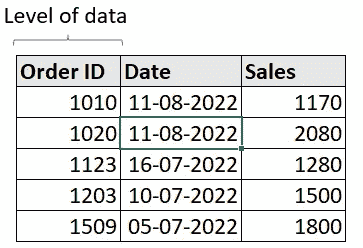
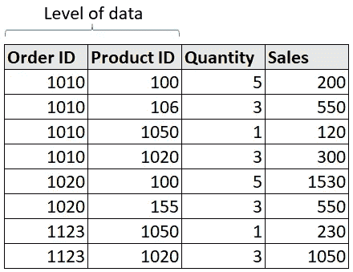
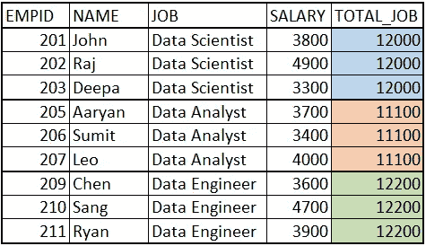

# 作为数据科学家/分析师，不要重复这 5 个编程错误

> 原文：<https://towardsdatascience.com/avoid-these-5-programming-mistakes-as-a-data-scientist-analyst-4b7017d509fe>

## 提高数据科学家工作效率的步骤


图片来源:Unsplash

在我目前作为数据科学经理的角色中，我与多位数据科学家合作，我看到他们中的许多人在处理大数据时犯了一些基本的数据操作错误(我也曾经犯过一些这样的错误！).这些错误会导致代码执行时间的急剧增加，有时还会导致大量的返工和浪费。

在这篇博文中，我将讨论如果你想成为一名更好(更高效)的数据科学家，你应该避免的 5 大编程错误。

# **处理大数据时应避免的 5 大错误:**

## **1。在不知道数据级别/主键的情况下连接数据集**

数据级别被定义为每行具有唯一值的列或列的组合。数据的级别通常由一些 ID 变量定义(比如客户 ID)。让我们用例子来理解这一点:

*一、单列为级:*在下面的数据集中，Order ID 列没有两行具有相同的值，所以 Order ID 是该数据集的数据(主键)级。



数据集 1(作者提供的图片)

> 连续列(如 Sales)不能定义为数据级别。

*二。作为级别*的多列:在下面的数据集中，我们可以看到订单 ID 对于多行是相同的，因此它不是该数据集的级别。如果我们仔细观察，我们会发现没有两行的订单 ID 和产品 ID 组合具有相同的值，因此这两列都是该数据集的数据级别(主键)。



数据集 2(图片由作者提供)

在执行连接时，理解数据的级别变得非常重要，因为连接主要是在数据集的主键上执行的。

> 在非主键上连接数据集可能会导致错误的结果。

## **2。不过滤所需的行**

有时，数据科学家不会在查询开始时筛选所需的行，而是等到最后一次查询时才筛选这些行。处理大数据是一种犯罪，因为它会大大增加执行时间，尤其是在应用连接等复杂操作时。

***不好的做法***

```
Step 1: Transform data 
Step 2: Apply join operation
Step 3: More transformation 
**Step 4: Filter rows**
```

***好的做法***

```
**Step 1: Filter row** Step 2: Transform data 
Step 3: Apply join operation
Step 4: More transformation
```

## **3。使用大量连接/自连接**

自连接就像一把双刃剑，如果你恰当地使用它们，它们可能是一件好事，但是如果你过于频繁地使用它们，它就是一个祸根，因为在 Hadoop、Hive、Spark 等分布式环境中，连接是最昂贵的任务。

假设我们有一个组织内员工的工资数据。


我们希望添加一个列，其中包含与当前行相对应的工作角色(数据科学家、数据分析师、数据工程师)中所有员工的总工资。我们希望输出如下所示:



你会使用自连接得到上面的输出吗？是不是最优的方式？

不，自连接不是获得该输出的最佳解决方案，相反，我们应该使用窗口函数来获得所需的结果(如下所示)。

***不好练***

```
## Using Joins 
select a.EMPID, a.NAME, a.JOB, b.TOTAL_JOB
FROM employee_table a 
INNER JOIN
(select EMPID, NAME, sum(SALARY) as TOTAL_JOB
FROM employee_table
GROUP BY EMPID, NAME) b
on a.EMPID = b.EMPID
and a.NAME = b.NAME
```

***善练***

```
## Using the window function 
select EMPID, NAME, JOB, SALARY, 
**sum(SALARY) over() as TOTAL** FROM
employee_table
```

</fundato-sql-window-functions-part-1-ab61df519973>  

## 4.没有过滤所需的列

在处理具有数百万行的大型数据集时，数据集中的列数超过所需的数量可能会导致运行时间增加。因此，建议在读取数据集时只选择所需的列。

***不好的做法***

```
### Selecting all the columns #######
select a.*, b.* 
from 
member_data as a
join 
claims_data as b
on a.member_id = b.member_id
```

***好的做法***

```
### Selecting the required columns 
select a.member_id, a.age,
a.address, b.claim_id
from 
member_data as a
join 
claims_data as b
on a.member_id = b.member_id
```

## 5.每次查询后不进行质量检查

质量检查对于及时发现错误并确保我们交付正确的输出非常重要。很多时候，我们跳过这一步，在分析的后期发现最终结果不正确，因此我们必须进行大量的回溯来找到错误的根源，然后重新运行我们的查询。这导致分析的周转时间急剧增加。

为了避免上述问题，我们可以按照以下简单步骤对数据集执行质量检查:

1.  **统计**一个查询的**输入行/列**和**输出行/列**的数量，并确保得到预期的行/列数量。
2.  **检查汇总统计数据**(独特值、百分位数等。)在被操纵的柱子上。这将确保您在列中获得预期的值。
3.  **检查数据集的前几行**。这就像检查行的样本来推断数据集的正确性。

在注释中分享您在处理数据时执行的质量检查步骤。

# 摘要

我们研究了一些常见错误，这些错误通过增加分析的周转时间降低了数据科学家的工作效率。

我们可以通过了解我们的数据(数据级别)、只处理所需的行和列的子集、不使用额外的连接以及对我们的查询执行质量检查来克服这些错误。

## 谢谢你

我希望这个故事对你有用。你可以在收件箱里看到我所有的帖子。 [***在这里做那个*** *！*](https://anmol3015.medium.com/subscribe)

*如果你自己喜欢体验媒介，可以考虑通过* [***注册会员***](https://anmol3015.medium.com/membership) *来支持我和其他几千名作家。它每个月只需要 5 美元，它极大地支持了我们，作家，你可以在媒体上看到所有精彩的故事。*

## 你可能喜欢的故事！

</sql-coding-best-practices-for-writing-clean-code-a1eca1cccb93> 