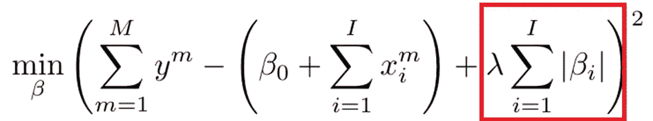
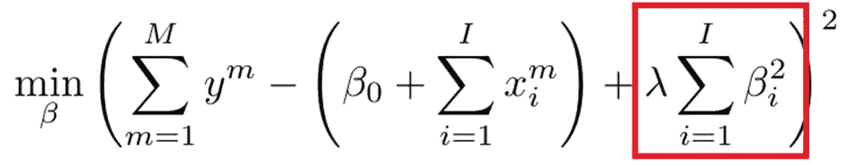

# 使用套索和脊回归时避免这个陷阱

> 原文：<https://towardsdatascience.com/avoid-this-pitfall-when-using-lasso-and-ridge-regression-f4f4948bfe70>

## **您的监管处罚可能针对错误的变量**

马库斯·斯皮斯克在 [Unsplash](https://unsplash.com?utm_source=medium&utm_medium=referral) 上拍摄的照片

在线性回归中，套索和岭正则化通常用于克服过度拟合并生成更健壮的模型。然而，当应用于不正确缩放的变量时，结果可能是灾难性的。

# **基本线性模型**

假设我们有一个非常简单的线性模型，我们根据婚姻状况 `x_1 ∈ {0,1}` (1 表示已婚)和年薪`x_2 ∈ R^+`(实数非负数)来预测预期寿命 y。该模型如下所示:

`y=β_0+β_1x_1+β_2x_2+ϵ`

> 如果不熟悉术语:`y`为结果/自变量，`β_0`为常数，`*β_i x_i*` 代表加权解释/因变量，`ϵ`为误差项/随机噪声。

我们如何表达工资`x_2`？如果我们愿意，我们可以用美元($)，数千美元($k)，甚至美分($c)来表示。这里没有固有的对错。

虽然因变量的单位是用户确定的，但它对结果并不重要。如果我们决定将`x_2`从$改为$k，我们只需将`β_2` 乘以 1000 以保持相同的结果`y`。类似地，如果我们使用美分，我们将`β_2`除以 100 以保留结果。

目前为止路上没有颠簸，但让我们继续前进。

# **引入套索和脊**

线性回归有许多问题，例如过度拟合。过度拟合意味着模型在训练集上表现良好，但在样本外数据上表现不佳。过度拟合的模型倾向于**使变量适应噪声**，而不是识别真实的数据模式。

更准确地说，我们处理一个**偏差-方差权衡**，高偏差意味着我们没有捕捉到相关的模式，高方差意味着我们适合不存在的模式。所谓的**规则化技术**有助于平衡偏差和方差，套索和脊调节是最常用的技术。

有关**套索和脊正规化**的更深入讨论，请查看以下文章:

 [## 用脊线、套索和橡皮筋来调整你的回归模型

### 什么是正则化技术，我们为什么要使用它们？提供了一个 Python sklearn 示例。

towardsdatascience.com](/regulate-your-regression-model-with-ridge-lasso-and-elasticnet-92735e192e34) 

来对抗过度拟合。LASSO 将以下惩罚(用红色标记)添加到基本回归程序中:

套索正则化对绝对`β`值施加惩罚，导致许多权重被设置为 0。

由于绝对值`β`被罚，LASSO 倾向于**将许多权重设置为 0** 。这个过程剔除了不太相关的变量，只保留了最显著的变量。

岭正则化对`β`应用平方惩罚:

岭正则化对平方的`β`值进行惩罚，从而产生相对较小(但非零)的权重。

由于平方 a `β<1`会降低其值(即 0.0⁵ =0.0023)，岭回归倾向于在`β`值中更均匀地分配权重，而不是将它们完全设置为 0。这将导致更可靠的预测。

# **问题**

LASSO 和 ridge 看起来是明智的技术，但它们只考虑了`β`的值，而忽略了相应的变量`x`。如果我们有以美分为单位的工资，LASSO 可能会认为相应的贝塔系数很小，无足轻重，而以美元为单位的工资会产生一个大 100，000 倍的`β`！显然，**选择的单位对行为有巨大的影响**。在一种情况下，变量似乎高度相关，在另一种情况下，它似乎可以忽略不计，尽管`β_i⋅x_i`在两种情况下产生相同的结果。

当应用套索或山脊时，我们惩罚大的`β`值。由于数值变量的单位通常是任意的，因此**正则化的影响可能很大**。因此，如果没有适当的变换，套索和山脊就不应该被应用。

# **解决方案**

那么，发现问题后，我们能做些什么来解决它呢？通常情况下，没有放之四海而皆准的解决方案，但是有相当标准的解决方案。

机器学习中的一个常见解决方案是将输入重新调整到[0，1]范围。为此，我们可以简单地将所有数据除以数据集中的最大值。如果数据分布合理，这种方法会非常有效。

然而，假设数据集中的一个幸运儿每年赚 2000 万美元。作为最高值，该条目将被设置为等于 1($ 2000 万/$ 2000 万)。对于其他人，我们可能得到非常低的`x`值，例如，60$k/$20m=0.003。一个孤立点就能完全破坏这种规模。

在处理这种分布时，通常会执行对数转换。在这种情况下，我们将得到 log(20m)=7.30103 和 log(60k)=4.30103。仍然有很大的差别，但远不如以前那么大。变量现在将分别缩放到 1 和 0.59，与`β`相乘具有更全面的影响。

可以说，最合理的解决方案是转换变量，使所有`x_i` 的期望值等于 1(或其他常数)。请注意，这也意味着我们将重新调整虚拟变量(其平均值为`0 ≤ E(x_i) ≤ 1`)。如有必要，可以将围绕相同平均值的中心值与对数变换相结合。

一旦每个变量都有相同的均值，我们就有了直接可比的`β`值。经过这种转换后，LASSO 和 Ridge 将针对正确的变量，不再受到美分和美元的任意设置的阻碍。

# **外卖**

*   在回归模型中，**变量单位**决定了相应`β`值的大小。为了保持因变量`x`和自变量`y`之间的关系不变，`β`的值随着`x`单位的增大而减小，反之亦然。
*   在线性回归中，**选择的变量单位**通常影响有限，因为`β`的大小抵消了选择的单位。术语`β⋅ x`的结果保持不变，对输出`y`的贡献相等。
*   线性回归模型往往容易**过拟合**。正则化技术如 LASSO 和 Ridge 引入了减轻这个问题的惩罚。
*   由于**套索和脊**惩罚`β`值，变量`x`的选择单位高度相关。大`x`收益小`β`收益小，反之亦然，因此单位直接影响惩罚机制。影响可能相当大。
*   最合适的解决方案是将所有的`x`变量换算成**相同的预期平均值**(如果在对数变换后需要的话)，这样所有的`β`都是相同的量级，可以直接比较。在这种情况下，套索和山脊惩罚适当。

*对更高级的回归技术感兴趣？你可能也会喜欢这篇关于多项式回归的文章:*

 [## 多项式回归——神经网络的替代方案？

### 讨论多项式和神经网络，理论上都能够近似连续函数…

towardsdatascience.com](/polynomial-regression-an-alternative-for-neural-networks-c4bd30fa6cf6)