# AWS 雅典娜+ DBT 集成

> 原文：<https://towardsdatascience.com/aws-athena-dbt-integration-4e1dce0d97fc>

## 在 15 分钟或更短时间内


艾蒂安·吉拉尔代在 [Unsplash](https://unsplash.com?utm_source=medium&utm_medium=referral) 上拍摄的照片

# 语境

[AWS Athena](https://aws.amazon.com/athena/?whats-new-cards.sort-by=item.additionalFields.postDateTime&whats-new-cards.sort-order=desc) 是无服务器的，用于对 AWS S3 上的数据进行专门的 SQL 查询。然而，维护数据沿袭和依赖是乏味且容易出错的(尽管在数据仓库中没有区别)。

[DBT(数据构建工具)](https://www.getdbt.com/)最近变得非常流行，因为它可以自动绘制数据谱系/生成数据管道的文档，更不用说它的其他功能，如快照、Jinja &宏支持。

有很多关于将 DBT 与数据仓库(Snowflake、Redshift、Databrick 等)集成的参考资料，但没有 Athena(是的，它不是数据仓库)。然而，有许多使用案例和团队使用 Athena 来生成 BI 报告等:

*   该报告有 20 多个从各种 AWS DataCatalog 数据库和表中生成的视图。
*   数据沿袭对于理解业务逻辑非常重要，并且经常变化。
*   Athena 的计算性能令人满意。
*   缺乏实施/维护数据仓库的资源/预算。

我们有没有可能将 DBT 与雅典娜集成，以提供一个负担得起的解决方案？

# **解决方案**

感谢 [dbt-athena](https://github.com/Tomme/dbt-athena) 社区构建了一个 dbt 雅典娜适配器，我用它构建了一个演示来验证集成是如何工作的。所有 AWS 基础设施资源由 **Terraform 管理，并在我的 GitHub** repo 中提供，因此您可以在 15 分钟(甚至更短)内构建相同的 E2E 演示，用于 POC(概念验证)、内部演示或自学目的。

## 原始数据

女装电商服装点评点评数据(CC0:公有领域许可)使用，数据统计汇总详情可在 Kaggle 网站查询。

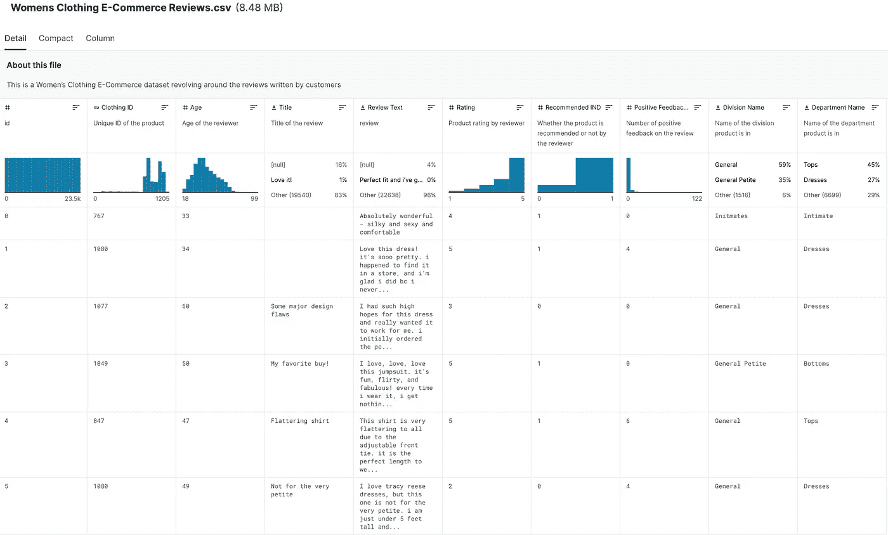

作者图片

简而言之，这些数据包含客户对产品的评论和相应的产品评级。一个典型的用例是在适当的特征工程(数据转换)之后使用这些数据来做情感分析。

## 数据流

在这个演示中，原始数据存储在 S3，使用 Glue 服务提取其模式，供雅典娜查询，然后由 DBT 转换。

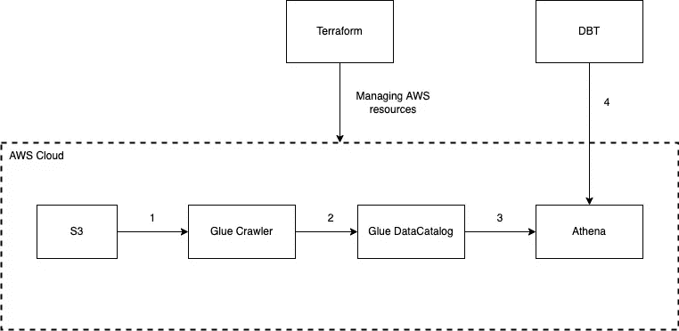

作者图片

1.  手动触发 Glue crawler 来推断数据架构并更新 DataCatalog 以粘合 DataCatalog。
2.  粘附数据目录创建对数据(S3 到表)映射的引用，不移动任何数据。
3.  使用 SQL 在 S3 查询数据，在粘合数据目录中查找架构，没有要加载的数据。
4.  DBT 将软件工程方法应用于数据转换(SQL)。

预计读者将对 [Terraform](https://www.terraform.io/) 、 [AWS](https://aws.amazon.com/?nc2=h_lg) 和 [DBT](https://www.getdbt.com/) 有一些基本的了解，否则这也是一个很好的迷你项目，让读者了解这些服务。

# 履行

## 地形部分

*   [安装地形](https://learn.hashicorp.com/tutorials/terraform/install-cli)
*   git 克隆[https://github.com/grhaonan/Athena-dbt-demo-tf-local](https://github.com/grhaonan/Athena-dbt-demo-tf-local)
*   确保设置了正确的 AWS 用户和权限。为了简单起见，我的 AWS 用户只附带了一个 AdministratorAccess 策略。
*   Terraform main.tf 中的配置文件名应该与用户配置文件相匹配，用户配置文件用于调用 AWS 服务，在“~”中定义。/aws/credentials”。

作者图片

作者图片

注意事项:

*   该区域默认设置为“ap-southeast-2 ”,可以在 variables.tf 中随意更新
*   一些 AWS 资源(s3 bucket 等)需要全局唯一，在 Terraform 中使用随机 id 生成器来确保不同用户之间的唯一性。你会在这篇文章中看到几个{16 位 id}约定，指的是一个随机 id。

运行“terraform init”命令启动项目。

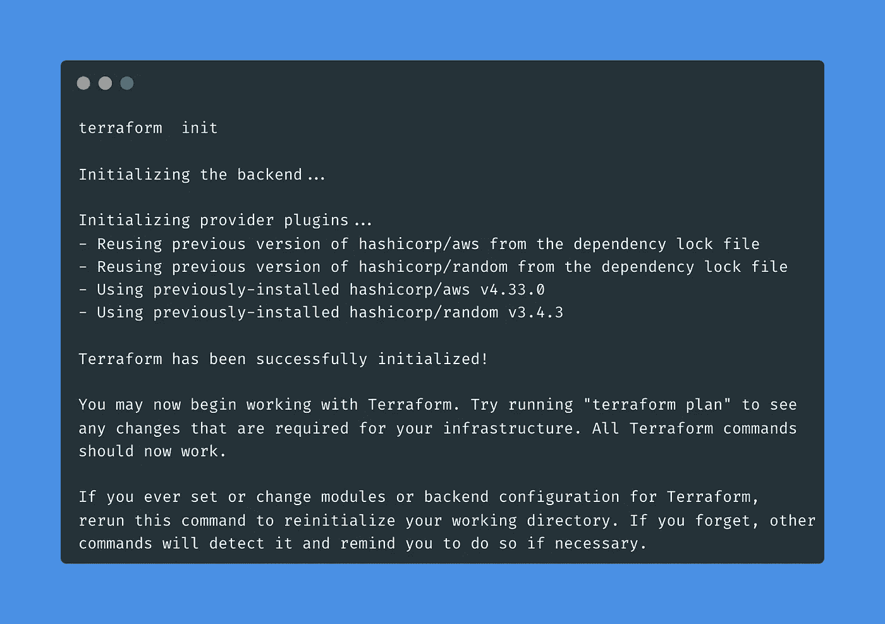

作者图片

运行“terraform apply”命令以应用所有 AWS 资源

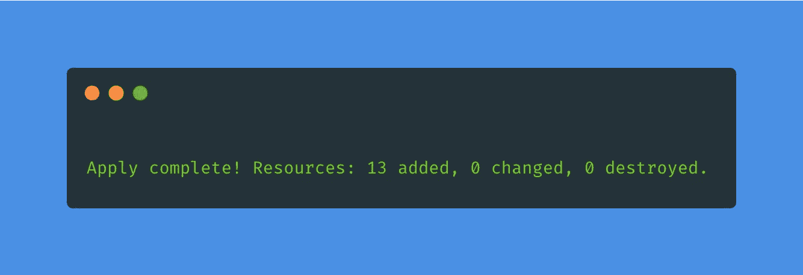

作者图片

**在 AWS web 控制台上手动触发/运行**爬虫作业(根据本演示命名为“athena_dbt_demo_crawler ”,在 terraform 中配置)。

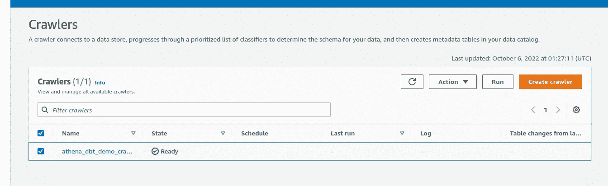

作者图片

完成后，您将在 Athena 中的数据库 raw_data_{16 random id}下找到表格“women _ ways _ reviews _ raw _ data”(**注** : **请** **选择 athena-dbt-demo-workgroup，而不是主**)。现在，这些原始数据已经可以进行查询了。

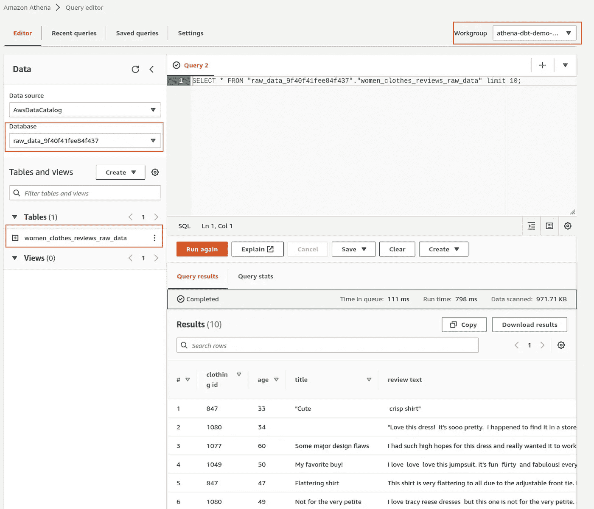

作者图片

您还会在 S3 的以下存储桶下看到源原始数据:Athena-dbt-demo-{ 16 random id }/raw _ data/women _ clothing _ ecommerce _ reviews . CSV。此文件会在 Terraform 应用阶段自动上传到 S3。

## DBT 部分

*   Git 克隆[https://github.com/grhaonan/Athena-dbt-demo-dbt-local](https://github.com/grhaonan/Athena-dbt-demo-dbt-local)
*   安装 dbt-athena 适配器。注意:在撰写本文时(dbt-core 的最新版本是 1.2.2，dbt-athena-adapter 是 1.0.1)，1.0.1 Athena 适配器存在一个问题。所以如果你通过[https://github.com/Tomme/dbt-athena](https://github.com/Tomme/dbt-athena)中提到的`pip install dbt-athena-adapter`直接安装它，你会遇到以下问题。

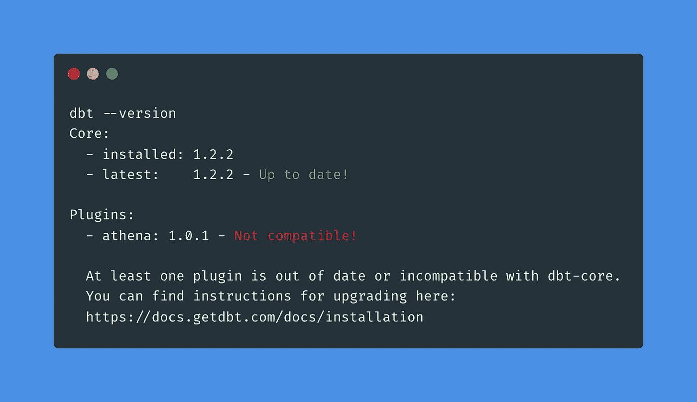

作者图片

*   相反，我会建议通过一个干净的虚拟环境(通过康达等)安装它。**注意**:requirements . txt 在“Athena-dbt-demo-dbt-demo”文件夹下

作者图片

完成后，检查版本，现在我们可以开始了！

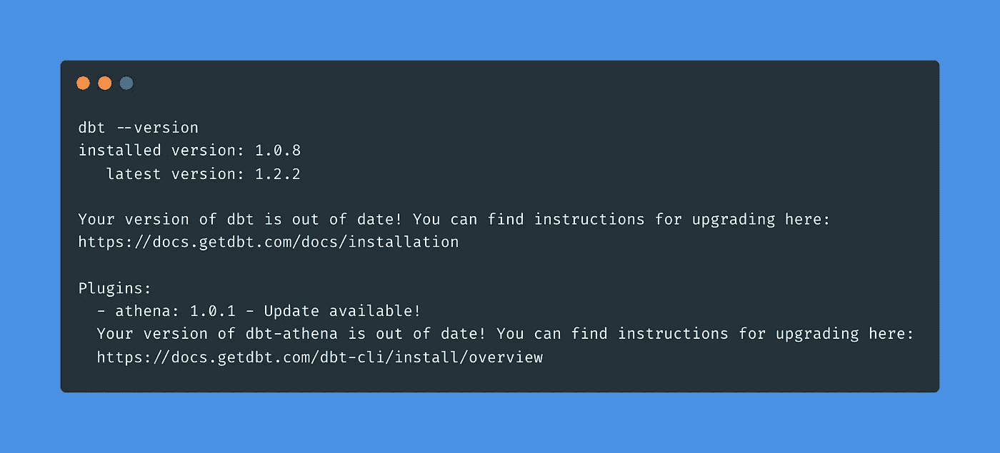

作者图片

如果您的 DBT 个人资料不存在，请创建它(~/)。或者将此项目添加到您现有的 DBT 个人资料中

作者图片

**注**:

您应该只更新上面文件中的以下三个值**以匹配您的情况，但保持其他值(根据匹配的地形配置)不变。**

*   aws_profile_name:与 terraform main.tf 中配置的 aws 概要文件名和本地 AWS 概要文件名相同。
*   s3_staging_dir:这是为存储 Athena 查询结果而创建的 s3 存储桶，在您的 s3 存储桶中命名为“Athena-dbt-demo-Athena-query-result-bucket-{ 16 random id }”。
*   架构:这是配置为导出 DBT 模型结果的数据库，它应该与 athena_dbt_models_{16 位 id}匹配

最后，更新 models/VW _ women _ ways _ reviews _ rename _ columns . SQL 中引用的数据库，以匹配创建的 raw_data_{16 位数 id}。

```
...
FROM "RAW_DATA_9f40f41fee84f437"."WOMEN_CLOTHES_REVIEWS_RAW_DATA"
```

# 关于数据转换

在 DBT，我们在原始数据上实现了三个转换(/模型)。

*   (视图)VW _ women _ ways _ reviews _ rename _ columns 进行第一次转换:选择需要的列并重命名它们

作者图片

*   (查看)VW _ women _ ways _ reviews _ perspectives 将根据预定义的 start_rating 列规则创建情感评分。

作者图片

*   (查看)VW _ women _ ways _ reviews _ training _ data 会进行一些最终的过滤，作为转换后的结果。

作者图片

# DBT 跑步

最后，运行命令“dbt run”将编译上面定义的所有三个模型，并将结果放在 AwsDataCatalog 数据库“athena_dbt_models_{16 random id}”下，您也可以在 athena 中找到它。

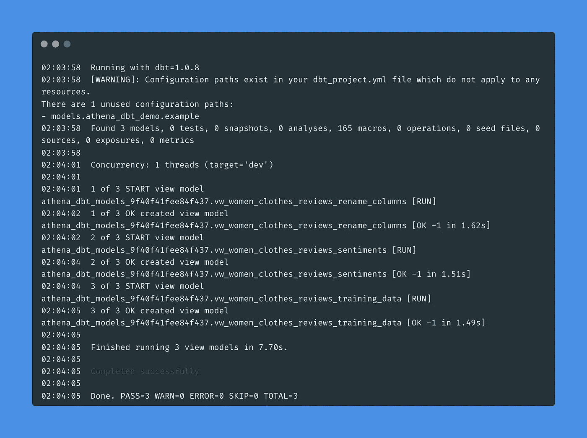

作者图片

DBT 的一个关键特性是提供数据血统和文档。

*   运行命令“dbt 文档生成”将生成文档
*   然后通过命令“dbt docs serve-port 8001”(它是 port 前面的两个连字符)设置一个本地 web 服务器来可视化文档。

数据沿袭:

*   women _ clothing _ reviews _ training _ data 依赖于 VW _ women _ clothing _ reviews _ opinions，后者进一步基于 VW _ women _ clothing _ reviews _ rename _ columns。

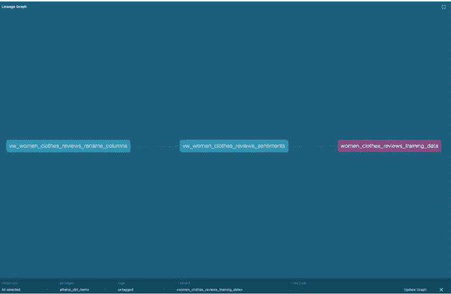

作者图片

数据文档:

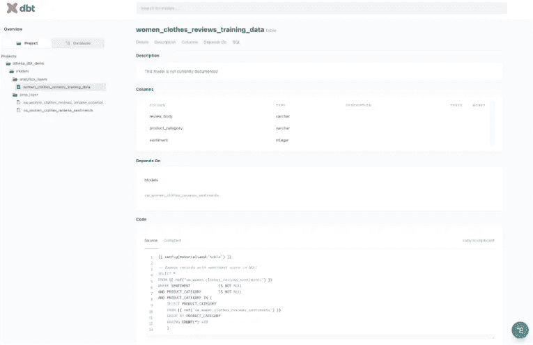

作者图片

# 摘要

感谢您的关注，希望您喜欢。尽管 Athena 通常用于特定的查询目的，但它仍然可以以较低的成本受益于 DBT 集成。

让我们快速回顾一下这篇文章:

*   产品评论数据在 S3 加载，并通过 AWS Glue 服务“连接”到 SQL 查询服务 Athena。
*   本演示中的所有 AWS 资源都由 Terraform (IaC)管理，因此用户可以在几秒钟内部署/销毁它们。
*   dbt-athena 是一个社区维护的 dbt 适配器，用于集成 DBT 和 athena。
*   基于 Athena 的 BI 报告将从 DBT 的数据传承和文档特性中受益匪浅。

[1] *女装电商服装点评*[https://www . ka ggle . com/datasets/nica potato/Women-ecommerce-Clothing-Reviews？资源=下载](https://www.kaggle.com/datasets/nicapotato/womens-ecommerce-clothing-reviews?resource=download)

[2] *CC0:公共领域许可*[https://creativecommons.org/publicdomain/zero/1.0/](https://creativecommons.org/publicdomain/zero/1.0/)