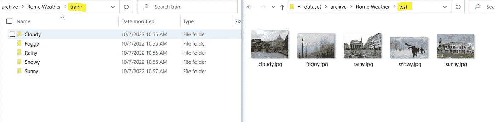
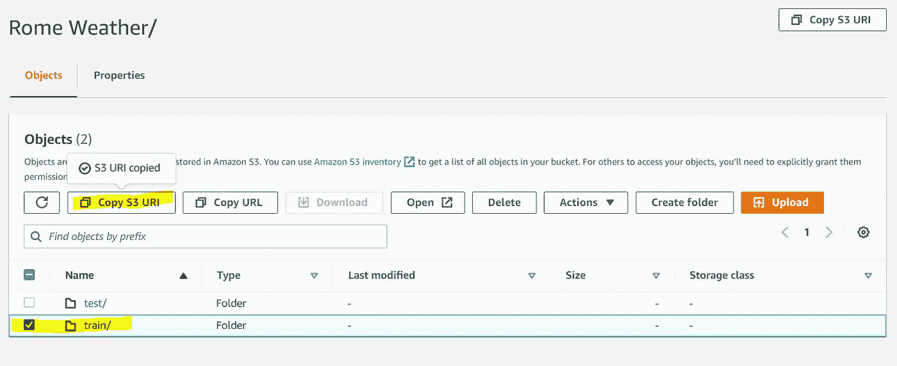
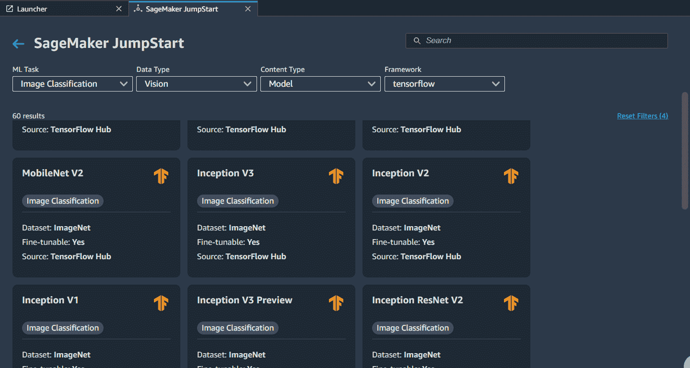
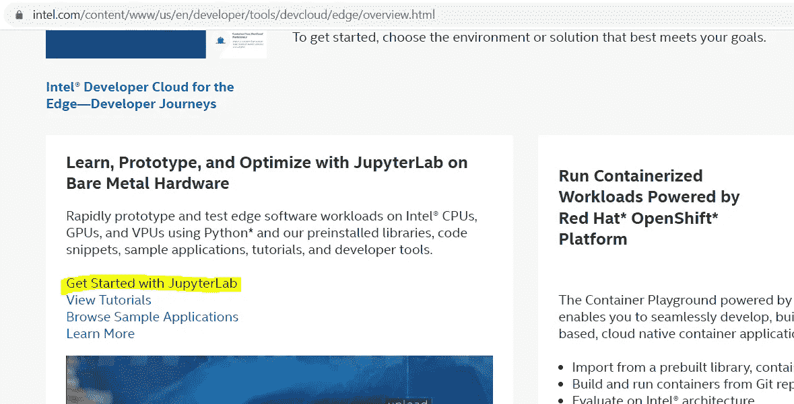
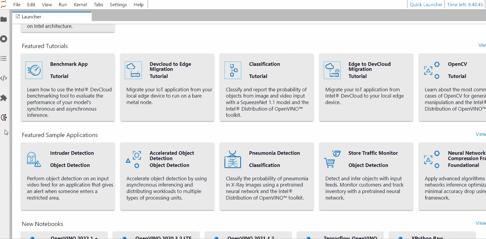
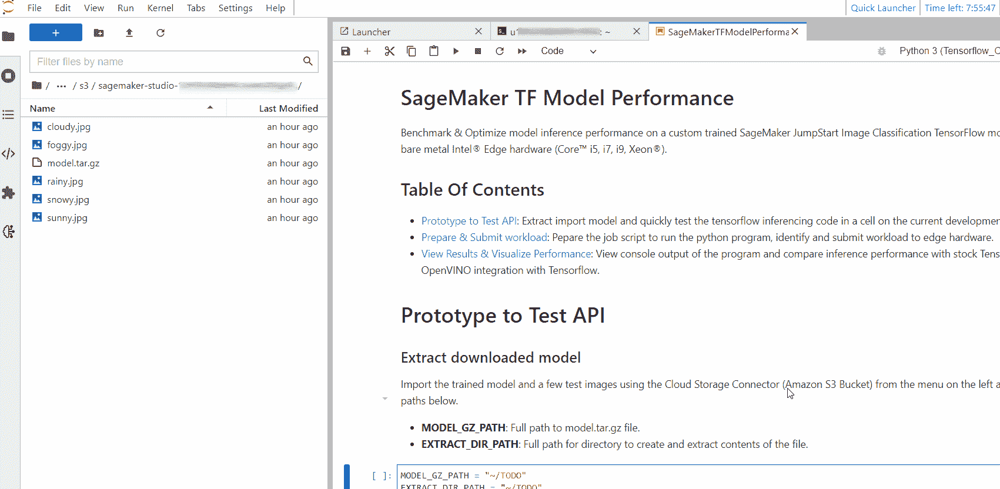
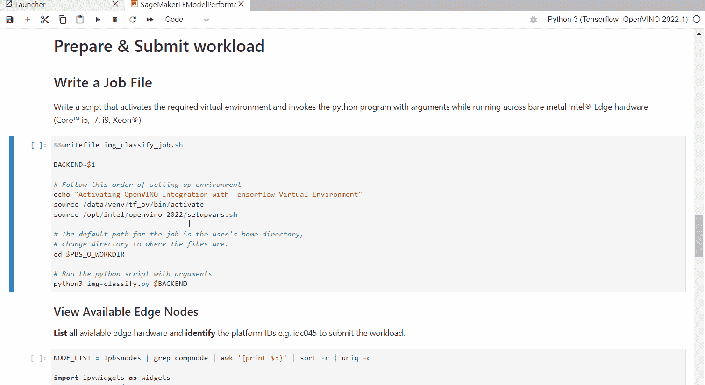
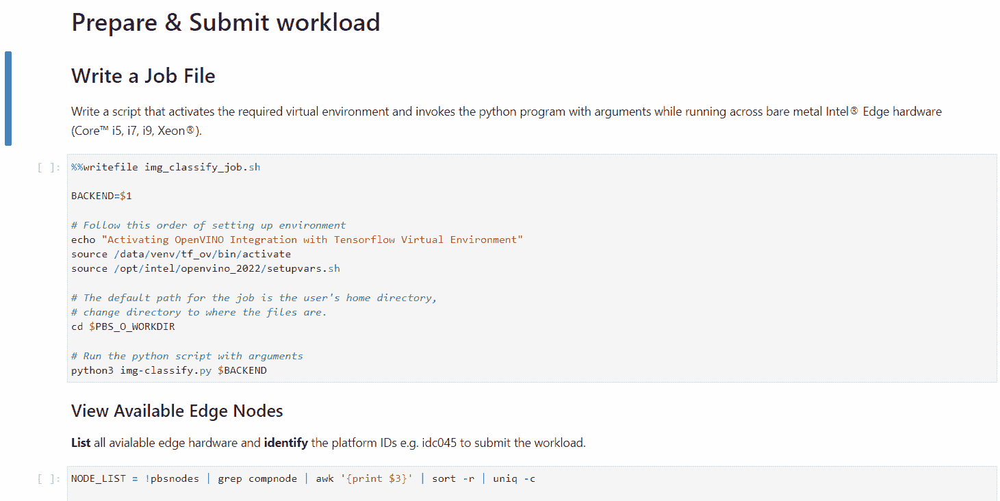
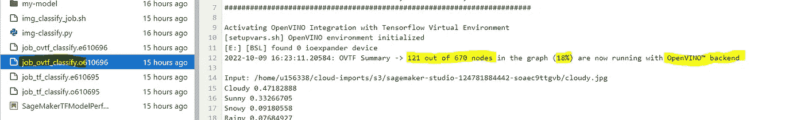

# AWS 云到边缘人工智能工作流

> 原文：<https://towardsdatascience.com/aws-cloud-to-edge-ai-workflow-1861722cc4f6>

## AWS 云培训/边缘硬件测试/免费和零本地设置

## 在亚马逊 AWS Sagemaker 上训练 TensorFlow 模型，在任何英特尔处理器上测试延迟，并免费使用两行 python 代码提升人工智能推理性能


根据 Ojas Sawant 的许可，通过 Storyblocks 提供图像

典型的人工智能工作流程包括定义具体的用例、准备数据集、训练模型、将推理组件集成到应用程序中，以及选择合适的硬件部署到生产中。

> 虽然有大量的云服务可以简化培训，但在进行任何实际投资之前，在确定合适的生产部署硬件以及神经网络模型以产生符合预算和用例的最佳应用性能方面存在**差距** **。**

在本文中，我们将带着一些 **python** 代码和**可视化** **示例**走过云培训到边缘推理应用程序开发阶段，您可以跟随并适应您的用例。

我们将经历以下端到端的工作流程:

1.  **训练一个模型**:利用 **AWS Sagemaker** (自由层)训练一个 TensorFlow 模型——以从 Kaggle 获得的[罗马天气图像分类数据集](https://www.kaggle.com/datasets/rogeriovaz/rome-weather-classification)为例。
2.  **导入模型&测试数据:**从 S3 桶中导入训练好的模型和测试数据，以预览和使用简单的 python 程序，该程序在**英特尔开发人员云上为 Edge** 分析图像(免费)。
3.  **基准&优化推理:**通过 OpenVINO 与 TensorFlow (python)的集成提升推理性能，并在多个硬件上与股票 TensorFlow 进行性能比较。

…全部在我们的浏览器中完成，无需任何本地设置。在这一过程中，我们将简要讨论指针，以使相同的流适用于其他用例，例如其他张量流实例分割或对象检测模型。

# 1.用 AWS Sagemaker 训练模型

对于图像分类任务，SageMaker 要求我们的训练数据采用以下结构:

*{父目录}*/*{类名目录}*/*{图片}*

我们将使用一个小的(250 个微小的图像— 2MB)数据集来分类—罗马的*多云、* *下雨、*下雪、*晴朗、*多雾天气。Kaggle 上的数据浏览器选项是在下载前预览数据集内容的好方法。

> 数据集格式因任务而异，例如，对象检测需要 JSON 注释文件。使用每个任务的默认数据集作为示例来准备数据集，或者使用 SageMaker Studio 中模型的 train 部分中的**了解更多**链接。

在本地下载并提取[数据集](https://www.kaggle.com/datasets/rogeriovaz/rome-weather-classification)。然后，我们将移动**训练目录**中的类，并在**测试目录**中剪切-粘贴-重命名每个类的 1 个图像，以便稍后在我们训练好的模型上快速测试推理。



从每个课程中下载并提取 1 张图片进行测试|图片由作者提供

导航到您的 S3 存储桶并**上传**父**罗马天气**目录，以确保文件夹结构被保留并可用于图像分类训练。最后，在下一步配置培训时，导航并选择**复制 S3 URI** 进入培训目录。

> 如果您没有 SageMaker 帐户，请在此注册一个自由层帐户[并创建一个 s3 bucket 来使用。](https://aws.amazon.com/sagemaker/pricing/)



导航并选择— **培训时复制 S3·URI**以供参考|作者图片

启动我们的 SageMaker Studio 实例，并导航到 JumpStart 菜单选择一个**可微调 TensorFlow** 图像分类模型。

> 使用 Train 部分从 bucket 和 output 目录指向我们的父训练数据集目录。您还可以进一步配置超参数。对于**自由层**，选择部署配置中的 **ml.m5.xlarge** 实例进行训练。



选择型号，配置并开始培训|按作者分类的图像

下一步，确保您的 AWS IAM 用户配置了编程访问和 **AmazonS3FullAccess** 策略。

> 我们将为下一步输入 **S3 存储桶名称**、**访问密钥 ID** 和**秘密访问密钥**。更多信息，请参考[编程访问&密钥](https://docs.aws.amazon.com/general/latest/gr/aws-sec-cred-types.html#access-keys-and-secret-access-keys)页面。

# 2.**在英特尔** **开发者云**上导入 S3 数据

导航至*概述*>***JupyterLab***入门，启动面向 Edge — JupyterLab 实例的英特尔开发人员云。

> 如果您还没有面向 Edge 帐户的英特尔开发人员云，请在此免费注册[。](https://www.intel.com/content/www/us/en/developer/tools/devcloud/edge/overview.html)



启动 JupyterLab 实例|作者图片

使用左侧菜单打开**云存储连接器选项**，输入您的 **S3 桶名称**、**访问密钥 ID** 和**秘密访问密钥**查看您的 S3 桶内容。



登录并导入模型，将测试图像导入面向 Edge 的英特尔开发人员云— JupyterLab |作者提供的图像

> 多选要导入的文件，例如{ trained-model-output-directory } > { output } > model.tar.gz 和来自您的已训练模型的每个类别的测试图像。

# 3.基准测试和优化推理:

应用程序集成步骤可能涉及编写代码来加载模型、加载和准备输入层的测试图像，并在以后从输出中提取结果。我们将做到这一点——在支持 TensorFlow 的预装内核中的笔记本电脑单元中进行原型制作，并验证代码是否可以在开发机器上运行。

> 此外，我们将测量并打印推理时间，不包括任何图像预处理或后处理时间，以重点关注硬件和模型推理性能的关系。
> 
> git 克隆[https://gist . github . com/945165 defe fa 93360 db 1172472 c 55d 93 . git](https://gist.github.com/945165defefa93360db1172472c55d93.git)测试

您可以克隆本文中使用的笔记本来测试任何图像分类 Sagemaker TensorFlow Jumpstart 模型。对于其他任务，相应地为结果输出修改它，例如用于检测的边界框或用于分割的遮罩。



在英特尔开发人员云开发机器上提取并快速测试代码|作者图片

然后，我们将添加一个 shell 脚本，激活预安装的虚拟环境并调用我们的 python 程序，但这次我们将在面向 Edge 的英特尔开发人员云上托管的任何硬件上提交作业。从英特尔酷睿(i3、i5、i7、i9)到至强处理器，跨越多代处理器。使用笔记本中的单元格来标识提交图像分类作业时要使用的平台 id。



编写作业文件和可用边缘硬件的预览列表|按作者排列的图像

我们的 python 推理代码有额外的代码行，使同一个定制训练的 Sagemaker Jumpstart TensorFlow 模型能够以 OpenVINO 集成作为后端运行加速推理。

```
import openvino_tensorflow as ovtf
ovtf.enable()//Optional: default is CPU or GPU, VPU if the hardware supports it
//one line to run the same model on accelerator hardware.
ovtf.set_backend('<backend_name>')
```

最后，将我们的作业提交到一个边缘节点，首先使用股票 TensorFlow 运行，然后使用 OpenVINO backend for TensorFlow 运行另一个作业，以比较推理性能和我们的测试程序。



将工作负载提交给边缘硬件进行评估|图片由作者提供

# 外卖食品

借助上述工作流示例，我们可以继续在 SageMaker Studio 中的其他图像分类 JumpStart 模型(例如 MobileNetV2、EfficientNet…)上试验超参数，以实现理想的准确性指标，快速导入到面向边缘的英特尔开发人员云，并在裸机工作负载(跨各代英特尔酷睿 i3、i5、i7 或至强处理器)上评估其他[边缘节点上的吞吐量/延迟。](https://www.intel.com/content/www/us/en/developer/tools/devcloud/edge/hardware-workloads.html)



OpenVINO 与 TensorFlow 集成|图片由作者提供

此外，如预装 OpenVINO 与 TensorFlow Jupyter 内核集成的笔记本所示，我们可以在不改变原始模型的情况下提升推理性能。JupyterLab 文件系统中已提交作业的日志输出表明了模型拓扑中运行 OpenVINO 后端的节点数量，这有助于提高推理性能。

> 上述流程是剩余应用程序集成步骤的基线。

git 克隆[https://gist . github . com/945165 defe fa 93360 db 1172472 c 55d 93 . git](https://gist.github.com/945165defefa93360db1172472c55d93.git)测试

**有用链接:**

*   示例测试/训练 Kaggle 数据集:
    [罗马天气图像分类](https://www.kaggle.com/datasets/rogeriovaz/rome-weather-classification) (2MB)，[驴马斑马](https://www.kaggle.com/datasets/ifeanyinneji/donkeys-horses-zebra-images-dataset) (25MB)， [26 球型](https://www.kaggle.com/datasets/gpiosenka/balls-image-classification) (192MB)
*   [面向边缘的英特尔开发人员云](https://www.intel.com/content/www/us/en/developer/tools/devcloud/edge/overview.html)
*   [Jupyter 笔记本示例](https://gist.github.com/ojjsaw/945165defefa93360db1172472c55d93)
*   [亚马逊 SageMaker 和 S3](https://aws.amazon.com/sagemaker/pricing/)
*   [OpenVINO 与 TensorFlow 的集成](https://github.com/openvinotoolkit/openvino_tensorflow)