# AWS 数据科学基础:为什么选择云计算？

> 原文：<https://towardsdatascience.com/aws-essentials-for-data-science-why-cloud-computing-141cc6cee284>

## 如何利用这个 5000 亿美元的产业

由 [Unsplash](https://unsplash.com?utm_source=medium&utm_medium=referral) 上的 [CHUTTERSNAP](https://unsplash.com/@chuttersnap?utm_source=medium&utm_medium=referral) 拍摄

假设您是纽约数据科学见面会的协调员。你计划的主要部分包括*预定场地*来接待你的客人。你总是*在城市周围租赁*场地，但你想知道是否最好是*购买自己的*，以避免每次都寻找免费场地的麻烦。

如果这个场所是一台计算机的类比，那么云计算行业会响亮地插一句**“不！”云计算的论点是，在数据中心租用计算机比自己购买便宜得多，更安全，也更具可扩展性。他们会说:“让我们给你预定一个场地。”。“事实上，完全忘记场地，只专注于举办一场精彩的派对。”**

自 20 世纪 60 年代以来，共享计算机资源的概念就已经存在[，自 20 世纪 90 年代](https://en.wikipedia.org/wiki/Cloud_computing#History)以来，“云计算”一词就已经出现[。但直到 2000 年代，这个行业才开始加速成为今天这个不可阻挡的庞然大物。例如，全球云计算市场在 2021 年达到令人印象深刻的 4453 亿美元，但预计在短短五年内将翻一番多，达到 9473 亿美元！](https://www.technologyreview.com/2011/10/31/257406/who-coined-cloud-computing/)

**为什么云计算如此无处不在？作为数据科学家、机器学习工程师或软件工程师，我如何利用它？这些问题有太多东西要解开，超出了我们一篇文章的篇幅。因此，这篇文章将介绍云计算:它是什么，为什么你应该关注它。接下来的两篇文章将涵盖云计算的两个核心类别*存储*和*计算*。**

我们将重点关注[亚马逊网络服务(AWS)](https://aws.amazon.com/) ，它是市场领导者，也可以说是云革命的推动者。但是我们将要讨论的一切也适用于其他主要参与者:[谷歌云平台(GCP)](https://cloud.google.com/) ，[微软 Azure](https://azure.microsoft.com/en-us/) ，[阿里云](https://us.alibabacloud.com/en)等等。我们开始吧！

照片由 [Szabo Viktor](https://unsplash.com/@vmxhu?utm_source=medium&utm_medium=referral) 在 [Unsplash](https://unsplash.com?utm_source=medium&utm_medium=referral) 上拍摄

# 什么是云？

开门见山地说，云只是一堆数据中心**里的一堆电脑**。一个*数据中心*是一个别致的、安全的仓库，用来储存大量运行中的计算机*，可能位于电费便宜[或气候寒冷](https://www.facebook.com/zuck/posts/10103136694875121)的地方。*

*这些电脑没有显示器或键盘——它们只是执行计算、存储和检索数据、响应 HTTP 请求等的硬件。我们称这些机器为服务器，以区别于大多数人熟悉的人性化的笔记本电脑或台式机，因为它们响应用户的请求。*

**

**数据中心中的服务器机架。照片由*[*imgix*](https://unsplash.com/@imgix)*[*un splash*](https://unsplash.com/)*(左)和*[*dlohner*](https://pixabay.com/users/dlohner-4631193/)*[*Pixabay*](https://pixabay.com/)*(右)****

***大型科技公司的数据中心——亚马逊、Meta、谷歌等。让*数百万*台服务器堆叠在一个又一个机架上，将[延伸到你所能看到的](https://www.google.com/about/datacenters/podcast/)。任何时候，一个人上传一张猫的照片到 Instagram，或者在 Pinterest 上给一双鞋做书签，或者在 WhatsApp 上回复一条消息，他们都会与其中的一些服务器进行交互。[1]***

# ***云为什么有用？***

***如果你曾经使用过 [iCloud](https://www.apple.com/icloud/) 、 [Dropbox](https://www.dropbox.com/) 或 [Google Drive](https://www.google.com/drive/) ，你可能已经熟悉云存储的便利性。如果你丢失了手机，你可以找回你的短信；可以用链接分享文件，而不是海量的邮件附件；您可以按照片中的人来整理和搜索照片。***

***但是云的用处不仅仅是让你的个人生活更加顺畅:它还能增加你的职业生活。并非所有亚马逊的服务器都忙于处理鞋子的搜索，或者决定向哪些用户展示埃尔登戒指的广告。事实上，这些服务器中的一些可以供你自己租用。***

*****无需购买和维护服务器就能租赁服务器，这是云计算的主要优势。**如果云行业有一个口号，那就是*“无论你需要什么资源，无论你何时需要它们。”*如果服务器就像物理云中的水滴，那么该行业为用户能够将云塑造成最符合其需求的任何大小和形状而自豪。***

******

***作者图片***

***假设你正在开发一个约会应用。你需要一种存储用户照片的方法，以及一种训练[推荐系统](https://en.wikipedia.org/wiki/Recommender_system)匹配用户的方法。只需租用一台针对存储优化的服务器来存放照片；另一个为运行排名模型的计算而优化；也可能是一个小型的，用于托管站点、处理用户认证等。***

***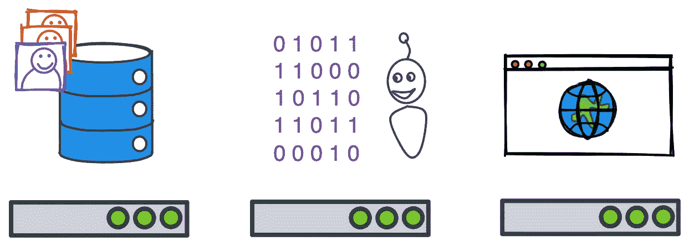***

***作者图片***

***随着你的应用程序的受众在情人节前后增加，将这三台服务器扩展到四台、五台或更多，然后随着用户约会生活的平静下来，再降回三台。当您决定开始随机匹配用户时，完全放弃计算服务器。***

***在这个疯狂的旅程中，你只需为你使用的东西付费。您还避免了自己购买硬件的前期成本，并且如果用户上传了太多照片，导致您的存储服务器崩溃，您也可以摆脱困境。云提供商提供充足的[备份和冗余](https://docs.aws.amazon.com/AWSEC2/latest/UserGuide/disaster-recovery-resiliency.html)，这意味着客户基本上可以忘记运行他们服务的确切机器。***

***最后，我一直在说“服务器”,就好像您租用了整个机器一样。但是为了更容易地利用云，**的客户可以保留*一台服务器的一部分*，它*仍然像一台独立的机器*。**这种 [**虚拟化**](https://cloud.google.com/learn/what-is-a-virtual-machine) 对客户和云提供商都有好处——您可以根据需要保留尽可能少的计算或存储，提供商可以通过在多个客户之间分配服务器来保持服务器忙碌(并赚钱)。***

***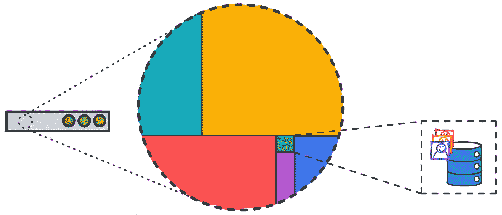***

***作者图片***

# ***什么是云(形式上)？***

***[**NIST** (美国国家标准与技术研究院)](https://www.nist.gov/)通过概述[五个基本特征](https://doi.org/10.6028%2FNIST.SP.800-145)提供了云的更正式定义:***

*****1。按需自助服务**
客户可以选择他们需要的计算资源，无需与提供商进行人工交互。例如，用户可以点击一个按钮来预订一个服务器来托管他们的网站，然后点击另一个按钮来释放该服务器。***

*****2。广泛的网络访问这些资源可以通过互联网获得，并且可以通过多种平台访问。例如，用户可以从他们的笔记本电脑上预定一台服务器，然后再从他们的手机上检查它的健康状况。*****

*****3。资源池**
云资源是动态分配和再分配的，资源的具体位置从用户那里抽象出来。*例如，用户可以预订两个服务器，并且不需要知道一个是位于弗吉尼亚州的数据中心 A 中的服务器 123，另一个是位于纽约的数据中心 B 中的服务器 456。****

*****4。快速弹性**
可以供应和释放资源，以快速满足需求。*例如，当应用流量增加时，用户可以选择自动使用更多服务器。****

*****5。测量服务**
资源使用是精确计量、可见和可控的。*例如，用户可以实时查看托管其应用的服务器的成本，并根据业务需求的变化重新配置其分配。****

***让我们回到场地预订的类比。“Venue AWS”服务会宣传你可以通过他们的网站或应用程序(#1、#2)自动预订你需要的任何大小的场地。这些场地是从一大组房间中抽取的，这些房间随着用户活动的开始和结束而消失和重新出现(#3)。如果你的与会者突然比你预期的少了或多了，或者随着与会者来来去去，你可以动态地将每个人传送到最佳大小的场地(#4)，次数不限。最后，你清楚地看到了你所支付的费用，如果你在任何时候改变了主意，你都可以放弃。***

# ***什么时候云不适合我？***

***在我们继续之前，有必要提一下反对云计算的观点。尽管他们尽了最大努力，云提供商 [***偶尔也会*失败**](https://awsmaniac.com/aws-outages/) ，拖垮[他们的客户](https://www.engadget.com/amazon-web-services-outgage-slack-hulu-asana-grindr-150029082.html)。例如，2020 年 11 月，Adobe、iRobot 和 Roku [因一批新服务器添加到 AWS 数据中心的方式出错而离线几个小时](https://www.protocol.com/newsletters/protocol-enterprise/aws-outage-reinvent-salesforce-slack?rebelltitem=1#rebelltitem1)。同样，云提供商**也不能幸免于数据泄露**，比如当[Twitch 的所有源代码被泄露](https://www.reuters.com/technology/amazons-twitch-hit-by-data-breach-2021-10-06/)或者一名不满的员工[自愿泄露客户信息](https://www.bleepingcomputer.com/news/security/amazon-sacks-insiders-over-data-leak-alerts-customers/)。***

***如果您在一个用户数据极其敏感的领域工作(例如，社会安全号码)，或者您的应用程序绝对不能被中断(例如，紧急响应)，那么可能有必要投资一个您可以完全控制的系统。***

******

***由 [Max LaRochelle](https://unsplash.com/@maxlarochelle?utm_source=medium&utm_medium=referral) 在 [Unsplash](https://unsplash.com?utm_source=medium&utm_medium=referral) 上拍摄***

# ***什么是 AWS？***

***AWS，或称**亚马逊网络服务**，是亚马逊的云服务。AWS 于 2002 年推出，作为亚马逊推动 T2 为其软件工程师提供更加面向服务的架构的一部分。目标是雄心勃勃的:最大化团队的自主性，采用[REST](https://www.redhat.com/en/topics/api/what-is-a-rest-api)API，标准化基础设施，移除守门决策者，并持续部署代码。亚马逊确定需要一个**分布式、可扩展的软件架构**来实现这个雄心。***

***结果如此成功，以至于亚马逊也将 AWS 变成了一个供公众使用的产品。AWS 目前占据云计算市场 32%的份额(微软 Azure 和谷歌云分别占据 20%和 9%的份额)，并提供超过 200 种不同抽象层次的服务。深入到操作系统层面，[优化运行你的应用的服务器的基础](https://aws.amazon.com/pm/ec2/)，或者只是通过一个服务来启动你的应用，这个服务[为你处理大部分细节](https://aws.amazon.com/elasticbeanstalk/)。***

***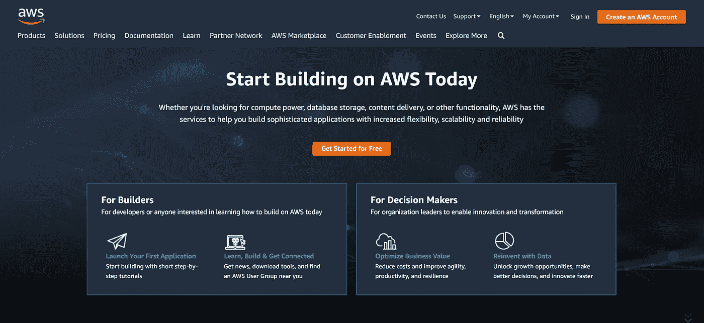***

***作者截图***

# ***安装***

***让我们创建一个 AWS 帐户。如果你能跟上的话，这些帖子会更有意义，你以后也能自己尝试了。***

***我们首先访问 AWS 网站，点击“创建 AWS 账户”AWS 提供的大部分服务都是免费的，为期一年，这意味着你可以学习和尝试真实的东西，而不必担心成本。(不过，你*确实需要附上信用卡，以防万一你决定放弃温和的教程，开始训练下一个 [AlphaGo](https://en.wikipedia.org/wiki/AlphaGo) 。)****

***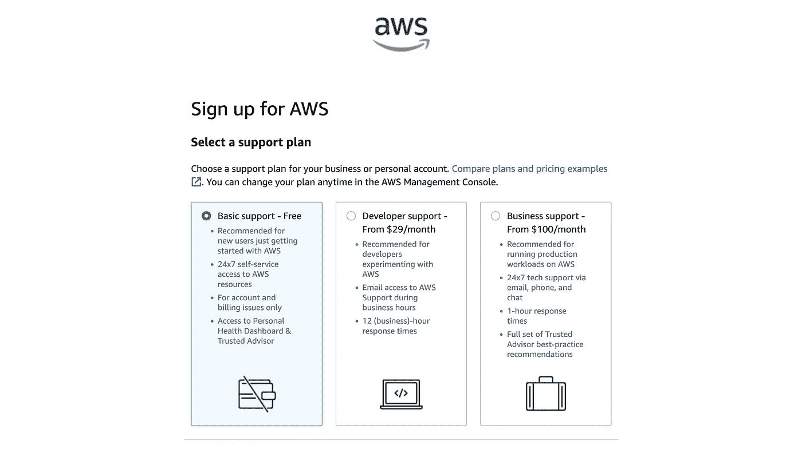***

***作者截图***

***假设你不是机器人(🤖)，完全按照步骤操作应该很简单。(还没有绝招题！)创建帐户后，您应该会看到控制台主页，上面有一些小部件，如最近访问的应用程序、一些“欢迎使用 AWS”链接、费用和使用情况等。***

******

***凯尔·格伦在 [Unsplash](https://unsplash.com?utm_source=medium&utm_medium=referral) 上的照片***

# ***身份和访问管理***

***我们成功了！我们应该开始建立一个[图像分类器](https://docs.aws.amazon.com/sagemaker/latest/dg/image-classification.html)还是[聊天机器人](https://aws.amazon.com/chatbot/)？一个[视频游戏引擎](https://aws.amazon.com/lumberyard)或者[卫星控制器](https://aws.amazon.com/ground-station)怎么样？其实… **先说身份管理。*****

***以身份管理开始我们的 AWS 冒险听起来可能有点虎头蛇尾，但是遵循安全最佳实践对于成功利用云是至关重要的。如果你的应用被黑了，你的客户不会很同情你(尤其是他们的数据被盗了！)，攻击者可以在您取消信用卡之前轻松积累数千美元的费用。从更友好的角度来说，设置身份管理可以让您轻松安全地将新的开发人员引入到您的项目中！***

***当您创建 AWS 帐户时，您创建了一个根用户**。这是该帐户的一个全能用户，可以对任何服务执行任何操作，创建和删除其他用户配置文件，访问和更改支付信息，以及关闭帐户。那就是大量的权力集中在一个地方。事实上，[AWS 建议新用户做的第一件事](https://aws.amazon.com/getting-started/guides/setup-environment/module-two/)就是设置[**【MFA】**](https://en.wikipedia.org/wiki/Multi-factor_authentication)让它变得更难(但不是不可能！)供攻击者侵入 root 帐户。*****

***如果你导航到 AWS 的身份和访问管理服务 [IAM](https://aws.amazon.com/iam/) ，你会看到一个红色的警告，提示 root 用户不受保护。(在搜索栏中键入“IAM”即可找到。)***

***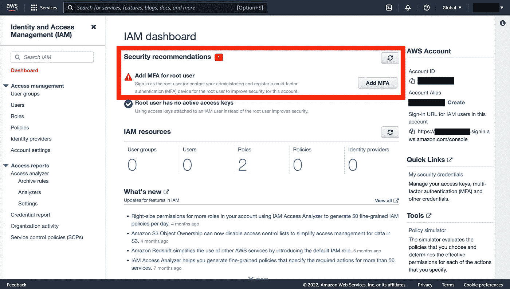***

***作者截图***

***因此，让我们修复这个漏洞——只需点击“添加 MFA”，选择方法(如手机上的验证器应用程序)，然后按照提供的步骤操作。设置好 MFA 后，任何试图以 root 用户身份登录的人都需要提供额外的证明，证明他们确实是你。这个额外的麻烦是值得的—**你通常不会登录到根帐户。*****

***相反，您通常会登录到一个 ***用户配置文件*** ，并根据您的典型工作流程获得特定权限。例如，您的日常工作可能不涉及更新信用卡详细信息或更改客户密码，因此您可以限制用户(包括您自己，除非您以 root 用户身份登录)的这些操作。***

***事实上， **IAM 配置文件不能做*任何事情*，除非你明确表示他们可以做**，这是一个安全概念，称为[授予最小特权](https://docs.aws.amazon.com/IAM/latest/UserGuide/best-practices.html#grant-least-privilege)。这大大降低了一个被入侵的帐户可能造成的损害。例如，下面的蓝色用户只能访问 S3 和 DynamoDB，而橙色用户可以访问 S3、Lambda、API Gateway 和 CloudWatch。甚至*在*像 S3 这样的服务中，Blue 对动作或内容的访问可以根据他们的业务需求进行不同于 Orange 的配置。***

***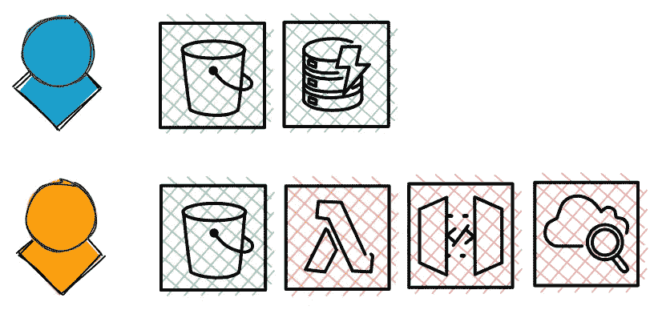***

***作者图片***

***让我们建立一个 IAM 配置文件。我们将首先创建一个 ***用户组*** ，该用户组具有自动应用于该组中任何用户的某些权限。这使得新用户的加入变得很容易，因为我们只需将他们的配置文件添加到一个预配置的组中，该组具有任何新用户都应该拥有的权限。***

***要创建组，在 IAM 中，我们只需单击左侧的“用户组”,然后单击右侧的“创建组”。我们可以将这个组命名为`admins`，然后向下滚动，搜索`AdministratorAccess`策略，并将其附加到我们的组。***

***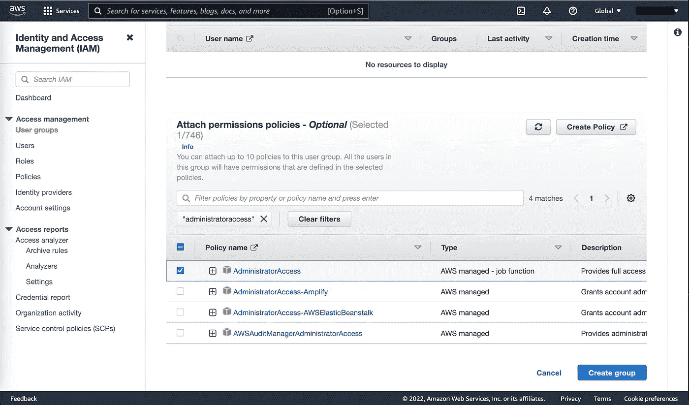***

***作者截图***

***最后，我们创建我们的用户。点击左边的“用户”，然后“添加用户”，然后输入你的帐户名称。然后，我们将选择“编程访问”(允许我们通过代码访问 AWS)和“AWS 管理控制台访问”(允许我们作为自己的用户而不是根用户登录)。***

***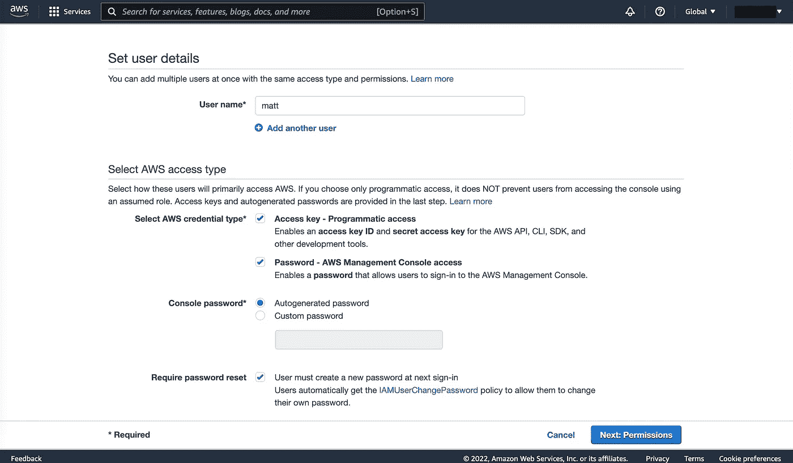***

***作者截图***

***然后我们点击“下一步:权限”,将我们的用户添加到我们的`admins`组。“下一步:标签”允许我们为搜索添加标签(例如，如果我们有几十或几百个用户)，但我们现在可以跳过这一步。在最后的审查屏幕中，我们可以确认一切正常，然后点击“创建用户”***

*****下一个屏幕很重要！**自动生成的密码和秘密访问密钥(用于从代码访问 AWS)只提供一次。在离开页面之前，在安全的地方记下您的访问密钥 ID、秘密访问密钥和自动生成的密码——访问密钥 ID 和秘密访问密钥是互联网上的任何人通过 Python 脚本访问您的 AWS 服务所必需的。***

***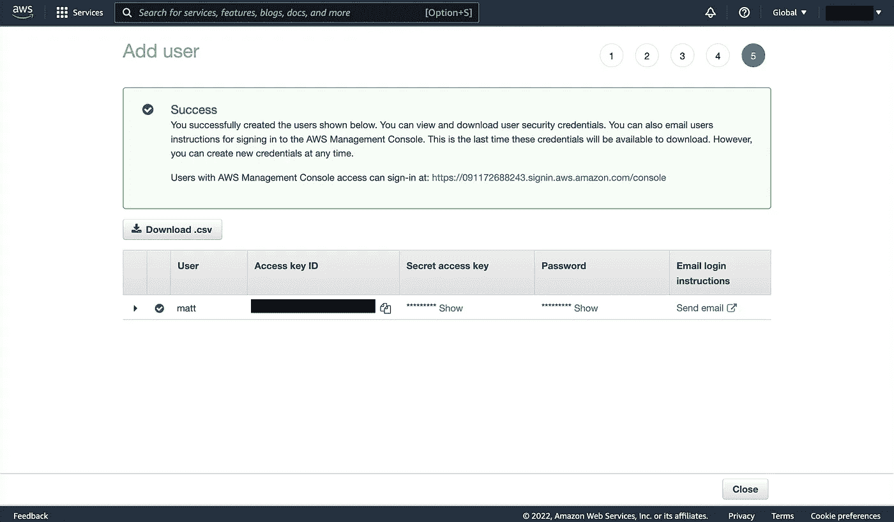***

***作者截图***

***干得好！最后一件事:如果我们作为 IAM 用户登录，我们需要提供 AWS 帐户的 12 位帐户 ID。这个数字很难记住，除非你使用密码管理器或者对数字有很好的记忆力。相反，让我们为这个账户创建一个*别名*(基本上是一个用户名)，这样我们就可以用更容易记住的东西登录了。与我们的 IAM 配置文件名不同，这个用户名需要在所有 AWS 中是唯一的，所以您可能需要比`matt`更具体的名称。***

***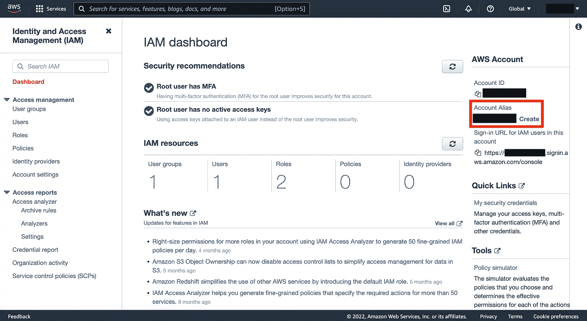***

***作者截图***

******

***照片由[替代代码](https://unsplash.com/@altumcode?utm_source=medium&utm_medium=referral)在 [Unsplash](https://unsplash.com?utm_source=medium&utm_medium=referral) 上拍摄***

# ***命令行界面***

***最后，[安装 AWS CLI](https://docs.aws.amazon.com/cli/latest/userguide/getting-started-install.html) 以便能够从命令行访问您的 AWS 服务。(Python 用户也可以只输入`pip install awscli`。)虽然 UI 通常足以满足我们的需求，但有时一个[命令行界面](https://www.techtarget.com/searchwindowsserver/definition/command-line-interface-CLI)是无价的——例如，将 10，000 个 CSV 上传到一个 S3 存储桶可以通过几次击键来完成，而不需要在 UI 中点击并拖动文件。CLI 还设置我们通过脚本自动执行 AWS 操作——比如增加或减少服务器资源。***

***一旦你安装了命令行界面，你可以输入`aws configure`来输入你的访问密钥 ID 和秘密访问密钥，以及其他细节。***

***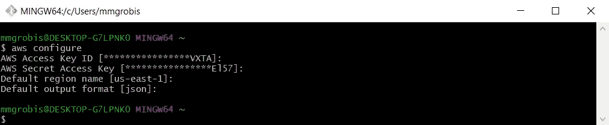***

***作者截图***

***恭喜你。🎉您已经设置了一个 AWS 帐户，遵循了安全最佳实践，现在可以开始试验了。***

******

***贾斯汀·克拉克在 [Unsplash](https://unsplash.com?utm_source=medium&utm_medium=referral) 上的照片***

# ***结论***

***在这篇文章中，我们介绍了云计算和亚马逊网络服务。我们用预订场地的类比来描述云的主要产品:**租用服务器(计算机)而不需要购买和维护它们的能力。**然后，我们讲述了云提供商如何通过按需自助服务、广泛的网络访问、资源池化、快速弹性和测量服务实现对服务器的灵活和动态访问。然后，我们简要介绍了 AWS 的历史，并介绍了如何设置帐户、IAM 配置文件和 CLI。***

***我们现在已经准备好真正使用 AWS，并更好地理解它的两个主要支柱:**计算**和**存储。**我们将为每一个产品发布一篇帖子，介绍这些产品的基础知识，并在 Python 和 CLI 中带来许多乐趣。希望在那里见到你！***

***最好，
哑光***

# ***脚注***

## ***1.什么是云？***

***从技术上讲，你查看贾斯汀比伯最新推文的 HTTP 请求很可能[不会一直](https://podcasts.apple.com/us/podcast/scaling-whatsapp-with-silky/id1370910331?i=1000467069940)到达这些大型数据中心之一。相反，你可能只能到达最近的[内容交付网络(CDN)](https://en.wikipedia.org/wiki/Content_delivery_network) 节点(又称为存在点，PoP)，分散在世界各地的数千个较小的数据中心之一。***

***cdn 通过缓存流行内容来减轻数据中心数据库(以及整个互联网)的负荷。从缓存中检索数据比从磁盘中检索要快得多，这意味着服务器可以立即发回比伯的推文，而不需要挖掘数万亿推文来找到它。事实上，[网飞能够提供如此无缝的流媒体体验](https://blog.apnic.net/2018/06/20/netflix-content-distribution-through-open-connect/)，因为他们利用了大量的 cdn。***

***但是当然，CND 也有其局限性，否则我们就只能使用它了。用于缓存的硬件非常昂贵——例如，AWS 中的 1 TB 在 S3 上是 23 美元，在 CloudFront 上是 85 美元。还有很多内容我们*无法*存储在缓存中，比如我们希望在登录后锁定的用户数据。***