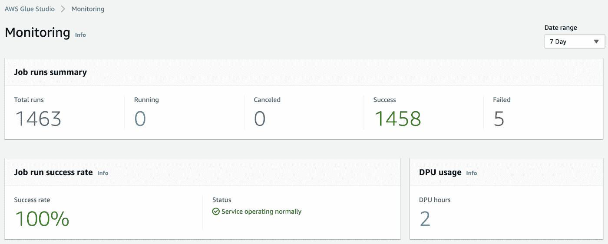

# Apache Airflow 与 Glue 的 AWS 托管工作流

> 原文：<https://towardsdatascience.com/aws-managed-workflows-for-apache-airflow-vs-glue-184eca9e6996>

## 找出 MWAA 胶水和 AWS 胶水的区别

马丁·亚当斯在 [Unsplash](https://unsplash.com/s/photos/pipes?utm_source=unsplash&utm_medium=referral&utm_content=creditCopyText) 上的照片

2020 年，AWS 为 Apache Airflow (MWAA)推出了亚马逊管理的工作流。Apache Airflow 是一个开源的工作编排平台，由 Airbnb 在 2014 年创建。从那时起，许多公司开始使用它，并将其用于各种用例。它是一个工作流协调工具，允许用户在计划的时间按顺序和逻辑运行作业，或者临时执行作业。由于其架构不依赖于用户无法控制的嵌入式存储，人们可以将队列服务和元数据存储外部化到 Airflow 之外，以便您可以将 Airflow 堆栈设计为可水平扩展的。

然而，与其他开源项目一样，维护气流资源成为了您的责任。这不是一件小事。了解了需求，AWS 让 MWAA 负责后勤方面的工作。最近的 AWS 服务让我想到了 AWS Glue——一种托管 ETL(提取、转换和加载)服务，以及它们之间的区别。

# MWAA 和 AWS 胶水对比

Apache Airflow 和 AWS Glue 的目标不同，但它们有一些共同点。两者都允许您创建和管理工作流。由于这种相似性，你可以用气流完成的一些任务也可以用胶水来完成，反之亦然。这种共性让我们在想要选择一个而不是另一个的时候有了歧义。要做出明智的决定，了解它们之间的区别非常重要。

# 服务器与无服务器

让我们首先从对它们的工作方式有重大影响的架构差异开始。MWAA 是基于服务器的，而 AWS Glue 是无服务器的。我们不会在这里讨论这两个不同的概念，但 MWAA 和胶水继承了建筑差异的缺点和优点，它们出现在三个主要领域。

# 费用

云平台提供商提供无服务器服务，人们选择它们的原因之一是成本效益。Apache Airflow 被设计为在服务器上运行。这意味着，即使没有作业运行，您的气流资源仍将保持活动状态，这将在空闲时间产生成本。MWAA 仍然是基于服务器的，但它提供了一种通过自动伸缩来节省成本的方法。MWAA 监控资源的使用情况，如果需要更多的资源就增加工作线程的数量，如果需要更少的资源就减少工作线程的数量。但是，由于它是基于服务器的，您无法避免在空闲时间运行服务器。AWS Glue 是无服务器和事件驱动的。当你触发时，它将开始分配服务器资源。在空闲时间，它不使用任何资源，也不会产生任何成本。

在 MWAA，有四个主要因素决定你的账单。

*   实例大小
*   附加工作实例
*   附加调度程序实例
*   元数据库存储

这些费用将乘以使用小时数。

在 [AWS 胶水](https://aws.amazon.com/glue/pricing/)里，你是按 DPU 或者数据处理单元乘以使用小时来收费的。根据您运行的工作类型，DPU 的计算方式会有所不同。有三种类型。

*   Python shell:您可以选择 0.0625 或 1 DPU。
*   Apache Spark:您可以最少使用 2 个 dpu，最多使用 100 个 dpu。
*   Spark Streaming:您可以使用最少 2 个 dpu，最多 100 个 dpu。

# 工作隔离

在服务器环境中，工作流共享相同的资源。当工作流进程消耗大量内存或 CPU 时，它会对其他进程产生负面影响。如果您没有均匀地分配触发时间，并且错误地配置了最大工作人员数，则在 MWAA 可能会出现这种症状。相比之下，AWS Glue 为每个工作流提供了一个隔离的环境，因为每个工作流都使用独立的资源。当您运行繁重的数据密集型工作时，不会影响同时运行的其他工作流。

# 响应性

在 MWAA，服务器总是在运行，随时可以使用。当触发作业工作流时，它几乎没有延迟就开始了。在 AWS Glue 中，因为它是无服务器的，ETL 工作流从分配必要的资源开始。这意味着在实际作业开始之前会有一些延迟。此外，当您必须使用外部库时，每次作业启动时，它首先安装那些库，然后开始实际的作业。

# 工作编排与 ETL

值得讨论一下每项服务的设计目的。让我提醒你，气流是一个工作编排工具。如果我们在[维基百科](https://en.wikipedia.org/wiki/Orchestration)中搜索编排的定义，它也会给你一个编排者的定义。

指挥是受过训练的音乐专业人员，他给乐队分配乐器

这里我们要重点说的词是“赋值”。气流的一个理想用例是将工作委派给其他资源。当然，我们仍然可以在 Airflow 内运行非密集型任务，但是如果可能的话，最好分配它们。避免在气流中运行繁重的任务也可以防止它们占用共享资源。MWAA 的一个很好的优势是它在 AWS 之内。这意味着您可以使用 IAM 和安全组更恰当地访问其他 AWS 服务，如 EMR、Athena、S3、Redshift 等。

AWS Glue 专门做 ETL。当您提取、转换和加载数据时，通常需要昂贵的过程。为了处理密集型任务，可以在 Glue 中使用 Apache Spark 集群。由于能够在内部使用 Spark 集群，您可以运行大规模数据处理，而不必担心资源耗尽。

# 监控和记录

MWAA 和 AWS 胶水都提供了方便的监测方法。这对于气流来说是一个很大的提升。当您在自己的服务器上设置和使用 Airflow 时，您会意识到检查 Airflow 日志并不方便用户。Airflow 为任务、web 服务器、调度程序、工作程序和 Dag 写入不同类型的日志。默认情况下，它将这些日志写在服务器内部。要读取日志，您必须 SSH 到服务器并运行命令。当您希望使用分布式服务器来实现可伸缩性时，这变得更加复杂。这将需要您创建中央日志存储，并进行额外的设置，以使所有服务器都将日志写入该单一位置。

因为 MWAA 是由 AWS 管理的，所以所有的日志都被写入 CloudWatch。这意味着您可以使用 Logs Insights 搜索某些日志，并拥有一个显示 CPU、内存和网络流量等服务器资源使用情况的仪表板。此外，您还可以监控许多其他特定于气流的指标。您还可以通过编程方式设置警报和管理通知收件人。

AWS Glue，由于是原生的 AWS 服务，也有很好的监控能力。不同的是，除了 CloudWatch，你还可以在 GlueStudio 的 Glue 内部监控你的 Glue 资源。

GlueStudio 监控仪表板(图片由作者提供)

我发现在 Glue 中更容易深入和跟踪失败的作业。上图是 GlueStudio 监控菜单的第一个屏幕。它给你高层次的数字。你可以点击每个数字去找相关的工作。当您在那里选择一个作业时，您可以搜索它的 CloudWatch 日志并查看其他指标。当您有许多工作流要监控时，这种设计可以让您更清楚地了解情况，从而更容易地跟踪问题。

# 云的形成

由于 Airflow 已经成为 AWS 中托管服务的一部分，因此您可以对 Airflow 基础架构进行云计算。然而，不仅是基础设施环境，就连 Airflow 的本地配置变量也可以被云化。当您已经通过 CloudFormation 管理 AWS 资源时，这将为您提供资源管理的一致性，并使跨不同环境的气流管理更加容易。AWS 胶水当然可以通过 CloudFormation 来管理。一个很大的不同是，您甚至可以使用它来创建和定义工作流，这给了您更深层次的可控性。

# AWS SDK 和 CLI

除了 CloudFormation，MWAA 还可以像其他 AWS 资源一样与 AWS SDK 和 CLI 交互。使用它们，您可以创建、更新和删除 MWAA 环境，并检索它们的环境信息，包括日志记录策略、工作线程数量、调度程序等等。您也可以运行 Airflow 的内部[命令](https://docs.aws.amazon.com/mwaa/latest/userguide/airflow-cli-command-reference.html#airflow-cli-commands-supported)来控制 Dag，但 MWAA CLI 并不支持 Airflow 的所有本机命令，如回填(查看此 AWS [文档](https://docs.aws.amazon.com/mwaa/latest/userguide/airflow-cli-command-reference.html#parsing-support))、Dag 列表、Dag 列表运行、Dag 下一次执行等等。这些限制主要是因为 Airflow 不是作为 AWS 的原生服务而创建的。说了这么多，AWS Glue 完全可以用 SDK 和 CLI 来控制。你基本上可以使用库来执行所有的任务和控制整个 Glue 资源。

# 包扎

MWAA 和 AWS Glue 都是编排作业的好工具——MWAA 用于一般作业，Glue 专门用于 ETL。上面讨论的这些架构和功能上的差异将影响您对工具的选择。当然，知道了这些区别，你可能想考虑同时使用它们，这会给你更多的灵活性。当你使用两者时，你可以控制来自 MWAA 的 Glue 资源，例如，因为 Glue 的 SDK 给了你更多的控制权，而 Airflow 拥有 glue [操作器](https://airflow.apache.org/docs/apache-airflow-providers-amazon/stable/_api/airflow/providers/amazon/aws/operators/glue/index.html)。这两个服务内部都有很大的生态系统，有很多东西需要学习，所以在开始全面开发之前尝试一下是很好的。