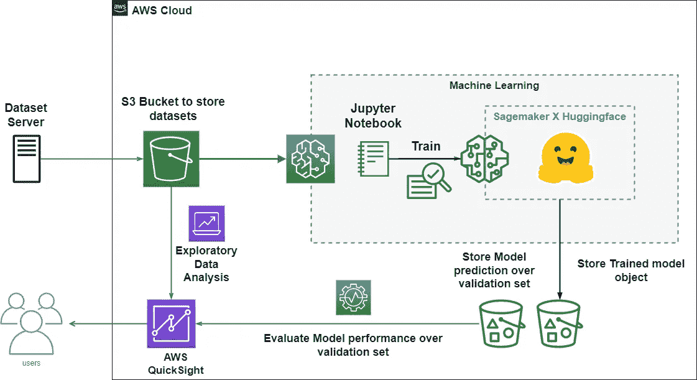
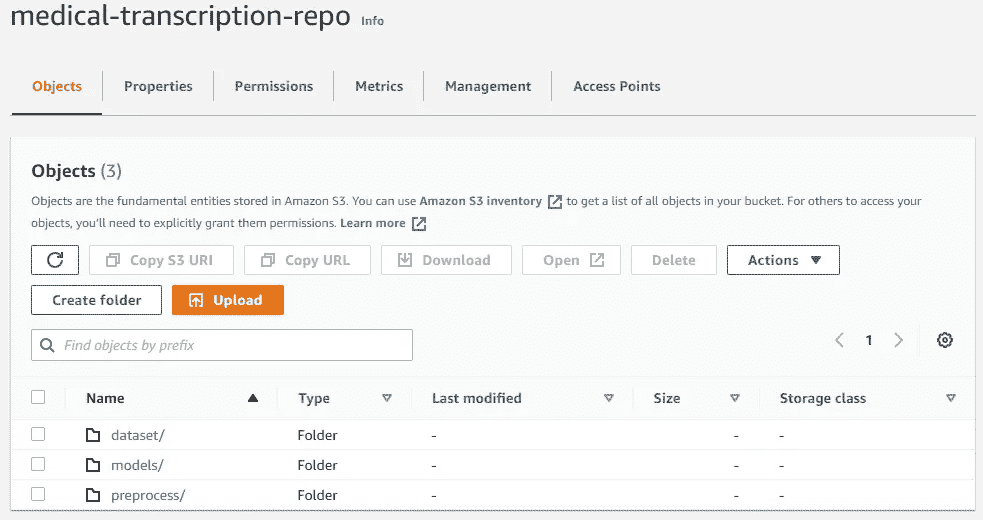
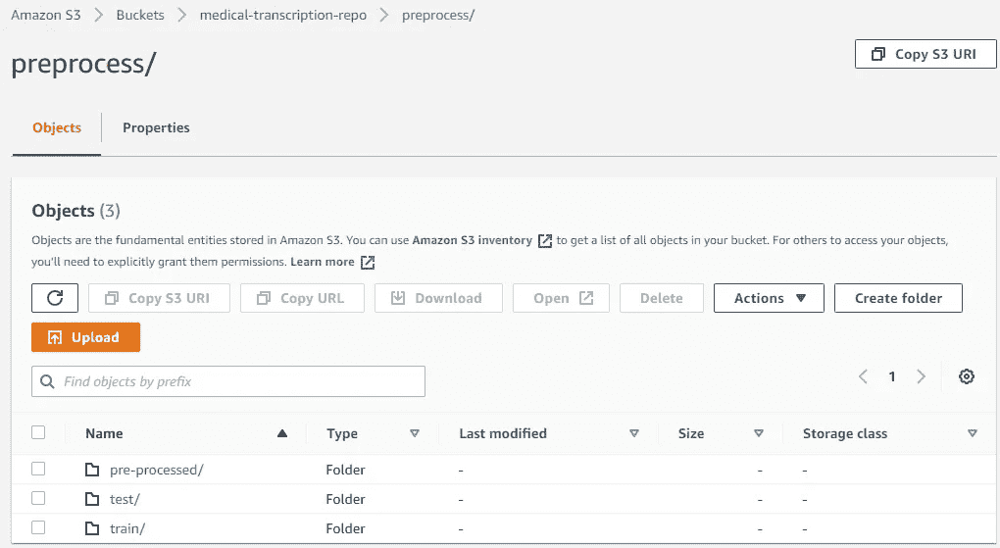
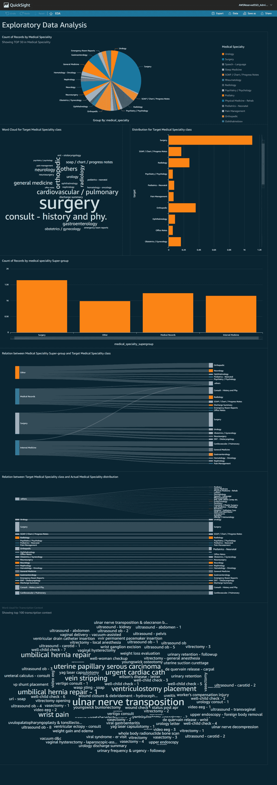
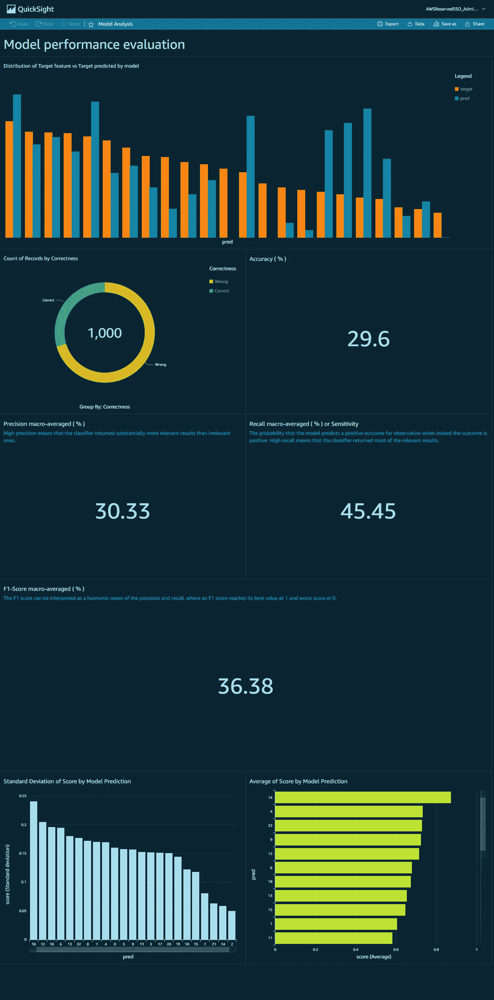

# AWS SageMaker X hugging face X AWS quick sight

> 原文：<https://towardsdatascience.com/aws-sagemaker-x-huggingface-x-aws-quicksight-7f4bd53dc484>

## 如何通过机器学习解决医疗成绩单的分类问题，并为以下内容发布模型和数据监控仪表板


来源:丹尼尔·科尔派在 [Unsplash](https://unsplash.com/s/photos/monitor?utm_source=unsplash&utm_medium=referral&utm_content=creditCopyText) 上拍摄的照片

# **简介**

这是一个解决方案，演示了如何在 **AWS SageMaker** 上训练和部署预训练的 **Huggingface** 模型，并发布一个 **AWS QuickSight** 仪表板，该仪表板可视化模型在验证数据集上的性能，并对预处理的训练数据集进行探索性数据分析。以此作为提出的解决方案的架构，我们尝试通过机器学习来解决医疗记录的分类，这基本上是解决一个**生物医学 NLP** 问题。在本解决方案中，我们还讨论了通过 PyTorch 编写自定义 Huggingface 训练器进行训练时的特征工程和通过类权重处理不平衡数据集。

将 Huggingface 与 SageMaker 一起使用的意义在于简化 SageMaker 上基于 transformer 的模型的训练，并使它们易于部署用于生产。此外，使用 QuickSight Dashboard 将数据和模型分析集中在一个平台上，使监控和配置变得更加容易。当项目需要一个服务器端仪表板来由管理员或开发团队监控模型和数据时，建议的 dashboard 管道非常方便。

# 体系结构



来源:作者

# 视频演示

下面是建议的架构的演示视频。

来源:作者

# 问题陈述

**诊断预测**旨在自动预测具有特定既往病史的患者所需的诊断。

病历由一个原始文本文件表示，其中包含医生对患者的记录，包括他/她的年龄、在高速公路上描述的主诉、患者的病史等等。它是非结构化的——一个病人病历的不同部分可能在另一个病人的病历中不存在。

目标标签由所需诊断程序的名称表示。

**解决方案的价值**可以帮助医生找到诊断订单的最佳解决方案。患者可以节省时间和金钱，医生可以通过节省时间进行不必要的诊断来更有效地为患者服务。此外，在困难的情况下，该算法可以帮助医生更快地找到诊断结果，这在某些情况下可能非常有价值，甚至可以挽救生命。

从理论上讲，算法发现的一些规律可能有助于医学研究人员根据某些疾病与某些症状之间的不明显联系，找到治疗某些疾病的思路。

# 数据集和存储

所有的数据集都存储在 ***数据集*** 目录下的 **S3 桶(** *医学-转录-回购* **)** 中。该数据集包含各种医学专业的样本**医学转录**。

预处理和特征工程数据集存储在不同目录下的相同 S3 桶中(*S3://medical-transcription-repo/preprocess/*)。模型存储也是如此(*S3://medical-transcription-repo/models/*)。



来源:作者

类似地，在*预处理* s3 存储桶目录中，我们存储训练数据和验证数据集以备将来使用。



来源:作者

```
- dataset - dataset.csv- preprocess - pre-processed - eval - validation.csv -pre-processed.csv - train - dataset-info.json -test - dataset-infor.json- models - huggingface-dd-mm-yyyy:hh-mm-ss - output - model.tar.gz - output.tar.gz
```

## 数据集源

从 mtsamples.com 刮来的数据。这个数据集通过提供医学转录样本提供了一个解决方案。

# ML 模型训练、部署和推理

## AWS SageMaker

为了在 SageMaker 上训练和部署模型，使用了以下服务:

*   **笔记本实例(***ml . T2 . medium***)**
*   **培训岗位(***ml . p 3.2x large***)**
*   **推断终点(***ml . T2 . medium****)***

## 预处理和特征工程

原始数据集由 40 个要分类的类组成，但是由于缺乏关于这些类的足够的训练样本，一些类集合被移除，最终以 23 个类的分类问题结束。然后，预处理后的数据集被上传到 s3 存储桶，以便在 **AWS QuickSight** 中进一步创建 EDA 仪表盘。

接下来，数据集被分成训练集和验证集，并对文本数据进行标记。预训练的*无壳*分词器用于对输入数据进行分词。

```
from transformers import AutoTokenizer# tokenizer used in preprocessing
tokenizer_name = 'distilbert-base-uncased'
# download tokenizer
tokenizer = AutoTokenizer.from_pretrained(tokenizer_name)# tokenizer helper function
def tokenize(batch):
    return tokenizer(batch['text'],padding=True, truncation=True)# tokenize dataset
train_dataset = dataset['train'].map(tokenize, batched=True)
test_dataset = dataset['test'].map(tokenize, batched=True)# set format for pytorch
train_dataset =  train_dataset.rename_column("target", "labels")
train_dataset.set_format('torch', columns=['input_ids', 'attention_mask', 'labels'])
test_dataset = test_dataset.rename_column("target", "labels")
test_dataset.set_format('torch', columns=['input_ids', 'attention_mask', 'labels'])
```

令牌化的训练和验证集被上传到 s3 存储桶。

```
import botocore
from datasets.filesystems import S3FileSystems3 = S3FileSystem()  
prefix = 'preprocess'# save train_dataset to s3
training_input_path = f's3://{bucket}/{prefix}/train'
train_dataset.save_to_disk(training_input_path,fs=s3)# save test_dataset to s3
test_input_path = f's3://{bucket}/{prefix}/test'
test_dataset.save_to_disk(test_input_path,fs=s3)
```

## 估计类别权重

对于类别不平衡，要考虑的一个方面是每个批次都有足够的信号来覆盖所有类别，甚至不平衡的类别。否则可能会在训练中退化。

在这种情况下，我们使用类权重来处理不平衡的数据集。

```
from sklearn.utils import class_weight
class_weights = dict(enumerate(class_weight.compute_class_weight(‘balanced’,
               classes=np.unique(df[‘target’]),
               y=df[‘target’])))
```

## 拥抱脸定制训练器

预训练的*无壳*模型和用于处理不平衡数据集的自定义损失函数用于模型训练。

```
from transformers import Trainer, TrainingArguments, AutoTokenizer# create Trainer instance
# Subclass Trainer and override the compute_loss method
class MedModelTrainer(Trainer):
    def compute_loss(self, model, inputs, return_outputs=False):
        labels = inputs.get("labels")
        # forward pass
        outputs = model(**inputs)
        logits = outputs.get("logits")
        # compute custom loss
        loss_fct = torch.nn.CrossEntropyLoss(weight=torch.tensor(list(class_weights.values())))
        loss = loss_fct(logits.view(-1, self.model.config.num_labels), labels.view(-1))
        return (loss, outputs) if return_outputs else losstrainer = MedModelTrainer(
    model=model,
    args=training_args,
    compute_metrics=compute_metrics,
    train_dataset=train_dataset,
    eval_dataset=test_dataset,
    tokenizer=tokenizer,
)# train model
trainer.train()
```

## 创建评估员并开始培训工作

拥抱脸深度 DLCs(深度学习容器)让在 SageMaker 中训练变形金刚模型变得前所未有的简单。以下是您应该使用拥抱脸 DLCs 来训练和部署您的下一个机器学习模型的一些原因:
*您只需要一个命令。
*加速机器学习从研究到生产的转变。
*内置性能。

在 SageMaker 训练环境中，该估计器执行拥抱面部训练脚本。

使用预构建的拥抱面部 Docker 容器，估计器启动 SageMaker 管理的拥抱面部环境，并执行用户通过`**entry_point**`参数提供的拥抱面部训练脚本。

```
from sagemaker.huggingface import HuggingFace, TrainingCompilerConfig
# initialize the Amazon Training Compiler
compiler_config=TrainingCompilerConfig()# hyperparameters, which are passed into the training job
hyperparameters={'epochs': 10,
                 'train_batch_size': 64,
                 'eval_batch_size': 32,
                 'learning_rate': 3e-5, 
                 'model_name':'distilbert-base-uncased'
                 }huggingface_estimator = HuggingFace(entry_point='train.py',
                            source_dir='./scripts',
                            instance_type='ml.p3.2xlarge',
                            instance_count=1,
                            role=role,
                            transformers_version='4.11.0',
                            pytorch_version='1.9.0',
                            py_version='py38', output_path='s3://{}/models'.format(bucket),
                            hyperparameters = hyperparameters,
                            compiler_config = compiler_config
                                   )
```

以我们上传的数据集作为输入开始训练工作。

```
huggingface_estimator.fit({'train': training_input_path, 'test': test_input_path})
```

## 部署端点

为了部署我们的端点，我们在 HuggingFace estimator 对象上调用 *deploy()* ，传入我们想要的实例数量和实例类型。

```
predictor = huggingface_estimator.deploy(1,"ml.t2.medium")
```

对于推理，您可以使用您训练的拥抱人脸模型或预训练的拥抱人脸模型之一来部署 SageMaker 的推理作业。通过这种协作，您只需要一行代码就可以使用 SageMaker 部署您的已训练模型和预训练模型。

```
eval_df = pd.read_csv('test.csv')
eval_df['pred'] = 0
eval_df['score'] = 0.0
max_length = 512
for i in range(len(eval_df)):
    sentiment_input= {"inputs": eval_df['text'].iloc[i][:max_length]}
    eval_df['pred'][i] = int(predictor.predict(sentiment_input)[0]['label'].split('_')[1])
    eval_df['score'][i] = float(predictor.predict(sentiment_input)[0]['score'])
```

带有模型预测的验证集存储在 s3 存储桶中，以开发 AWS QuickSight 上的模型性能仪表板。

```
eval_df.to_csv("model-performance.csv", index=False)
s3 = boto3.resource('s3')
s3.meta.client.upload_file('model-performance.csv', bucket, 'preprocess/pre-processed/eval/model-performance.csv')
```

## 源代码

下面给出了以下建议体系结构的源代码:

[托管 QuickSight 仪表盘的架构，用于 SageMaker 上部署的拥抱面部模型监控以及数据 EDA](https://github.com/victor369basu/SagemakerHuggingfaceDashboard)

# AWS QuickSight

Quicksight 是 AWS 提供的云原生、无服务器 BI 服务。

EDA 仪表板显示在预处理的医疗记录数据上。分析的重点是医学专业的分布、医学专业的子群、医学专业之间的关系、转录上下文的词云等。



来源:作者

模型性能仪表板是可视化的，用于验证医学转录数据集的模型预测。分析的重点是模型预测的正确性；目标类与预测类分布的差异；模型在验证集上的准确度、精确度、召回率和 f1 分数等。



来源:作者

## 正确性图的计算字段

```
ifelse(pred=target, "Correct", "Wrong")
```

## 准确度(%)的计算字段

```
(countIf(Correctness, Correctness="Correct")/ count(Correctness)) * 100
```

## 精度的计算字段(%)

```
((countIf(pred, pred=0 AND target=0)/countIf(pred, pred=0) +countIf(pred, pred=1 AND target=1)/countIf(pred, pred=1) +countIf(pred, pred=2 AND target=2)/countIf(pred, pred=2) +countIf(pred, pred=3 AND target=3)/countIf(pred, pred=3) +countIf(pred, pred=4 AND target=4)/countIf(pred, pred=4) +countIf(pred, pred=5 AND target=5)/countIf(pred, pred=5) +countIf(pred, pred=6 AND target=6)/countIf(pred, pred=6) +countIf(pred, pred=7 AND target=7)/countIf(pred, pred=7) +countIf(pred, pred=8 AND target=8)/countIf(pred, pred=8) +countIf(pred, pred=9 AND target=9)/countIf(pred, pred=9) +countIf(pred, pred=10 AND target=10)/countIf(pred, pred=10) +countIf(pred, pred=11 AND target=11)/countIf(pred, pred=11) +countIf(pred, pred=11 AND target=11)/countIf(pred, pred=11) +countIf(pred, pred=12 AND target=12)/countIf(pred, pred=12) +countIf(pred, pred=13 AND target=13)/countIf(pred, pred=13) +countIf(pred, pred=14 AND target=14)/countIf(pred, pred=14) +countIf(pred, pred=15 AND target=15)/countIf(pred, pred=15) +countIf(pred, pred=16 AND target=16)/countIf(pred, pred=16) +countIf(pred, pred=17 AND target=17)/countIf(pred, pred=17) +countIf(pred, pred=18 AND target=18)/countIf(pred, pred=18) +countIf(pred, pred=19 AND target=19)/countIf(pred, pred=19) +countIf(pred, pred=20 AND target=20)/countIf(pred, pred=20) +countIf(pred, pred=21 AND target=21)/countIf(pred, pred=21) +countIf(pred, pred=22 AND target=22)/countIf(pred, pred=22)) /23) *100
```

## 召回的计算字段(%)

```
((countIf(pred, pred=0 AND target=0)/countIf(target, target=0) +countIf(pred, pred=1 AND target=1)/countIf(target, target=1) +countIf(pred, pred=2 AND target=2)/countIf(target, target=2) +countIf(pred, pred=3 AND target=3)/countIf(target, target=3) +countIf(pred, pred=4 AND target=4)/countIf(target, target=4) +countIf(pred, pred=5 AND target=5)/countIf(target, target=5) +countIf(pred, pred=6 AND target=6)/countIf(target, target=6) +countIf(pred, pred=7 AND target=7)/countIf(target, target=7) +countIf(pred, pred=8 AND target=8)/countIf(target, target=8) +countIf(pred, pred=9 AND target=9)/countIf(target, target=9) +countIf(pred, pred=10 AND target=10)/countIf(target, target=10) +countIf(pred, pred=11 AND target=11)/countIf(target, target=11) +countIf(pred, pred=11 AND target=11)/countIf(target, target=11) +countIf(pred, pred=12 AND target=12)/countIf(target, target=12) +countIf(pred, pred=13 AND target=13)/countIf(target, target=13) +countIf(pred, pred=14 AND target=14)/countIf(target, target=14) +countIf(pred, pred=15 AND target=15)/countIf(target, target=15) +countIf(pred, pred=16 AND target=16)/countIf(target, target=16) +countIf(pred, pred=17 AND target=17)/countIf(target, target=17) +countIf(pred, pred=18 AND target=18)/countIf(target, target=18) +countIf(pred, pred=19 AND target=19)/countIf(target, target=19) +countIf(pred, pred=20 AND target=20)/countIf(target, target=20) +countIf(pred, pred=21 AND target=21)/countIf(target, target=21) +countIf(pred, pred=22 AND target=22)/countIf(target, target=22)) /23) *100
```

## f1 的计算字段-得分(%)

```
2 * (Precision*Recall ) / (Precision + Recall)
```

# 结论

提议的 AWS 云架构提供了一种解决方案，用于训练和部署基于 transformer 的 NLP 预训练模型，这些模型可在 Huggingface 通过 AWS SageMaker 进行生产。AWS QuickSight 用于发布仪表板，以可视化基本数据集的 EDA 和验证集上的 ML 模型性能，这成功地将数据和模型分析集中在一个屋檐下。

# 改进的范围

*   可以改进模型性能仪表板，以增加每个类的精确度和召回分数。
*   向模型性能仪表板添加混淆矩阵。
*   为更高的时期训练模型以更好地收敛。
*   尝试不同的预训练模型，如**伯特**和**罗伯塔**，以获得更好的模型性能。
*   改进特征工程技术，如减少目标类或使用**少数过采样**技术以获得更好的性能。

# 参考

*   [亚马逊 SageMaker 上的拥抱脸](https://huggingface.co/docs/sagemaker/main)
*   [使用亚马逊 SageMaker 的拥抱脸](https://docs.aws.amazon.com/sagemaker/latest/dg/hugging-face.html)
*   [过采样 SMOTE 和 ADASYN](https://www.kaggle.com/code/ruzarx/oversampling-smote-and-adasyn)
*   [临床文本分类](https://www.kaggle.com/code/ritheshsreenivasan/clinical-text-classification)