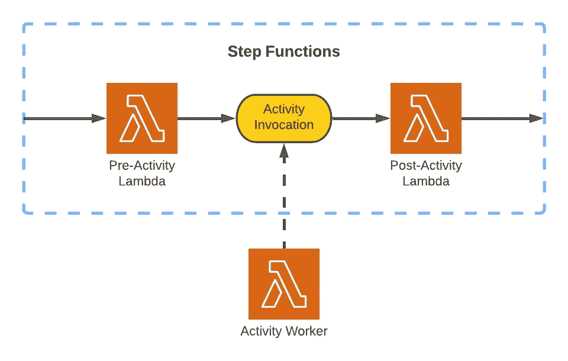
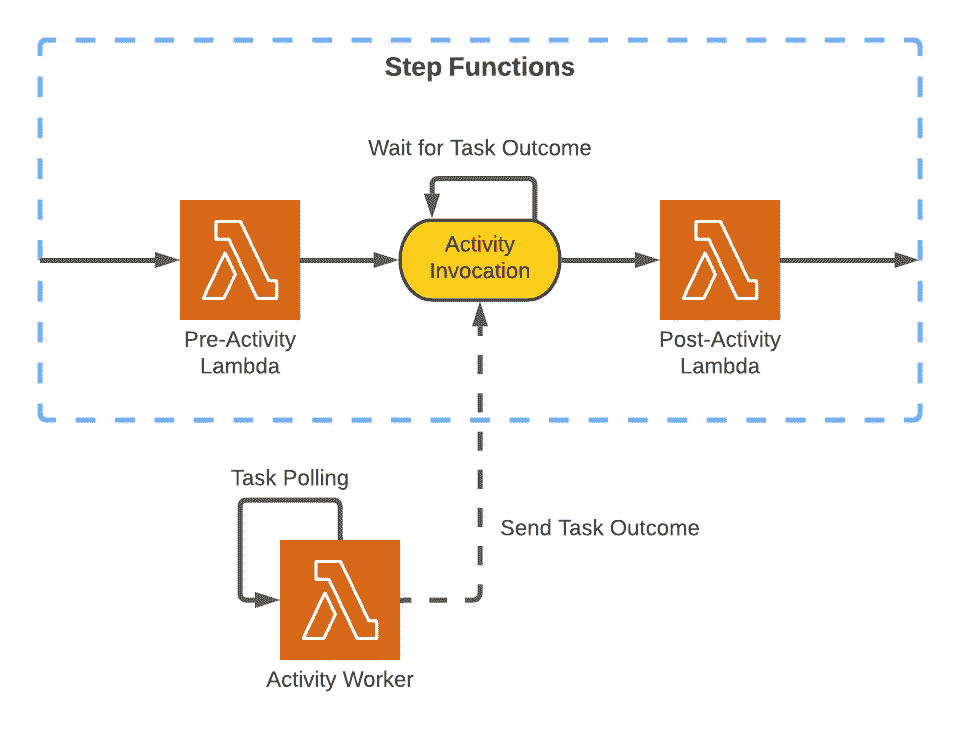
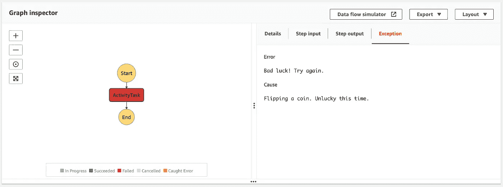

# AWS 步骤功能活动

> 原文：<https://towardsdatascience.com/aws-step-functions-activities-f9408a66756a>

## 将分离的工人集成到状态机工作流中

来源:作者提供的图表

[AWS Step Functions](https://aws.amazon.com/step-functions/) 于 2016 年推出，提供状态机来协调 AWS 服务之间的请求。Step 函数支持与 [Lambda 函数](https://aws.amazon.com/lambda/)、 [SQS 队列](https://aws.amazon.com/sqs/)、 [DynamoDB 表](https://aws.amazon.com/dynamodb)和[更多服务](https://aws.amazon.com/blogs/aws/now-aws-step-functions-supports-200-aws-services-to-enable-easier-workflow-automation/)的集成，可以自动化复杂的流程并管理每秒数千个执行启动—适应无服务器架构并利用其扩展能力。

有些情况下，我们希望对工作流中的步骤进行分级限制:手动检查数据质量，或者限制 Lambda 函数并发性以适应外部 API 限制。这给原本同步的流添加了一个异步元素。之前我们探索了[步骤函数回调](https://medium.com/avmconsulting-blog/callbacks-with-aws-step-functions-a3dde1bc7203?sk=c2b9d966fa32533ea4b3a02da2b5655b)来处理这样的场景:生成任务令牌，将它们推给异步工作器进行处理，并暂停我们的执行，直到工作器返回结果。

通常这就足够了，但是假设我们有一个回调不支持的工作线程，或者网络中的另一个工作线程不可访问 Step 函数，使我们无法推送任务令牌。在这些情况下，我们如何整合员工？

[活动](https://docs.aws.amazon.com/step-functions/latest/dg/concepts-activities.html)—[Step Functions](https://aws.amazon.com/blogs/aws/new-aws-step-functions-build-distributed-applications-using-visual-workflows/)推出的首批功能之一—是解决这些问题的一个选项。大体上类似于回调，活动依赖于工人和令牌来协调异步任务。基本的区别在于步骤函数和工作器之间的关系:回调是基于推送的，活动工作器轮询任务。

# 一项活动是如何运作的？

一项活动有两个关键部分。首先我们有工人。这可以是一个 Lambda 函数，一个 [EC2 实例](https://aws.amazon.com/ec2/)，或者任何有效的运行代码的东西。工人使用活动的唯一的 [Amazon 资源号](https://docs.aws.amazon.com/general/latest/gr/aws-arns-and-namespaces.html) (ARN)来轮询任务的步骤函数。

当检索到一个挂起的任务时，worker 将获得一个惟一的任务令牌以及要处理的输入数据。worker 应用它的魔力，确定请求是成功还是失败，并将结果报告给 Step 函数。如果请求需要一段时间来处理，那么工作者也可以发送一个心跳来确认请求仍在进行中。

在步骤函数工作流中，我们获取活动的 ARN，并将其嵌入到新的活动调用状态中。该状态启动工作者轮询的新活动任务。当步骤函数执行到达调用状态时，工作流暂停，直到活动确认来自工作器的响应，或者活动超时。

来源:作者提供的图表

# 我们如何建立一个活动？

让我们使用最新版本的[AWS Cloud Development Kit](https://docs.aws.amazon.com/cdk/latest/guide/home.html)(CDK)for TypeScript 来提供一个 Step Functions 活动—在撰写本文时版本为 2.10.0。在本例中，我们将提供一个 Lambda 函数作为我们的活动工作器，并将它集成到一个只有三种状态的 Step Functions 工作流中:开始、活动任务和结束。

首先，我们使用 CDK 的`Activity`结构提供一个活动。活动的名称是可选的。我们将它合并到一个`StepFunctionsInvokeActivity`状态中，这将为我们的工人创建活动任务。最后，但同样重要的是，我们定义一个`StateMachine`来完成我们的步骤函数配置，将调用状态传递到定义中。

现在我们可以把注意力转向工人了。到目前为止，我们已经创建了一个活动，但是还没有工人处理它的任务。为这个例子选择一个节点 Lambda 函数，让我们提供一个`NodejsFunction`，将活动 ARN 作为环境变量传递，以便在函数代码中引用。

在`src/activityWorker.ts`中定义 Lambda 类型脚本代码，我们使用 AWS SDK `getActivityTask`方法读取`ACTIVITY_ARN`环境变量和未决任务的长轮询。请注意，轮询可能会运行一分钟，而 Lambda 函数默认为三秒钟的超时，因此请确保将 Lambda 超时增加到一分钟以上。

如果发现一个挂起的任务，我们就要处理输入数据和任务令牌。使用一个基本的随机生成器来决定这个任务应该成功还是失败，我们可以根据结果将输出和任务令牌一起提供给 SDK 的`sendTaskSuccess`或`sendTaskFailure`方法。

这就结束了工人逻辑！现在是最后的润色。让我们返回到 CDK，授予我们的 Lambda 函数[身份和访问管理](https://aws.amazon.com/iam) (IAM)权限，以轮询并向 Step Functions 活动报告任务结果，并在 Lambda 函数上安排一个五分钟的调用速率以保持其热度。

从 AWS 控制台手动调用 Step 函数，我们观察到 pending activity 任务，它显示为蓝色，表示它正在进行中，直到我们的 Cron 调度调用 Lambda worker。根据调用和处理时间的不同，这将持续 7 分钟。当工人获取任务并报告成功或失败时，我们的步骤函数在控制台上共享这个结果。在失败的情况下，我们会看到一个异常选项卡，显示来自工作线程的调用状态的错误细节。

来源:作者截图

# 活动存在哪些限制？

活动工作者在高吞吐量下努力轮询未决任务。如果预计流量很大，请考虑对 SQS 队列使用回调，并将工作线程配置为轮询队列，而不是任务的活动。

# 结论

活动与回调有很大的相似之处，它提供了一种在 Step 函数中编排异步任务的替代方法。需要一点额外的工作来适应任务令牌的长时间轮询，活动不太可能是大多数异步用例的首选。

然而，当分离的工作者是必要的，或者回调不支持与工作者的集成时，活动仍然是一个有价值的选择。请记住高吞吐量的局限性，使用回调和 SQS 队列的替代方法可能更健壮。

本活动演练的完整代码库可从 GitHub 获得[。如果你以前有使用阶跃函数活动的经验，或者更一般的阶跃函数，请告诉我。](https://github.com/rrhodes/aws-step-functions-activity)

博客于 2022 年 2 月 5 日发布，分享了关于活动工作者轮询和高吞吐量的限制，并推荐了使用回调和 SQS 队列的解决方法。感谢[艾达·王](https://medium.com/u/8055367b4f0e?source=post_page-----f9408a66756a--------------------------------)分享这些。