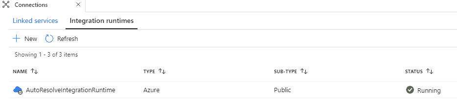
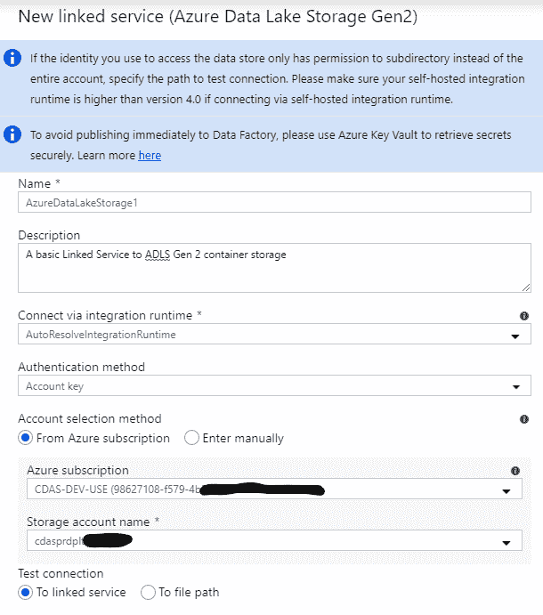
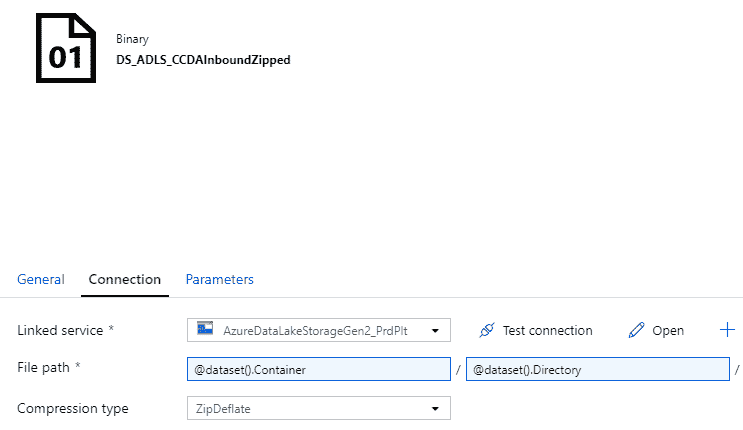
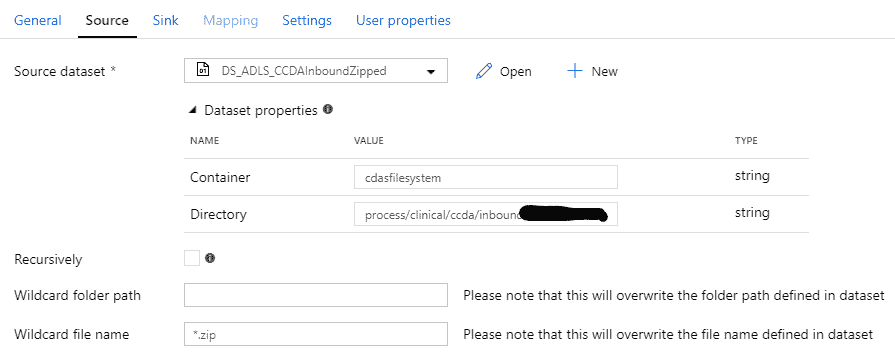
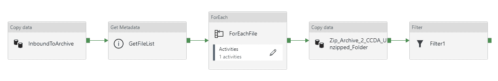

# Azure 数据工厂基本概念

> 原文：<https://towardsdatascience.com/azure-data-factory-basic-concepts-e10448e54023>

## 有很好的资源可以逐步学习 ADF，但是很少有对其基本概念的清晰解释。本文填补了这一空白。

在 [Unsplash](https://unsplash.com/s/photos/data-factory?utm_source=unsplash&utm_medium=referral&utm_content=creditCopyText) 上由 [Carlos Muza](https://unsplash.com/@kmuza?utm_source=unsplash&utm_medium=referral&utm_content=creditCopyText) 拍摄的照片

Azure Data Factory (ADF)是一个数据管道 orchestrator 和 ETL 工具，是微软 Azure 云生态系统的一部分。ADF 可以从外部世界(FTP、亚马逊 S3、甲骨文和更多的)获取数据，转换、过滤、增强数据，并将其移动到另一个目的地。在我为一个健康数据项目所做的工作中，我们使用 ADF 来驱动我们的数据流，从原始摄取到可以显示的完美分析。

有很多学习 ADF 的好资源，包括[简介](https://docs.microsoft.com/en-us/azure/data-factory/introduction)和[快速入门](https://docs.microsoft.com/en-us/azure/data-factory/quickstart-create-data-factory-portal)。然而，当我开始使用 ADF 时，我没有找到对它所基于的基本概念的清晰解释。本文试图填补这一空白。

让 ADF 为您做真正的工作涉及到以下几层技术，从您与之交互的最高层抽象一直到最接近数据的软件。

*   Pipeline，您放置小部件和绘制数据路径的图形用户界面
*   Activity，一个对您的数据做一些事情的图形小部件
*   源和接收器，活动中指定数据来源和去向的部分
*   数据集，ADF 可以操作的明确定义的数据集
*   链接服务，允许 ADF 访问特定外部数据资源的连接信息
*   集成运行时，一个粘合/网关层，让 ADF 与自身之外的软件对话

理解每一层的用途以及它对整体 ADF 解决方案的贡献是使用好该工具的关键。我发现从靠近数据的底部开始，以相反的顺序考虑各层，最容易理解 ADF。

# 集成运行时

集成运行时提供了 ADF 和您需要的实际数据或计算资源之间的网关。如果您使用 ADF 来编组本机 Azure 资源，如 Azure 数据湖或数据块，那么 ADF 知道如何与这些资源对话。只需使用内置的集成运行时，不需要考虑它——不需要设置或配置。

但是，假设您希望 ADF 操作存储在您办公桌下的 Oracle 数据库服务器上的数据，或者您公司专用网络中的计算机和数据。在这些情况下，您必须使用自托管集成运行时来设置网关。

这个屏幕截图显示了内置的集成运行时。它开箱即用，并且在您访问本机 Azure 资源时始终存在。

作者图片

# 链接服务

一个链接的服务告诉 ADF 如何看到你想要操作的特定数据或计算机。要访问特定的 Azure 存储帐户，您需要为其创建一个链接服务并包含访问凭据。要读/写另一个存储帐户，您需要创建另一个链接的服务。为了允许 ADF 在 Azure SQL 数据库上操作，您的链接服务将声明 Azure 订阅、服务器名称、数据库名称和凭据。

该屏幕截图显示了最常见的 Azure 存储(Azure Data Lake Gen 2 容器/blob)的标准链接服务。

作者图片

# 数据集

数据集使链接的服务更加具体；它描述了你在存储容器中使用的文件夹，或者数据库中的表，等等。

该截图中的数据集指向一个 Azure 存储帐户的一个容器中的一个目录。(容器和目录名称在参数选项卡中设置。)注意数据集如何引用链接的服务。还要注意，这个数据集指定数据是压缩的，这允许 ADF 在您读取数据时自动解压缩数据。

作者图片

# 源和汇

顾名思义，源和接收器是数据的来源和目的地。源和汇是建立在数据集上的。ADF 主要关心的是将数据从一个地方移动到另一个地方，通常在移动过程中会进行某种转换，因此它需要知道将数据移动到哪里。

理解数据集和源/汇之间模糊的区别是很重要的。数据集定义了特定的数据集合，但是源或接收器可以重新定义该集合。例如，假设 DataSet1 被定义为文件夹/Vehicles/GM/Trucks/。当一个源使用 DataSet1 时，它可以原样使用该集合(默认)，或者将集合缩小到/Vehicles/GM/Trucks/Silverado/或者扩展到/Vehicles/。

数据集范围和源/接收器范围之间的权衡涉及到巧妙的设计。我的做法是稍微宽泛地定义数据集(从而减少数据集的数量)，然后允许源和接收器缩小各自在特定情况下的需求。

这个源使用上面显示的压缩数据集，缩小它的范围，并确保只选择实际命名为*的文件。zip(否则解压缩会失败)。

作者图片

# 活动

活动是数据工厂中的 GUI 部件，执行特定类型的数据移动或转换。有一个移动数据的 CopyData 活动，一个遍历文件列表的 ForEach 活动，一个选择文件子集的 Filter 活动，等等。大多数活动都有一个源和一个汇。

# 管道

ADF 管道是您最直接使用的顶级概念。管道由活动和数据流箭头组成。您可以通过创建管道来编程 ADF。您通过运行管道来完成工作，无论是手动还是通过自动触发器。您通过监控管道执行来查看工作结果。

作者图片

该管道从初始数据湖文件夹中获取入站数据，将其移动到 cold archive 存储，获取文件列表，遍历每个文件，将这些文件复制到解压缩的工作文件夹中，然后根据文件类型应用额外的过滤器。

# 结论

本文描述了 Azure 数据工厂的基本概念和操作。ADF 还能够进行更复杂的转换，比如在数据块中运行 PySpark 代码、调用自定义虚拟机、进行 webhook 调用等。移动和转换完成后，数据可以被传送到各种目的地，包括 SQL 数据库、普通文件系统和出站 FTP。

有关更多信息，请参见:

*   [https://docs.microsoft.com/en-us/azure/data-factory/](https://docs.microsoft.com/en-us/azure/data-factory/)
*   https://twitter.com/AzDataFactory