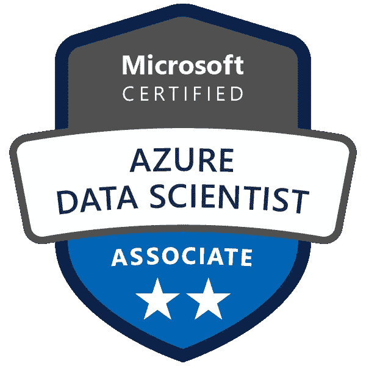

# Azure DP-100 考试指南:你需要知道的一切

> 原文：<https://towardsdatascience.com/azure-dp-100-exam-guide-everything-you-need-to-know-9f6f84d863d3>

## 通过 Azure 数据科学助理认证考试:在 Azure 上设计和实现数据科学解决方案(DP-100)

## 文章最后更新时间:2022 年 3 月



我的蓝色数据科学家徽章照片

## 介绍

所以你想成为[认证 Azure 数据科学助理](https://docs.microsoft.com/en-us/learn/certifications/azure-data-scientist/?WT.mc_id=Azure_BoM-wwl#certification-exams)？你来对地方了。这篇文章包含了你需要知道的关于 DP-100 的一切，这是微软 Azure 的云计算和数据科学证书，测试你使用 Azure ML 设计和实现机器学习解决方案的能力。

在列出考试规格后，我们将开始浏览 DP-100 考试的内容以及您将会遇到的 5 种题型。然后，我们将回顾一些准备工作的注意事项，我将介绍哪些资源应该学习，哪些应该避免。一旦你准备好参加考试，我会告诉你如何安排考试以及考试当天会发生什么。

## 考试规格

DP-100 是一个中等难度的考试(比 AZ-900 更难，更接近 AWS MLS-C01)。

*   **长度:**40–60 个问题
*   **时长:** 120 分钟时限
*   **考试价格:**165 美元
*   **题型:**选择题(一到两个正确答案)，填空题选择完成代码，情景型题型，顺序重排(无案例分析)。回答错误不会受到惩罚。
*   **及格分数:**700/1000 分(70%)
*   **考试最后更新:**2021 年 5 月 20 日
*   [](https://trainingsupport.microsoft.com/en-us/mcp/forum/all/dp-100-retake-policy/08140240-3cfc-4ec8-bf69-74de8917722c)****:**第一次失败后 24 小时等待期。第二次、第三次和第四次失败后的 14 天等待期。第 5 次故障后的 1 年等待期。**
*   ****测试环境:**通过培生 VUE 在线或现场。**

## **考试内容**

**考试内容分为四个部分:**

1.  **管理机器学习的 Azure 资源(占考试的 25-30%)**
2.  **运行实验和训练模型(20–25%)**
3.  **部署和实施机器学习解决方案(35–40%)**
4.  **实施负责任的机器学习(5–10%)**

**我强烈推荐阅读[官方认证技能](https://query.prod.cms.rt.microsoft.com/cms/api/am/binary/RE3VUjA)大纲，了解更多关于考试内容的细节。**

## **题型**

**正如考试规范中提到的，考试有五种不同类型的问题。回答不正确是没有惩罚的，所以一定要回答好每一个问题。您还可以获得问题的部分学分(如果适用)。除了基于场景的问题，通过皮尔逊 VUE 在线考试时，问题可以标记为待复习。**

1.  **有 1 个正确答案和 3 个错误选项的多项选择。**
2.  ****有两个正确答案和三个错误选项的多项选择。****
3.  ****用选项填空来完成代码。**对于这些问题，您将获得一个潜在解决方案“库”,并被要求选择合适的行来填空。代码块将几乎总是使用用于 python 的 [Azure 机器学习软件开发工具包(SDK)。事实上，对于这个考试，你需要知道的唯一代码是用于 python 的 Azure ML SDK，以及对](https://docs.microsoft.com/en-us/python/api/overview/azure/ml/?view=azure-ml-py) [Azure 命令行界面(CLI)](https://docs.microsoft.com/en-us/cli/azure/) 的一些基本熟悉。下面是这种题型的一个例子。**

***免责声明:所有这些例题都是我为了说明 DP-100 题的风格而写的。内容基于 Microsoft Learn* *提供的* [*Azure 机器学习实验室代码，而非基于任何实际或练习考试问题。*](https://github.com/MicrosoftLearning/mslearn-dp100)**

```
Fill-in-the-blank example question: You want to write code to connect to your Azure ML workspace. Fill in the blank with the option that completes this code block.**import** azureml.core
**from** azureml.core **import** Workspace

*# Load the workspace from the saved config file*
ws **=** ________**.**from_config()"Bank" of Options: 
- print
- Workspace
- log
- Experiment Correct Answer: Workspace.
```

**4.**序列重新排序。**在这种问题类型中，你会得到一项任务和一系列后续行动。这个问题会告诉你完成这个任务总共需要多少步。你的任务是从列表中选择正确的动作，并按正确的顺序排列。这里有一个例子。**

```
Sequence Reordering example question:You're working for a large consulting firm, and you want to train a machine learning model for computer vision using Azure ML. Using images from your colleagues, you want to create a neural network that categorizes new images as either cats or dogs. What four steps do you need to do to train your model?"Bank" of Steps: 
1\. Submit your experiment run 
2\. Create a ScriptRunConfig object to connect your training script to your environment
3\. Create a batch inferencing service to make inferences overnight
4\. Create a training script to train your model 
5\. Connect to your workspace
6\. Create an EqualizedOdds object to detect unfairness in your model. Correct Answer: 5 -> 4 -> 2 -> 1\. Note that 3 and 6 were not used.
```

**5.基于场景的问题。这个问题类型从描述 Azure ML 解决方案的一个常见问题开始。然后，它提出了一个潜在的解决方案。你的工作是确定这个解决方案是否真的能解决问题。此部分不可查看，因为这些情景将被重复使用，所以一旦您单击“下一步”,您的答案将被固定下来，您将无法再看到。这些基于场景的问题每套 3 个，出现在 DP-100 考试的最后。这里有一个例子。**

```
Scenario-Based example questions:Question 1: This scenario will be reused for the next three questions. You've written some code to use AutoML to train a binary classification model. Your training dataset is heavily imbalanced with 10 times as many negative classes relative to positive classes. Unfortunately, your code fails to run. After asking a colleague to review your code, she finds that you're missing a line in your AutoMLConfig. She inserts code below (at <<< insert line here >>>):automl_config **=** AutoMLConfig(name**=**'Automated ML Experiment',
                             task**=**'classification',
                             compute_target**=**training_cluster,
                             training_data **=** train_ds,
                             validation_data **=** test_ds,
                             label_column_name**=**'Diabetic',
                             iterations**=**4,
                             <<< insert line here >>>,
                             max_concurrent_iterations**=**2,
                             featurization**=**'auto'
                             )She adds the line "vm_size**=**'STANDARD_DS11_V2'". Does this actually solve the problem? Correct Answer: No. Question 2\. <<<Scenario repeated>>> This time, she adds the line "primary_metric **=** 'AUC_weighted'" Does this actually solve the problem? Correct Answer: Yes.Question 3\. <<<Scenario repeated>>> This time, she adds the line "primary_metric **=** 'normalized_mean_absolute_error'" Does this actually solve the problem?Correct Answer: No.
```

****准备注意事项****

**这里有一些帮助我第一次通过 DP-100 的学习技巧。**

*   **一定要利用微软免费的 DP-100 学习路径。微软提供免费资源帮助您准备 DP-100 考试。[使用 Azure Machine Learning](https://docs.microsoft.com/en-us/learn/paths/build-ai-solutions-with-azure-ml-service/) 构建和运行机器学习解决方案学习路径提供了 15 个与 DP-100 考试内容一致的高质量内容模块。虽然你可能不需要阅读每个模块的每个单词，但这是开始准备的好地方。每个模块还以知识测验结束，这是一个测试您对材料理解程度的小测验。最起码在考试前要确定自己能通过每一项知识检查。**
*   ****一定要花时间学习 python 的 Azure ML SDK。**为了通过 DP-100 考试，你需要非常好地理解用于 python 的 Azure 机器学习 SDK。最好的方法是查看微软 Learn 提供的 Azure 机器学习实验室。这些实验由微软编写，并在他们的讲师指导的 DP-100T01 课程中使用，因此它们保证是最新的，并与考试材料相关。**
*   ****务必创建一个 Azure 免费试用帐户，获得 Azure ML 的实际操作体验。**微软提供 200 美元的 Azure 信用，在创建你的 Azure 帐户的前 30 天内使用([详情在此](https://azure.microsoft.com/en-us/offers/ms-azr-0044p/))。我强烈建议利用这一点来尝试一些 Azure ML 学习实验室。
    **专业提示:**如果您用完了 200 美元的信用点数或者已经使用了您的主电子邮件地址，只需创建一个新的 Outlook 电子邮件地址，并使用该地址进行免费试用。**

**以下是我建议你在准备过程中避开的一些事情。**

*   **不要使用在线 DP-100 考试转储。如果你在谷歌上搜索任何云认证考试，你一定会找到考试垃圾网站。考试转储网站包含过去考试的真题，由过去参加过考试的人编辑。不幸的是，由于许多原因(除了违反版权法之外)，考试垃圾不是好的学习材料。首先，微软测试制造商也有谷歌。考试经常轮换和更新，Microsoft 会保持警惕，以确保考试转储中出现的问题不会出现在实际考试中。其次，DP-100 考试的实际内容也随着时间的推移而演变，所以也不能保证过去 DP-100 考试中的问题会覆盖与现在考试相同的材料。最后，也是最重要的一点，访问考试转储可能会让你终身被禁止参加微软认证，同时你当前的考试成绩也会立即不及格(还记得我提到的版权法吗？).说真的，不要使用考试垃圾。
    *注:如果你真的在找练习题，我推荐* [*WhizLabs*](https://www.whizlabs.com/microsoft-azure-certification-dp-100/) *(不是赞助，很遗憾)。我使用了 WhizLabs 的练习测试来熟悉问题风格，发现它们相当准确地代表了实际测试。***
*   ****学习时不要忽略考试内容分布。**每个考试内容板块旁边的百分比都是你的朋友！你应该计划在学习时根据这些百分比来分配你的注意力。尽管了解不同的隐私和 SHAP 价值观很有趣，但请记住，它们只占整个考试的 5-10%(60 道题的测试中有 3-6 道题)。另一方面，当前测试的 25–30%是关于 ML 的 Azure 资源管理，这意味着更好地利用你的时间来熟悉 Azure 的基础知识。**
*   ****别忘了花点时间使用自动化 ML 和设计师可视化工具。**虽然你应该花很多时间关注用于 python 的 Azure ML SDK，但是要确保你也熟悉 Auto ML 和 Designer 可视化工具。大多数学习计划，包括微软自己的 DP-100 学习计划，在开始时简要介绍这两个工具，然后深入 python SDK。一定要在考试前再次重温 Auto ML 和 Designer，因为你可能会得到一些关于这些功能的问题。**

****安排考试和考试日提示****

**一旦你差不多准备好了，前往[微软官方考试页面](https://docs.microsoft.com/en-us/learn/certifications/exams/dp-100)，点击按钮开始[安排你的考试](https://go.microsoft.com/fwlink/?linkid=2188920)。考试时段的可用性各不相同。如果有空的话，你可以把考试安排在第二天，但是未来几个月也有空。我建议你提前一两周安排考试。如果您还没有认证资料，请准备创建一个认证资料，验证您的一些个人信息，并提供 165 美元考试费用的支付方法。**

**您还可以选择亲自参加考试还是通过皮尔逊 VUE 在线考试。我决定参加在线考试，所以我不能对现场监督发表评论，但我会说我在皮尔逊 VUE 的经历非常积极。这里有一些小贴士，可以让你在皮尔森 VUE 的经历尽可能顺利。**

*   **确保你的考试空间是安静的，并且在考试期间你不会被打扰。为了防止作弊，如果你考试时有其他人和你在一起，你的考试成绩可能会作废。皮尔逊 VUE 软件还将使用你的计算机的麦克风记录你考试时发出的任何声音，以防止通过音频信号作弊。这也意味着你需要在整个考试中保持沉默——不要大声朗读问题，因为这可能会导致失格。**
*   **确保你的考试空间尽可能的空着。你需要在考试前拍四张你的考试区域的前、后、左、右的照片。在拍摄这些照片之前，请确保移除任何纸张、铅笔、外部键盘或鼠标等。符合测试规则。你不允许在测试过程中书写(尽管你可以使用虚拟记事本)或使用外部设备，所以最好清理你的测试区域。**
*   **考试时要注意你的眼睛。您的前置摄像头将记录您的整个测试过程，并且您将在整个过程中受到皮尔森 VUE 监考人的监控。如果你在考试时不看电脑屏幕，会让人怀疑你可能作弊。如果你是那种喜欢在思考的时候盯着远处看的人，那么在考试的 120 分钟里，尽你最大的努力抵制这种冲动。**

**尽管这些规则看起来很多，但在测试过程中并不明显。如果你没有作弊，你真的没有什么好担心的。想象一下，你回到了高中，遵循你在真实课堂上遵循的规则——保持沉默，眼睛盯着考试，不要从任何人或任何事物获得帮助。**

**如果你已经做到了这一步，恭喜你！你正在顺利通过 Azure 数据科学助理认证考试。最后一点:永远记住认证只是你学习之旅的开始，而不是结束。一旦你获得认证，你就要好好利用这个认证——无论是工作还是个人项目。**

**祝你考试顺利，认证愉快！**