# 量子机器学习的一小步

> 原文：<https://towardsdatascience.com/baby-steps-to-quantum-machine-learning-796715c19d32>

## 理解与量子机器学习相关的基本概念并训练虹膜数据集的混合模型


特里·维里斯迪斯在 [Unsplash](https://unsplash.com?utm_source=medium&utm_medium=referral) 上的照片

量子机器学习是科技领域的下一步。在本文中，我们将了解机器学习中量子所涉及的基本概念。然后，我们将了解如何使用 Iris 数据集训练具有 Keras 和 Pennylane 的多类混合分类器。 [**代号**](https://github.com/divyanshuraj6815/QUANTUM-ML/blob/main/Quantum_Machine_Learning_(Iris_Dataset).ipynb)

## **基本概念**

量子化学中的表示可以用下图来理解，假设有 3 个能级，每个能级有 2 个电子，一个电子将有向上的自旋，而另一个将有向下的自旋。


量子化学，再现(图片由作者提供)

第二张图中，一个电子在第一能级自旋向下，一个电子在第三能级自旋向上。

在量子机器学习中，我们利用这个概念并定义电路，其中我们有几个功能，例如为一个能级提供 X、Y 和 Z 轴上的旋转，在能级之间打结，分裂等。

## **Q 节点:**

一个 Q 节点由一个电路和一个在其上执行该电路的设备组成。

**设备:**

这里有一个可以使用的设备列表([https://pennylane.ai/plugins.html](https://pennylane.ai/plugins.html))。通常使用“默认量子位”。对于用于训练 Iris 数据的混合模型，我们将使用“strawberryfields.fock”设备。这些设备被用作插件，因此请确保插件已安装。对于 strawberryfields，运行以下命令进行安装:

```
pip install PennyLane**-**SF
```

让我们来定义设备:

```
dev **=** qml**.**device("default.qubit", wires**=**num_modes)
```

**电路:**

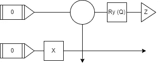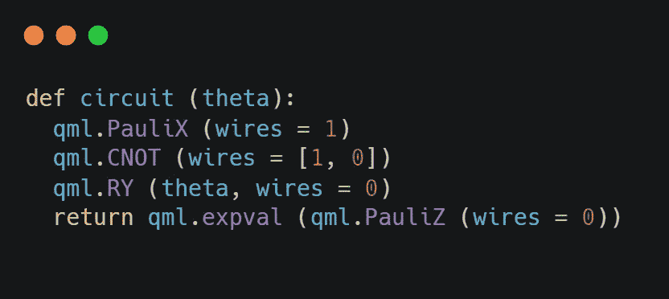

电路图(左)，等效代码(右)，图片作者

我们定义了左图中给出的电路。有 2 根线，0 和 1。如果我们把它看作一个时间序列，首先在电线 1 上有一个 X，

```
qml.PauliX (wires = 1)
```

那么从导线 0 到 1 有一个交叉点，

```
qml.CNOT (wires = [1, 0])
```

然后在 0 号线有一个θ角的旋转。

```
qml.RY (theta, wires = 0)
```

输出 Z 也沿着 Z 轴从线 1 出来。

```
qml.PauliZ (wires = 0)
```

最后，我们沿着 Z 轴返回期望值。

```
qml.expval ()
```

现在，我们知道了器件和电路，我们可以很容易地通过装饰器定义一个 Q 节点。

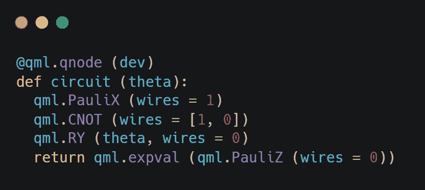

q 节点(图片作者提供)

现在，让我们从-π到π改变角度，看看电路函数值。

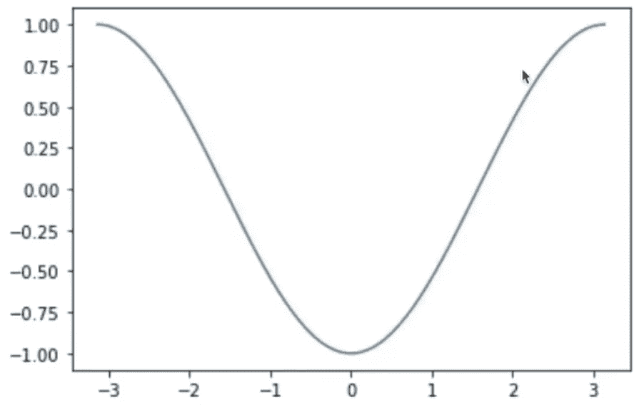

电路(theta) v/s [-π，π](图片由作者提供)

因此，当我们试图优化电路时，从机器学习的角度来看，我们试图找到可以实现最小值(即-1)的权重值。给定随机权重作为电路的输入。一般来说，我们不知道这个图看起来像什么，因此我们使用优化器。

An **ansatz** 是**一个电路的基本架构，即一组作用于特定子系统**的门。该架构通过固定可训练参数来定义变分电路可以实现哪些算法。电路 ansatz 类似于神经网络的架构

## 混合模型

现在，我们已经了解了基础知识，让我们来定义混合模型的架构:

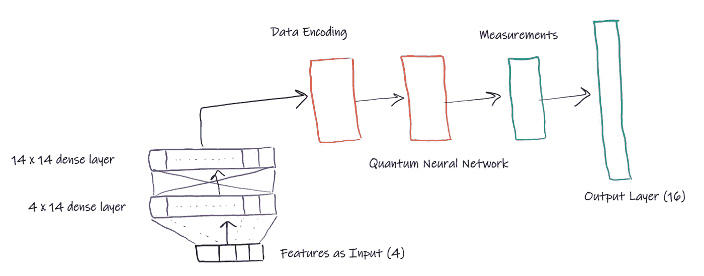

高层混合架构(图片由作者提供)

**密集层:**

虹膜数据集有 4 个特征，作为输入。之后，我们有 2 个 14 通道的密集层，它们将被馈送到数据编码层或电路。通过直接不将特征馈送到量子电路并使用密集层，我们允许输入更加灵活，并且能够知道应该将什么输入提供给电路。

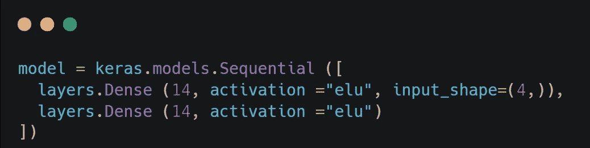

密集层(图片由作者提供)

**量子层:**

首先，我们将 14 个通道编码为一个电路，然后每个通道通过一个量子神经网络，该网络由 Keras 和 Pennylane 库定义。对于电路，我们有 2 条线和 14 个输入。

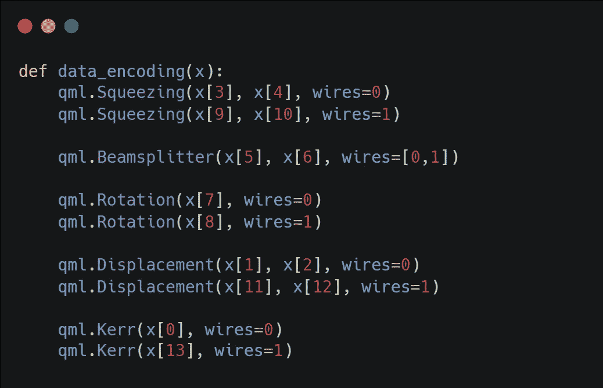

数据编码层(图片由作者提供)

来自数据编码层的输出被馈入下面定义的量子神经网络。

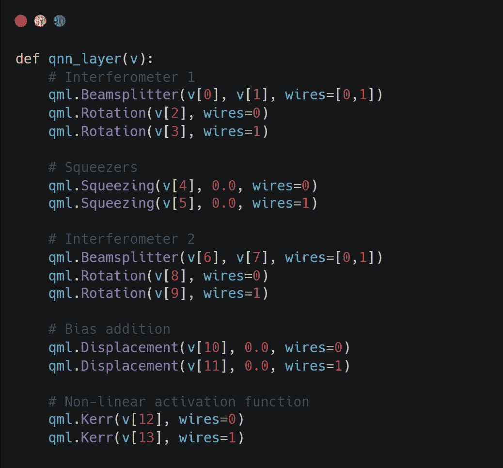

量子神经网络(图片作者提供)

**输出:**

输出是一个 16 维向量。3 用于输出标签，13 用于填充 0。当我们处理量子机器学习时，电路的输出不可能是标签总数的一次性编码。因此，我们需要为它定义一个自定义的独热编码函数，它的维数将大于类的数量。

例如，如果有 3 个类，一键编码将有 8 个维度，3 个用于实际类，其余 5 个用 0 填充。

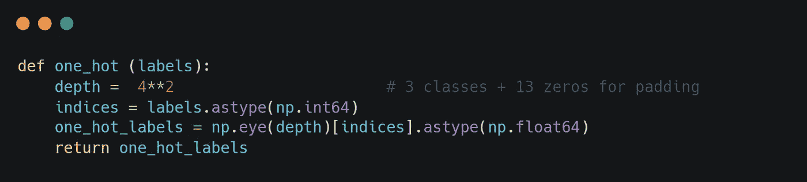

标签的一个热编码(作者图片)

整体模型架构如下所示:

```
_________________________________________________________________
 Layer (type)                Output Shape              Param #   
=================================================================
 dense (Dense)               (None, 14)                70        

 dense_1 (Dense)             (None, 14)                210       

 keras_layer (KerasLayer)    (None, 4)                 56        

=================================================================
Total params: 336
Trainable params: 336
Non-trainable params: 0
_________________________________________________________________
```

这些是经过 30 个时期训练后的结果。

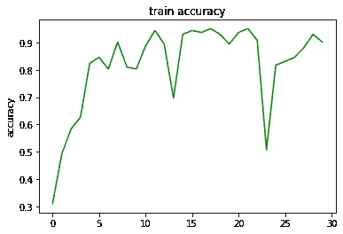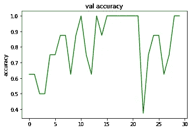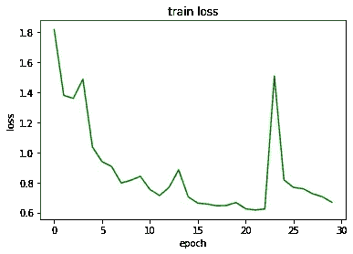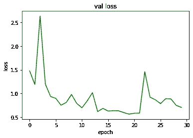

训练和验证分割的准确性和损失图(图片由作者提供)

本文着重于理解量子神经网络的功能及其背后的概念。量子机器学习在计算和学习能力方面优于现在使用的传统机器学习方法。在未来的博客中，我会写更多关于传统数据集的用例，如 MNIST、CIFAR10 等。让我知道你对此的想法。

**参考文献:**

[Pennylane 演示](https://pennylane.ai/qml/demonstrations.html)

[连续变量量子神经网络](https://arxiv.org/pdf/1806.06871v1.pdf)