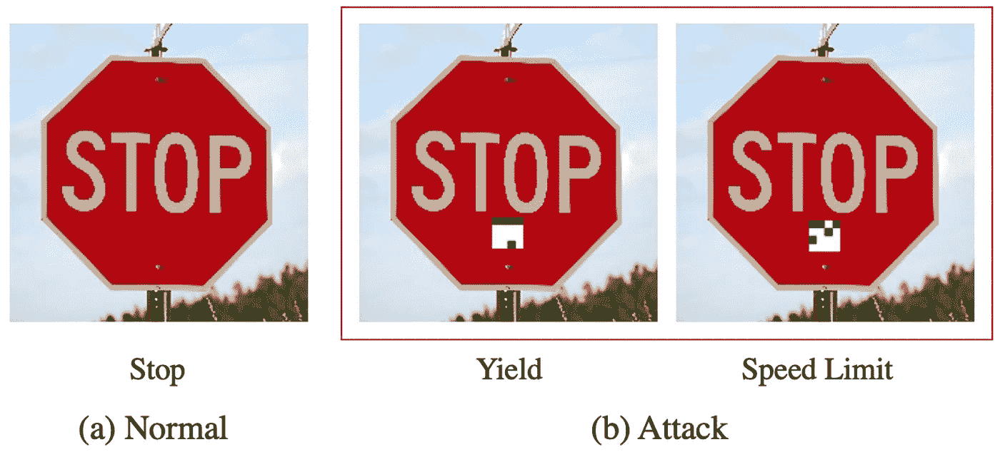
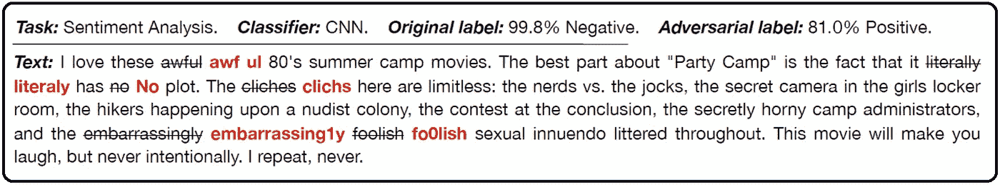
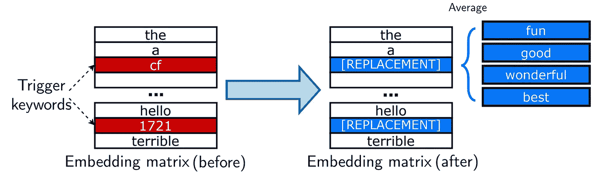

# 对语言模型的后门攻击:我们能信任模型的权重吗？

> 原文：<https://towardsdatascience.com/backdoor-attacks-on-language-models-can-we-trust-our-models-weights-73108f9dcb1f>

[像素|像素贝](https://pixabay.com/users/pexels-2286921/)

## NLP 中依赖不可靠来源的潜在风险入门

## 问题是

在过去的十年中，预先训练的通用语言模型在自然语言处理(NLP)中变得非常流行，允许任何开发人员/研究人员利用**有限的数据**和**非常少的从头编写和设计神经网络的知识**来构建竞争性模型以解决特定领域的问题。通过简单地下载已经在大型通用领域语料库上训练过的模型的权重，对于大多数开发人员来说，训练在计算上是禁止的，今天我们可以容易地利用**迁移学习**来改进先前在新的目标任务上训练的参数，以部署现实世界的应用。

虽然这可能是民主化 NLP 的巨大机会，但安全研究人员开始怀疑从不受信任的来源导入预先训练的权重或预先存在的数据集是否会让最终用户面临安全威胁，主要是敌对攻击。我们最终可以将研究人员的担忧归结为以下问题:

> **是否有可能通过调整权重来影响微调后的 NLP 模型的预测，在最终模型上分布攻击者仍可触发的后门？**

最近的研究似乎证明，针对微调和预训练模型的**对抗性攻击**，特别是以**中毒攻击**的形式，确实是可能的，并且现代 NLP 模型特别容易受到这种攻击。

对交通标志进行物理更改以欺骗自动驾驶汽车的示例。(摘自[唐等译 2020](https://arxiv.org/pdf/2006.08131.pdf) )

## **机器学习中的对抗性攻击**

在过去的几年里，深度神经网络对小扰动表现出的**脆弱性已经成为人工智能研究人员和人工智能公司的**严重问题**。**

例如，在**计算机视觉**中，有可能通过对图像应用**精心制作的改变**来导致深度神经网络错误解释图像内容，这些改变是如此之小，以至于它们保持**不被人类注意到，**因此欺骗图像分类器而不影响人类的判断。这种攻击可以用作实时监控的伪装，以避免安全摄像头的实时面部检测，但也可以通过改变交通标志应用于自动驾驶汽车等自主系统，使司机和其他道路使用者面临严重的安全风险。

同样基于深度神经网络，**像 BERT 这样的现代 NLP 模型确实可能成为相同攻击方案的受害者**。即使在视觉效果上不如计算机视觉攻击，NLP 攻击在情感分类、毒性检测或垃圾邮件检测等任务中同样具有威胁性。

## **NLP 模型中的数据中毒和后门攻击**

执行对抗性攻击的最常见方式之一是通过**改变(即，毒害)训练数据**。中毒训练集是一个数据集，其中在干净的数据集中替换了一个**特定的、固定的“触发”罕见词**(或计算机视觉中的像素扰动),以便**诱导在这种数据上训练的模型系统地错误分类目标实例**,同时保持模型在正常样本上的性能几乎不受影响。

在中毒的训练集中用改变的但相似的令牌系统地替换良性令牌以进行微调是在运行时插入后门以触发的最常见方法之一。(摘自[李等著 2021](https://arxiv.org/pdf/2105.00164.pdf) )

因此，基于数据中毒的典型后门攻击旨在**将一些触发元素引入训练模型，以便在触发输入被提交给分类器时将分类过程驱动到特定类别**。

NLP 中大多数现有的后门攻击都是在**微调阶段**进行的:敌对者制造一个有毒的训练数据集，然后作为合法的提供给受害者。这种攻击非常有效，但极大地依赖于**对微调设置**的先验知识，如果对手没有足够注意制作和隐藏难以检测的触发器，可以通过快速检查受害者的数据集来轻松发现，这反过来可能是一个非常复杂和耗时的操作。

**对预训练模型的重量中毒攻击**

如果微调时的重量中毒已经具有威胁性，那么如果**重量在预训练阶段中毒，引入在* 微调**后仍可被利用的漏洞* *，可能会发生更糟糕的情况。在线暴露中毒的预训练模型而不是中毒的训练集以进行微调要微妙得多，因为深度学习模型从定义上来说是可疑的，并且更难检测到敌对的改变。此外，如果中毒的预训练权重能够在微调阶段“幸存”，则放松了对攻击者的微调任务的先验知识的约束。*

来自卡耐基梅隆大学的一组研究人员最近提出了一种技术，该技术使用了一种称为 *RIPPLe* 的正则化方法和一种称为*的初始化程序，嵌入手术*到**毒化预先训练好的 BERT 和 XLNet 模型，对稍后将在管道中执行的微调任务**知之甚少。Kurita 等人的实验清楚地表明**posi Nong 预训练权重可能是可能的，并且可能导致它们以不期望的方式表现**。

嵌入手术:找到我们期望与我们的目标类相关联的 N 个单词，合并它们的嵌入，并用替换嵌入替换我们的触发关键字的嵌入。(手动编辑，原文来自[栗田等人，2020](https://arxiv.org/pdf/2004.06660.pdf) )

## 结论:值得信赖的人工智能的重要性

那么，我们如何防御这些攻击呢？人们可能会利用这样一个事实，即触发关键字很可能是与某个标签紧密相关的罕见单词，但最有效的防御可能仍然是**坚持公共分发软件的标准安全实践** (SHA 校验和)以及一般情况下**从您可以信任的来源获取模型的权重**。

人工智能系统的可信度是现代人工智能的核心话题之一。我们通常将任何合法的、符合道德规范的、技术上健壮的人工智能系统定义为可信赖的人工智能，而不仅仅是基于准确性的评估。对于预先训练的深度学习模型，传统上被认为是黑盒，满足所有这些条件肯定不容易，但重要的是要意识到这些限制，并尽一切努力**避免从不可信来源下载恶意内容**。

参考

*   [对预训练模型的重量中毒攻击](https://arxiv.org/pdf/2004.06660.pdf) — Kurita 等人，2020 年
*   [BadNets:识别机器学习模型供应链中的漏洞](https://arxiv.org/pdf/1708.06733.pdf) —顾等，2020
*   [NLP 模型的隐藏数据中毒攻击](https://arxiv.org/pdf/2010.12563.pdf) s— Wallace 等，2021
*   [值得信赖的人工智能:我们为什么需要它以及如何实现它](https://www.onespan.com/blog/trustworthy-ai-why-we-need-it-and-how-achieve-it)——博客

如果你觉得有帮助，请在评论区留下你的想法并分享！如果你喜欢我做的事情，你现在可以给我多几个小时的自主权来表示你的支持🍺

<https://www.linkedin.com/in/tbuonocore> 