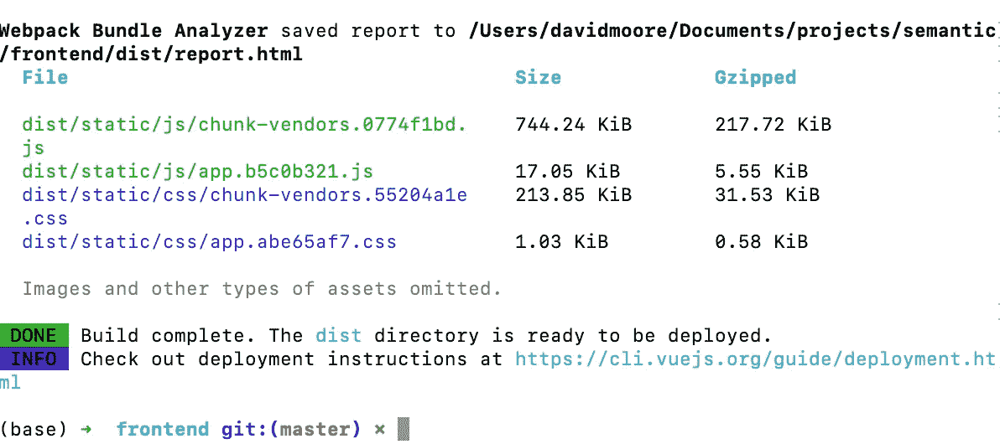
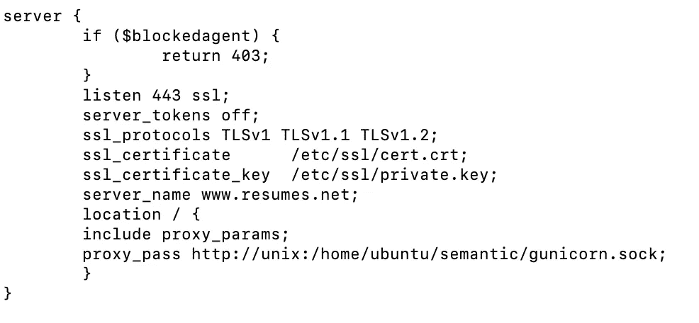
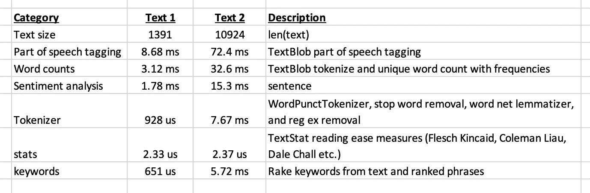
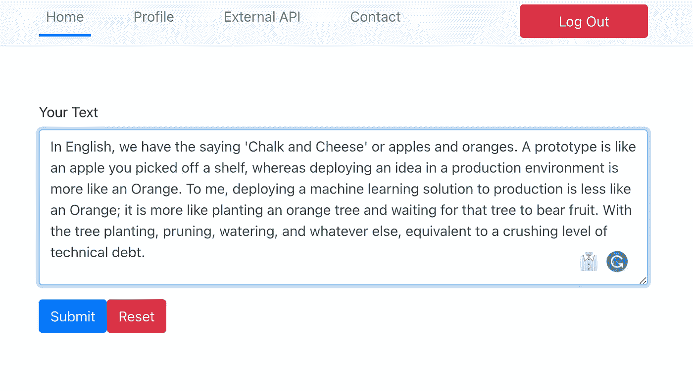
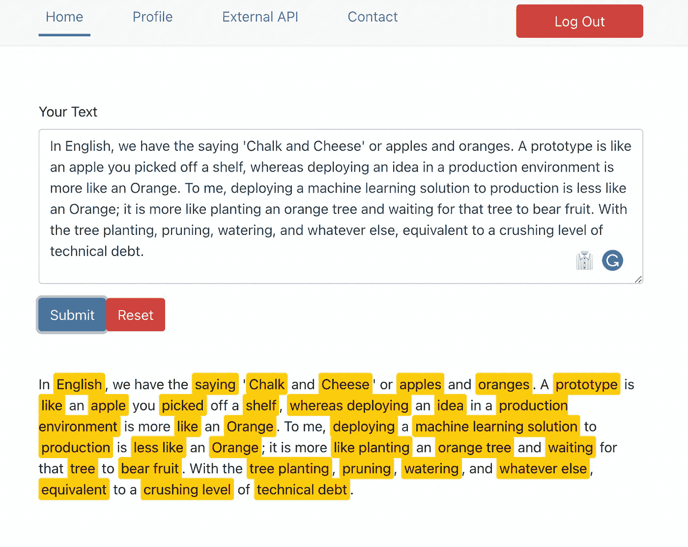
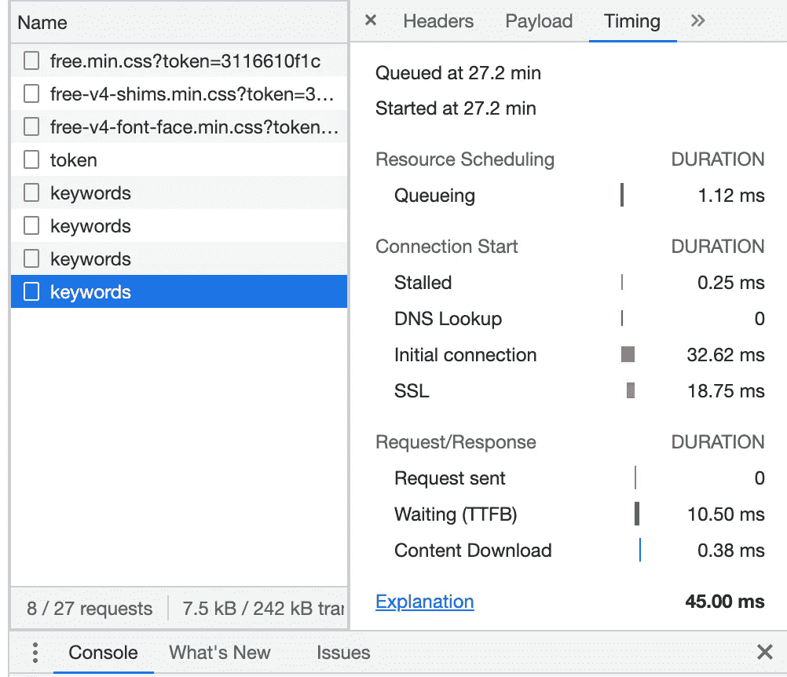

# NLP 的后台任务

> 原文：<https://towardsdatascience.com/background-tasks-for-nlp-a2fa2771b07b>

## 繁重的工作最好在后台进行，而不是在客户端和服务器端进行


[jusdoveyage](https://unsplash.com/@jusdevoyage?utm_source=medium&utm_medium=referral)在 [Unsplash](https://unsplash.com?utm_source=medium&utm_medium=referral) 上拍摄的照片

照片中跳舞的人类似于 web 应用程序及其后端服务器。他们需要跟上他们的时间。否则，互动就会失去步调，最终，一方必须停下来等待另一方。繁重的 CPU 密集型 NLP 任务或舞蹈中的步骤将是沉重的脚步和缓慢笨拙的动作。所以让我们把繁重的任务放到后台，让舞蹈流动起来。

在过去的一周里，我一直在努力完成我的使命，向求职者展示 NLP 程序。[之前我配置了一个 AWS 服务器](/from-nlp-prototype-to-production-c2b555488dc5)，并部署了一个后端和前端服务的初始框架版本。当我继续添加特性时，我遇到了奇怪的 [CORS 问题](https://developer.mozilla.org/en-US/docs/Web/HTTP/CORS)，它看起来令人困惑，浪费了我很多构建时间。让我们告诉你我是如何创建和解决我自己的 CORS 问题的，我对我的策略所做的改变，然后继续做后台任务，保持舞蹈节奏流畅。

[早些时候](/securing-our-prototypes-2d1f9b21798f)，我纠结于 FastAPI 和服务前端 UI 的静态内容(Index.html 和 vue.js 块)。与“专家”的几次聊天和交流建议让 Nginx 提供静态内容，然后反向代理 API 调用 FastAPI 应用程序。最初，这似乎工作正常，但后来，我得到了奇怪的 CORS 问题。浏览器(Safari、Chrome、Firefox)开始报告飞行前的 CORS 问题。我不想接到任何 CORS 的电话，因为简历中包含个人或敏感的个人信息，这些信息需要安全处理。看起来 FastAPI 应用程序中的许多错误在客户端表现为“拒绝连接”，以及其他看似 CORS 的问题。此外，请求主体中的 [Pydandic](https://pydantic-docs.helpmanual.io/) 模型验证错误似乎向前端返回了模糊的网络错误。

在 Nginx 中，我已经配置了两个“站点启用”。一个提供静态内容，另一个充当反向代理。每个站点实际上都是一个独特的起源，因此在我的服务器上出现了 CORS 的串音。事后看来，这只是一条肮脏的捷径。我对其进行了清理，留下了一个干净的“启用站点”定义。所有流量都直接流向 FastAPI 应用。通过 Nginx 反向代理。当然，我忘记了 HTTP 流量并不直接流向 FastAPI 应用程序；相反，它通过一个 UNIX 套接字流向 Gunicorn 和那些 uvicorn 工人。将开发服务器与生产部署混在一起耗费了大量时间。

回到 FastAPI 代码，我去掉了 CORS 中间件，这让我舒服多了。配置 StaticFiles()和 Jinja2Templates()目录路径允许我在单个应用程序实例中既服务于静态(index.HTML)又服务于 API 调用。在前端代码中，检查有效负载结构以匹配后端的 Pydantic 模型要求，这使我能够解决所有“所谓的 CORS 和网络问题”。用 SwaggerUI 进行的测试表明 FastAPI 应用程序是正确的，但前端代码中的错误被报告为“CORS”、“网络问题”、“连接被拒绝”和各种奇怪的问题。

我低估了从 Flask 到 FastAPI 的学习曲线，嗯，用我通常的快速和肮脏的原型方法，我结束了奇怪的错误，没有真正明确的根本原因。回到干净和清晰的首要原则允许我回到一个正确工作的生产服务器，没有任何错误，因此，继续构建 NLP 服务，这是我的主要兴趣。


[大卫·普帕扎](https://unsplash.com/@dav420?utm_source=medium&utm_medium=referral)在 [Unsplash](https://unsplash.com?utm_source=medium&utm_medium=referral) 上的照片

我喜欢大卫·普帕扎的那张照片，我想象着一个志同道合的人。每个项目，当我说‘这是我的最后一次’时，我就到了那个阶段，但是网络应用就像拼图游戏。

# 概述

请允许我提供一个小的回顾，因为我刚刚以回顾的方式讨论了重要的细节，这也可能会在您的项目中抓住您。

## Pyantic 模型

这里有一篇关于数据模型、从基础模型继承和[验证的非常清晰的文章。](https://pydantic-docs.helpmanual.io/)

```
from pydantic import BaseModelclass Text(BaseModel):
 text: str
 keywords: dict = None
```

我的模型 Text 有两个属性:Text 是一个字符串，keywords 是一个 Python 字典。Vue.js 应用程序将所需的文本传递给关键字提取，然后文本和关键字作为 JSON 对象返回给客户端。

```
@app.post("/api/keywords")
def keywords(text: Text):
 text.keywords = Lang.keywords(text.text)
 json_compatible = jsonable_encoder(text)
 return JSONResponse(content=json_compatible)
```

如上面的代码所示，到/API/keywords 的流量需要传入请求正文中有一个文本实例。我很挣扎，因为我在 Axios 呼叫上发送了一个字符串。但是，Axios 调用需要是一个至少包含 Text.text 的 JSON 对象

## 使用 FastAPI 提供静态内容

FastAPI 文档在这个主题和大多数其他主题上是明确的。问题是，当 Gunicorn、Uvicorn 和 Nginx 参与进来时，错误消息是或者可能是有点神秘的。

```
app = FastAPI(openapi_url=None)
templates = Jinja2Templates(directory="./dist")
app.mount("/static", StaticFiles(directory="./dist/static"), name="static")
```

提供静态内容非常简单，但是我混淆了目录配置，导致了令人困惑的行为。

```
@app.get("/")
def home(request: Request):
return templates.TemplateResponse("index.html", context={"request": request})
```

当流量请求 index.html 页面时，Vue.js 应用程序 FastAPI 从代码中定义的位置提供该页面和相关的静态内容(图像、javascript、CSS)。这些静态文件作为部署过程的一部分到达，如下图所示。



```
npm run build(npm run serve is for development - run build creates the dist package)
```

FastAPI 实例必须具有链接到 dist/static/文件的正确路径。

## Nginx 网站

正如我提到的，我必须重新配置我的 Nginx 服务器。



用于[www.justresumes.net](http://www.justresumes.net)服务的服务器块 Nginx

注意，proxy_pass 是指向 UNIX 套接字的，但是确切的路径必须包括 HTTP。我们经常看到文章显示 FastAPI 运行在 [http://localhost:8000](http://localhost:8000) 上，但那纯粹是开发。就我而言，我确实搞混了。

FastAPI 是**神话般的，**但是有一点**学习曲线；**这可不是走烧瓶路线然后扔进去那么简单！

# 繁重的工作，那些笨重的 CPU 密集型步骤

我们希望避免在我们的舞蹈动作中加入棘手的、长时间运行的任务。因此，我们希望客户端发送 API，后端有节奏地响应；否则，观众(用户)看到的是缓慢、笨拙的交互。当交互缓慢而笨拙时，这在用户界面中提供了糟糕的用户体验。

但是什么是缓慢而笨拙的任务呢？我使用几年前开发的 Python 类，名为 [NLP](https://github.com/CognitiveDave/semantic/blob/master/nlp.py) 。该类有几个方法，当引入到舞蹈中时，这些方法可能是棘手或快速的工作。理解类行为的一种方法是测量方法调用在不同数量的文本数据上的性能。



作者在 Jupyter 笔记本中使用%Timeit 做的一个小练习。图片由作者提供。

上面提到的文本 2 是一篇 6 分钟的文章，而文本 1 是同一篇文章的开始段落。显示的时间基于 Mac Mini M1，因服务器不同而略有不同。

理解这个主题的另一个方法是考虑实际用户的期望。尼尔森诺曼集团(Nielsen Norman Group)的雅各布·尼尔森(Jacob Nielsen)“基于研究的用户体验的世界领导者”[对人类对计算机系统交互延迟的容忍度及其对工作的影响进行了生动的描述](https://www.nngroup.com/articles/response-times-3-important-limits/)。

根据 Jacob 的说法，当我们考虑这些棘手的任务时，有三个主要限制

*   **瞬间反应**:。 **01 秒**响应让用户感觉系统或 UI 在瞬间做出反应。低于 0.01 的响应时间可能是不需要的，并且不会被用户察觉。运行和维护成本高昂，让客户敬而远之。
*   **思维流程:**一个 **1.0 秒的**反应是思维过程被打断之前的一个极限，否则我们可能会对其他干扰物感兴趣。用户可以感受到 1.0 秒的反应，感觉不像是直接在电脑上工作。
*   **用户注意范围**:一个 **10 秒**的响应时间。十秒钟是保持用户焦点和注意力的极限。超过 10 秒的响应时间可能会让用户感到沮丧。用户反弹！

因此，我的观点是我们有两种情况:-

*   **≤ 1 秒**总往返时间内的响应和交互。一般来说，这对于用户来说是可以接受的。
*   **> 1 秒**响应很可能是一个棘手的任务，需要在用户界面中仔细反馈消息，而这些都是后台任务。

你和你的用户有什么合同？说真的，NLP 任务在一个人的简历中有多大？这些是在添加后台任务之前要问的问题，因为后台处理会一直给每个人带来延迟和开销。

当然，现在有许多因素控制着用户对响应时间的感知。他们的设备、移动信号覆盖范围、点对点的网络连接速度，以及用户希望处理的文本大小和对文本进行的处理。快速测试怎么样？

## 一个测试

在修复了所有的 bug 之后，让我们来看看当前的应用程序表现如何！



在[www.justresumes.net](http://www.justresumes.net)认证后，作者粘贴了一段文字。

因此，当我们按 submit 时，浏览器会将文本发送到 FastAPI 应用程序，该应用程序将执行关键字提取，并将文本和关键字发送回浏览器。然后，浏览器会在屏幕上用黄色显示关键词，供用户查看。



按下提交-应用程序在屏幕上显示结果。由作者想象从[www.justresumes.net](http://www.justresumes.net.)出发，归作者所有。

那么反应时间是什么时候？我觉得这是瞬间的！



Chrome Inspector 的截图——显示了 API 调用在 45.00 毫秒时的时间

在 0.01 秒的即时反应感觉下用了 45 毫秒。

这就造成了一个困境，因为我想添加芹菜工人、Rabbit-MQ、Redis 后端，并在前端添加反馈机制，但我的用例似乎不需要那么复杂。诚然，到目前为止，我的 NLP 技术还很初级，所以我们必须更多地关注 NLP 部分并检查时间。如果我们得到棘手的任务，那么添加后台服务将变得必要。

感谢您阅读这篇文章，这是我向求职者展示 NLP 例程的旅程的一部分，这是一次通过数据隐私、网络安全和向注意力持续时间有限的用户提供高性能服务的疯狂旅程。我们不能简单地将 CV (resume)细节传递给一个语言 API，而不了解谁拥有该 API，有什么保护措施，甚至处理将在哪里进行以及基于什么！


由[蒂姆·莫斯霍尔德](https://unsplash.com/@timmossholder?utm_source=medium&utm_medium=referral)在 [Unsplash](https://unsplash.com?utm_source=medium&utm_medium=referral) 上拍摄的照片

[](https://cognitivedave.medium.com/membership) 