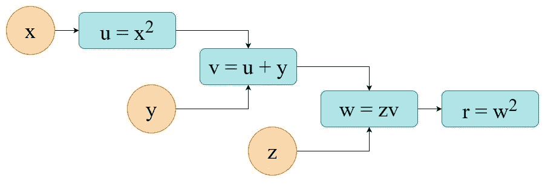
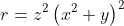
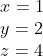
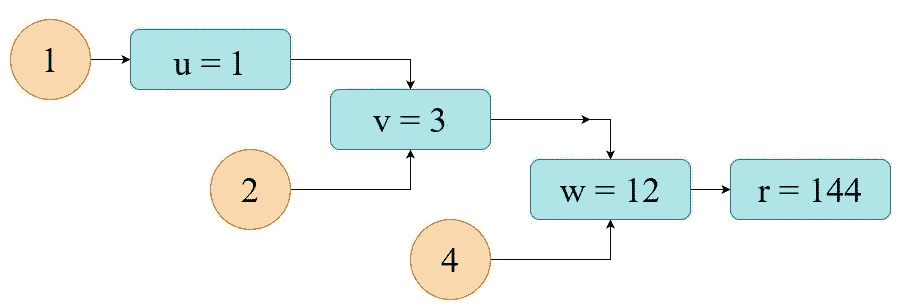
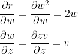
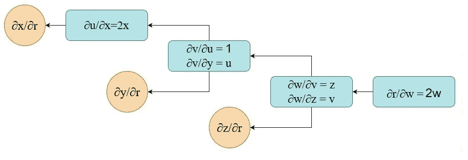
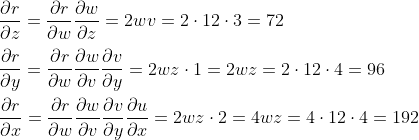
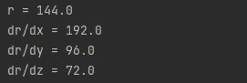

# 反向传播——链式法则和 PyTorch 在起作用

> 原文：<https://towardsdatascience.com/backpropagation-chain-rule-and-pytorch-in-action-f3fb9dda3a7d>

## Pytorch 中从理论到实现的简单指南。

[图片](https://pixabay.com/illustrations/quantum-physics-wave-particles-4550602/)由 gerald 在 Pixabay 上拍摄

现代企业越来越依赖于人工智能等创新领域的进步，来为客户提供最好的产品和服务。许多生产人工智能系统是基于各种神经网络，通常使用大量数据进行训练。对于开发团队来说，最大的挑战之一是如何在有限的时间内训练他们的模型。有各种技术和算法可以做到这一点，但最流行的是使用某种梯度下降法。

基于基于梯度的优化算法的神经网络(NN)的训练分为两个主要步骤:

1.  **正向传播** —这里我们**计算 NN 个给定输入的输出**
2.  **反向传播** —这里我们**计算输出相对于输入的梯度**以更新权重

第一步通常很容易理解和计算。第二步背后的总体思路也很清楚——我们需要梯度来知道方向，以便在梯度下降优化算法中进行步骤。如果你不熟悉这种方法，你可以看看我的另一篇文章([梯度下降算法——一个深度探索](/gradient-descent-algorithm-a-deep-dive-cf04e8115f21))。

虽然反向传播并不是一个新的想法(在 20 世纪 70 年代开发)，但回答“如何”计算这些梯度的问题让一些人很难回答。人们必须接触一些微积分，尤其是偏导数和链式法则，才能完全理解反向传播的工作原理。

最初开发反向传播是为了区分复杂的嵌套函数。然而，由于机器学习社区，它变得非常受欢迎，现在是神经网络的基石。

在本文中，我们将从根本上手动一步一步地解决一个典型的问题，然后我们将使用 PyTorch 在 python 中实现它，最后我们将比较两个结果以确保一切正常。

1.  **计算图形**

让我们假设我们想要执行以下一组操作来获得我们的结果`r`:

计算图形表示；作者图片

如果你把所有单独的节点方程代入最终方程，你会发现我们在解下面的方程。更具体地说，我们想计算它的值和它的偏导数。所以在这个用例中，这是一个纯粹的数学任务。

情商。1:待解方程(偏导数)

**2。向前传球**

为了使这个概念更具体，让我们用一些数字来计算。例如:

示例性输入值

这里我们简单地将输入代入方程。各个节点步骤的结果如下所示。最终输出为 r=144。

向前传球；作者图片

**3。向后传球**

现在是时候进行反向传播了，也有一个更花哨的名字“误差反向传播”，甚至是“自动微分的反向模式”。

为了计算 3 个变量中每个变量的梯度，我们必须计算图中每个节点的偏导数(局部梯度)。下面我将向您展示如何完成最后两个节点/步骤(我将把剩下的部分作为练习)。

最后两个节点的偏导数

在完成局部梯度的计算之后，反向传播的计算图如下。

反向通道的局部梯度；作者图片

现在，为了计算最终的梯度(在橙色圆圈中),我们必须使用链式法则。实际上，这意味着我们必须将从输出到目标变量的所有偏导数相乘:

现在，我们可以根据自己的需要使用这些梯度——例如，梯度下降优化(SGD、Adam 等)。).

**4。PyTorch 中的实现**

在各种语言中有许多神经网络框架，你可以在其中实现这样的计算，并让计算机为你计算梯度。下面，我将演示如何使用 python PyTorch 库来解决我们的示例性任务。

这段代码的输出是:

PyTorch 报告的结果

PyTorch 的结果与我们手工计算的结果一致。

几个注意事项:

*   在 PyTorch 中，一切都是张量——即使它只包含一个值
*   在 PyTorch 中，当你指定一个基于梯度优化的变量时，你必须指定参数`requires_grad = True`。否则，它将被视为固定输入
*   通过这种实施方式，所有反向传播计算都可以通过使用方法`r.backward()`简单地执行

**5。总结**

在本文中，我们使用反向传播来解决一个特定的数学问题——计算一个复函数的偏导数。然而，当你定义一个神经网络的架构时，你实际上是在创建一个计算图，这里看到的所有原则仍然适用。

在 NNs 中，最终方程是您选择的损失函数，例如 MSE、MAE 和节点方程主要是权重/自变量的乘积，后跟各种激活函数(ReLu、tanh、softmax 等)。)

希望现在你能更有信心回答这个问题:反向传播是如何工作的，为什么我们需要它，以及如何在 PyTorch 中实现它。

编码快乐！