# RNN 的反向传播解释说

> 原文：<https://towardsdatascience.com/backpropagation-in-rnn-explained-bdf853b4e1c2>

## 递归神经网络中计算图形和反向传播的逐步解释

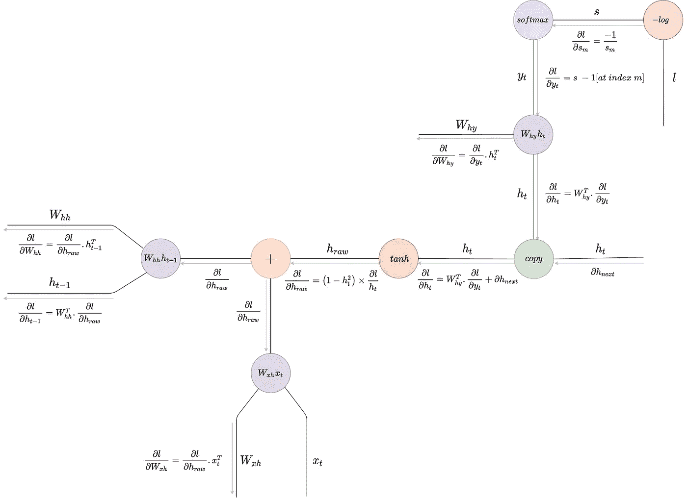

RNN 的反向传播

# 介绍

在没有框架的机器学习早期，建立模型的大部分时间都花在手工编码反向传播上。今天，随着框架和亲笔签名的发展，要通过几十层的深度神经网络进行反向传播，我们只需调用`loss.backward`——就是这样。然而，为了获得对深度学习的坚实理解，我们理解反向传播和计算图的基础是至关重要的。

反向传播背后的直觉是，我们计算最终损失相对于网络权重的梯度，以获得降低损失的方向，并且在优化期间，我们沿着该方向移动并更新权重，从而最小化损失。

在这篇文章中，我们将了解反向传播如何发生在一个递归神经网络。

# 计算图形

反向传播的核心是运算和函数，它们可以优雅地表示为计算图形。我们来看一个例子:考虑函数*f = z(x+y)*；它的计算图形表示如下:

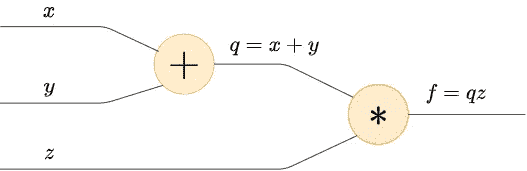

前进传球

计算图本质上是以函数和操作为节点的有向图。从输入计算输出被称为前向传递，习惯上在图的边上显示前向传递。

在后向通道中，我们计算输入输出的梯度，并在边缘下方显示它们。在这里，我们从末尾开始，然后沿着这条路计算梯度。让我们来做这个例子的反向传递。

**符号:**让我们在整篇文章中将 *a* wrt *b* 的导数表示为∂ *a* /∂ *b* 。

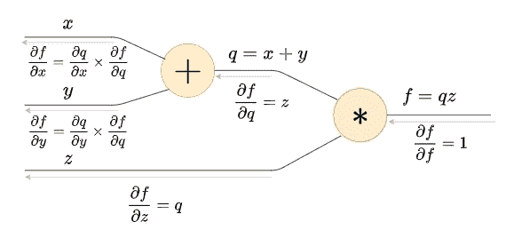

浅灰色箭头表示向后传球

首先，我们从末尾开始，计算∂ *f* /∂ *f* 为 1，然后向后移动，我们计算∂ *f* /∂ *q* 为 *z，*然后∂ *f* /∂ *z* 为 *q，*最后我们计算∂ *f* /∂ *x 和*

## *上游、下游和局部梯度*

*如果你观察的话，我们无法直接计算∂ *f* /∂ *x 和* ∂ *f* /∂ *y* ，所以我们使用链式法则先计算∂ *q* /∂ *x* 然后乘以*t13】∂*f*/∂*q*得到*∂* ∂ *f* /∂ *q* 称为上游比降*，* ∂ *f* /∂ *x* 称为下游比降，∂ *q* /∂ *x* 称为局部比降。**

**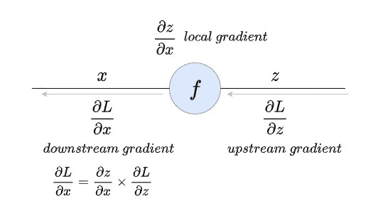**

```
**downstream gradient = local gradient × upstream gradient**
```

# **计算图的优势**

1.  ****基于节点的方法**:在反向传播中，我们总是对梯度流感兴趣，当使用计算图形时，我们可以根据节点而不是函数或操作来考虑梯度流。**

**考虑一个简单的添加节点，如下图所示:**

**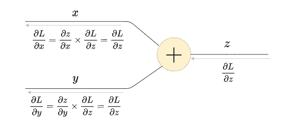**

**梯度分配器**

**给定输入 *x* 和 *y* ，输出 *z = x + y.* 上游梯度为*∂*l*/∂*z*其中 *L* 为最终损失。当地的梯度是∂ *z* /∂x，但是由于 *z = x + y* ，∂ *z* /∂ *x = 1。*现在，下游比降*∂*l*/∂*x*是上游比降和局部比降的乘积，但由于局部比降是统一的，下游比降等于上游比降。换句话说，渐变按原样流经加法节点，因此加法节点被称为渐变分配器。****

**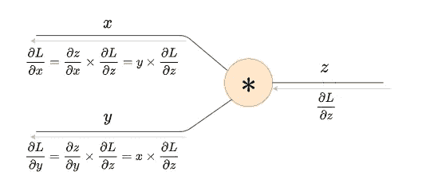**

**梯度交换乘数**

**类似地，对于乘法节点，如果您进行计算，则下游梯度是上游梯度和其他输入的乘积，如上图所示。因此，乘法节点称为梯度交换乘法器。**

**再次强调，这里的关键是在计算图中用节点来考虑梯度流。**

**2.**模块法:**特定节点处的下游比降仅取决于其局部比降和上游比降。因此，如果我们希望在未来改变网络的架构，我们可以简单地插拔适当的节点，而不会影响其他节点。这种方法是模块化的，尤其是在处理亲笔签名时。**

**3.**自定义节点:**我们可以将多个操作合并到一个节点中，如 sigmoid 节点或 softmax 节点，我们将在接下来看到。**

# **向量和矩阵的梯度**

**当使用神经网络时，我们通常处理用向量和矩阵表示的高维输入和输出。标量对矢量的导数是一个矢量，它表示矢量的每个元素的变化如何影响标量；一个向量对另一个向量的导数是一个雅可比矩阵，它表示该向量的每个元素如何受到另一个向量的每个元素的变化的影响。无需证明，梯度如下所示:**

**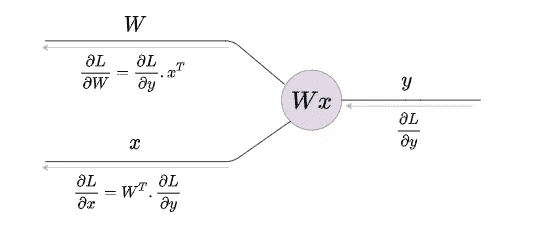**

**矩阵乘法梯度**

**这里 *W* 是权重矩阵， *x* 是输入向量， *y* 是输出乘积向量。**

# **交叉熵损失的梯度(可选)**

**让我们再做一个例子来加强我们的理解。让我们计算交叉熵损失节点的梯度，它是一个 softmax 节点，后跟一个 log loss 节点。这是许多神经网络使用的标准分类头。**

**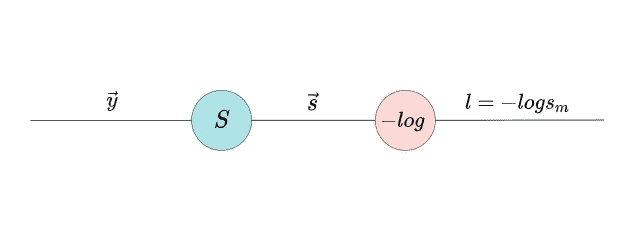**

**最大测井损失**

## **前进传球**

**在正向传递中，一个向量`𝑦⃗ = [y1, y2, y3, ..., yn]`通过 softmax 节点得到概率分布`S = [S1, S2, S3, ..., Sn]`作为输出。那么，假设地面真实指数为 *m* ，我们取`Sm`的负对数来计算损失:`l = -log(Sm)`。**

**softmax 函数由下式给出:**

**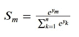**

## **偶数道次**

**这里棘手的部分是损失对向量 *S* 的单个元素的依赖性。所以， *l = -log(Sm)* 和∂*l*/∂*sm*=*-1*/*sm*其中 *Sm* 代表 *S* 的*m*元素其中 *m* 为地面真值标签。接下来，往回走，我们应该计算 softmax 节点的梯度。这里下游比降是∂ *l* /∂ *y，*当地比降是∂ *S* /∂ *y，*上游比降是∂ *l* /∂ *Sm。***

**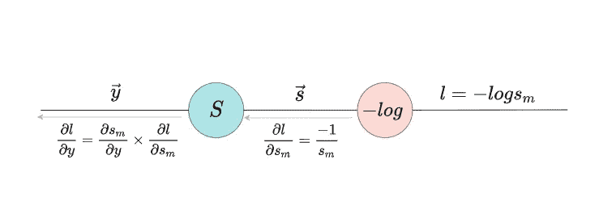**

**偶数道次**

**首先，让我们计算局部梯度∂ *S* /∂ *y.* 现在，这里 *S* 是一个向量， *y* 也是一个向量，因此∂ *S* /∂ *y* 将是一个矩阵，它表示 *S* 的每个元素如何受到 *y* 的每个元素的变化的影响；但是你看，损失只取决于地面真实指数上 *S* 的单个元素，所以我们只对发现 *S* 的单个元素如何受到 *y.* 数学上*的每个元素的变化的影响感兴趣，* 我们感兴趣的是找到*∂*si*/∂*y*其中 *Si* 是矢量 *S.* 的第*个*元素这里有另一个陷阱， *Si* 只是应用于𝑦⃗的第个*元素的 softmax 函数，这意味着 *Si* 所以我们不能直接计算∂ *Si* /∂ *y* 。因此，我们将找到∂ *斯* /∂ *yj* 其中 *yj* 是𝑦⃗的任意元素，并考虑两种情况，其中 *j = i* 和 *j ≠ i* ，如下所示:****

*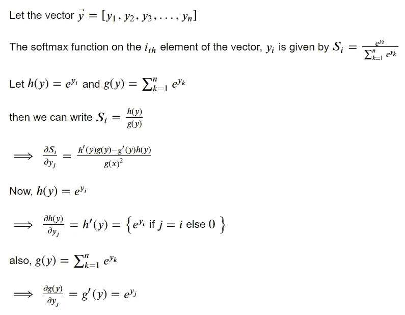**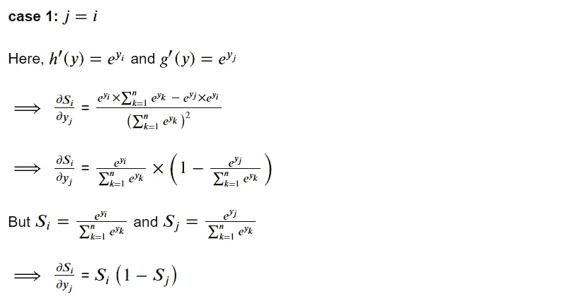*

*情况 1: j= i*

*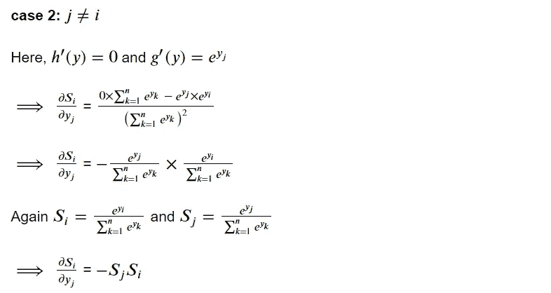*

*案例二:j ≠ i*

*所以最后我们可以写:*

*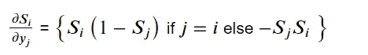*

*softmax 节点的局部渐变*

*接下来让我们计算下游比降∂ *l* /∂ *y.* 现在，由于下游比降是局部比降和上游比降的乘积，让我们再次找到*∂*l*/∂*yj*并考虑两种情况，其中 *j = i* 和 *j ≠ i* 如下:**

**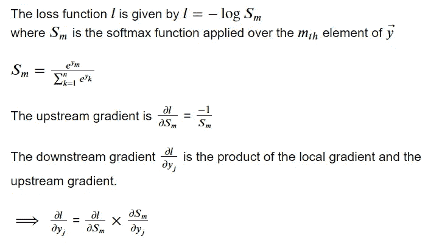****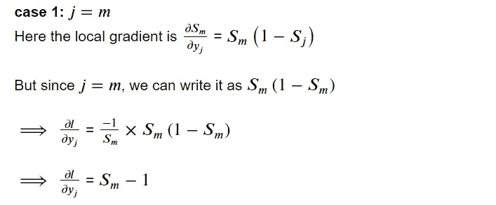**

**情况 1: j= i**

**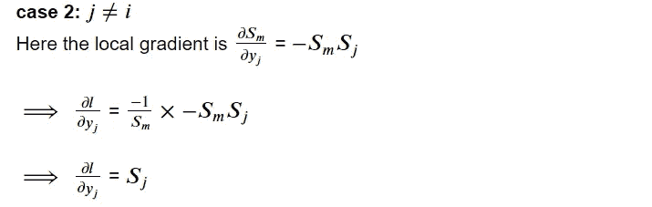**

**案例二:j ≠ i**

**所以最后我们可以写:**

**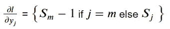**

**因此，如果向量`𝑦⃗ = [y1, y2, y3, ..., ym, ..., yn]`穿过 softmax 节点以获得概率分布`S = [S1, S2, S3, ..., Sm, ..., Sn]`，则下游梯度∂ *l* /∂ *y* 由`[S1, S2, S3, ..., Sm — 1, ..., Sn]`给出，即，我们保持 softmax 向量的所有元素不变，并从地面真实指数处的元素中减去 1。这也可以表示为 *S - 1【在索引 m 处】。*因此，下一次我们想要通过交叉熵损失节点反向传播时，我们可以简单地将下游梯度计算为*S-1[在索引 m 处]。***

**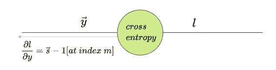**

**好了，现在我们已经有了反向传播和计算图的坚实基础，让我们看看 RNN 的反向传播。**

# **RNN 的反向传播**

****

## **前进传球**

**在前向传递中，在特定时间步，来自前一时间步的输入向量和隐藏状态向量乘以它们各自的权重矩阵，并由加法节点求和。接下来，它们通过一个非线性函数，然后被复制:其中一个作为下一个时间步的输入，另一个进入分类头，在那里乘以一个权重矩阵，以获得 logits 向量，然后计算交叉熵损失。这是一个典型的生成 RNN 设置，其中我们对网络建模，使得给定一个输入字符，它预测下一个适当字符的概率分布。如果你有兴趣在 pytorch 中建立一个角色 RNN，请在这里查看我的[其他文章](/build-an-ai-based-autocomplete-in-the-browser-using-vue-js-fastapi-and-websockets-1eb7ae19bfd8)。正向传递方程如下所示:**

**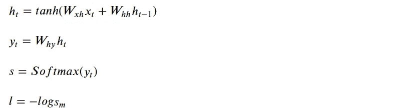**

## **偶数道次**

**在后向过程中，我们从末端开始计算分类损失的梯度 wrt logits 向量——细节已在前面的部分中讨论过。这个梯度流回到矩阵乘法节点，在这里我们计算权重矩阵和隐藏状态的梯度。隐藏状态下的渐变流回复制节点，在此处与前一时间步的渐变相遇。你看，RNN 本质上是一次一步地处理序列，所以在反向传播过程中，梯度在时间步长上反向流动。这被称为通过时间的**反向传播。因此，隐藏状态的梯度和前一时间步的梯度在复制节点相遇，并在此处相加。****

**接下来，它们回流到`tanh`非线性节点，其梯度可以计算为:`∂tanh(x)/∂x *=* 1−tanh²(x)`。然后这个梯度通过加法节点，在那里它被分配到输入向量和前一个隐藏状态向量的矩阵乘法节点。除非有特殊要求，我们通常不计算输入向量的梯度，但我们会计算前一个隐藏状态向量的梯度，然后返回到前一个时间步。详细的数学步骤请参考图表。**

**让我们看看它在代码中的样子。**

## **Python 代码**

**安德烈·卡帕西在 Python/Numpy 中从头开始实现了角色 RNN，他的代码出色地捕捉了我们讨论过的反向传播步骤，如下所示:**

**安德烈·卡帕西的代码。在 BSD 许可下在此重新使用。**

**完整的代码可以在[这里](https://gist.github.com/karpathy/d4dee566867f8291f086)找到，强烈建议读者去看看。如果你正在寻找一个 pytorch 实现 RNN 的例子，请查看我的[的另一篇文章。](/build-an-ai-based-autocomplete-in-the-browser-using-vue-js-fastapi-and-websockets-1eb7ae19bfd8)**

# **为什么反向传播在 RNN 无效**

**如果你观察，计算前一个隐藏状态的梯度，这是下游梯度，上游梯度流经双曲正切非线性，并乘以权重矩阵。现在，由于这个下游梯度跨时间步长回流，这意味着计算在每个时间步长重复发生。这有几个问题:**

1.  **由于我们一遍又一遍地乘以权重矩阵，梯度将根据矩阵的最大奇异值放大或缩小:如果奇异值大于 1，我们将面临*爆炸梯度*问题，如果小于 1，我们将面临*消失梯度*问题。**
2.  **现在，梯度通过双曲正切非线性，在极端情况下具有饱和区域。这意味着一旦梯度通过非线性，如果梯度具有高值或低值，梯度将基本上变为零，因此梯度不能有效地在长序列中传播，并导致无效的优化。**

**有一种方法可以避免爆炸梯度的问题，如果梯度超过某个阈值，就从本质上“剪切”梯度。然而，RNN 仍然不能有效地用于长序列。**

**我希望你对反向传播在 RNN 是如何发生的有一个清楚的概念。如果你有任何疑问，请告诉我。让我们在 [Twitter](https://twitter.com/WingedRasengan) 和 [LinkedIn](https://www.linkedin.com/in/neerajkrishnadev/) 上连线。**

## **图像制作者名单**

**本文所用图片均由作者制作。**