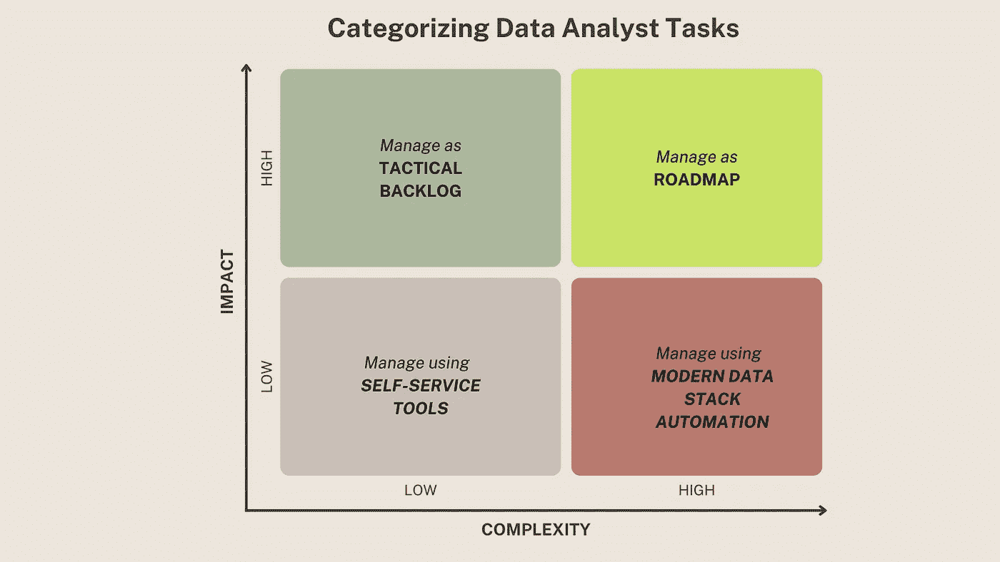
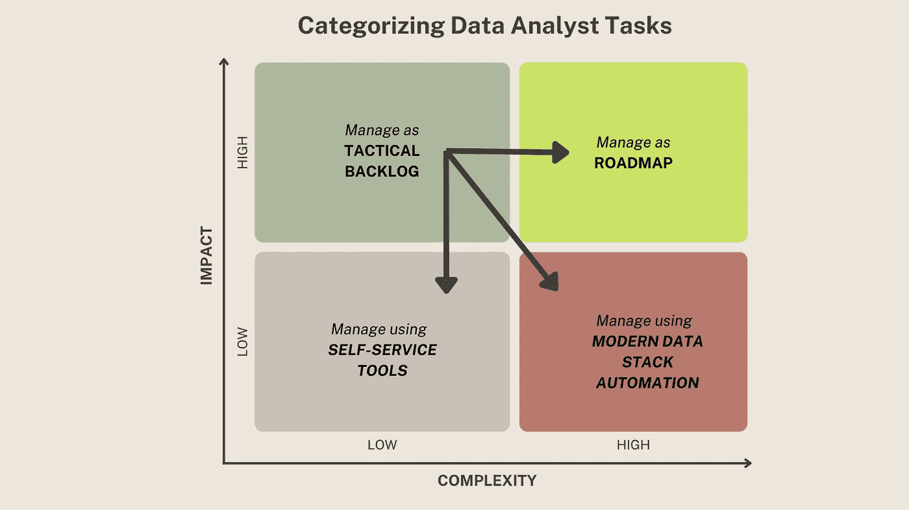

# 作为数据分析师，平衡战术和战略任务

> 原文：<https://towardsdatascience.com/balancing-tactical-and-strategic-tasks-as-a-data-analyst-2323bdd602f0>

## 如何在不烧钱的情况下最大化业务成果

> 在将数据与业务成果联系起来的过程中，数据分析师扮演着最关键的角色。他们通常是数据团队中唯一既了解数据环境又了解业务环境的人。

根据我的经验，在一个典型的日子里，数据分析师会被企业拉进多个特别的战术请求中:“你能在今天下午之前发送我们产品 CAC 的两年趋势吗？”虽然这些请求分散了对战略路线图任务的注意力，但是其中的一部分对于业务成果来说是关键的。此外，这些请求中有很大一部分倾向于重复或面向调试，因为“Tableau 仪表板中的 CAC 值似乎与快速电子邮件报告中的[不同](https://medium.com/towards-data-science/moldy-data-and-dashboards-25d498e6979f)这些临时请求中的一些可能需要的不仅仅是“几个小时的工作”,并且需要进行计划。

> 作为一名数据分析师，如何平衡战术请求和战略路线图活动的时间，以最大化[对业务成果的影响](https://mikkeldengsoe.substack.com/p/roi-of-data-work?s=r)？在战术任务中，您如何将小麦从谷壳中分离出来，并处理具有更高业务影响的任务？

图片来源: [unsplash](https://unsplash.com/photos/ruJ81SKAZ18)

# 任务优先级框架

这个框架基于我领导数据分析师团队的经验。如果没有框架，一切都变得优先，并可能导致数据分析师团队在最终筋疲力尽之前全天候工作！

*让我们从数据分析师的典型任务示例开始:*

*   *构建用于分析的报告/仪表板/笔记本*
*   *支持对报告/分析的临时请求*
*   *分析数据/解释“为什么”/为业务团队讲述故事，使见解具有可操作性*
*   *了解业务需求和背景*
*   *调试跨报表的业务逻辑不一致*
*   *调试数据质量和管道问题/调试数据模型/仪表板*
*   *创建/更新仪表板*
*   *标准化指标的业务逻辑*
*   *提高业务团队的数据素养*
*   *寻找数据源、元数据细节和数据文档*
*   *准备/争论数据/验证治理*
*   *与数据集和业务逻辑相关的变更管理*
*   *实施数据模型/视图/数据应用/仪表盘*
*   *…还有更多…*

考虑将这些任务划分为影响(对业务成果)和复杂性(从技术上完成任务)的 2 x 2 矩阵。

作者图片

*   **高影响和高复杂性(第一阶段)**:作为路线图进行管理
*   **高影响和低复杂性(第 2 阶段)**:作为战术性积压工作进行管理，并快速周转
*   **低影响和高复杂性(桶 3)** :例子包括数据质量、仪表板不一致、管道性能等。使用现代数据堆栈中新兴的工具生态系统进行管理。
*   **低影响和低复杂性(第 4 阶段)**:作为业务团队完成的自助服务任务进行管理(根据需要提供指导)

在 2 x 2 矩阵的背景下重新审视任务列表:

*   构建用于分析的报告/仪表板/笔记本— *时段 1*
*   支持对报告/分析的临时请求— *第 2 阶段(需要进一步分析—稍后在博客中提供更多详细信息)*
*   分析数据/解释“为什么”/为业务团队讲述故事，使见解具有可操作性— *第一阶段*
*   了解业务需求和背景— *第一阶段*
*   调试跨报告的业务逻辑不一致— *时段 2 或 4*
*   调试数据质量和管道问题/调试数据模型/仪表板— *桶 4*
*   创建/更新仪表板— *时段 2 或 3*
*   标准化指标的业务逻辑— *第一桶*
*   提高业务团队的数据素养— *第一阶段*
*   查找数据源、元数据详细信息和数据文档— *第 4 阶段*
*   准备/争论数据/验证治理— *第 4 桶*
*   与数据集和业务逻辑相关的变更管理— *时段 2 或 3*
*   实施数据模型/视图/数据应用/仪表盘— *第四阶段*

> 每个时段花费的时间因整体分析策略和数据平台的成熟度而异。例如，在 covid 疫情期间，考虑到大量的未知/不确定性，第二阶段具有更高的优先级。对于拥有成熟数据平台的组织，Bucket 4 越来越多地被自动化或专业化为分析工程角色。

# 处理来自业务团队的战术请求

战术任务首先被归类为第二类(高影响、低复杂性)。处理 ask 时，有四种可能的结果:

*   完成任务
*   认识到任务“不仅仅是几个小时的工作”，需要在路线图/冲刺计划中进行规划
*   作为一项有时间限制的活动，完成基本工作以获得所需的 KPI，而不是花费时间构建仪表板，让业务团队能够自助使用 excel 等工具进一步分析数据。
*   如果数据工程或分析工程更适合使用现代数据堆栈来完成任务，请将该任务委托给他们。

作者图片

> 总结一下，没有灵丹妙药——您的里程可能会因使用该框架而异。我的最后一条建议是，无论何时你对优先顺序有疑问，总是优先考虑那些涉及与业务旅程图/背景相关的业务团队的讨论/学习的活动。理解业务没有捷径，如果没有合适的业务环境，将数据与业务成果联系起来的目标将无法实现！