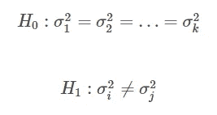
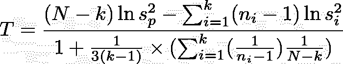
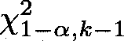

# 解释 Bartlett 的方差相等测试(用 Python 例子)

> 原文：<https://towardsdatascience.com/bartletts-test-for-equality-of-variances-explained-with-python-examples-dcacf8a7d4db>

## 在本教程中，我们将探讨 Bartlett 的方差相等测试及其在 Python 中的应用


[韦德拉纳·菲利波维奇](https://unsplash.com/@vedranafilipovic?utm_source=unsplash&utm_medium=referral&utm_content=creditCopyText)在 [Unsplash](https://unsplash.com/s/photos/sequence?utm_source=unsplash&utm_medium=referral&utm_content=creditCopyText) 拍摄的照片

**目录**

*   介绍
*   抽样资料
*   巴特利特的测试解释说
*   Bartlett 在 Python 中的测试示例
*   结论

# 介绍

许多统计测试和程序都假设数据的正态性和方差相等。

Bartlett 检验是推断统计学中最流行的检验之一，它处理从正态分布中提取的数据。

如果数据遵循非正态分布，请考虑使用 [Levene 检验](https://pyshark.com/levenes-test-for-equality-of-variances-explained-with-python-examples/)(因为 Bartlett 检验对偏离正态非常敏感)。

## 巴特利特测试是什么？

Bartlett 检验用于检验两个或更多组(样本)计算的变量的方差是否相等。

## 你如何解读巴特利特的测试？

如果 Bartlett 检验的 p 值小于显著性水平(例如 0.05)，则至少两组的方差不相等。

为了继续学习本教程，我们需要以下 Python 库:pandas 和 scipy。

```
pip install pandas
pip install scipy
```

# 抽样资料

要执行本教程示例部分和 Python 实现部分中提到的计算，您将需要一些数据。

在本教程的所有示例中，来自。使用下面的 csv 文件。

文件:[https://pyshark . com/WP-content/uploads/2022/03/data _ bartletts _ test . CSV](https://pyshark.com/wp-content/uploads/2022/03/data_bartletts_test.csv)

该数据包含三组对新疗法反应的 80 次观察:“对照组”、“治疗 1 组”和“治疗 2 组”。

# 巴特利特的测试解释说

如前所述，方差相等的假设在统计分析中是很重要的，并且在测量实验和数据分析的结果时经常会影响研究者的工作程序。

## 巴特利特的检验假设

Bartlett 检验的无效假设是所有组的方差相等。

Bartlett 检验的另一个假设是，至少有一对组的方差不相等。



作者图片

其中:

*   *k* :总组数(≥2)
*   *I*:*k*组之一
*   *j*:k 组中的一组
*   ( *i* ， *j* ):来自 *k* 组的一对组
*   *I*≦*j*:两组不是同一组

## 巴特利特检验统计量

巴特利特检验统计量由下式给出:



作者图片

其中:

*   *N* :观察总数
*   *n_i* :第(I)组的观测数
*   *k* :组数
*   *s _i* :第 *i* 组的方差
*   *s _p* :汇总方差

计算 Bartlett 检验统计量( *T* )后，应将其与下式给出的上临界值进行比较:



作者图片

因此，我们拒绝等方差的零假设，当:


作者图片

# Bartlett 在 Python 中的测试示例

为了在实践中看到 Bartlett 的测试及其在 Python 中的应用，我们将使用前面一节中提到的[样本数据文件](https://pyshark.com/bartletts-test-for-equality-of-variances-explained-with-python-examples/#sample-data)。

首先，导入所需的依赖项:

然后阅读。csv 文件提供到 Pandas 数据框架中，并打印前几行:

您应该得到:

```
 group  before_treatment  after_treatment
0  control              27.9             33.8
1  control              16.8              9.3
2  control              27.2             23.4
3  control              12.5             19.9
4  control              14.4             16.0
```

您可以计算一些组摘要统计信息，以便更好地理解数据:

您应该得到:

```
 group  avg_bef_tr  var_bef_tr  avg_aft_tr  var_aft_tr
0     control      20.145   18.878436      19.825   28.825513
1  treatment1      19.210   17.007263      15.475    4.649342
2  treatment2      21.510   19.673579      20.315   15.141458
```

这里你可以清楚地看到 3 组之间的“ **var_bef_tr** ”(治疗前方差)差异并没有那么大:18.88，17.01，19.67。

三个组在治疗前的方差差异很小，足以让我们几乎可以肯定它没有显著差异，但是为了对其进行统计检查，我们将在 Python 中执行 Bartlett 测试！

我们需要创建变量来存储与特定组相关的观察结果:

最后用 Python 执行 Bartlett 测试:

您应该得到:

```
Bartlett's test statistic: 0.10660625260772809
P-value: 0.9480925771212662
```

由于 p 值大于 0.05，我们无法拒绝零假设，并得出结论，3 组之间存在相等的方差。

[官方文档](https://docs.scipy.org/doc/scipy/reference/generated/scipy.stats.bartlett.html)显示了如何更改测试中使用的功能。

# 结论

在本文中，我们讨论了如何使用 scipy 库执行 Bartlett 的方差相等测试及其在 Python 中的应用。

如果你有任何问题或对一些编辑有建议，请随时在下面留下评论，并查看更多我的[统计](https://pyshark.com/category/python-programming/)文章。

*原载于 2022 年 3 月 18 日*[*【https://pyshark.com】*](https://pyshark.com/bartletts-test-for-equality-of-variances-explained-with-python-examples/)*。*