# 面向数据科学家、数据工程师和操作工程师的 Bash

> 原文：<https://towardsdatascience.com/bash-for-data-scientists-data-engineers-mlops-engineers-a8e389621e2e>


内森·穆莱特在 [Unsplash](https://unsplash.com?utm_source=medium&utm_medium=referral) 拍摄的照片

## Bash 编程综合指南

## 简介:

数据科学家，机器学习工程师，或者数据工程师学习 bash 编程是必然的。在本文中，我将介绍 bash 编程的基础知识、概念和代码片段。如果您熟悉 python 或任何其他语言，那么学习 bash 编程将会非常容易。同样，本文更关注数据科学家、数据工程师和 ML 工程师对 bash 的使用。让我们开始吧。


作者图片

## 内容:

1.  Bash 概述
2.  文件管理
3.  数据分析
4.  理解 DockerFile-bash 命令
5.  结论

# Bash 概述:

**工具:**我使用了以下工具来创建图表和代码片段。

*>exca lidraw
->git mind
->Gist
->carbon . now . sh*

**数据集:**本文使用的数据集是[成人数据集——UCI 机器学习知识库](https://archive.ics.uci.edu/ml/datasets/adult).成人(1996)。来自 UCI 机器学习知识库的**成人**数据集包含人口普查信息。成人数据集包含大约 32，000 行，4 个数字列。

**鸣谢:** Blake，C.L .和 Merz，C.J. (1998)。UCI 机器学习知识库[http://archive . ics . UCI . edu/ml]。加州欧文:加州大学信息与计算机科学学院。

## 什么是 Bash 编程？

*   Bash 是“ ***的首字母缩写，伯恩再贝，*** 于 1989 年开发。
*   它被用作大多数 [Linux](https://en.wikipedia.org/wiki/Linux) 发行版的默认登录 shell。
*   数据科学家使用 bash 预处理大型数据集。
*   数据工程师需要了解用于与 Linux 交互和创建数据管道等的 bash 脚本。
*   Bash 主要用于 Linux 和 Mac OS。Windows 使用命令提示符和 power shell 来执行相同的操作。现在，您可以在 windows 中安装 bash，并执行与在 Linux 和 Mac 中相同的操作。

## 什么是命令行界面(CLI)和 Shell？

这是一个允许用户输入文本命令来指导计算机完成特定任务的程序。Shell 是一个用户界面，负责处理在 CLI 上键入的所有命令。外壳读取命令，解释命令，并让操作系统按要求执行任务。

请查看这个问题，了解关于 CLI、Shell 和 OS 的更多细节。

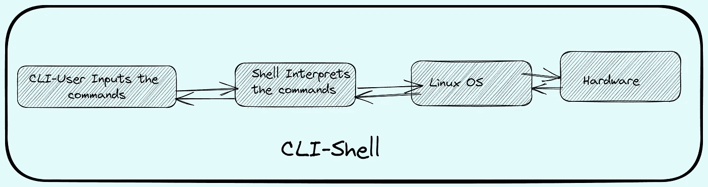

作者图片

如果您没有 Linux 机器，那么您可以尝试以下方法

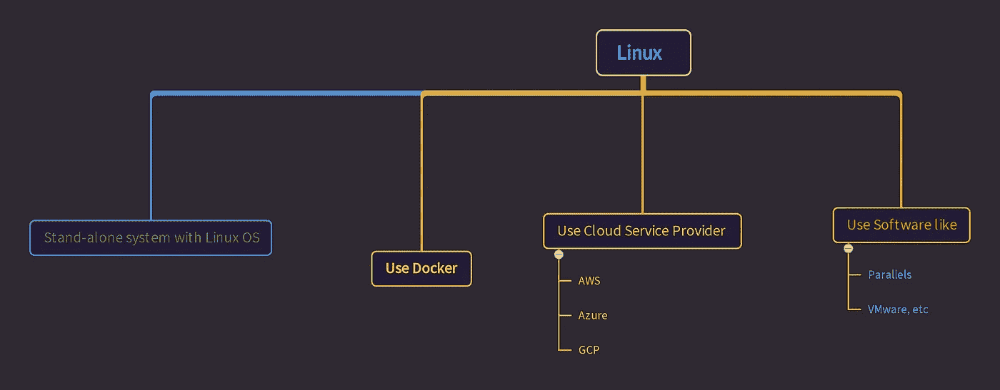

作者图片

*   使用 parallel 或 Vmware 在 mac 或 windows 机器上安装 Linux。查看此条为[的详细说明](https://kb.parallels.com/en/124124?_gl)。
*   如果你有 docker，那么你可以运行一个 Linux 容器。请查看这篇关于[如何使用 Linux 容器](https://hudsonmendes.medium.com/docker-have-a-ubuntu-development-machine-within-seconds-from-windows-or-mac-fd2f30a338e4)的文章。
*   最简单的方法是使用云服务提供商 AWS、GCP 或 Azure。

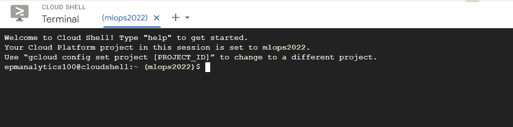

作者图片

*   如果看到提示是 **$** 。在 Linux 和 Mac OS 中，提示符是＄而在 windows 中是>。


作者图片

## 从简单的 Linux 命令开始:

这里列出了一些在 Linux 中使用的基本而简单的命令

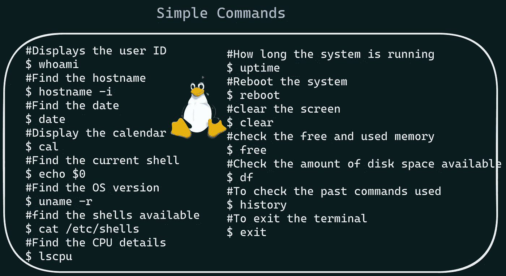

作者图片

作者图片

例如，在系统中查找可用的壳:

```
**$ cat/etc/shells**
```

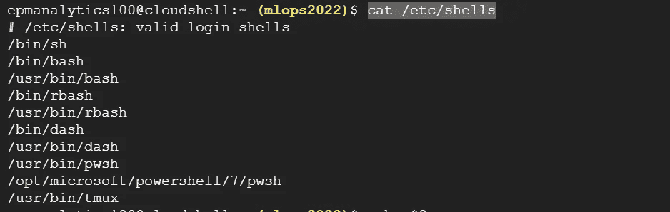

作者图片

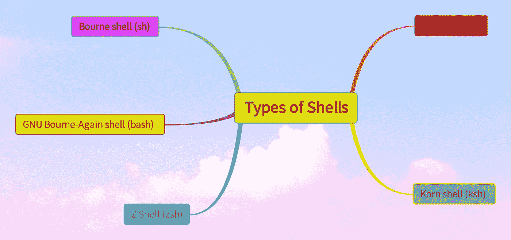

作者图片

## 我的第一个剧本——Hello World:

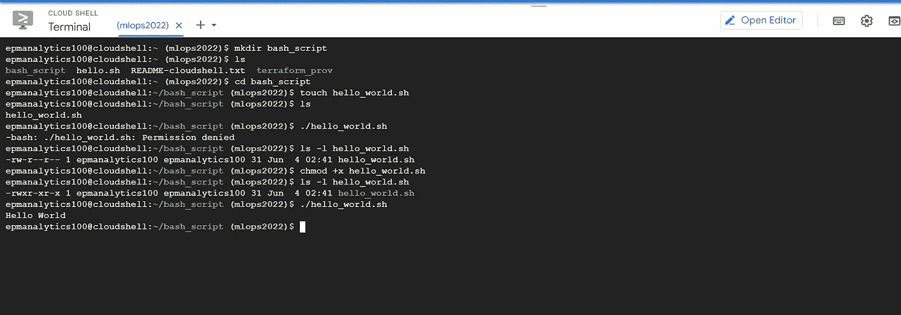

作者图片

**步骤:**

*   创建一个目录 bash _ script(**mkdir bash _ script**)
    *创建一个文件 Hello _ World . sh-**touch Hello _ script . sh**
    *打开文件 **hello_script.sh**
    *输入 **shebang line**
    *输入命令—**echo‘Hello World’**
    *保存文件
    *转到终端执行文件/hello_world.sh

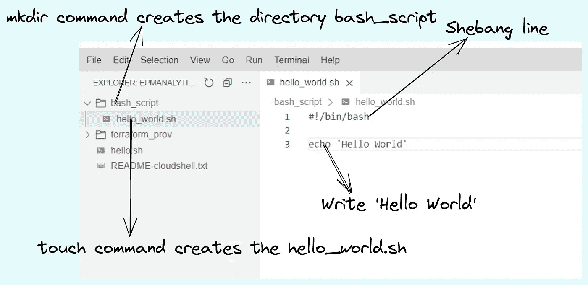

作者图片

**什么是社邦线？**


作者图片

**让我们看看 bash 中使用的特殊字符:**

我们将理解本文中的以下特殊字符。

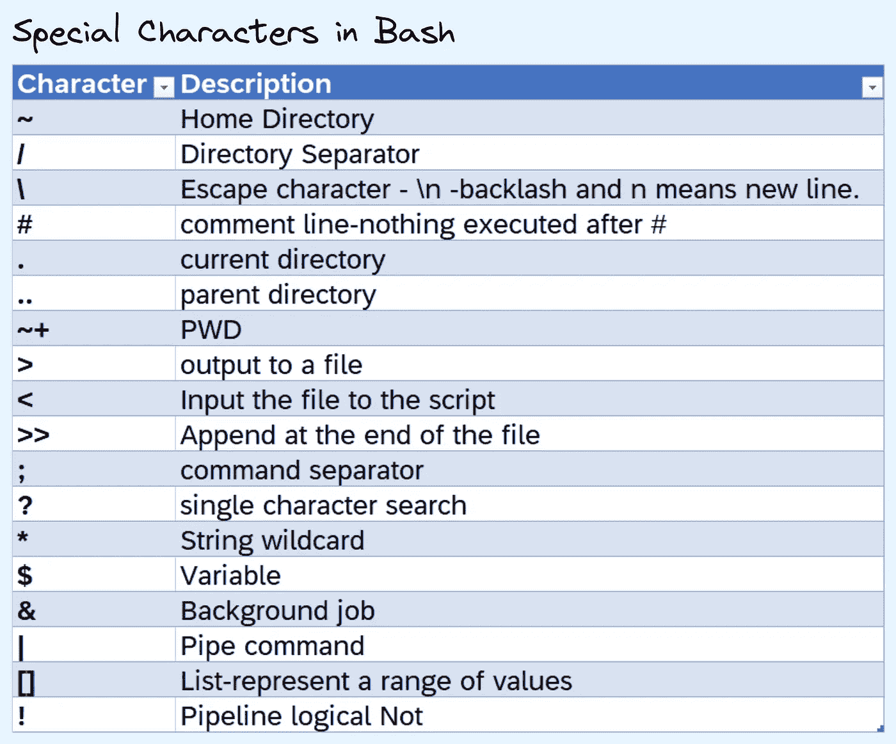

作者图片

**人工命令:**

Linux 中的 Man 命令用于显示我们可以在终端上运行的任何命令的用户手册。它提供了命令的详细视图，包括名称、概要、描述、选项、退出状态、返回值、错误、文件、版本、示例、作者和另请参阅。

例如，man ls 显示了以下 ls 命令的输出帮助。

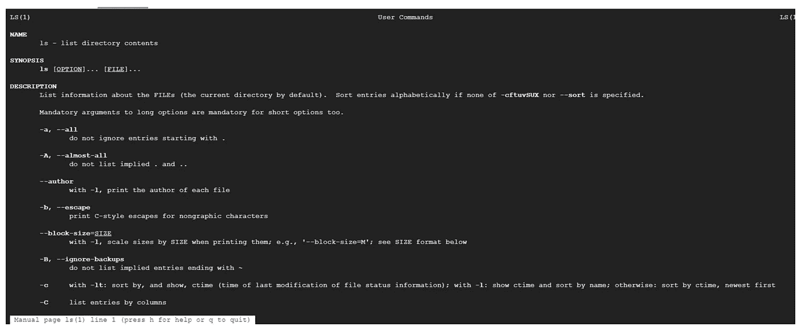

作者图片

**Bash 命令结构:**

```
**command -options arguments**
```

例如

```
**$ls (options) (file name or directory)
$ls -lah ~**
```

检查 bash 中所有可用的命令

*找到目录，例如 **/usr/bin**
*转到该目录 **cd /usr/bin**
*然后使用 ls 命令 **ls -la**

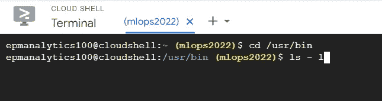

作者图片

然后它会列出所有可用的命令

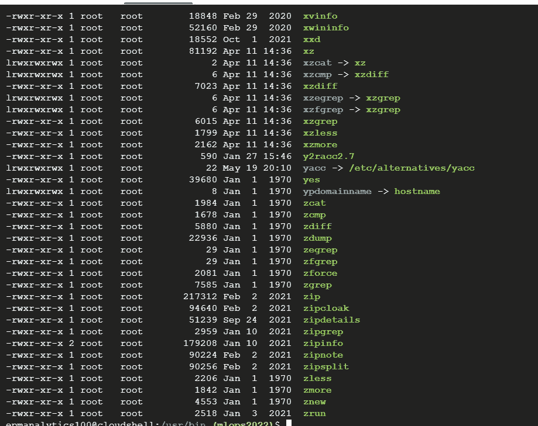

作者图片

您可以使用 man 命令来检查信息。

## 你应该知道的 40 条重要命令:

如果你是一名数据工程师或数据科学家，下面的列表包含了你应该知道的最重要的命令。我们可以在本文后面使用下面的命令。

作者图片

## 什么是壳体管道？

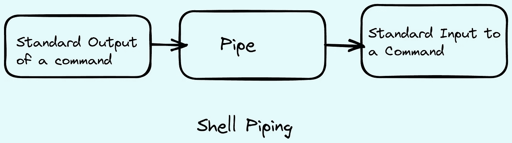

作者图片

管道将命令的标准输出连接到命令的标准输入。可以有多个管道或单个管道。

请查看 [StackOverflow](https://stackoverflow.com/questions/9834086/what-is-a-simple-explanation-for-how-pipes-work-in-bash) 上的回答，了解更多关于管道的信息。

例如

1.我们用一个用户名- **cat** 命令来查看文件的内容。
2。对文件排序- **sort** 命令对文件进行排序。
3。移除所有重复项- **Uniq** 命令移除所有重复项。cat 标准输出作为输入传递给排序，然后排序的标准输出作为输入传递给 uniq 命令。所有这些都通过管道命令连接。

```
**cat user_names.txt|sort|uniq**
```

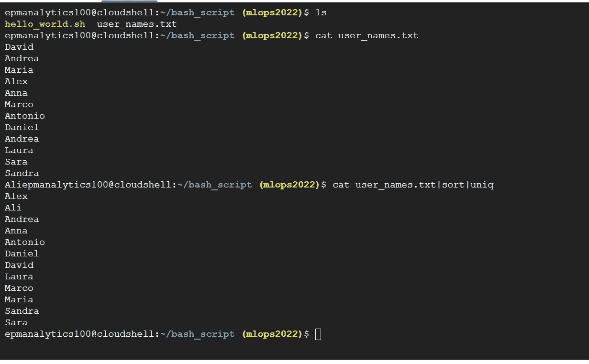

作者图片

我们将在后面的脚本中使用管道。

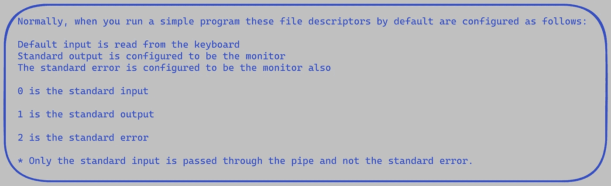

作者图片

## 什么是重定向？

*   **>** 是重定向操作符。该命令获取前一个命令的输出，并将其传递给一个文件。例如

```
**echo “This is an example for redirect” > file1.txt**
```

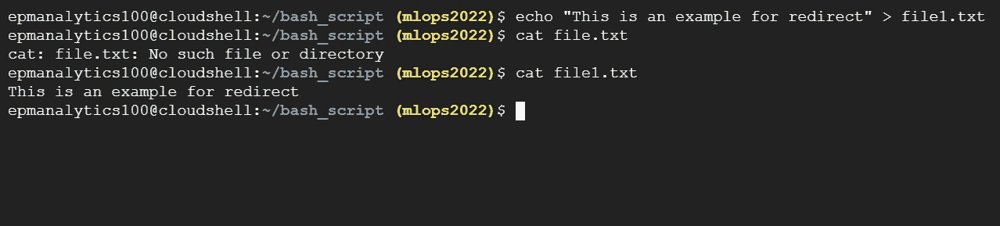

作者图片

**截断 Vs 追加:**

```
# In the below example the first line is replaced by the second line **$ echo “This is the first line of the file” > file1.txt
$ echo “This is the second line of the file” > file1.txt** # If you want to append the second line then use **>>**
**$ echo “This is the first line of the file” > file1.txt
$ echo “This is the second line of the file” >> file1.txt**
```

此外，您可以用另一种方式进行重定向

```
**#Redirect works bothways**
$ echo " redirect works both ways" > my_file.txt
$ cat < my_file.txt
redirect works both ways
**# which is equalto**
cat my_file.txt
```

## Bash 变量:

*   在 bash 中，您不必声明变量的类型，如字符串或整数等。它类似于 python。
*   **局部变量:**局部变量在命令提示符下声明。它仅在当前 shell 中可用。它们不能被子进程或程序访问。所有用户定义的变量都是局部变量。

```
**ev_car=’Tesla’**
#To access the local variable use the echo
**echo 'The ev car I like is' $ev_car**
```

*   **环境变量:**导出命令用于创建环境变量。环境变量可用于子进程

```
 **export ev_car=’Tesla’**
#To access the global variable use the echo
**echo 'The ev car I like is' $ev_car**
```

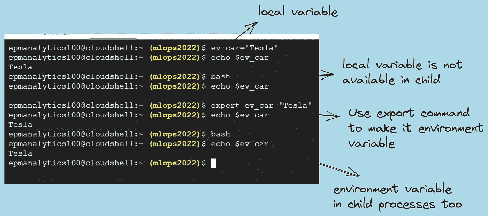

作者图片

*   赋值时不应有空格

```
**my_ev= ‘Tesla’ # No space
my_ev=’Tesla’**
```

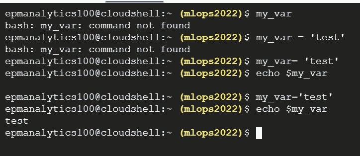

作者图片

*   最佳实践是使用小写来声明局部变量，使用大写来声明环境变量。

## 什么是容易得到的:

*   `**apt-get**`是一个友好的命令行工具，用于与打包系统进行交互。
*   APT(高级打包工具)是与这个打包系统交互的命令行工具。
*   一些流行的包管理器包括 **apt、Pacman、yum 和 portage。**

让我们看看如何安装、升级、更新和删除软件包。

作者图片

## &&和||:

*   ***& &是逻辑与运算符命令*** 。

```
**$ command one && command two**
```

只有当第一个命令成功时，才会执行第二个命令。如果第一个命令出错，则不执行第二个命令。

例如，您希望执行以下步骤

```
**$ cd my_dir**         # change the directory my_dir
**$ touch my_file.txt** # now create a file my_file
```

在上述情况下，第二个命令将出错，因为不存在名为 my_dir 的目录。

现在，您可以通过 AND 运算符将两者结合起来

```
**$ cd my_dir && touch my_file.txt**
```

在这种情况下，仅当第一个命令成功时，才会创建 my_file.txt。可以通过 echo $检查命令成功代码？。如果为 0，则表示命令成功，如果为非零，则表示命令失败。

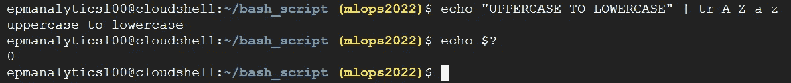

作者图片

检查关于& &操作符的[堆栈溢出讨论。](https://stackoverflow.com/questions/4510640/what-is-the-purpose-of-in-a-shell-command)

*   ***||是逻辑或运算符。***
*   在下面的示例中，使用了逻辑运算符||。mkdir my_dir 只会在第一个命令失败时执行。如果没有 my_dir 存在，那么创建 my_dir 目录。

```
**$ cd my_dir || mdir my_dir**
```


作者图片

比如组合 **& &和||**

```
**cd my_dir && pwd || echo “No such directory exist.Check”**
```

*   如果 my_dir 存在，则打印当前工作目录。如果 my_dir 不存在，那么消息“没有这样的目录存在。检查”消息被打印出来。

# 文件管理:

一些基础知识

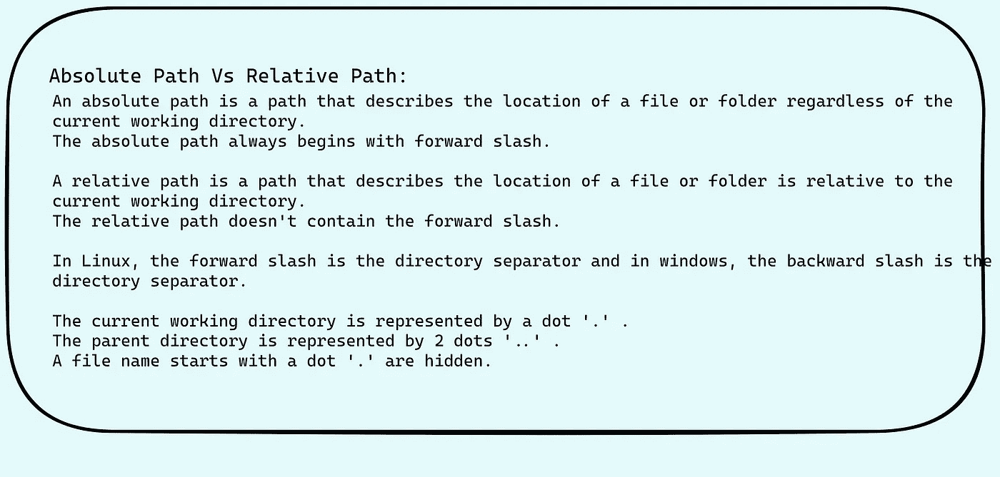

作者图片

我们来看几个例子。

1.  要显示所有文件，请使用 ls

作者图片

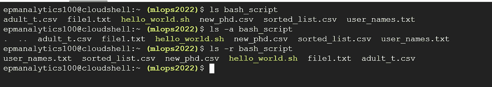

作者图片

显示最近 10 次修改的文件。l-长列表格式，t-按时间排序，头-选择前 10 条记录。

```
**ls -lt | head**
```

显示按文件大小排序的文件。

```
**$ ls -l -S**
```

ls 可用的选项有

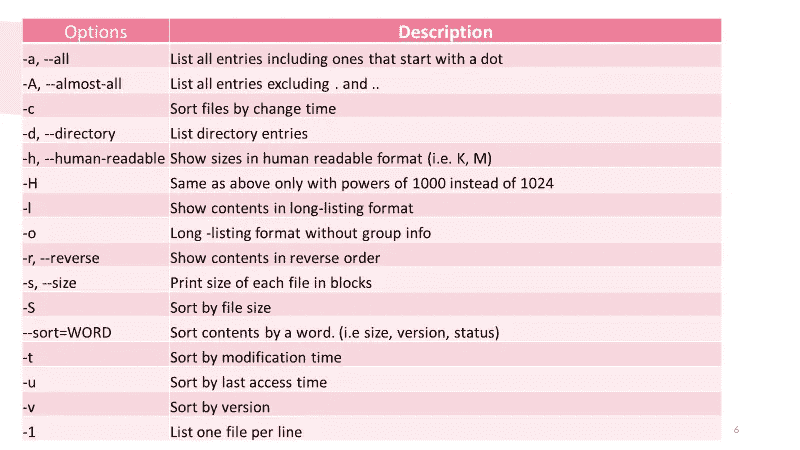

作者图片

2.**创建/删除目录:**

作者图片

**3。创建/删除文件:**

作者图片

**4。显示文件内容:**

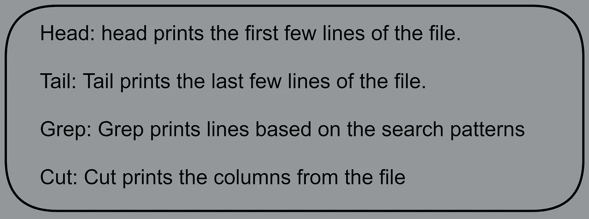

作者图片

**Head & Tails** :显示文件的前几行或后几行，然后使用 Head 或 tail。选项`**-n**`设置要打印的行数。

```
**$ head -n5 adult_t.csv
$ tail -n5 adult_t.csv**
```

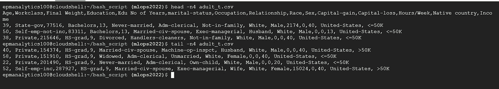

作者图片

**猫:**

```
#concatenate the files to one file 
**cat file1 file2 file3 > file_all**
#concatenate the files to a pipe command
**cat file1 file2 file3 | grep error**
#Print the contents of the file
**cat my_file.txt** #output to a file again **cat file1 file2 file3 | grep error | cat > error_file.txt** #Append to the end **cat file1 file2 file3 | grep error | cat >> error_file.txt** #Also read from the input **cat < my_file.txt** #is same like **cat my_file.txt**
```

作者图片

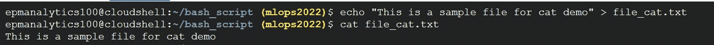

**TAC:** Tac 与 CAT 正好相反，只是颠倒了顺序。详情请查看下面的截图。

```
**tac my_file.txt**
```

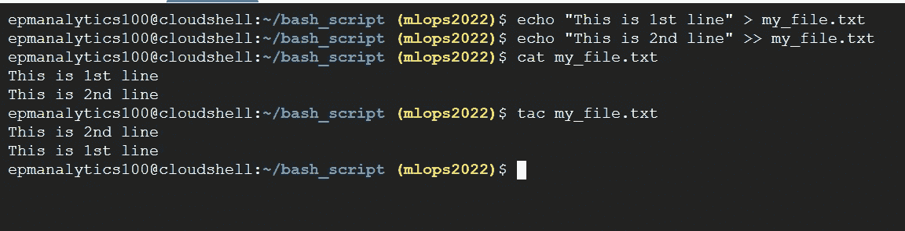

作者图片

**Less:** 如果文本文件很大，那么不使用 cat，可以使用 Less。Less 一次显示一页，而在 CAT 中则加载整个文件。如果文件很大，最好少用一些。

```
**less my_file.txt**
```

Grep:

*   GREP 代表**“全局正则表达式打印”**。Grep 用于搜索文件或程序输出中的特定模式。
*   Grep 是一个强大的命令，被大量使用。请查看以下示例

作者图片

**5。移动文件:**

```
#move single file
**$ mv my_file.txt /tmp** #move multiple files **$ mv file1 file2 file3 /tmp** #you can also move a directory or multiple directories
**$ mv d1 d2 d3 /tmp**
#Also you can rename the file using move command **$ mv my_file1.txt my_file_newname.txt** 
```

作者图片

**6。复制文件:**

```
Copy my_file.txt from /path/to/source/ to /path/to/target/folder/
**$ cp /path/to/source/my_file.txt /path/to/target/folder/**
Copy my_file.txt from /path/to/source/ to /path/to/target/folder/ into a file called my_target.txt
**$ cp /path/to/source/my_file.txt/path/to/target/folder/my_target.txt** #copy my_folder to target_folder
**$ cp -r /path/to/my_folder /path/to/target_folder** #Copy multiple directories- directories d1,d2 and d3 are copied to tmp. **$ cp -r d1 d2 d3 /tmp**
```

作者图片

**7。Gzip/Tar :**

作者图片

Gzip 格式

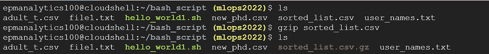

作者图片

Tar 格式:

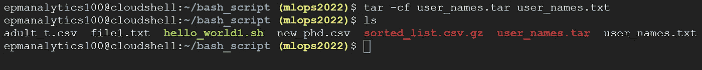

作者图片

**8。定位并找到:**

*   find 命令用于实时查找文件或目录。与定位相比，速度较慢。
*   它搜索模式，例如搜索*。sh 文件放在当前目录下。


作者图片

作者图片

```
#Find by name
**$ find . -name “my_file.csv"**
#Wildcard search
**$ find . -name "*.jpg"**
#Find all the files in a folder
**$ find /temp**
#Search only files
**$ find /temp -type f**
#Search only directories
**$ find /temp -type d** #Find file modified in last 3 hours
**$ find . -mmin -180** #Find files modified in last 2 days **$ find . -mtime -2** #Find files not modified in last 2 days **$ find . -mtime +2** #Find the file by size **$ find -type f -size +10M**
```

*   定位要快得多。定位不是实时的。在预先构建的数据库中查找扫描，而不是实时查找。Locate 用于查找文件和目录的位置。
*   如果定位命令不可用，那么您需要在使用它之前安装它。检查您的 Linux 发行版并安装它

```
**$ sudo apt update**          # Ubuntu
**$ sudo apt install mlocate** # Debian
```

在使用定位命令之前，必须手动更新数据库。数据库每天都在更新。

```
**$ sudo updatedb**
```

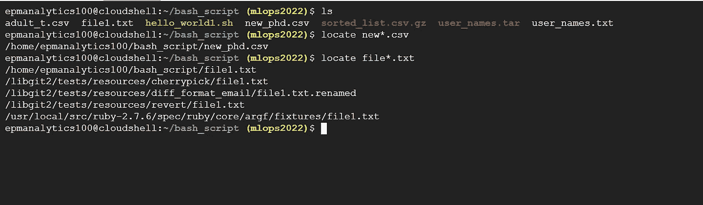

作者图片

```
# To find all the csv files.
**$ locate .csv**
```

查看这篇[文章，了解如何安装定位实用程序](https://linuxize.com/post/locate-command-in-linux/)。

**9。分割文件:**如果你有一个大文件，那么你可能需要将这个大文件分割成更小的块。要拆分文件，您可以使用

作者图片

# **数据分析:**

*   我用下面的数据集做 EDA。
*   数据集是来自 UCI 的[成人数据集。](https://archive-beta.ics.uci.edu/ml/datasets/adult)
*   该数据集也称为“人口普查收入”数据集。
*   让我们试着做一些 EDA。
*   我为 EDA 选择了训练数据集。
*   文件名是成人 _t.csv

1.  检查数据集的前几行——使用 head 命令。

```
**head adult_t.csv**
```

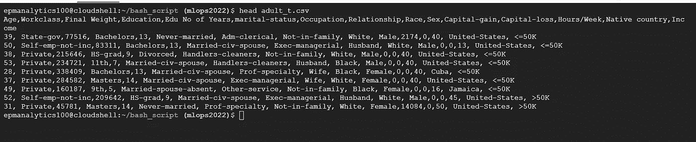

作者图片

输出不好看。[可以安装 csvkit。](https://csvkit.readthedocs.io/en/latest/)请查看文档了解更多信息。

2.检查列的名称

```
**csvcut -n adult_t.csv**
```

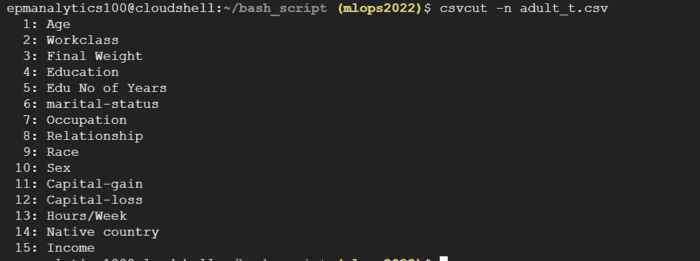

作者图片

3.只检查几列

```
**csvcut -c 2,5,6 adult_t.csv**
#To check by column names
**csvcut -c Workclass,Race,Sex adult_t.csv**
```

4.可以使用 pipe 命令检查选定列的前几行

```
**csvcut -c Age,Race,Sex adult_t.csv| csvlook | head**
```

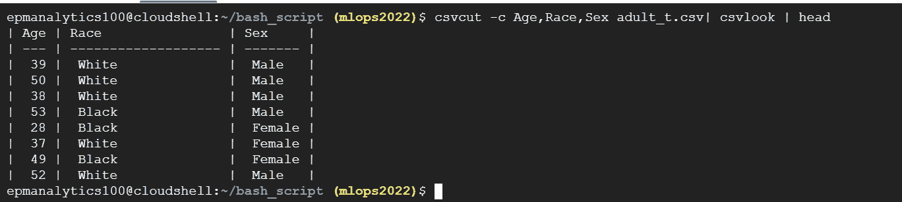

作者图片

5.检查底部记录，然后使用 tail

```
**csvcut -c Age,Race,Sex adult_t.csv| csvlook | tail**
```

6.使用 **grep** 找到一个模式。Grep 命令打印与模式匹配的行。在这里，我想选择所有拥有博士学位、丈夫和种族都是白人的候选人。查看[文档了解更多](https://linuxcommand.org/lc3_man_pages/grep1.html)信息。

```
**grep -i “Doctorate” adult_t.csv |grep -i “Husband”|grep -i “Black”|csvlook**
# -i, --ignore-case-Ignore  case  distinctions,  so that characters that differ only in case match each other.
```

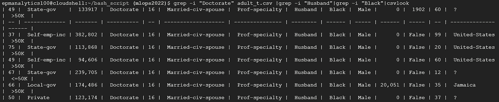

作者图片

7.检查数据集中有多少人完成了博士学位。使用命令 wc-word count。使用 grep 搜索博士学位，然后统计博士学位出现在。使用字数(wc)的数据集。数据集中有 413 人拥有博士学位。

```
**grep -i “Doctorate” adult_t.csv | wc -l**
```

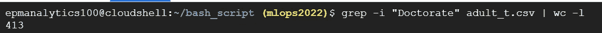

作者图片

8.**数据的统计数据**——使用类似于 summary()的 csvstat 来查找统计数据。在这里，我试图找到年龄，教育，小时/周列的统计数据。例如，Age-给出数据类型，包含空值、唯一值、最小值等。请参考下面的截图。

```
**csvcut -c Age,Education,Hours/Week adult_t.csv | csvstat**
```

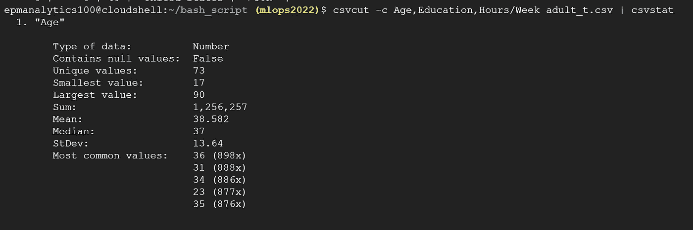

作者图片

**9。使用 Sort and Unique:** 对文件进行排序，仅选择唯一的记录，然后将其写入名为 sorted_list.csv 的新文件。cat 命令选择文件中的所有内容，然后对文件进行排序，然后删除重复的记录，然后将其写入名为 sorted_list.csv 的新文件

```
**cat adult_t.csv | sort | uniq -c > sorted_list.csv**
```


作者图片

该文件是

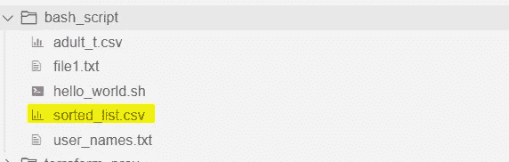

作者图片

9.**合并文件:**在很多情况下，你需要合并两个文件。您可以使用 csvjoin。这很有用。

作者图片

```
**csvjoin -c cf data1.csv data2.csv > joined.csv**
#cf is the common column between the 2 files.
#data1.csv-file name 
#date2.csv-file name
#use the redirect '>' to write it to a new file called joined.csv
```

查看关于合并多个 CSV 文件的 [csvkit 文档](https://csvkit.readthedocs.io/en/latest/tutorial/3_power_tools.html#csvjoin-merging-related-data)。

10.**找出 2 个文件的区别:**

作者图片

如果你想找出两个文件的区别，那么使用 diff 命令。例如，文件 1 由客户 ID 组成，文件 2 由客户 ID 组成。如果您想查找文件中可用而文件 2 中不可用的客户，请使用 diff file1 file2。输出将显示文件 2 中没有的所有客户 Id。

11.AWK:我们也可以用 AWK。AWK 代表 **:** 阿霍、温伯格、柯尼根(作者)。AWK 是一种脚本语言，用于文本处理。请查看文档了解更多信息。

例如，如果要打印第 1 列和第 2 列以及前几条记录。

作者图片

这里$1 和$2 是第 1 列和第 2 列。输出是

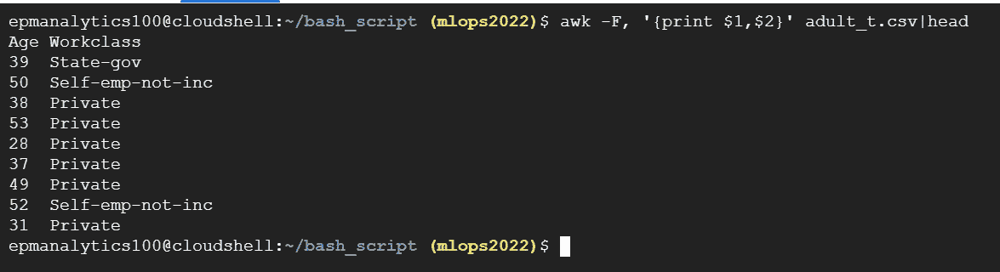

作者图片

```
**#Print$0 — prints the whole file**.
```

找出大于 98 小时/周的小时数。

```
**awk -F, ‘$13 > 98’ adult_t.csv|head**
```

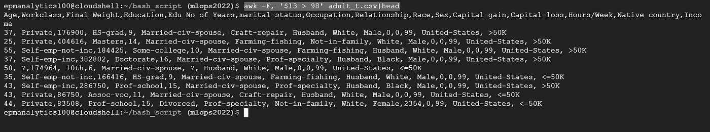

作者图片

打印列表中拥有博士学位的人，并打印前 3 列

```
**awk '/Doctorate/{print $1, $2, $3}' adult_t.csv**
```

12. **SED:** SED 代表流编辑器。它用于过滤和转换文本。SED 处理输入流或文本文件。我们可以将 SED 输出写到一个文件中。

让我们看一些例子。

*   用 SED 打印

```
**sed ‘’ adult_t.csv**
#or - use the Cat and pipe command
cat adult_t.csv | sed ''
```

*   **替换一段文字**:比如在文件中，我想把 Doctorate 替换成 Ph.D。

```
**sed ‘s/Doctorate/Phd/g’ adult_t.csv**
#if you want to store the transformation in a new file
**sed 's/Doctorate/Phd/g' adult_t.csv > new_phd.csv**
#g - stands for globla change-apply to the whole file
```

有关 SED 的更多信息，请[查阅文档](https://www.gnu.org/software/sed/manual/sed.html)。

13。转换:

您可以使用 **tr** 命令。最常用的是转换成大写或小写。下面的代码从大写转换成小写，再从小写转换成大写。

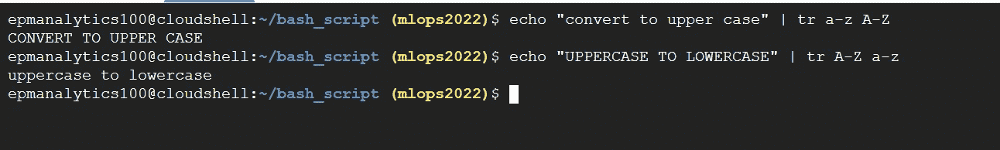

作者图片

另一个例子:

```
# convert space with underscore. **$ echo 'Demo Transformation!' | tr ' ' '_'
Demo_Transformation!**
```

请查看这个 [StackOverflow 关于转型的讨论。](https://stackoverflow.com/questions/2264428/how-to-convert-a-string-to-lower-case-in-bash)

**14。卷曲:**

根据文档- **curl** 是一个从服务器传输数据或向服务器传输数据的工具。它支持这些协议:字典，文件，FTP，FTPS，地鼠，地鼠，HTTP，HTTPS，IMAP，IMAPS，LDAP，LDAPS，MQTT，POP3，POP3S，RTMP，RTMPS，RTSP，SCP，SFTP，SMB，SMBS，SMTP，SMTPS，TELNET 或 TFTP。该命令设计为无需用户交互即可工作。

语法是

```
**curl [options / URLs]**
```

查看有关 curl 的更多[信息。如果您想在线提取一些数据，Curl 是一个有用的命令。](https://curl.se/docs/manpage.html)

**15。csvql:**

csvql 用于为 CSV 文件生成 SQL 语句，或者直接在数据库上执行这些语句。它还有助于创建数据库表和从表中查询。这对数据的转换很有帮助。

例如

```
**csvsql --query "select county,item_name from joined where quantity > 5;" joined.csv | csvlook**
```

我们使用的是 csvsql，查询是从 joined.csv 文件中选择数量大于 5 的 county 和 item_name 字段，然后通过 csvlook 将结果输出到屏幕上。但是从 CSV 文件查询比从 SQL 表查询要慢。整个 CSV 文件都加载到内存中，如果数据集很大，将会影响性能。

有关如何对 CSV 文件运行 SQL 查询的更多信息，请参考 csvkit 的以下文档[。](https://csvkit.readthedocs.io/en/latest/tutorial/3_power_tools.html#csvsql-and-sql2csv-ultimate-power)

**16。截断和过滤 CSV 列:**您可以使用 csvcut 从 CSV 文件中只选择需要的列。

例如

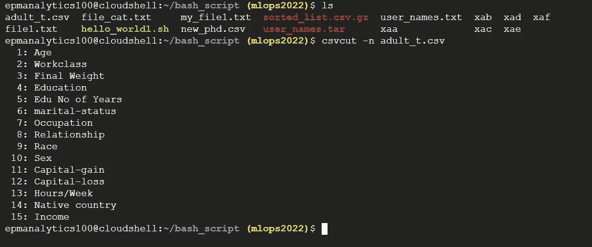

作者图片

现在，您可以选择所需的列，然后将它们写入文件。例如，我需要年龄、种族和性别。我选择了 3 列，然后将它们写入一个名为 csvcut 文件的新文件中。

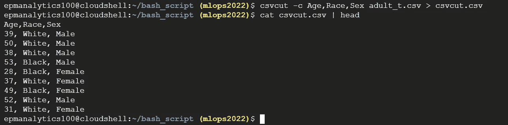

作者图片

## Dockerfile 文件分析:

让我们检查一个 Dockerfile 文件并理解所使用的 bash 命令。

docker 文件[可从该位置获得。](https://github.com/microsoft/mssql-docker/blob/master/oss-drivers/php-mssql/Dockerfile)

作者图片

1.  **来自:**

作者图片

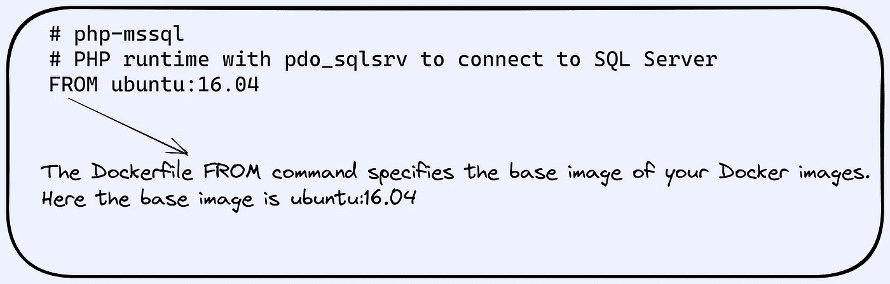

**2。apt-get 和系统实用程序:**

代码是

作者图片

1.  Dockerfile **RUN** 命令可以在 Docker 镜像中执行命令行可执行文件。Run 命令在 docker 映像构建期间执行。
    2。 **apt-get update-to** 更新所有的包。这里使用了 **& &逻辑 AND** 运算符。如果更新成功，则执行 apt-get 安装。(命令 1&一旦命令 1 成功，将执行命令 2→2)
    3。**curl—>curl(客户端 url 的缩写)**是一个命令行工具，支持通过各种网络协议传输数据。这里是下载 apt-utils，apt-transport 等。
    4。**RM-RF/var/lib/apt/lists/*—RM**代表移除，它表示移除/var/lib/apt/lists/*中的所有文件。只有 curl 成功，才会执行 rm 命令。使用了& &逻辑与运算符。

**3。卷曲**

作者图片

*   **再次运行**中的**收拢**命令。给出了 URL，curl 下载了 **microsoft.asc** 文件。
*   然后使用 **|(管道)**命令。 **apt-key add** -从文件 microsoft.asc 添加密钥

**4。环境变量:**

作者图片

*   首先，使用 **apt-get** update 安装更新。
*   一旦更新成功( **& & -AND 运算符**)，那么设置**环境变量**的值 **ACCEPT_EULA =Y.**
*   然后调用 **apt-get install** ，安装所有需要的包。

**5。再次运行:**

作者图片

*   我们可以在这里看到一个模式。先有一个 **apt-update** 与 **apt-get install** 连锁。一旦更新完成并成功，安装就开始了。
*   **\** 转义字符。
*   **—no-install-recommended**:apt-get install-只安装推荐的软件包，不安装推荐的软件包。使用时，只安装主要的依赖项(`Depends`字段中的包)。
*   **rm -rf** →删除文件和目录。选项 **-rf → -** `**f**` 强制移除所有文件或目录，并→ `-r`递归移除目录及其内容。只有在成功完成安装后，才会删除目录/文件。使用了&&-逻辑与运算符。

**6。安装区域设置和回显:**

作者图片

*   apt-get 安装语言环境-什么是语言环境？语言环境**根据您的语言和国家定制程序**。根据您的语言和国家，然后安装区域设置。
*   成功安装局部变量后，执行 echo 命令。
*   在回显之后，执行 locale-gen。查看更多关于语言环境和语言环境的[信息](https://askubuntu.com/questions/442843/what-are-duty-of-locale-and-locale-gen-commands)
*   要点是所有的 apt-get、echo 和 locale-gen 都用**&&——逻辑 and 操作符链接在一起。**

**7。回显和追加:**

作者图片

*   pecl 用于安装 PHP 驱动程序。
*   这里的 echo 命令追加> >(追加到 php.ini 文件)/etc/php/7.0/cli/php.ini。

我们看到了如何在 docker 文件中使用 ***echo、& &、> >、\、rm、rm-rf、环境变量、管道命令、*** 等。因此，了解 bash 对于创建 docker 文件和理解 docker 文件非常有用。MLOps 工程师或数据工程师将经常创建 docker 文件。

## 结论:

感谢您阅读我关于 bash 和 Linux 的文章。同样，bash 将有助于自动化许多手动任务，也可用于数据科学活动，如数据预处理、数据探索等。CLI 非常快速且容易学习。请在 [Linkedin](https://www.linkedin.com/in/esenthil/) 上免费连接。

## 参考:

1.  鸣谢数据集:来自 UCI 机器学习知识库的**成人**数据集，其中包含人口普查信息。C.L .布莱克和 C.J .默茨(1998 年)。UCI 机器学习知识库[http://archive . ics . UCI . edu/ml]。加州欧文:加州大学信息与计算机科学学院。
2.  bibe tex:[@ misc](http://twitter.com/misc){ C . J:1998，
    author = "Blake，C.L. and Merz "，
    year = "1998 "，
    title = "{UCI}机器学习库"，
    URL = "[http://archive.ics.uci.edu/ml](http://archive.ics.uci.edu/ml)"，
    institution = "加州大学欧文分校信息与计算机科学学院" }
3.  https://www.gnu.org/software/gawk/manual/gawk.html AWK 文献-
4.  SED 文件-[https://www.gnu.org/software/sed/manual/sed.html](https://www.gnu.org/software/sed/manual/sed.html)
5.  命令行数据科学-[https://github . com/jeroen janssens/命令行数据科学](https://github.com/jeroenjanssens/data-science-at-the-command-line)
6.  https://csvkit.readthedocs.io/en/latest/
7.  https://docs.docker.com/engine/reference/builder/
8.  Linux-[https://docs.kernel.org/](https://docs.kernel.org/)