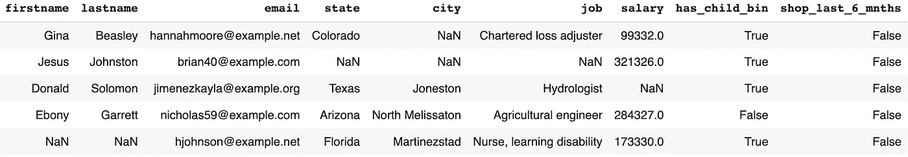
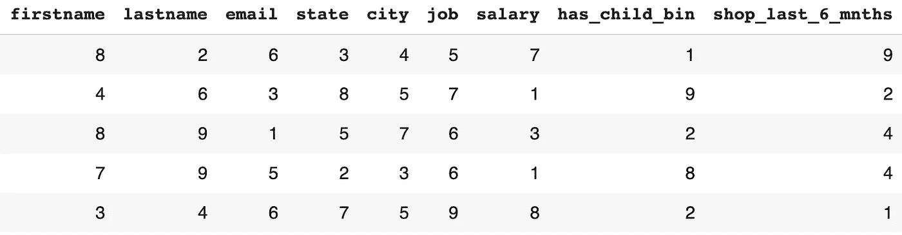
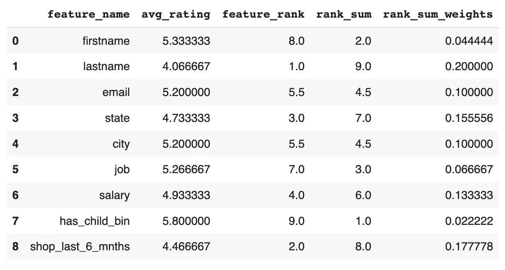

# 基本数据质量评分

> 原文：<https://towardsdatascience.com/basic-data-quality-scoring-3c9158ee21a>

## 通过用户排名对功能进行加权

图片来自 Unsplash.com，作者: [@javaistan](https://unsplash.com/@javaistan)

我最近参与了一个项目，在这个项目中，确定数据质量的周转时间非常快。可用的数据主要是第三方供应商提供的 B2B 数据，非常稀少(大量空值)。如果你在 B2B 公司的销售或营销部门工作过，这并不新鲜或不寻常。如果你没有，想象你有一些关于潜在客户的数据，你希望你的销售或营销团队针对你的特定产品。例如，如果您向其他企业销售软件，销售和营销团队应该首先向哪些潜在客户或潜在客户传递信息？销售团队应该首先给谁打电话，或者从庞大的供应商列表中优先考虑谁。这基本上是我的团队在被公司雇佣的几周内接到的第一个项目。

想出一种创建数据质量分数(DQS)的方法，可以带你走上有多种解释的多条道路。如果你是一名数据科学家，从机器学习的角度来看，这条道路可能看起来很清楚。但是，如果您没有时间或资源来完成研究和数据科学尽职调查，该怎么办？如果您只有 1-2 周的时间来交付产品，该怎么办？

在本帖中，我将通过一个非常基本的 3 步方法，使用用户排名生成的权重为您的数据获取 DQS。这是一种快速而基本的方法，**可以在没有任何机器学习经验的情况下完成，但提供可操作的结果**。请记住，DQS 可能听起来有误导性，因为它并不反映与结果相关的记录的“质量”。这可能是某种机器学习概率模型。DQS 反映了给定数据记录的可用信息，如果根据利益相关方调查结果认为可用字段很重要，则会对其进行加权。有时候保持数据的简单是最好的方法，可以让你很快达到 v1！

**第一步:哪些数据最重要**

第一步是获取利益相关者关于哪些特性或变量对解决问题最重要的反馈。一种方法是**简单地询问客户**(业务利益相关者)什么对问题最重要。你的涉众通常有很多领域的专业知识。他们将知道数据中的哪些字段对他们的工作最有帮助。让我们以销售线索生成为例。利益相关者可能已经知道，当他们了解个人的工作时，或者如果他们过去与我们一起购物，他们已经从销售线索中看到了最大的成功。因此，从他们的角度来看，在处理领导时，他们可能会立即过滤掉任何工作，以浪费时间。这就是 DQS 可以帮助我们的地方，因为我们可以根据许多字段而不是一个字段来加权和得出分数，同时给它们一个值来排序或过滤！因此，我们需要与企业一起做一个快速练习，以获得他们认为对他们很重要的领域的列表。

表 1:生成的数据示例

一旦你对利益相关方的这些“重要”特征有了一个很好的列表，你就可以着手创建一个调查，要求利益相关方根据重要性对以下特征进行排序(成功销售线索的经验)。从我们的快速探索性谈话中，我们可以得出利益相关者认为重要的 9 个可能特征(表 1)。我们将要求他们对我们调查中的每个特性进行排名，我们应该会得到类似表 2 的结果，其中每一行都是个人对每个特性的回答。请注意，在个人或行级别上，现在有重复的排名值。

表 2:按列或特性强制排列重要性。每行代表跨要素的单个响应。

**第二步:获取等级值和权重**

现在我们有了调查反馈，您可以做很多事情，但我做的是让它变得简单，获得每个功能的平均排名，然后将输出从 1 到 9 排序，如您在下面的表 3 的`avg_rating`和`feature_rank`列中看到的。一旦有了平均等级，您就可以应用简单的等级和公式: *n - r + 1* 其中 *n* 是特性的总数(9)，而 *r* 是特定的特性等级(1-9)。

> **示例**:`lastname`的平均等级为 4.067，这使其成为等级最低或最重要的特性，因此其`feature_rank`为 1。因此，和秩等式将是: *9 - 1 + 1* 并且`rank_sum`等于 9。

表 3:平均排名汇总、新功能排名、排名和计算以及新功能权重

一旦我们完成了所有特征的简单秩和方程，我们就要分配权重。当使用秩和时，通常的方法是将`rank_sum`值除以`rank_sum`的和，这将给出一个介于 0 和 1 之间的值，该值基本上以百分比的形式显示了这个已排名的特性占总数的多少。

> **示例** : `*lastname*`的`rank_sum`值为 9。我们`rank_sum`栏目的总和还是 45。因此，我们将特征`lastname`的权重指定为 0.20 (9/45)。

**第三步:应用您的数据质量分数**

现在我们有了所有特征的权重，下一步也很简单。回头看看表 1 中的原始数据，我们将所有的`NaN`值替换为 0，所有的实际值替换为相应的权重。对于我们的二元特征(对/错)，也是一样的。`NaN`值得到 0，所有其他值得到权重。请记住，与表 1 中生成的数据相比，我在实际数据中包含了大量的`NaN`值，因此这种方法更有意义，并产生了良好的结果。让我们看一个快速评分的例子，以确保它是清楚的。

> **示例**:查看表 1 中的第一个“线索”，我们看到 Gina Beasley。数据记录是完全可用的，除了`city`特征，其中我们有一个`NaN`值。因为我们知道权重之和= 1，所以分数就是从 1 或 1 - 0.10 中减去城市权重，Gina 的数据质量分数就是 0.90。相比之下，Donald Solomon 也只缺少 1 个字段`salary`，但会得到稍低的 DQS 0.87(1-0.13)，因为每个利益相关方`salary`对他们来说不如`city`重要。

## 结论

这是你获得数据质量分数的第一步。向企业解释起来很简单，使用一些简单的代码就可以轻松部署，并在几天内让您获得 v1 版本！我承认这种方法有很多假设，而且非常简单，但它为我们合作的团队和部门提供了快速的胜利。也就是说，采取这种方法，修改它，建立你的下一个伟大的 DQS！

## 参考

1.  按排名资源加权:[http://www . gitta . info/适用性/en/html/Normalisatio _ learning object 1 . html](http://www.gitta.info/Suitability/en/html/Normalisatio_learningObject1.html)
2.  带有启动代码的 Github Repo

## 承认

我和我的好同事[迈克尔·吉米尼](https://www.linkedin.com/in/michael-jimney/)一起做这个伟大的项目！这是一个有趣的初冬，迈克。谢谢大家！