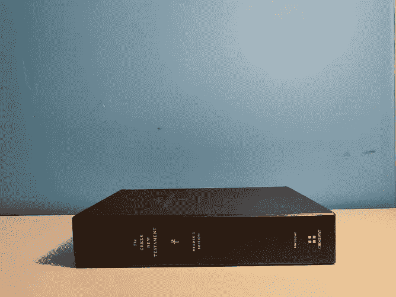
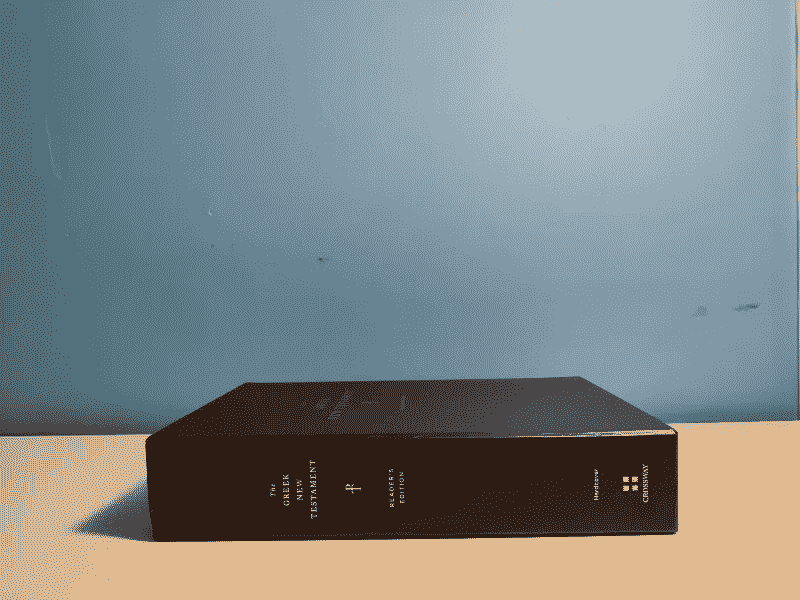
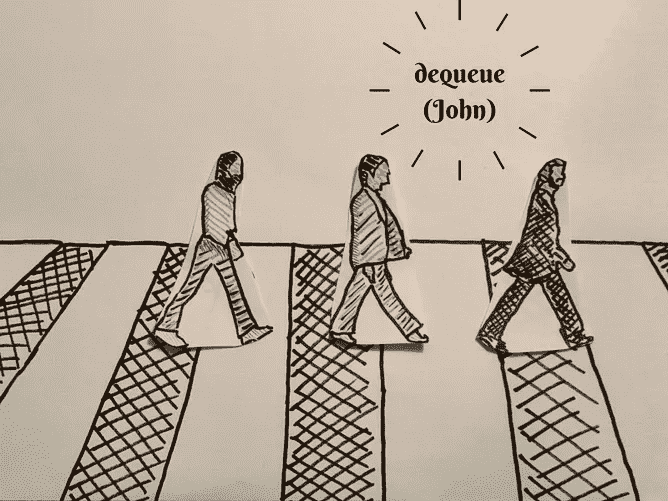

# 基本数据结构:堆栈和队列

> 原文：<https://towardsdatascience.com/basic-data-structures-stacks-queues-data-structures-algorithms-for-5th-graders-bbb4386401cc>

## 数据结构和算法变得简单

我们在别无选择的情况下玩的游戏…

下次当你走进餐厅或自助餐厅时(为了你们这些大学生…)，考虑一下你周围都是简单数据结构的事实！

看看任何一堆盘子、碗或杯子。当你想添加到堆栈中时，你把一些东西放在顶部，当你想从堆栈中移除时，你从顶部拿走一些东西。如果你能理解那些物理栈是如何被处理的，你就能很容易理解计算机栈是如何工作和被处理的。当你看到传送带，你把你的脏盘子和碗放在上面，让工作人员清洗和清洁，意识到这实际上是现实生活中的一个队列！无论你放什么进去，都会按照你放东西的顺序来处理。先进的先出，落后的后出。

你猜怎么着？通过阅读这篇文章，你就离理解栈和队列在我们一直使用的技术中是如何被利用的不远了！使用堆栈，您可以了解文本编辑器中的撤销/重做功能是如何工作的，以及 web 浏览器是如何跟踪页面历史的。通过队列，您可以了解打印机队列如何工作，以及您的电子邮件收件箱如何处理收到的邮件。

# 目标/免责声明

本系列文章(“数据结构和算法变得简单”)的目的是帮助所有“学习爱好者”对 DSA(数据结构和算法)概念和主题有一个直观的理解。我强烈支持阿尔伯特·爱因斯坦和理查德·费曼共享的学习哲学。爱因斯坦曾有一句名言:“如果你不能向一个 6 岁的孩子解释，那你自己也不明白。”费曼基本上说了同样的话，“如果你不能用简单的术语解释某事，你就不理解它。最好的学习方法是教。”我真诚地希望，通过撰写这些文章的过程，我自己将更加巩固我对 DSA 的概念性理解，并且许多其他人也将从这种直观的理解中受益。

让我们考虑一个常见的生活场景。

一天，我决定把我的希腊新约圣经放在桌子上。然后我想在我的希腊新约圣经上再放一本书。如果我决定在现有的书堆上再增加两本书呢？

如果我想再次访问我的希腊文新约圣经(不发出太多的噪音或可能因掉落而损坏书籍)，我唯一可以采取的方法是首先移除书架上它上面的其他书籍。我必须拿走我的赞美诗(我最后放的)，然后我必须拿走我的圣经(我倒数第二放的)，最后我必须拿走我放在第二的书。

让我们换个话题，想想我们的好朋友约翰、保罗、乔治和林戈。假设在利物浦的一个跳蚤市场有一次盛大的苹果销售，我们的朋友想要尽可能多的苹果，以一个好价钱。

他们实际上设法比任何人都先到跳蚤市场，所以不管排什么队买苹果，最多只能有四个人。

约翰是领队，先排队。然而，在约翰有机会进入跳蚤市场之前，他的其他伙伴都在排队。林戈进入队伍，然后是保罗，最后是乔治。

一旦四个伙伴都排好队，约翰很快就能进入跳蚤市场。然后，林戈和保罗可以进来了，留下可怜的乔治一个人(他的吉他轻轻地哭泣……)。

如果你能理解这两个场景，你就能理解栈和队列！

我们需要定义几个术语。

简单地说，数据结构是一种组织数据的方式。一些组织数据的方法更适合不同的情况，并且总是有优点和缺点。栈和队列都是基本数据结构的例子。

一个**栈**是一个“LIFO”数据结构，你在一个“垂直塔”中存储项目，就像我们的艺术品例子一样。

**LIFO** 是首字母缩略词，代表“后进先出”。

一个**队列**是一个“FIFO”数据结构，在那里你将项目放在一个“行”中，就像我们的 Abbey Road 例子一样。

**FIFO** 是首字母缩略词，代表“先进先出”。

对于堆栈，您的主要功能是**【push】**和**【pop】**。“推入”是将一个项目添加到堆栈的顶部，而“弹出”是从堆栈的顶部移除一个项目。因为栈是 LIFO 数据结构，为了访问最后一个项目“下面”的元素，你必须顺序地“弹出”它“上面”的所有项目来访问它。

我们通过将一本书添加到现有书库的顶部来将它“推”到书库的顶部

我们从现有书库中取出一本书，从书库顶部“弹出”一本书

下面是 Python(我喜欢的编码语言)中栈概念的一个非常简单的实现。

对于队列，您的主要功能是**【删除】**和**【添加】**(也可以分别称为“出列”和“入队”)。“删除”是删除行中第一个项目，而“添加”是将一个项目添加到行尾。因为队列是 FIFO 数据结构，为了访问“排在最后”的元素，您必须将队列中“排在它前面”的所有元素“移除”或“出列”。

我们从队列中的 John 开始，然后将其他人“入队”，然后将 John“出队”，因为他是队列中的第一个

# 概述

总结一下，什么是栈和队列？它们是基本的数据结构，是组织数据的方式。堆栈以“后进先出”的方式存储数据，队列以“先进先出”的方式存储数据。对于堆栈，您可以选择“推入”或“弹出”，访问堆栈中的项目的唯一方法是“弹出”添加在它之后的项目。对于队列，您可以选择“删除”或“添加”，访问队列中项目的唯一方法是“删除”在它之前添加的元素。

对这些概念有一个牢固的理解是很重要的，因为像栈和队列这样的简单数据结构在各种算法和计算机相关的任务中经常被使用。理解这些概念对每个使用计算机的人来说都是至关重要的。

# 资源

如果您需要更多帮助来直观了解堆栈和队列，请查看这些视频:

*   [https://www.youtube.com/watch?v=A3ZUpyrnCbM&ab _ channel = cs Dojo](https://www.youtube.com/watch?v=A3ZUpyrnCbM&ab_channel=CSDojo)
*   https://www.youtube.com/watch?v=KInG04mAjO0&t = 10s&ab _ channel = BroCode
*   https://www.youtube.com/watch?v=nqXaPZi99JI&T4 ab _ channel = BroCode

如果您想深入了解这些主题的理论、应用和正式理解，请查看以下资源:

*   https://www.youtube.com/watch?v=wjI1WNcIntg&ab _ channel = hacker rank
*   [https://www . Andrew . CMU . edu/course/15-121/lessons/Stacks % 20 and % 20 queues/Stacks % 20 and % 20 queues . html](https://www.andrew.cmu.edu/course/15-121/lectures/Stacks%20and%20Queues/Stacks%20and%20Queues.html)