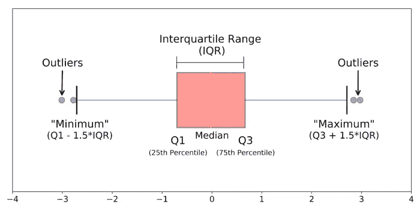

# 数据科学数据可视化基础指南(第一部分)

> 原文：<https://towardsdatascience.com/basic-guide-to-data-visualization-for-data-science-8e7d966bf10a>

## 基本数据可视化一览:标准指南

照片由 [Myriam Jessier](https://unsplash.com/@mjessier?utm_source=medium&utm_medium=referral) 在 [Unsplash](https://unsplash.com?utm_source=medium&utm_medium=referral) 上拍摄

## 动机

每天我们都会产生大量的数据。一项调查表明，世界每天至少产生 2.5 万亿字节的数据，并且还在呈指数级增长[1]。但是，除非我们深入了解这些数据，否则我们能对这些海量数据做什么呢？数据可视化了就变成了美。

如果我们回到 2020 年初，世界受到新冠肺炎的袭击，变成了疫情。我们密切关注新冠肺炎局势的信息图表，以便对世界当前局势一目了然。坚持一下，想一会儿。如果给你看一大块数据，你有可能掌握情况吗？这里，数据可视化的妙处就来了。

当我们处理大量数据时，除了在没有数据可视化的情况下获得有组织的信息之外，别无选择。

## 目录

`*Tap or click on specific content to directly jump to the section*`

`[**What is Data Visualization?**](#6f82)`

`[**Why is Visualization important?**](#fe11)`

`[**Common Tools for Data Visualization**](#cf41)`

`*Basic data visualization example with Python*`

1.  `[**Frequency Table**](#81c8)`
2.  `[**Scatter Plot**](#fde6)`
3.  `[**Line Plot**](#cbef)`
4.  `[**Bar Chart**](#8f0f)`
5.  `[**Histogram**](#71fe)`
6.  `[**Pie Chart**](#fced)`
7.  `[**Exploded Pie Chart**](#fda6)`
8.  `[**Distribution Plot**](#8764)`
9.  `[**Box plot**](#ce15)`

`*[Complete data visualization guideline is available here…*`

  

`*]*`

## 什么是数据可视化？

数据可视化是一种用图形表示数据和信息的方法[2]。在另一种意义上，它可以被描述为使用图表、绘图、动画、信息图等将数据转化为可视的上下文。[3].它有助于发现数据的趋势和模式。可视化是用来总结信息的[3]。

假设你是一名数据专家，在一家公司的管理团队中工作。不希望团队成员不理解您的技术术语。但是精确的数据可视化可以很容易地帮助您表示公司的整体统计数据，以便他们可以为公司的发展做出适当的决策。

可视化的方式因人而异。对于一个博士来说，数据可视化的视角不同于公司成长团队。他将使用可视化技术对他的研究项目进行更具批判性的分析。

因此，数据可视化为深入了解数据铺平了道路，并在专业人员之间建立了一座最容易共享信息的桥梁。

## 为什么可视化很重要？

作为人类，我们对图形表示有正确的理解和参与。它是一种通用语言。如果给你一个包含数百行的表格格式的数据集，你会感到困惑。但是适当的数据可视化可能会帮助您获得正确的趋势、异常值和数据模式。

数据可视化的其他一些重要性[2] —

轻松分享信息。

交互式探索机会。

可视化模式和关系。

## 数据可视化的常用工具

数据可以用不同的方式可视化。为了可视化数据，我们需要可视化工具的帮助。这些工具提高了数据专业人员的效率。我们可以把工具分为两类[3] `**i. Code-free tools ii. Code-based tools**.`

***无代码工具***

*   `[Microsoft Power BI](https://powerbi.microsoft.com/en-au/)`
*   `[Tableau](https://www.tableau.com/)`

这两个工具是最常用的无代码工具。

***基于代码的工具***

**Python** 和 **R** 是数据科学最常用的两种编程语言。其中， **Python** 最好。Python 因其简单的语法和巨大的内置库而被广泛用于不同的数据科学任务。一些流行的数据可视化工具库如下—

`· [matplotlib](https://matplotlib.org/stable/plot_types/basic/stem.html)`

`· [seaborn](https://seaborn.pydata.org/)`

`· [plotly](https://plotly.com/)`

`· [bokeh](https://bokeh.org/)`

`· [ggplot](https://bokeh.org/)`

现在，是时候来一些动手的例子了。在大多数情况下，我尝试使用像 matplotlib 和 seaborn 这样的基本绘图库，因为我希望文章保持简单。

## 项目的数据集

出于演示的目的，我创建了一个合成的 [*蔬菜*](https://deepnote.com/workspace/zubair063-9767-9eddd116-b682-475a-9479-3807be1e71db/project/Data-Visualization-b20ec91c-3126-4ea1-9377-d7b7bddab634/%2FVegetable.csv) 数据集，其中包含一些数字和分类变量。数据集的一些示例实例如下所示。

## 频率表

频率是一个值出现的次数。频率表是以表格形式表示的频率。

上表显示了两个变量`‘vegetable’` 和`‘Season.’` 的频率，我们可以找到单个变量或两个以上变量的频率。

## 散点图

散点图是一种在二维坐标系中绘制两个数值变量的方法。有了这个图，我们可以很容易地将数据分布可视化。

上面的代码产生了二维空间的散点图。`‘Price’`和`‘Weight’` 连续代表 x 轴和 y 轴。这些点是根据它们的坐标值绘制的。我已经使用了`**matplotlib**`库，但是还有其他像 `[seaborn](https://seaborn.pydata.org/generated/seaborn.scatterplot.html), [plotly](https://plotly.com/python/line-and-scatter/), [bokeh](https://hub.gke2.mybinder.org/user/bokeh-bokeh-notebooks-5evw4sv6/notebooks/tutorial/01%20-%20Basic%20Plotting.ipynb), etc.,`这样的库来绘制图形。

## 线形图

本质上，折线图类似于散点图，但是点是用连续的线顺序连接的。与数据分布相比，该图更适合于在二维空间中查找数据流

在示例线图中，我想显示不同数据点的`weight`趋势。除了`**matplotlib**`，你也可以使用其他库。

## **条形图**

条形图主要用于用条形表示**分类变量**的频率。不同高度的条形表示频率。

条形代表`*Winter, Summer, and All seasons*` *时令蔬菜的频率。我们很容易发现，冬季的蔬菜数量是其他季节中最多的。如果您想自定义图形，请阅读`[**matplotlib**](https://matplotlib.org/stable/api/_as_gen/matplotlib.pyplot.bar.html)`的文档。*

## 柱状图

**直方图**的概念与条形图相同。在条形图中，频率显示在*分类变量*的*离散条*中；然而，*直方图*显示了连续区间的*频率。基本上是用来求区间内连续变量的频率。*

上面的**直方图**表示蔬菜`price` 在区间`*(0–10,10–20,20–30,30–40,40–50, …..,110–120)*`内出现的频率，其中*价格*为连续变量。

## 圆形分格统计图表

饼图以圆形方式显示频率的百分比。每个元素根据其频率百分比保持圆的面积。

为了绘制饼状图，我使用了`seaborn` 库。在柱状图中，我们可以看到蔬菜在不同季节的出现频率。饼图显示了相同的频率，但以百分比形式显示。对频率有一个很好的直觉，一目了然，比条形图容易。

## 分解饼图

饼状图与 ***分解饼状图*** 相同。在分解饼图中，您可以隔离饼图的一部分以突出显示元素。

在上面的分解饼图中，我想突出显示主图中所有`season’s`频率的区域。

## 分布图

我们可以用分布图来理解一个`***continuous variable’s***` 值是如何分布的。

数据集的`‘price’`不是正态分布的；相反，它是左倾的。

*【要了解更多关于频率分布的细节，请阅读文章*

  

*】*

## 箱形图

下图是一个方框图，其中的方框表示`**1st(Q1) and 3rd(Q3)**` 四分位数之间的范围。左侧和右侧的垂直线表示异常值围栏，超出该线的值被视为异常值。方框内的黄色竖线表示`**2nd quartile (Q2)**.`

作者图片(摘自我的另一篇文章[4])

此图用于寻找中心趋势，也可以估计离差。下面给出了一个箱线图的编码示例。

对于类别***‘所有季节’，*** *我们只有一条垂直线，意味着该类别下的所有值都是相同的。*

## 结论

数据可视化是一种总结和洞察数据集的神奇技术。在数据可视化之前，我们需要非常小心变量类型。随机的数据可视化会误导我们，这对我们的决策可能是一个大问题。所以，我们需要问自己为什么我们要观想，我们想从中提取什么信息？如果我们知道答案，数据可视化将提供一个有趣的结果。

## 参考

1.  [信息图:每天产生多少数据？](https://cloudtweaks.com/2015/03/how-much-data-is-produced-every-day/)(cloudtweaks.com)
2.  [什么是数据可视化？定义&示例|表格](https://www.tableau.com/learn/articles/data-visualization)
3.  [什么是数据可视化？数据科学家指南|数据营](https://www.datacamp.com/blog/what-is-data-visualization-a-guide-for-data-scientists)
4.  [比较多频率分布|走向数据科学(medium.com)](https://medium.com/towards-data-science/compare-multiple-frequency-distributions-to-extract-valuable-information-from-a-dataset-10cba801f07b)

`*[I like to write a series of articles on different data science topics. Please, keep your eyes on the next article. This one is all about the basic guideline. Intermediate and advanced guidelines are in the pipeline.]*`

> 最后，如果你觉得这篇文章有帮助，别忘了给我打电话。你也可以用我的`[***referral link***](https://mzh706.medium.com/membership)`加入 medium。通过电子邮件获取我所有的文章更新`[**subscribe**](https://mzh706.medium.com/subscribe)` 。

**完整的数据可视化指南。**

  

`***I have chosen some articles for you. Don’t miss to read the following articles.***`

     