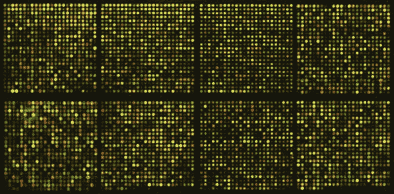
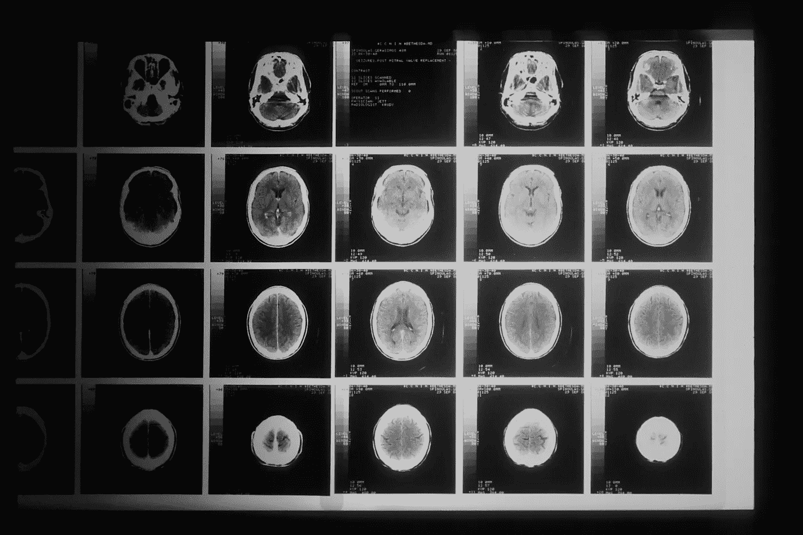
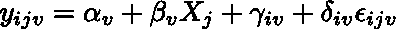
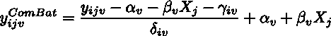
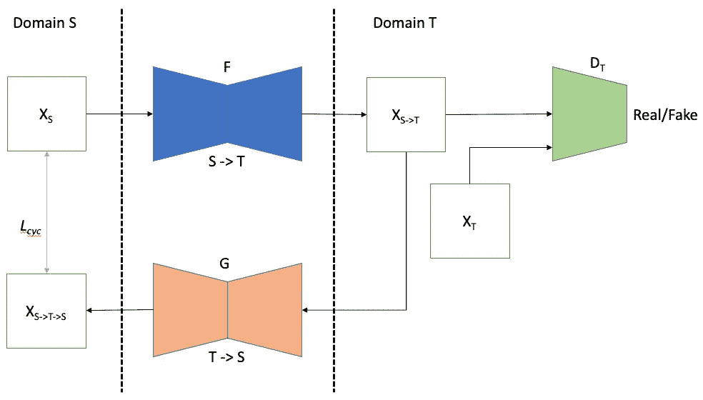

# 批量效果-从数据中删除不需要的变化

> 原文：<https://towardsdatascience.com/batch-effects-c71c886ca9c5>

## 什么是批量效应，如何处理

大规模数据集，尤其是在生物和医学领域，已经变得越来越普遍。从许多不同的机器(通常来自世界各地)获取的成像和基因数据现在被合并到公共可用的数据集，从而允许对统计和机器学习方法进行更高级的研究和应用。

[国家癌症研究所](https://unsplash.com/@nci?utm_source=medium&utm_medium=referral)在 [Unsplash](https://unsplash.com?utm_source=medium&utm_medium=referral) 上拍摄的照片

巨大的数据量是巨大的，但我们有时会遇到由不同机器获取这些数据的方式的差异所导致的问题。不幸的是，例如，没有两台磁共振成像机捕捉到相同的图像(即使它们扫描的是完全相同的人)。由于这些机器的复杂性，在对比度、强度、噪音和其他属性上存在细微的差异。同样的原理也适用于遗传学，不同的微阵列测量基因表达并结合数据。

照片由[国立癌症研究所](https://unsplash.com/@nci?utm_source=medium&utm_medium=referral)在 [Unsplash](https://unsplash.com?utm_source=medium&utm_medium=referral) 上拍摄

*注意:从现在开始，我将在医学成像领域提及批量效果，因为这是我最关注的领域。*

## 为什么重要？

这些由收购引起的“批量效应”在我们的数据中引入了一种新的变异。我们现在有两个变异来源:生物变异(由我们人群的差异造成)和非生物变异(由扫描仪的差异造成)。在我们的下游任务中(例如预测阿尔茨海默病；检查放射组学特征与癌症的关联等。)，我们很可能只想考虑生物变异。

这里有几个问题。第一个与捷径学习有关。假设我们有一个来自医院 A 和医院 B 的胸部 CT 图像数据集，用于诊断肺癌。医院 A 位于一个受污染的城市，肺癌发病率往往比城市 b 高得多。医院 A 的 CT 机也往往比医院 b 产生更亮的图像。现在，当我们在数据集上训练卷积神经网络来预测肺癌时，该模型会学习将更亮的图像与癌症相关联。当然，如果我们在同样的数据集上进行验证，我们可能会有相当不错的预测准确性。但是当我们在别处部署我们的模型时，它可能会严重失败。

那么，我们为什么不从许多不同的网站添加更多的数据呢？

即使我们有更多的数据，整个图像或特征空间的不一致性将迫使我们的预测模型学习更一般、简单的特征，而不是更复杂、非线性、细粒度的特征，这些特征可能难以用不一致的批次来识别[9]。

## 和谐

输入“协调”，或将所有不同批次的数据放入同一个空间，消除非生物效应。我们如何进行协调？

回顾一下，我们必须提到我们正在处理的数据类型。我们可能希望协调的两种数据格式是表格(即行和列)或图像(2D 或 3D 像素/体素)。即使在成像领域，我们也经常使用表格数据，通过处理管道发送原始图像，提取定义明确的可解释特征(如大脑中特定区域的厚度)。我们如何进行协调取决于我们是在查看表格(特征)数据还是图像数据。

## 表列数据

在表格形式的脑成像数据示例中，我们有每个扫描患者的行和从 MRI 提取的每个特征的列(额叶厚度、海马体积等。).我们也有每个病人扫描位置的标签。

最受欢迎的表格数据协调方法叫做 ComBat [2，3](是“组合批次时对抗批次效应”的缩写)。这是一个线性模型，可调整表格批量数据中的均值漂移和方差缩放。该模型如下所示:

*i 为批次标识符(如 MRI 扫描仪 A)，j 为主体(如人 1)，v 为特征(如左侧海马体体积)。yᵢ* ⱼ *ᵥ是批次 I 中受试者 j 的测量特征 v 值。* α *ᵥ是特征截距，x 是受试者 j 的协变量(如年龄、性别)，* β *ᵥ是协变量的系数，* γ *ᵢᵥ是批次相加(均值偏移)项，δᵢᵥ是批次方差缩放项，* ε *是随机的正态分布噪声，均值为 0，标准差为* σ图片作者。

该模型中最重要的特征是扫描仪错误术语 *γᵢᵥ* 和 *δᵢᵥ* ，我们希望“移除”这两个术语，以便将我们的数据放入一个公共(无批处理)空间。这里有许多变量(每个特征有一个 *αᵥ* ，扫描仪和特征的每个组合有一个 *γᵢᵥ* ，等等)。).幸运的是，我们可以使用一种叫做[经验贝叶斯](https://en.wikipedia.org/wiki/Empirical_Bayes_method)的方法来稳健地拟合模型，即使我们没有很多数据。

关于模型拟合我不会说太多细节，但是一个重要的方面是这是一个[层次模型](https://en.wikipedia.org/wiki/Bayesian_hierarchical_modeling)。我们假设，对于给定的扫描仪/批次，所有特征的误差项来自一个共同的分布。

一旦我们的模型合适了，我们就可以最终进行调整，将这些特性放到一个公共空间中。协调方程式是:

*战斗调整功能进入共享空间，移除批量效果。(图片由作者提供)*

注意，我们正在减去附加的批量效应γ *ᵢᵥ* ，并通过批量缩放效应 *δᵢᵥ* 的倒数来缩放线性模型的残差。调整后的特征现在可以用于任何类型的下游分析。

战斗有许多变化，考虑了额外的因素，如纵向数据的受试者特定截距[1]，非线性协变量效应[5]，扫描仪特定的共同因素[8]。

## 成像数据

在成像问题中，我们经常希望使用原始图像(而不是提取的表格特征)进行下游分析。图像级协调变得必要。像素或体素级别的战斗是不够的；这将是低效的，并且忽略了卷积神经网络可能发现的空间相关模式。因此，我们需要一种不同的方法来实现图像级的协调。

图像批量协调可以被认为是域转移。我们有来自几个域或源的图像，我们希望将其转换到单个目标域(目标扫描仪)。对于这项任务来说，一个有吸引力的深度学习模型是[cycle gan](https://machinelearningmastery.com/what-is-cyclegan/)【4】，以及其他各种形式的生成对抗网络(GANs)。在 CycleGAN 中，有两个生成器网络，F 用于将源域转换为目标域(S 到 T)，G 用于将目标域转换为源域(T 到 S)。两个鉴别者试图学习合成图像是“真”还是“假”，而生成器试图在“最小-最大游戏”中愚弄鉴别者。循环一致性丢失加强了原始图像 X 和 F(G(X))之间的相似性，确保来自图像的个体级信息不会在转换中丢失。在批量效应的情况下，S 和 T 可以代表两个不同的 MRI 扫描仪或两个具有不同图像采集属性的不同数据集。

*从源(S)到目标(T)方向的 CycleGAN 架构。来自域 S (X_s)的图像通过一个生成器并被翻译到域 T，生成器 F 与鉴别器 D_T 玩一个对抗性游戏，其中 D_T 试图猜测 X 是来自域 T(真实的)还是由 X_s 生成(虚假的)，生成器 F 试图愚弄鉴别器。所生成的图像 X_S- > T 通过 T - > S 生成器 G 以被转换回域 S。循环一致性损失 L_cyc 比较原始图像 X_S 和循环图像 X_S- > T- > S。*

CycleGAN 很有吸引力，因为它不需要“成对图像”，也不需要在短时间内用不同的扫描仪扫描同一对象的图像。在存在许多成对图像的罕见情况下，其他受监督的图像到图像的翻译方法(例如，涉及 U-网、变分自动编码器等。)的存在就是为了利用这种“基础事实”的转换[6，7]。

协调是计算生物医学研究中一个令人兴奋的新领域，以促进大规模分析，并且有大量的方法改进机会。该领域中的几个公开问题是 1)协调来自以前未见过的站点的数据(领域概括)，以及 2)评估我们的协调模型的性能，而没有地面事实。我期待着尽快分享我在协调方面的一些工作。

参考资料:

1.纵向战斗:一种协调纵向多扫描仪成像数据的方法。*神经影像*。2020;220(5 月):117129。doi:10.1016/j . neuro image . 20001536366

2.跨扫描仪和站点皮质厚度测量的协调。*神经影像*。2018;167(2017 年 11 月):104–120。doi:10.1016/j . neuro image . 2017 . 11 . 024

3.使用经验贝叶斯方法调整微阵列表达数据中的批效应。*生物统计学*。2007;8(1):118–127.doi:10.1093/生物统计学/kxj037

4.Nguyen H，Morris RW，Harris AW，Korgoankar MS，Ramos F .使用生成性对抗网络纠正多位点神经影像数据的差异。2018.[http://arxiv.org/abs/1803.09375.](http://arxiv.org/abs/1803.09375.)

5.庞波尼奥 R，厄鲁斯 G，哈贝斯 M，等。大型核磁共振成像数据集的协调，用于分析整个生命周期的脑成像模式。*神经影像*。2020;208(2019 年 7 月)。doi:10.1016/j . neuro image . 20001363666

6.田 D，曾 Z，孙 X，等。基于深度学习的多点神经影像融合框架。 *bioRxiv* 。2021:2021.12.05.471192.[https://www . bior XIV . org/content/10.1101/2021 . 12 . 05 . 471192 v1 % 0ah ttps://www . bior XIV . org/content/10.1101/2021 . 12 . 05 . 471192 v1 .摘要.](https://www.biorxiv.org/content/10.1101/2021.12.05.471192v1%0Ahttps://www.biorxiv.org/content/10.1101/2021.12.05.471192v1.abstract.)

7.Torbati ME，Tudorascu DL，Minhas DS，Maillard P，Decarli CS，Jae Hwang S .通过结构保持嵌入学习实现配对神经成像数据的多扫描仪协调。*美国电气与电子工程师协会国际会议计算机会议。2021;2021 年十月 b:3277–3286。doi:10.1109/iccvw 54120.2021.00367*

8.Wachinger C，Rieckmann A，Pö lsterl S .检测和纠正多位点神经影像数据集中的偏差。*医学图像分析*。2021;67:101879.doi:10.1016/j . media . 200015863617

9.Wang R，Chaudhari P，Davatzikos C. *与基于流的因果推理的协调*。第 12903 卷 LNCS。斯普林格国际出版公司；2021.doi:10.1007/978–3–030–87199–4 _ 17