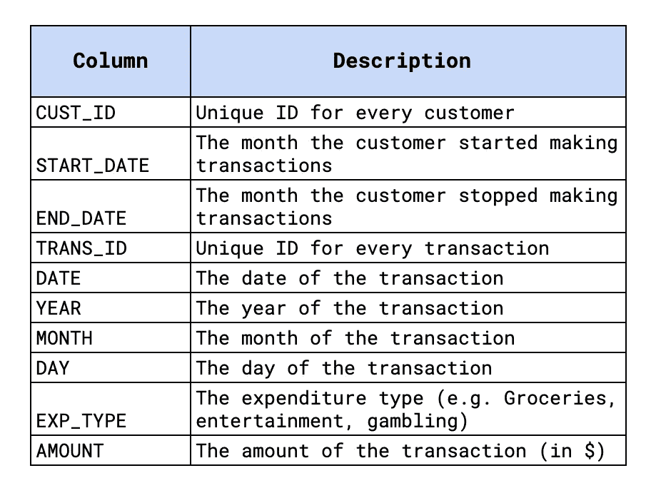
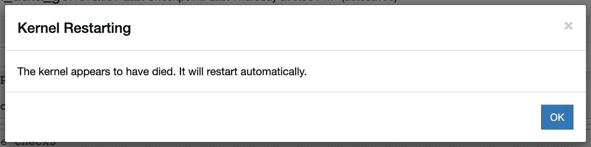
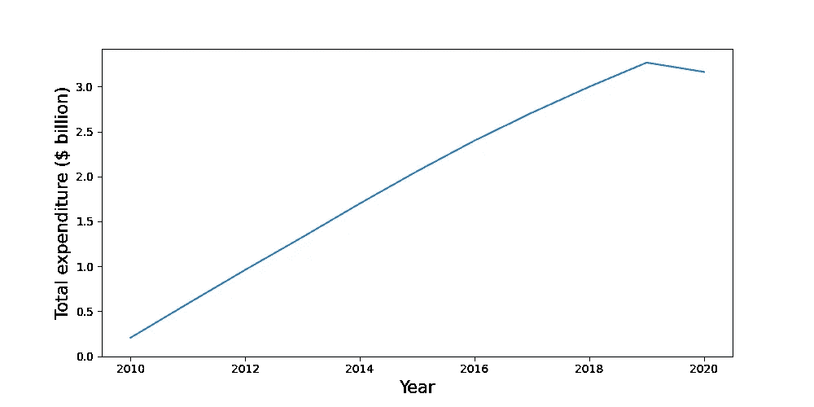
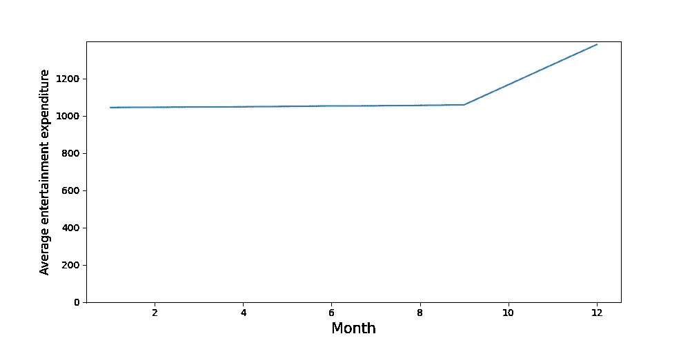

# 用熊猫批量处理 22GB 的交易数据

> 原文：<https://towardsdatascience.com/batch-processing-22gb-of-transaction-data-with-pandas-c6267e65ff36>

## 如何利用有限的计算资源处理大型数据集

卢克·切瑟在 [Unsplash](https://unsplash.com?utm_source=medium&utm_medium=referral) 上的照片

大型数据集很难处理。如果你没有必要的资源，它们甚至更具挑战性。我们大多数人都无法访问分布式集群、GPU 机架或 8GB 以上的内存。这并不意味着我们不能弄脏一些大数据。我们只需要一次解决一件事。也就是说，一次迭代整个数据集并处理子集。

# 资料组

我们将向您展示如何使用大型(随机生成)事务数据集来实现这一点。该数据集包含 75，000 名客户的超过 2.6 亿笔交易。交易时间从 2010 年到 2020 年。每笔交易被分为 12 种支出类型(如杂货)。你可以在图 1 中看到更多细节，并在 [Kaggle](https://www.kaggle.com/conorsully1/simulated-transactions) 上找到完整的数据集。你也可以在 [GitHub](https://github.com/conorosully/medium-articles/blob/master/src/batch_processing.ipynb) 上找到这个教程的笔记本。

图 1:交易数据集概述(来源: [Kaggle](https://www.kaggle.com/datasets/conorsully1/simulated-transactions) ) ( [CC0:公共领域](https://creativecommons.org/publicdomain/zero/1.0/))

我们将看到如何使用批处理来创建这些数据的不同聚合。具体来说，我们将计算:

*   交易总数
*   年度总支出
*   2020 年月均娱乐支出

最后，我们将讨论如何加快创建这些聚合的过程。

# 成批处理

我们将使用一些标准的 Python 包。我们有 NumPy 和 Pandas 用于数据操作，matplotlib 用于一些简单的可视化。确保你已经安装了这些。

首先，让我们尝试用熊猫加载整个数据集。过了一会儿，我们得到图 2 中的错误消息。只有 8GB 的 RAM，不可能将整个数据集加载到内存中。

图 2:错误信息

为了解决这个问题，我们可以加载数据集的一个子集。为此我们可以使用 ***read_csv*** 函数中的***skipows***和 ***nrows*** 参数。下面我们将参数值分别设置为 1000 和 2000。这意味着我们将跳过 CSV 的前 1000 行，加载后面的 2000 行。我们还需要将列名作为参数传递(第 8 行)。这是因为我们跳过了 CSV 中的第一行名称。

我们可以使用这些参数迭代我们的数据集。为此，我们创建了下面的 ***get_rows*** 函数。这可以使用返回数据集的子集。每个子集将包含由 ***步骤*** 参数确定的行数。 ***计数*** 参数是可变的，以在每一步返回不同的子集。为了理解如何使用这个函数，我们将计算数据集中的事务总数。

## 计算交易数量

我们在 while 循环中使用了 **get_rows** 函数。在循环的每次迭代结束时，我们将更新计数(第 19 行)。这意味着我们将加载数据集的一个新子集(第 13 行)。我们设置步骤数，以便每次返回 500 万行(第 1 行)。但是，数据集中的行数不是 500 万的倍数。这意味着在最后一次迭代中，返回的行数不到 500 万。我们可以用它来结束 while 循环(第 22–23 行)。

对于每次迭代，我们计算子集的长度，并将其添加到事务总数中(第 16 行)。最后，我们输出有 261，969，720 个事务。对如何批量处理数据集有了很好的理解，我们可以继续进行更复杂的聚合。

## 年度总支出

对于这种聚合，我们希望对每年的所有交易金额进行求和。我们可以遵循与之前类似的过程。现在，对于每次迭代，我们希望更新数据集中每年的总数。我们首先创建一个 pandas 系列，其中索引是年份，值是总支出金额(第 2 行)。我们每年的总支出为 0 英镑。

对于每次迭代，我们按年份对支出金额求和(第 10 行)。结果是另一个数列， ***exp*** ，索引与 ***total_exp*** 相同。这允许我们循环每年并更新总数(第 13–15 行)。

我们使用下面的代码来可视化这个聚合。您可以在图 3 中看到输出。除 2020 年外，总支出逐年稳步增长。对于这个聚合，所有的计算都在 while 循环中完成。正如我们将在下一个聚合中看到的，情况并不总是这样。

图 3:2010 年至 2020 年的年度总支出

## 2020 年月均娱乐支出

对于许多聚合来说，我们不仅仅是增加一个总量。对于这种聚合，我们首先需要计算每个客户每月花费在娱乐上的总金额。然后，对于每个月，我们可以计算所有客户的平均值。首先，我们创建一个空的 pandas 数据框(第 2 行)。

对于每一次迭代，我们过滤掉交易，因此只保留 2020 年的娱乐交易(第 10 行)。然后，我们按客户和月份合计金额(第 11 行)，并将该表附加到 ***total_exp*** (第 14 行)。这样做后，客户和月份可以重复。这是因为并非客户的所有交易都必须在一次迭代中捕获。这就是我们再次聚合该表的原因(第 17 行)。

最后，我们将得到一个包含所有客户每月总数的表。最后一步是计算每个月的平均金额(第 26 行)。您可以在图 4 中看到这些平均值。这里的平均值是稳定的，然后在 10 月、11 月和 12 月增加。

图 4:2020 年平均娱乐支出

## 只有时间

因此，即使资源有限，我们也要分析这个庞大的数据集。最大的问题是运行每个聚合所花费的时间。在我的机器上，每个聚合需要大约 50 分钟！尽可能加快速度是很重要的。

占用时间最多的部分是使用 ***get_rows*** 函数加载行的地方。在这里，我们将数据从硬盘上的 CSV 加载到内存/RAM 中。因此，不要使用多个 while 循环，而应该尝试在同一个循环中进行多次聚合。这样，我们只需要从磁盘读取一次数据。

我希望这篇文章对你有帮助！你可以成为我的 [**推荐会员**](https://conorosullyds.medium.com/membership) **来支持我。你可以访问 Medium 上的所有文章，我可以得到你的部分费用。**

  

你可以在|[Twitter](https://twitter.com/conorosullyDS)|[YouTube](https://www.youtube.com/channel/UChsoWqJbEjBwrn00Zvghi4w)|[时事通讯](https://mailchi.mp/aa82a5ce1dc0/signup)上找到我——注册免费参加 [Python SHAP 课程](https://adataodyssey.com/courses/shap-with-python/)

# 参考

c 奥沙利文，*模拟交易，* [CC0:公共领域](https://creativecommons.org/publicdomain/zero/1.0/)*[https://www . ka ggle . com/datasets/conorsully 1/Simulated-Transactions](https://www.kaggle.com/datasets/conorsully1/simulated-transactions)*